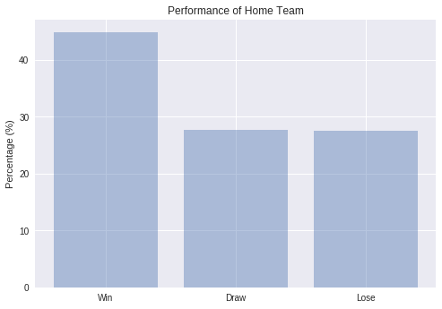

<div>
<style scoped>
    .dataframe tbody tr th:only-of-type {
        vertical-align: middle;
    }

    .dataframe tbody tr th {
        vertical-align: top;
    }

    .dataframe thead th {
        text-align: right;
    }
</style>
<table border="1" class="dataframe">
  <thead>
    <tr style="text-align: right;">
      <th></th>
      <th>CL League 2017-2018</th>
      <th>Top League</th>
      <th>age</th>
      <th>caps</th>
      <th>club</th>
      <th>country</th>
      <th>goals</th>
      <th>name</th>
      <th>pos</th>
    </tr>
  </thead>
  <tbody>
    <tr>
      <th>0</th>
      <td>0</td>
      <td>0</td>
      <td>45</td>
      <td>158</td>
      <td>Al-Taawoun</td>
      <td>Egypt</td>
      <td>0</td>
      <td>Essam El-Hadary</td>
      <td>GK</td>
    </tr>
    <tr>
      <th>1</th>
      <td>0</td>
      <td>1</td>
      <td>29</td>
      <td>21</td>
      <td>West Bromwich Albion</td>
      <td>Egypt</td>
      <td>1</td>
      <td>Ali Gabr</td>
      <td>DF</td>
    </tr>
    <tr>
      <th>2</th>
      <td>0</td>
      <td>1</td>
      <td>30</td>
      <td>78</td>
      <td>Aston Villa</td>
      <td>Egypt</td>
      <td>2</td>
      <td>Ahmed Elmohamady</td>
      <td>DF</td>
    </tr>
    <tr>
      <th>3</th>
      <td>0</td>
      <td>0</td>
      <td>26</td>
      <td>24</td>
      <td>Los Angeles FC</td>
      <td>Egypt</td>
      <td>0</td>
      <td>Omar Gaber</td>
      <td>MF</td>
    </tr>
    <tr>
      <th>4</th>
      <td>0</td>
      <td>1</td>
      <td>26</td>
      <td>5</td>
      <td>Wigan Athletic</td>
      <td>Egypt</td>
      <td>0</td>
      <td>Sam Morsy</td>
      <td>MF</td>
    </tr>
  </tbody>
</table>
</div>

__WC 2018 Participating teams and players data to be used throughout our work(sample of the data obtained by scraping)__

<div>
<style scoped>
    .dataframe tbody tr th:only-of-type {
        vertical-align: middle;
    }

    .dataframe tbody tr th {
        vertical-align: top;
    }

    .dataframe thead th {
        text-align: right;
    }
</style>
<table border="1" class="dataframe">
  <thead>
    <tr style="text-align: right;">
      <th></th>
      <th>CL League 2017-2018</th>
      <th>Top League</th>
      <th>age</th>
      <th>caps</th>
      <th>goals</th>
      <th>country</th>
    </tr>
    <tr>
      <th>country</th>
      <th></th>
      <th></th>
      <th></th>
      <th></th>
      <th></th>
      <th></th>
    </tr>
  </thead>
  <tbody>
    <tr>
      <th>Argentina</th>
      <td>14</td>
      <td>14</td>
      <td>29.130435</td>
      <td>37.347826</td>
      <td>172</td>
      <td>Argentina</td>
    </tr>
    <tr>
      <th>Australia</th>
      <td>2</td>
      <td>9</td>
      <td>27.608696</td>
      <td>29.826087</td>
      <td>121</td>
      <td>Australia</td>
    </tr>
    <tr>
      <th>Belgium</th>
      <td>17</td>
      <td>19</td>
      <td>27.217391</td>
      <td>47.260870</td>
      <td>156</td>
      <td>Belgium</td>
    </tr>
    <tr>
      <th>Brazil</th>
      <td>18</td>
      <td>17</td>
      <td>28.130435</td>
      <td>29.869565</td>
      <td>127</td>
      <td>Brazil</td>
    </tr>
    <tr>
      <th>Colombia</th>
      <td>6</td>
      <td>13</td>
      <td>27.913043</td>
      <td>31.000000</td>
      <td>91</td>
      <td>Colombia</td>
    </tr>
    <tr>
      <th>Costa Rica</th>
      <td>3</td>
      <td>6</td>
      <td>29.434783</td>
      <td>51.347826</td>
      <td>115</td>
      <td>Costa Rica</td>
    </tr>
    <tr>
      <th>Croatia</th>
      <td>8</td>
      <td>16</td>
      <td>27.478261</td>
      <td>40.304348</td>
      <td>116</td>
      <td>Croatia</td>
    </tr>
    <tr>
      <th>Denmark</th>
      <td>5</td>
      <td>17</td>
      <td>26.739130</td>
      <td>26.565217</td>
      <td>65</td>
      <td>Denmark</td>
    </tr>
    <tr>
      <th>Egypt</th>
      <td>1</td>
      <td>7</td>
      <td>28.521739</td>
      <td>37.304348</td>
      <td>64</td>
      <td>Egypt</td>
    </tr>
    <tr>
      <th>England</th>
      <td>16</td>
      <td>23</td>
      <td>25.608696</td>
      <td>20.956522</td>
      <td>59</td>
      <td>England</td>
    </tr>
    <tr>
      <th>France</th>
      <td>18</td>
      <td>23</td>
      <td>25.565217</td>
      <td>26.043478</td>
      <td>87</td>
      <td>France</td>
    </tr>
    <tr>
      <th>Germany</th>
      <td>16</td>
      <td>23</td>
      <td>26.695652</td>
      <td>41.086957</td>
      <td>159</td>
      <td>Germany</td>
    </tr>
    <tr>
      <th>Iceland</th>
      <td>0</td>
      <td>8</td>
      <td>28.260870</td>
      <td>40.043478</td>
      <td>81</td>
      <td>Iceland</td>
    </tr>
    <tr>
      <th>Iran</th>
      <td>2</td>
      <td>1</td>
      <td>26.739130</td>
      <td>30.521739</td>
      <td>109</td>
      <td>Iran</td>
    </tr>
    <tr>
      <th>Japan</th>
      <td>1</td>
      <td>13</td>
      <td>28.260870</td>
      <td>45.000000</td>
      <td>163</td>
      <td>Japan</td>
    </tr>
    <tr>
      <th>Mexico</th>
      <td>4</td>
      <td>6</td>
      <td>28.826087</td>
      <td>60.304348</td>
      <td>207</td>
      <td>Mexico</td>
    </tr>
    <tr>
      <th>Morocco</th>
      <td>4</td>
      <td>12</td>
      <td>26.913043</td>
      <td>24.043478</td>
      <td>60</td>
      <td>Morocco</td>
    </tr>
    <tr>
      <th>Nigeria</th>
      <td>2</td>
      <td>10</td>
      <td>25.608696</td>
      <td>25.608696</td>
      <td>56</td>
      <td>Nigeria</td>
    </tr>
    <tr>
      <th>Panama</th>
      <td>0</td>
      <td>1</td>
      <td>28.478261</td>
      <td>58.478261</td>
      <td>145</td>
      <td>Panama</td>
    </tr>
    <tr>
      <th>Peru</th>
      <td>1</td>
      <td>1</td>
      <td>26.956522</td>
      <td>34.086957</td>
      <td>95</td>
      <td>Peru</td>
    </tr>
    <tr>
      <th>Poland</th>
      <td>7</td>
      <td>15</td>
      <td>27.913043</td>
      <td>35.478261</td>
      <td>126</td>
      <td>Poland</td>
    </tr>
    <tr>
      <th>Portugal</th>
      <td>13</td>
      <td>11</td>
      <td>27.913043</td>
      <td>39.521739</td>
      <td>142</td>
      <td>Portugal</td>
    </tr>
    <tr>
      <th>Russia</th>
      <td>8</td>
      <td>1</td>
      <td>28.304348</td>
      <td>28.521739</td>
      <td>56</td>
      <td>Russia</td>
    </tr>
    <tr>
      <th>Saudi Arabia</th>
      <td>0</td>
      <td>3</td>
      <td>28.173913</td>
      <td>34.304348</td>
      <td>91</td>
      <td>Saudi Arabia</td>
    </tr>
    <tr>
      <th>Senegal</th>
      <td>4</td>
      <td>18</td>
      <td>26.565217</td>
      <td>26.608696</td>
      <td>73</td>
      <td>Senegal</td>
    </tr>
    <tr>
      <th>Serbia</th>
      <td>5</td>
      <td>13</td>
      <td>26.260870</td>
      <td>25.956522</td>
      <td>65</td>
      <td>Serbia</td>
    </tr>
    <tr>
      <th>South Korea</th>
      <td>1</td>
      <td>3</td>
      <td>27.304348</td>
      <td>29.304348</td>
      <td>77</td>
      <td>South Korea</td>
    </tr>
    <tr>
      <th>Spain</th>
      <td>18</td>
      <td>23</td>
      <td>28.043478</td>
      <td>42.217391</td>
      <td>105</td>
      <td>Spain</td>
    </tr>
    <tr>
      <th>Sweden</th>
      <td>3</td>
      <td>14</td>
      <td>27.869565</td>
      <td>31.304348</td>
      <td>73</td>
      <td>Sweden</td>
    </tr>
    <tr>
      <th>Switzerland</th>
      <td>6</td>
      <td>19</td>
      <td>26.695652</td>
      <td>37.347826</td>
      <td>98</td>
      <td>Switzerland</td>
    </tr>
    <tr>
      <th>Tunisia</th>
      <td>0</td>
      <td>8</td>
      <td>26.173913</td>
      <td>20.173913</td>
      <td>36</td>
      <td>Tunisia</td>
    </tr>
    <tr>
      <th>Uruguay</th>
      <td>7</td>
      <td>11</td>
      <td>27.782609</td>
      <td>42.260870</td>
      <td>134</td>
      <td>Uruguay</td>
    </tr>
  </tbody>
</table>
</div>

__The data gathered was grouped by nation and averaged- Including all the countries participating__


<div>
<style scoped>
    .dataframe tbody tr th:only-of-type {
        vertical-align: middle;
    }

    .dataframe tbody tr th {
        vertical-align: top;
    }

    .dataframe thead th {
        text-align: right;
    }
</style>
<table border="1" class="dataframe">
  <thead>
    <tr style="text-align: right;">
      <th></th>
      <th>date</th>
      <th>home_team</th>
      <th>away_team</th>
      <th>home_score</th>
      <th>away_score</th>
      <th>tournament</th>
      <th>city</th>
      <th>country</th>
      <th>neutral</th>
    </tr>
  </thead>
  <tbody>
    <tr>
      <th>0</th>
      <td>1872-11-30</td>
      <td>Scotland</td>
      <td>England</td>
      <td>0</td>
      <td>0</td>
      <td>Friendly</td>
      <td>Glasgow</td>
      <td>Scotland</td>
      <td>False</td>
    </tr>
    <tr>
      <th>1</th>
      <td>1873-03-08</td>
      <td>England</td>
      <td>Scotland</td>
      <td>4</td>
      <td>2</td>
      <td>Friendly</td>
      <td>London</td>
      <td>England</td>
      <td>False</td>
    </tr>
    <tr>
      <th>2</th>
      <td>1874-03-07</td>
      <td>Scotland</td>
      <td>England</td>
      <td>2</td>
      <td>1</td>
      <td>Friendly</td>
      <td>Glasgow</td>
      <td>Scotland</td>
      <td>False</td>
    </tr>
    <tr>
      <th>3</th>
      <td>1875-03-06</td>
      <td>England</td>
      <td>Scotland</td>
      <td>2</td>
      <td>2</td>
      <td>Friendly</td>
      <td>London</td>
      <td>England</td>
      <td>False</td>
    </tr>
    <tr>
      <th>4</th>
      <td>1876-03-04</td>
      <td>Scotland</td>
      <td>England</td>
      <td>3</td>
      <td>0</td>
      <td>Friendly</td>
      <td>Glasgow</td>
      <td>Scotland</td>
      <td>False</td>
    </tr>
  </tbody>
</table>
</div>

__This is the raw dataframe we used to draw most of the data about international games in the past__


We had to preprocess this dataframe so that we can work with it properly. For this task we had to create different columns(year, winning team and others). Then we filtered the games that started from the year 1990 onwards with only the participating nations. The Data exploration is performed on the cleaned data. The initial dataset had 39638 rows and 9 columns.
Filtering out the matches played before 1990, and retaining only the nations playing in World Cup
2018, the dataset has 3564 rows and 11 columns. This is the clean dataframe used for our analysis and model construction:


<div>
<style scoped>
    .dataframe tbody tr th:only-of-type {
        vertical-align: middle;
    }

    .dataframe tbody tr th {
        vertical-align: top;
    }

    .dataframe thead th {
        text-align: right;
    }
</style>
<table border="1" class="dataframe">
  <thead>
    <tr style="text-align: right;">
      <th></th>
      <th>date</th>
      <th>home_team</th>
      <th>away_team</th>
      <th>home_score</th>
      <th>away_score</th>
      <th>tournament</th>
      <th>country</th>
      <th>neutral</th>
      <th>winning_team</th>
      <th>goal_difference</th>
      <th>match_year</th>
    </tr>
  </thead>
  <tbody>
    <tr>
      <th>15795</th>
      <td>1990-01-17</td>
      <td>Mexico</td>
      <td>Argentina</td>
      <td>2</td>
      <td>0</td>
      <td>Friendly</td>
      <td>USA</td>
      <td>True</td>
      <td>Mexico</td>
      <td>2</td>
      <td>1990</td>
    </tr>
    <tr>
      <th>15809</th>
      <td>1990-01-28</td>
      <td>Nigeria</td>
      <td>Senegal</td>
      <td>1</td>
      <td>1</td>
      <td>Friendly</td>
      <td>Nigeria</td>
      <td>False</td>
      <td>Draw</td>
      <td>0</td>
      <td>1990</td>
    </tr>
    <tr>
      <th>15811</th>
      <td>1990-02-02</td>
      <td>Colombia</td>
      <td>Uruguay</td>
      <td>0</td>
      <td>2</td>
      <td>Friendly</td>
      <td>USA</td>
      <td>True</td>
      <td>Uruguay</td>
      <td>2</td>
      <td>1990</td>
    </tr>
    <tr>
      <th>15813</th>
      <td>1990-02-02</td>
      <td>Iran</td>
      <td>Poland</td>
      <td>0</td>
      <td>2</td>
      <td>Friendly</td>
      <td>Iran</td>
      <td>False</td>
      <td>Poland</td>
      <td>2</td>
      <td>1990</td>
    </tr>
    <tr>
      <th>15816</th>
      <td>1990-02-04</td>
      <td>Costa Rica</td>
      <td>Uruguay</td>
      <td>0</td>
      <td>2</td>
      <td>Friendly</td>
      <td>USA</td>
      <td>True</td>
      <td>Uruguay</td>
      <td>2</td>
      <td>1990</td>
    </tr>
  </tbody>
</table>
</div>

__Clean DataFrame used for our analysis__


# Visulizations:


__Comment: This plot show us the distribution of goal difference in each and every match we used for our training set.__


__Comment: Since the different historical matches were used to train our model it was important for us
to see what type of tournament was the most frequent in our data(we took the 8 most frequent). We can see that friendly matches
are the most frequent followed by the FIFA world cup matches.__


__Comment: This plot gives us an idea of the strongest teams selected for the world cup.__



__Comment:Examine the perfromance of the squads when they play at home__


## Feature engineering for the baseline model


<div>
<style scoped>
    .dataframe tbody tr th:only-of-type {
        vertical-align: middle;
    }

    .dataframe tbody tr th {
        vertical-align: top;
    }

    .dataframe thead th {
        text-align: right;
    }
</style>
<table border="1" class="dataframe">
  <thead>
    <tr style="text-align: right;">
      <th></th>
      <th>country_ranked_06/18</th>
      <th>ranking</th>
    </tr>
  </thead>
  <tbody>
    <tr>
      <th>0</th>
      <td>Germany</td>
      <td>1</td>
    </tr>
    <tr>
      <th>1</th>
      <td>Brazil</td>
      <td>2</td>
    </tr>
    <tr>
      <th>2</th>
      <td>Belgium</td>
      <td>3</td>
    </tr>
    <tr>
      <th>3</th>
      <td>Portugal</td>
      <td>4</td>
    </tr>
    <tr>
      <th>4</th>
      <td>Argentina</td>
      <td>5</td>
    </tr>
  </tbody>
</table>
</div>

__A sample of the Fifa ranking table scraped from FIFA.com with only the squads participating__


<div>
<style scoped>
    .dataframe tbody tr th:only-of-type {
        vertical-align: middle;
    }

    .dataframe tbody tr th {
        vertical-align: top;
    }

    .dataframe thead th {
        text-align: right;
    }
</style>
<table border="1" class="dataframe">
  <thead>
    <tr style="text-align: right;">
      <th></th>
      <th># won</th>
      <th>country</th>
    </tr>
    <tr>
      <th>country</th>
      <th></th>
      <th></th>
    </tr>
  </thead>
  <tbody>
    <tr>
      <th>Egypt</th>
      <td>6</td>
      <td>Egypt</td>
    </tr>
    <tr>
      <th>Russia</th>
      <td>5</td>
      <td>Russia</td>
    </tr>
    <tr>
      <th>Saudi Arabia</th>
      <td>2</td>
      <td>Saudi Arabia</td>
    </tr>
    <tr>
      <th>Uruguay</th>
      <td>7</td>
      <td>Uruguay</td>
    </tr>
    <tr>
      <th>Iran</th>
      <td>4</td>
      <td>Iran</td>
    </tr>
  </tbody>
</table>
</div>


__Feature of the last 20 matches performance before the world cup of all the participating teams__


<div>
<style scoped>
    .dataframe tbody tr th:only-of-type {
        vertical-align: middle;
    }

    .dataframe tbody tr th {
        vertical-align: top;
    }

    .dataframe thead th {
        text-align: right;
    }
</style>
<table border="1" class="dataframe">
  <thead>
    <tr style="text-align: right;">
      <th></th>
      <th>Coach Salary</th>
      <th>coach</th>
      <th>coach age</th>
      <th>country</th>
      <th>nationality</th>
    </tr>
  </thead>
  <tbody>
    <tr>
      <th>0</th>
      <td>235600.0</td>
      <td>Adam NAWALKA</td>
      <td>61</td>
      <td>Poland</td>
      <td>POL</td>
    </tr>
    <tr>
      <th>1</th>
      <td>810000.0</td>
      <td>Age HAREIDE</td>
      <td>65</td>
      <td>Denmark</td>
      <td>NOR</td>
    </tr>
    <tr>
      <th>2</th>
      <td>810000.0</td>
      <td>Akira NISHINO</td>
      <td>63</td>
      <td>Japan</td>
      <td>JPN</td>
    </tr>
    <tr>
      <th>3</th>
      <td>174500.0</td>
      <td>Aliou CISSE</td>
      <td>42</td>
      <td>Senegal</td>
      <td>SEN</td>
    </tr>
    <tr>
      <th>4</th>
      <td>1030000.0</td>
      <td>Bert VAN MARWIJK</td>
      <td>66</td>
      <td>Australia</td>
      <td>NED</td>
    </tr>
  </tbody>
</table>
</div>

__National squad Coach salary feature__

## For our base line model an extra 3 features were used(taken from players_features DataFrame above): Average age of every team, average number of caps(number of international showings for every player) and average number of goals


<div>
<style scoped>
    .dataframe tbody tr th:only-of-type {
        vertical-align: middle;
    }

    .dataframe tbody tr th {
        vertical-align: top;
    }

    .dataframe thead th {
        text-align: right;
    }
</style>
<table border="1" class="dataframe">
  <thead>
    <tr style="text-align: right;">
      <th></th>
      <th># won</th>
      <th>age</th>
      <th>caps</th>
      <th>goals</th>
      <th>ranking</th>
      <th>Coach Salary</th>
    </tr>
    <tr>
      <th>country</th>
      <th></th>
      <th></th>
      <th></th>
      <th></th>
      <th></th>
      <th></th>
    </tr>
  </thead>
  <tbody>
    <tr>
      <th>Egypt</th>
      <td>6</td>
      <td>28.521739</td>
      <td>37.304348</td>
      <td>64</td>
      <td>45</td>
      <td>1300000.0</td>
    </tr>
    <tr>
      <th>Russia</th>
      <td>5</td>
      <td>28.304348</td>
      <td>28.521739</td>
      <td>56</td>
      <td>70</td>
      <td>2210000.0</td>
    </tr>
    <tr>
      <th>Saudi Arabia</th>
      <td>2</td>
      <td>28.173913</td>
      <td>34.304348</td>
      <td>91</td>
      <td>67</td>
      <td>1230000.0</td>
    </tr>
    <tr>
      <th>Uruguay</th>
      <td>7</td>
      <td>27.782609</td>
      <td>42.260870</td>
      <td>134</td>
      <td>14</td>
      <td>1470000.0</td>
    </tr>
    <tr>
      <th>Iran</th>
      <td>4</td>
      <td>26.739130</td>
      <td>30.521739</td>
      <td>109</td>
      <td>37</td>
      <td>1690000.0</td>
    </tr>
  </tbody>
</table>
</div>

__Features DataFrame for the baseline model__


    <matplotlib.axes._subplots.AxesSubplot at 0x7f02a7d43908>


### Coefficient analysis-Logistic regression


```
plt.figure(figsize = [21,8])
plt.subplot(1,3,1)
plt.title('Logisitic reg. Feature Importance for Draw')
plt.barh(result3.columns,reg3.coef_[0,:6],color='r')
plt.barh(result3.columns,reg3.coef_[0,6:],color='b')
plt.legend(['Home Team','Away Team'])
plt.subplot(1,3,2)
plt.title('Logisitic reg. Feature Importance for Home Team Win')
plt.barh(result3.columns,reg3.coef_[1,:6],color='r')
plt.barh(result3.columns,reg3.coef_[1,6:],color='b')
plt.legend(['Home Team','Away Team'])
plt.subplot(1,3,3)
plt.title('Logisitic reg. Feature Importance for Away Team Win')
plt.barh(result3.columns,reg3.coef_[2,:6],color='r')
plt.barh(result3.columns,reg3.coef_[2,6:],color='b')
plt.legend(['Home Team','Away Team'])

```


    <matplotlib.legend.Legend at 0x7fd5ee271588>


```
# result3 coefficients

plt.figure(figsize = [9,9])
plt.title('Logisitic Feature Comparison (Age)')
plt.barh(result3.columns[1]+' Draw',reg3.coef_[0,1],color='c',edgecolor='k')
plt.barh(result3.columns[1]+' Draw',reg3.coef_[0,6],color='c')
plt.barh(result3.columns[1]+' Home win',reg3.coef_[1,1],color='m',edgecolor='k')
plt.barh(result3.columns[1]+' Home win',reg3.coef_[1,6],color='m')
plt.barh(result3.columns[1]+' Away win',reg3.coef_[2,1],color='y',edgecolor='k')
plt.barh(result3.columns[1]+' Away win',reg3.coef_[2,6],color='y')

```


    <Container object of 1 artists>


#Our model built from scratch


```
# sofifa complete dataset
response = requests.get('https://drive.google.com/uc?export=download&id=12Km8bbBwLulQi2uFymPSCkXBTB5Ws-qj')
#have to decode the bytes before it can be read by pandas into df
df1 = pd.read_csv(BytesIO(response.content),index_col=0)
df1.head()
```


    /usr/local/lib/python3.6/dist-packages/IPython/core/interactiveshell.py:2718: DtypeWarning: Columns (23,35) have mixed types. Specify dtype option on import or set low_memory=False.
      interactivity=interactivity, compiler=compiler, result=result)


<div>
<style scoped>
    .dataframe tbody tr th:only-of-type {
        vertical-align: middle;
    }

    .dataframe tbody tr th {
        vertical-align: top;
    }

    .dataframe thead th {
        text-align: right;
    }
</style>
<table border="1" class="dataframe">
  <thead>
    <tr style="text-align: right;">
      <th></th>
      <th>Name</th>
      <th>Age</th>
      <th>Photo</th>
      <th>Nationality</th>
      <th>Flag</th>
      <th>Overall</th>
      <th>Potential</th>
      <th>Club</th>
      <th>Club Logo</th>
      <th>Value</th>
      <th>...</th>
      <th>RB</th>
      <th>RCB</th>
      <th>RCM</th>
      <th>RDM</th>
      <th>RF</th>
      <th>RM</th>
      <th>RS</th>
      <th>RW</th>
      <th>RWB</th>
      <th>ST</th>
    </tr>
  </thead>
  <tbody>
    <tr>
      <th>0</th>
      <td>Cristiano Ronaldo</td>
      <td>32</td>
      <td>https://cdn.sofifa.org/48/18/players/20801.png</td>
      <td>Portugal</td>
      <td>https://cdn.sofifa.org/flags/38.png</td>
      <td>94</td>
      <td>94</td>
      <td>Real Madrid CF</td>
      <td>https://cdn.sofifa.org/24/18/teams/243.png</td>
      <td>€95.5M</td>
      <td>...</td>
      <td>61.0</td>
      <td>53.0</td>
      <td>82.0</td>
      <td>62.0</td>
      <td>91.0</td>
      <td>89.0</td>
      <td>92.0</td>
      <td>91.0</td>
      <td>66.0</td>
      <td>92.0</td>
    </tr>
    <tr>
      <th>1</th>
      <td>L. Messi</td>
      <td>30</td>
      <td>https://cdn.sofifa.org/48/18/players/158023.png</td>
      <td>Argentina</td>
      <td>https://cdn.sofifa.org/flags/52.png</td>
      <td>93</td>
      <td>93</td>
      <td>FC Barcelona</td>
      <td>https://cdn.sofifa.org/24/18/teams/241.png</td>
      <td>€105M</td>
      <td>...</td>
      <td>57.0</td>
      <td>45.0</td>
      <td>84.0</td>
      <td>59.0</td>
      <td>92.0</td>
      <td>90.0</td>
      <td>88.0</td>
      <td>91.0</td>
      <td>62.0</td>
      <td>88.0</td>
    </tr>
    <tr>
      <th>2</th>
      <td>Neymar</td>
      <td>25</td>
      <td>https://cdn.sofifa.org/48/18/players/190871.png</td>
      <td>Brazil</td>
      <td>https://cdn.sofifa.org/flags/54.png</td>
      <td>92</td>
      <td>94</td>
      <td>Paris Saint-Germain</td>
      <td>https://cdn.sofifa.org/24/18/teams/73.png</td>
      <td>€123M</td>
      <td>...</td>
      <td>59.0</td>
      <td>46.0</td>
      <td>79.0</td>
      <td>59.0</td>
      <td>88.0</td>
      <td>87.0</td>
      <td>84.0</td>
      <td>89.0</td>
      <td>64.0</td>
      <td>84.0</td>
    </tr>
    <tr>
      <th>3</th>
      <td>L. Suárez</td>
      <td>30</td>
      <td>https://cdn.sofifa.org/48/18/players/176580.png</td>
      <td>Uruguay</td>
      <td>https://cdn.sofifa.org/flags/60.png</td>
      <td>92</td>
      <td>92</td>
      <td>FC Barcelona</td>
      <td>https://cdn.sofifa.org/24/18/teams/241.png</td>
      <td>€97M</td>
      <td>...</td>
      <td>64.0</td>
      <td>58.0</td>
      <td>80.0</td>
      <td>65.0</td>
      <td>88.0</td>
      <td>85.0</td>
      <td>88.0</td>
      <td>87.0</td>
      <td>68.0</td>
      <td>88.0</td>
    </tr>
    <tr>
      <th>4</th>
      <td>M. Neuer</td>
      <td>31</td>
      <td>https://cdn.sofifa.org/48/18/players/167495.png</td>
      <td>Germany</td>
      <td>https://cdn.sofifa.org/flags/21.png</td>
      <td>92</td>
      <td>92</td>
      <td>FC Bayern Munich</td>
      <td>https://cdn.sofifa.org/24/18/teams/21.png</td>
      <td>€61M</td>
      <td>...</td>
      <td>NaN</td>
      <td>NaN</td>
      <td>NaN</td>
      <td>NaN</td>
      <td>NaN</td>
      <td>NaN</td>
      <td>NaN</td>
      <td>NaN</td>
      <td>NaN</td>
      <td>NaN</td>
    </tr>
  </tbody>
</table>
<p>5 rows × 74 columns</p>
</div>


```
# rank players according to their overall score
df1.nlargest(100, columns='Overall').head()
```


<div>
<style scoped>
    .dataframe tbody tr th:only-of-type {
        vertical-align: middle;
    }

    .dataframe tbody tr th {
        vertical-align: top;
    }

    .dataframe thead th {
        text-align: right;
    }
</style>
<table border="1" class="dataframe">
  <thead>
    <tr style="text-align: right;">
      <th></th>
      <th>Name</th>
      <th>Age</th>
      <th>Photo</th>
      <th>Nationality</th>
      <th>Flag</th>
      <th>Overall</th>
      <th>Potential</th>
      <th>Club</th>
      <th>Club Logo</th>
      <th>Value</th>
      <th>...</th>
      <th>RB</th>
      <th>RCB</th>
      <th>RCM</th>
      <th>RDM</th>
      <th>RF</th>
      <th>RM</th>
      <th>RS</th>
      <th>RW</th>
      <th>RWB</th>
      <th>ST</th>
    </tr>
  </thead>
  <tbody>
    <tr>
      <th>0</th>
      <td>Cristiano Ronaldo</td>
      <td>32</td>
      <td>https://cdn.sofifa.org/48/18/players/20801.png</td>
      <td>Portugal</td>
      <td>https://cdn.sofifa.org/flags/38.png</td>
      <td>94</td>
      <td>94</td>
      <td>Real Madrid CF</td>
      <td>https://cdn.sofifa.org/24/18/teams/243.png</td>
      <td>€95.5M</td>
      <td>...</td>
      <td>61.0</td>
      <td>53.0</td>
      <td>82.0</td>
      <td>62.0</td>
      <td>91.0</td>
      <td>89.0</td>
      <td>92.0</td>
      <td>91.0</td>
      <td>66.0</td>
      <td>92.0</td>
    </tr>
    <tr>
      <th>1</th>
      <td>L. Messi</td>
      <td>30</td>
      <td>https://cdn.sofifa.org/48/18/players/158023.png</td>
      <td>Argentina</td>
      <td>https://cdn.sofifa.org/flags/52.png</td>
      <td>93</td>
      <td>93</td>
      <td>FC Barcelona</td>
      <td>https://cdn.sofifa.org/24/18/teams/241.png</td>
      <td>€105M</td>
      <td>...</td>
      <td>57.0</td>
      <td>45.0</td>
      <td>84.0</td>
      <td>59.0</td>
      <td>92.0</td>
      <td>90.0</td>
      <td>88.0</td>
      <td>91.0</td>
      <td>62.0</td>
      <td>88.0</td>
    </tr>
    <tr>
      <th>2</th>
      <td>Neymar</td>
      <td>25</td>
      <td>https://cdn.sofifa.org/48/18/players/190871.png</td>
      <td>Brazil</td>
      <td>https://cdn.sofifa.org/flags/54.png</td>
      <td>92</td>
      <td>94</td>
      <td>Paris Saint-Germain</td>
      <td>https://cdn.sofifa.org/24/18/teams/73.png</td>
      <td>€123M</td>
      <td>...</td>
      <td>59.0</td>
      <td>46.0</td>
      <td>79.0</td>
      <td>59.0</td>
      <td>88.0</td>
      <td>87.0</td>
      <td>84.0</td>
      <td>89.0</td>
      <td>64.0</td>
      <td>84.0</td>
    </tr>
    <tr>
      <th>3</th>
      <td>L. Suárez</td>
      <td>30</td>
      <td>https://cdn.sofifa.org/48/18/players/176580.png</td>
      <td>Uruguay</td>
      <td>https://cdn.sofifa.org/flags/60.png</td>
      <td>92</td>
      <td>92</td>
      <td>FC Barcelona</td>
      <td>https://cdn.sofifa.org/24/18/teams/241.png</td>
      <td>€97M</td>
      <td>...</td>
      <td>64.0</td>
      <td>58.0</td>
      <td>80.0</td>
      <td>65.0</td>
      <td>88.0</td>
      <td>85.0</td>
      <td>88.0</td>
      <td>87.0</td>
      <td>68.0</td>
      <td>88.0</td>
    </tr>
    <tr>
      <th>4</th>
      <td>M. Neuer</td>
      <td>31</td>
      <td>https://cdn.sofifa.org/48/18/players/167495.png</td>
      <td>Germany</td>
      <td>https://cdn.sofifa.org/flags/21.png</td>
      <td>92</td>
      <td>92</td>
      <td>FC Bayern Munich</td>
      <td>https://cdn.sofifa.org/24/18/teams/21.png</td>
      <td>€61M</td>
      <td>...</td>
      <td>NaN</td>
      <td>NaN</td>
      <td>NaN</td>
      <td>NaN</td>
      <td>NaN</td>
      <td>NaN</td>
      <td>NaN</td>
      <td>NaN</td>
      <td>NaN</td>
      <td>NaN</td>
    </tr>
  </tbody>
</table>
<p>5 rows × 74 columns</p>
</div>


```
# clean unnecessary columns and strip the value and wage column from non numeric signs to make the data analyzable
df1_clean=df1.drop(["Photo","Flag","Club Logo"],axis=1)
df1_clean['Value'] = df1_clean['Value'].str.replace('€', '')
df1_clean['Wage']=df1_clean['Wage'].str.replace('€','')

#parse string for millions and thousands to numeric values
def parseValueColumn(strVal):
    if 'M' in strVal:
        return int(float(strVal.replace('M', '')) * 1000000)
    elif 'K' in strVal:
        return int(float(strVal.replace('K', '')) * 1000)
    else:
        return int(strVal)   
#parse string for thousands to numeric values
def parseWageColumn(strVal):
  if 'K' in strVal:
    return int(float(strVal.replace('K', '')) * 1000)
  else:
    return int(strVal)   

df1_clean['Value'] = df1_clean['Value'].apply(lambda x: parseValueColumn(x))
df1_clean['Wage']=df1_clean['Wage'].apply(lambda x: parseWageColumn(x))
```


```
# check for null data
df1.isnull().sum()
```


    Name                      0
    Age                       0
    Photo                     0
    Nationality               0
    Flag                      0
    Overall                   0
    Potential                 0
    Club                    248
    Club Logo                 0
    Value                     0
    Wage                      0
    Special                   0
    Acceleration              0
    Aggression                0
    Agility                   0
    Balance                   0
    Ball control              0
    Composure                 0
    Crossing                  0
    Curve                     0
    Dribbling                 0
    Finishing                 0
    Free kick accuracy        0
    GK diving                 0
    GK handling               0
    GK kicking                0
    GK positioning            0
    GK reflexes               0
    Heading accuracy          0
    Interceptions             0
                           ...
    Vision                    0
    Volleys                   0
    CAM                    2029
    CB                     2029
    CDM                    2029
    CF                     2029
    CM                     2029
    ID                        0
    LAM                    2029
    LB                     2029
    LCB                    2029
    LCM                    2029
    LDM                    2029
    LF                     2029
    LM                     2029
    LS                     2029
    LW                     2029
    LWB                    2029
    Preferred Positions       0
    RAM                    2029
    RB                     2029
    RCB                    2029
    RCM                    2029
    RDM                    2029
    RF                     2029
    RM                     2029
    RS                     2029
    RW                     2029
    RWB                    2029
    ST                     2029
    Length: 74, dtype: int64


```
df1_clean.head()
```


<div>
<style scoped>
    .dataframe tbody tr th:only-of-type {
        vertical-align: middle;
    }

    .dataframe tbody tr th {
        vertical-align: top;
    }

    .dataframe thead th {
        text-align: right;
    }
</style>
<table border="1" class="dataframe">
  <thead>
    <tr style="text-align: right;">
      <th></th>
      <th>Name</th>
      <th>Age</th>
      <th>Nationality</th>
      <th>Overall</th>
      <th>Potential</th>
      <th>Club</th>
      <th>Value</th>
      <th>Wage</th>
      <th>Special</th>
      <th>Acceleration</th>
      <th>...</th>
      <th>RB</th>
      <th>RCB</th>
      <th>RCM</th>
      <th>RDM</th>
      <th>RF</th>
      <th>RM</th>
      <th>RS</th>
      <th>RW</th>
      <th>RWB</th>
      <th>ST</th>
    </tr>
  </thead>
  <tbody>
    <tr>
      <th>0</th>
      <td>Cristiano Ronaldo</td>
      <td>32</td>
      <td>Portugal</td>
      <td>94</td>
      <td>94</td>
      <td>Real Madrid CF</td>
      <td>95500000</td>
      <td>565000</td>
      <td>2228</td>
      <td>89</td>
      <td>...</td>
      <td>61.0</td>
      <td>53.0</td>
      <td>82.0</td>
      <td>62.0</td>
      <td>91.0</td>
      <td>89.0</td>
      <td>92.0</td>
      <td>91.0</td>
      <td>66.0</td>
      <td>92.0</td>
    </tr>
    <tr>
      <th>1</th>
      <td>L. Messi</td>
      <td>30</td>
      <td>Argentina</td>
      <td>93</td>
      <td>93</td>
      <td>FC Barcelona</td>
      <td>105000000</td>
      <td>565000</td>
      <td>2154</td>
      <td>92</td>
      <td>...</td>
      <td>57.0</td>
      <td>45.0</td>
      <td>84.0</td>
      <td>59.0</td>
      <td>92.0</td>
      <td>90.0</td>
      <td>88.0</td>
      <td>91.0</td>
      <td>62.0</td>
      <td>88.0</td>
    </tr>
    <tr>
      <th>2</th>
      <td>Neymar</td>
      <td>25</td>
      <td>Brazil</td>
      <td>92</td>
      <td>94</td>
      <td>Paris Saint-Germain</td>
      <td>123000000</td>
      <td>280000</td>
      <td>2100</td>
      <td>94</td>
      <td>...</td>
      <td>59.0</td>
      <td>46.0</td>
      <td>79.0</td>
      <td>59.0</td>
      <td>88.0</td>
      <td>87.0</td>
      <td>84.0</td>
      <td>89.0</td>
      <td>64.0</td>
      <td>84.0</td>
    </tr>
    <tr>
      <th>3</th>
      <td>L. Suárez</td>
      <td>30</td>
      <td>Uruguay</td>
      <td>92</td>
      <td>92</td>
      <td>FC Barcelona</td>
      <td>97000000</td>
      <td>510000</td>
      <td>2291</td>
      <td>88</td>
      <td>...</td>
      <td>64.0</td>
      <td>58.0</td>
      <td>80.0</td>
      <td>65.0</td>
      <td>88.0</td>
      <td>85.0</td>
      <td>88.0</td>
      <td>87.0</td>
      <td>68.0</td>
      <td>88.0</td>
    </tr>
    <tr>
      <th>4</th>
      <td>M. Neuer</td>
      <td>31</td>
      <td>Germany</td>
      <td>92</td>
      <td>92</td>
      <td>FC Bayern Munich</td>
      <td>61000000</td>
      <td>230000</td>
      <td>1493</td>
      <td>58</td>
      <td>...</td>
      <td>NaN</td>
      <td>NaN</td>
      <td>NaN</td>
      <td>NaN</td>
      <td>NaN</td>
      <td>NaN</td>
      <td>NaN</td>
      <td>NaN</td>
      <td>NaN</td>
      <td>NaN</td>
    </tr>
  </tbody>
</table>
<p>5 rows × 71 columns</p>
</div>


```
df1_clean.columns
```


    Index(['Name', 'Age', 'Nationality', 'Overall', 'Potential', 'Club', 'Value',
           'Wage', 'Special', 'Acceleration', 'Aggression', 'Agility', 'Balance',
           'Ball control', 'Composure', 'Crossing', 'Curve', 'Dribbling',
           'Finishing', 'Free kick accuracy', 'GK diving', 'GK handling',
           'GK kicking', 'GK positioning', 'GK reflexes', 'Heading accuracy',
           'Interceptions', 'Jumping', 'Long passing', 'Long shots', 'Marking',
           'Penalties', 'Positioning', 'Reactions', 'Short passing', 'Shot power',
           'Sliding tackle', 'Sprint speed', 'Stamina', 'Standing tackle',
           'Strength', 'Vision', 'Volleys', 'CAM', 'CB', 'CDM', 'CF', 'CM', 'ID',
           'LAM', 'LB', 'LCB', 'LCM', 'LDM', 'LF', 'LM', 'LS', 'LW', 'LWB',
           'Preferred Positions', 'RAM', 'RB', 'RCB', 'RCM', 'RDM', 'RF', 'RM',
           'RS', 'RW', 'RWB', 'ST'],
          dtype='object')


```
# limit the players for only the players in the world cup
df1_clean=df1_clean[df1_clean['Nationality'].isin(countrylist)]
display(df1_clean.shape)
df1_clean.columns
df1_clean.dtypes
```


    (11686, 71)


    Name                    object
    Age                      int64
    Nationality             object
    Overall                  int64
    Potential                int64
    Club                    object
    Value                    int64
    Wage                     int64
    Special                  int64
    Acceleration            object
    Aggression              object
    Agility                 object
    Balance                 object
    Ball control            object
    Composure               object
    Crossing                object
    Curve                   object
    Dribbling               object
    Finishing               object
    Free kick accuracy      object
    GK diving               object
    GK handling             object
    GK kicking              object
    GK positioning          object
    GK reflexes             object
    Heading accuracy        object
    Interceptions           object
    Jumping                 object
    Long passing            object
    Long shots              object
                            ...   
    Vision                  object
    Volleys                 object
    CAM                    float64
    CB                     float64
    CDM                    float64
    CF                     float64
    CM                     float64
    ID                       int64
    LAM                    float64
    LB                     float64
    LCB                    float64
    LCM                    float64
    LDM                    float64
    LF                     float64
    LM                     float64
    LS                     float64
    LW                     float64
    LWB                    float64
    Preferred Positions     object
    RAM                    float64
    RB                     float64
    RCB                    float64
    RCM                    float64
    RDM                    float64
    RF                     float64
    RM                     float64
    RS                     float64
    RW                     float64
    RWB                    float64
    ST                     float64
    Length: 71, dtype: object


```
# show players value distribution
plt.hist(df1_clean['Value'], bins=10, alpha=0.4, color='b')
plt.title("Players Value distribution")
plt.xlabel("players value")
plt.ylabel("Count")
```


    Text(0,0.5,'Count')


#Analysis of our own model's full features dataframe


```
# change object type data to integer for pivot table and fill 0 in string values
df1_clean.iloc[:,9:43]=df1_clean.iloc[:,9:43].apply(pd.to_numeric, errors='coerce').fillna(0).astype(int)
```


```
players_pivot = pd.pivot_table(df1_clean,index='Nationality', aggfunc='mean')
players_pivot['country'] = players_pivot.index
players_pivot.head()
```


<div>
<style scoped>
    .dataframe tbody tr th:only-of-type {
        vertical-align: middle;
    }

    .dataframe tbody tr th {
        vertical-align: top;
    }

    .dataframe thead th {
        text-align: right;
    }
</style>
<table border="1" class="dataframe">
  <thead>
    <tr style="text-align: right;">
      <th></th>
      <th>Acceleration</th>
      <th>Age</th>
      <th>Aggression</th>
      <th>Agility</th>
      <th>Balance</th>
      <th>Ball control</th>
      <th>CAM</th>
      <th>CB</th>
      <th>CDM</th>
      <th>CF</th>
      <th>...</th>
      <th>Special</th>
      <th>Sprint speed</th>
      <th>Stamina</th>
      <th>Standing tackle</th>
      <th>Strength</th>
      <th>Value</th>
      <th>Vision</th>
      <th>Volleys</th>
      <th>Wage</th>
      <th>country</th>
    </tr>
    <tr>
      <th>Nationality</th>
      <th></th>
      <th></th>
      <th></th>
      <th></th>
      <th></th>
      <th></th>
      <th></th>
      <th></th>
      <th></th>
      <th></th>
      <th></th>
      <th></th>
      <th></th>
      <th></th>
      <th></th>
      <th></th>
      <th></th>
      <th></th>
      <th></th>
      <th></th>
      <th></th>
    </tr>
  </thead>
  <tbody>
    <tr>
      <th>Argentina</th>
      <td>64.584456</td>
      <td>25.932642</td>
      <td>55.247668</td>
      <td>63.623834</td>
      <td>64.943005</td>
      <td>58.800000</td>
      <td>60.710465</td>
      <td>55.486047</td>
      <td>57.126744</td>
      <td>60.563953</td>
      <td>...</td>
      <td>1620.636269</td>
      <td>64.580311</td>
      <td>63.014508</td>
      <td>46.212435</td>
      <td>64.113990</td>
      <td>2.908699e+06</td>
      <td>53.920207</td>
      <td>44.503627</td>
      <td>12752.331606</td>
      <td>Argentina</td>
    </tr>
    <tr>
      <th>Australia</th>
      <td>64.303965</td>
      <td>24.312775</td>
      <td>53.154185</td>
      <td>61.814978</td>
      <td>62.607930</td>
      <td>52.779736</td>
      <td>55.578680</td>
      <td>54.482234</td>
      <td>54.989848</td>
      <td>55.223350</td>
      <td>...</td>
      <td>1515.881057</td>
      <td>65.105727</td>
      <td>61.832599</td>
      <td>47.422907</td>
      <td>64.894273</td>
      <td>7.339868e+05</td>
      <td>50.101322</td>
      <td>37.660793</td>
      <td>4114.537445</td>
      <td>Australia</td>
    </tr>
    <tr>
      <th>Belgium</th>
      <td>63.319853</td>
      <td>23.893382</td>
      <td>54.444853</td>
      <td>63.908088</td>
      <td>63.404412</td>
      <td>59.705882</td>
      <td>61.982684</td>
      <td>56.043290</td>
      <td>58.480519</td>
      <td>61.411255</td>
      <td>...</td>
      <td>1619.849265</td>
      <td>63.856618</td>
      <td>61.088235</td>
      <td>45.474265</td>
      <td>63.783088</td>
      <td>4.450092e+06</td>
      <td>54.628676</td>
      <td>44.919118</td>
      <td>19194.852941</td>
      <td>Belgium</td>
    </tr>
    <tr>
      <th>Brazil</th>
      <td>66.439655</td>
      <td>27.208128</td>
      <td>59.816502</td>
      <td>65.306650</td>
      <td>64.038177</td>
      <td>63.248768</td>
      <td>63.122340</td>
      <td>58.454787</td>
      <td>60.143617</td>
      <td>63.029255</td>
      <td>...</td>
      <td>1710.948276</td>
      <td>66.811576</td>
      <td>65.019704</td>
      <td>50.869458</td>
      <td>67.185961</td>
      <td>4.008898e+06</td>
      <td>57.556650</td>
      <td>49.998768</td>
      <td>18736.453202</td>
      <td>Brazil</td>
    </tr>
    <tr>
      <th>Colombia</th>
      <td>66.429054</td>
      <td>25.388514</td>
      <td>53.596284</td>
      <td>64.327703</td>
      <td>64.927365</td>
      <td>57.097973</td>
      <td>58.020408</td>
      <td>54.352505</td>
      <td>55.458256</td>
      <td>57.873840</td>
      <td>...</td>
      <td>1571.844595</td>
      <td>66.322635</td>
      <td>65.275338</td>
      <td>46.072635</td>
      <td>65.403716</td>
      <td>1.708860e+06</td>
      <td>51.471284</td>
      <td>40.246622</td>
      <td>5859.797297</td>
      <td>Colombia</td>
    </tr>
  </tbody>
</table>
<p>5 rows × 68 columns</p>
</div>


```
# this dataframe englobes all the predictors that make our own model
result2 = pd.merge(df_wins, players_pivot, on='country')
result2 = pd.merge(result2,df_ranking, on='country')
result2= pd.merge(result2, players_features,on='country')
result2 = result2.set_index('country')
# drop non relevant columns
result2=result2.drop(['ranking','ID','age','caps','goals'], axis=1)
result2.loc['South Korea'] = result2.mean()
result2.head()
```


<div>
<style scoped>
    .dataframe tbody tr th:only-of-type {
        vertical-align: middle;
    }

    .dataframe tbody tr th {
        vertical-align: top;
    }

    .dataframe thead th {
        text-align: right;
    }
</style>
<table border="1" class="dataframe">
  <thead>
    <tr style="text-align: right;">
      <th></th>
      <th># won</th>
      <th>Acceleration</th>
      <th>Age</th>
      <th>Aggression</th>
      <th>Agility</th>
      <th>Balance</th>
      <th>Ball control</th>
      <th>CAM</th>
      <th>CB</th>
      <th>CDM</th>
      <th>...</th>
      <th>Sprint speed</th>
      <th>Stamina</th>
      <th>Standing tackle</th>
      <th>Strength</th>
      <th>Value</th>
      <th>Vision</th>
      <th>Volleys</th>
      <th>Wage</th>
      <th>CL League 2017-2018</th>
      <th>Top League</th>
    </tr>
    <tr>
      <th>country</th>
      <th></th>
      <th></th>
      <th></th>
      <th></th>
      <th></th>
      <th></th>
      <th></th>
      <th></th>
      <th></th>
      <th></th>
      <th></th>
      <th></th>
      <th></th>
      <th></th>
      <th></th>
      <th></th>
      <th></th>
      <th></th>
      <th></th>
      <th></th>
      <th></th>
    </tr>
  </thead>
  <tbody>
    <tr>
      <th>Egypt</th>
      <td>6.0</td>
      <td>66.562500</td>
      <td>27.250000</td>
      <td>59.187500</td>
      <td>64.906250</td>
      <td>66.468750</td>
      <td>61.718750</td>
      <td>62.620690</td>
      <td>58.551724</td>
      <td>60.241379</td>
      <td>...</td>
      <td>64.843750</td>
      <td>65.125000</td>
      <td>51.750000</td>
      <td>69.437500</td>
      <td>2.958437e+06</td>
      <td>56.875000</td>
      <td>47.937500</td>
      <td>16062.500000</td>
      <td>1.0</td>
      <td>7.0</td>
    </tr>
    <tr>
      <th>Russia</th>
      <td>5.0</td>
      <td>62.169935</td>
      <td>25.232026</td>
      <td>52.862745</td>
      <td>60.238562</td>
      <td>61.692810</td>
      <td>54.127451</td>
      <td>59.816000</td>
      <td>57.020000</td>
      <td>58.032000</td>
      <td>...</td>
      <td>61.130719</td>
      <td>58.555556</td>
      <td>46.627451</td>
      <td>62.944444</td>
      <td>2.006209e+06</td>
      <td>51.111111</td>
      <td>41.415033</td>
      <td>16637.254902</td>
      <td>8.0</td>
      <td>1.0</td>
    </tr>
    <tr>
      <th>Saudi Arabia</th>
      <td>2.0</td>
      <td>63.793313</td>
      <td>25.252280</td>
      <td>51.954407</td>
      <td>62.747720</td>
      <td>65.243161</td>
      <td>50.693009</td>
      <td>54.134752</td>
      <td>52.198582</td>
      <td>52.755319</td>
      <td>...</td>
      <td>63.942249</td>
      <td>61.060790</td>
      <td>43.650456</td>
      <td>62.358663</td>
      <td>5.641641e+05</td>
      <td>47.890578</td>
      <td>36.796353</td>
      <td>6990.881459</td>
      <td>0.0</td>
      <td>3.0</td>
    </tr>
    <tr>
      <th>Uruguay</th>
      <td>7.0</td>
      <td>65.196078</td>
      <td>26.124183</td>
      <td>57.660131</td>
      <td>62.333333</td>
      <td>64.287582</td>
      <td>60.836601</td>
      <td>61.507246</td>
      <td>56.028986</td>
      <td>57.550725</td>
      <td>...</td>
      <td>65.633987</td>
      <td>63.464052</td>
      <td>47.437908</td>
      <td>65.980392</td>
      <td>4.146046e+06</td>
      <td>52.588235</td>
      <td>46.594771</td>
      <td>17333.333333</td>
      <td>7.0</td>
      <td>11.0</td>
    </tr>
    <tr>
      <th>Iran</th>
      <td>4.0</td>
      <td>66.764706</td>
      <td>24.882353</td>
      <td>57.058824</td>
      <td>65.470588</td>
      <td>62.941176</td>
      <td>57.117647</td>
      <td>64.142857</td>
      <td>53.142857</td>
      <td>55.571429</td>
      <td>...</td>
      <td>67.352941</td>
      <td>59.000000</td>
      <td>39.411765</td>
      <td>64.647059</td>
      <td>2.822353e+06</td>
      <td>58.176471</td>
      <td>50.764706</td>
      <td>9117.647059</td>
      <td>2.0</td>
      <td>1.0</td>
    </tr>
  </tbody>
</table>
<p>5 rows × 69 columns</p>
</div>


#EDA of our own model data


```
result2_std.boxplot(column=['Age','# won','Wage','Overall'],figsize=(10,8),
                       grid=True)
```


    ---------------------------------------------------------------------------

    NameError                                 Traceback (most recent call last)

    <ipython-input-40-8eb98761457b> in <module>()
    ----> 1 result2_std.boxplot(column=['Age','# won','Wage','Overall'],figsize=(10,8),
          2                        grid=True)


    NameError: name 'result2_std' is not defined


```
# show players Overall distribution
plt.hist(df1.Potential, bins=10, alpha=0.4,normed=True, color='b')
plt.title("#Players Potential distribution")
plt.xlabel("Potential")
plt.ylabel("Count")
overall_mean = df1_clean.Overall.mean()
overall_std = df1_clean.Overall.std()
xmin, xmax = plt.xlim()
x = np.linspace(xmin, xmax, 100)
p = norm.pdf(x, overall_mean, overall_std)
plt.plot(x, p, 'k', linewidth=2, color='r')
title = "Player's Potential,  mean = %.2f,  std = %.2f" % (overall_mean, overall_std)
plt.title(title)

plt.show()


# show players Overall distribution
plt.hist(df1_clean.Potential, bins=10, alpha=0.4,normed=True, color='b')
plt.title("#Players Overall Rating distribution")
plt.xlabel("Overall")
plt.ylabel("Count")
potential_mean = df1_clean.Potential.mean()
potential_std = df1_clean.Potential.std()
xmin, xmax = plt.xlim()
x = np.linspace(xmin, xmax, 100)
p = norm.pdf(x, potential_mean, potential_std)
plt.plot(x, p, 'k', linewidth=2, color='r')
title = "Player's Overall Rating,  mean = %.2f,  std = %.2f" % (potential_mean, potential_std)
plt.title(title)

plt.show()
```


Predictor Analysis of our own model:


