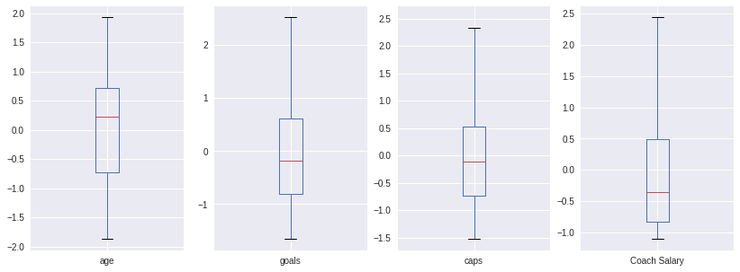
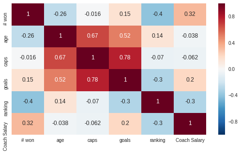
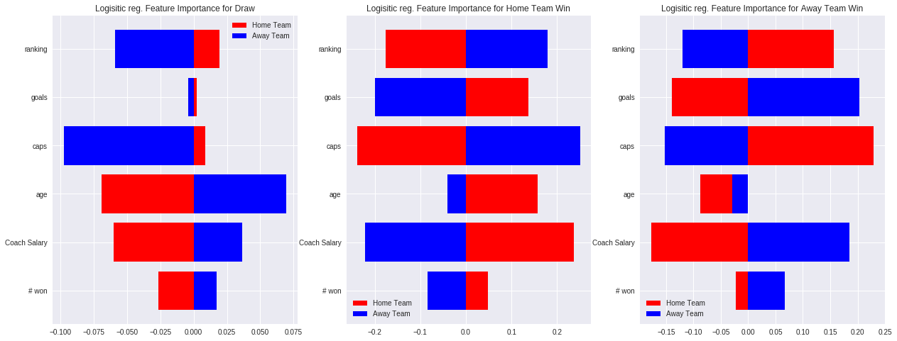
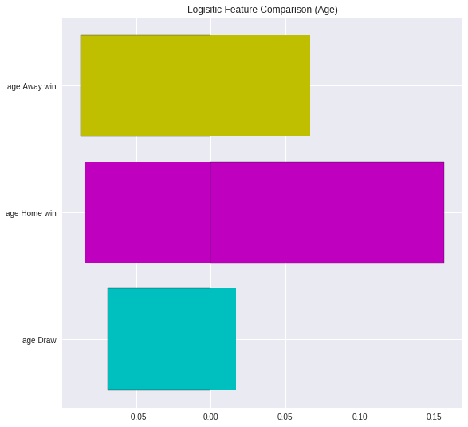
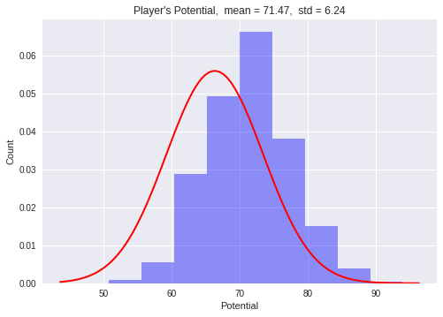
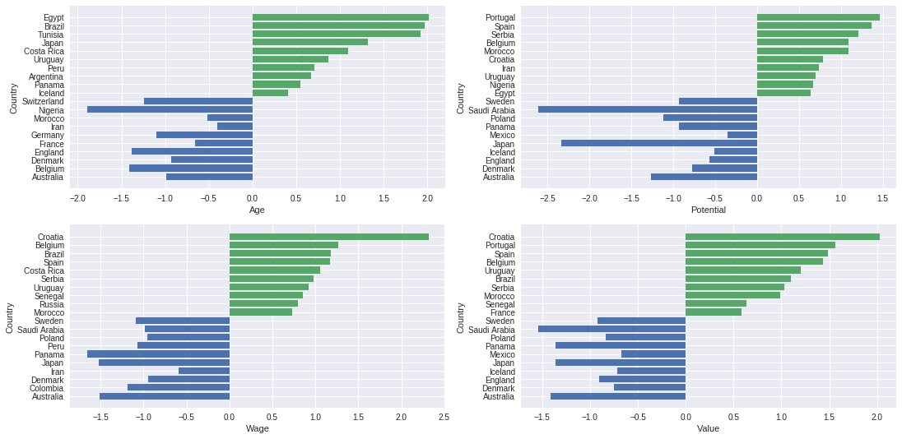
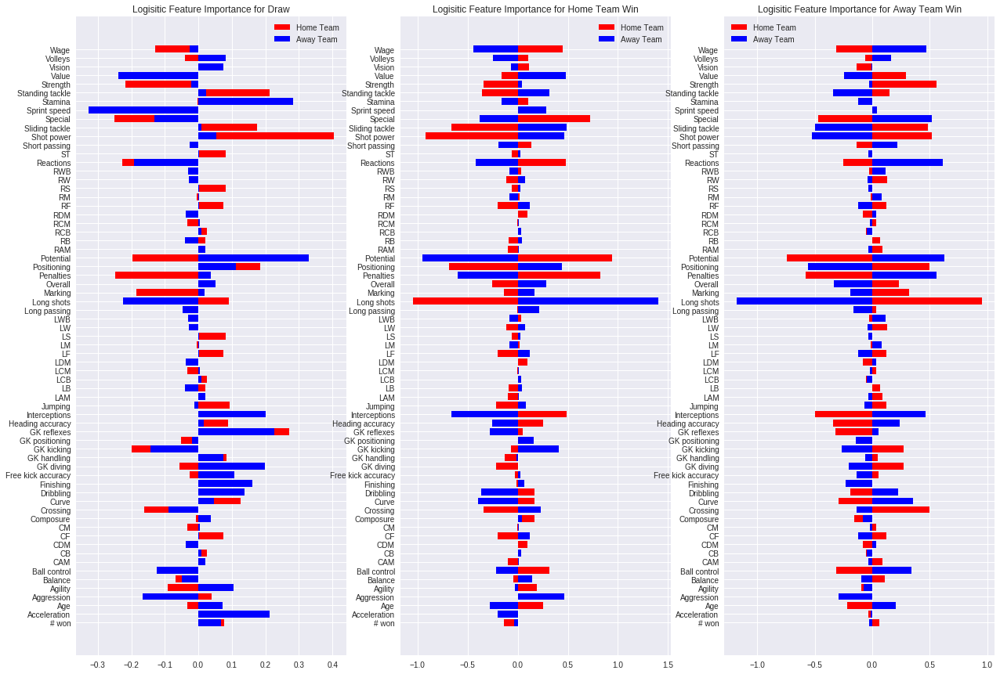
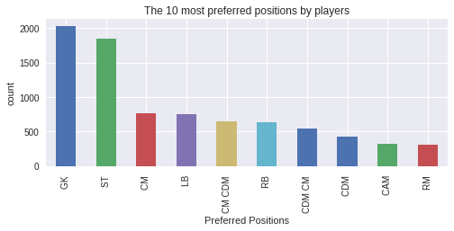

## Contents
{:.no_toc}
*  
{: toc}

# World cup 2018 prediction-Exploratory Data Analysis(Group 3)

DESCRIPTION OF DATA
1. Using scraping techniques data to start the analysis was built. (BeautifulSoup was used for
scraping the data):
 FIFA rankings were scraped from the official FIFA website (www.fifa.com).

 The complete squad data detailing countries that qualified for the world cup (32 countries
in total) and the selected players from each country (23 players in total) were scraped
from Wikipedia page.
 Additional data was scraped to build a dataset of the actual games that were played in
2018 (the games that needs to be predicted by the model) and the actual results. In
machine learning terms, these are the x-test and the y-test sets.
 Additionally data was scraped to create a new predictor of the 32 national teams’ coaches
and their respective salaries.

2. For the training set, a set of previously played games with the known outcome was used. Dataset
from www.sofifa.com (Kaggle), which included all the matched played since 1872 with the final
score, was evaluated. The important information for our analysis included in the dataset were the
team names, their home scores, away scores, city/country in which the match was played, and a
flag indicating the neutrality of the match(obtained from FIFA.com). From the same dataset
x_train, a tuplet of the Home and Away team names, and y_train, the outcome of the match
between those two team is computed. y_train is later transformed to 3-class classification where
class “0” denotes the home team won, class “1” denotes the match result was a draw and “2” if
the away team won. Also for the x_train was filtered to only the games played after 1990 and to
the national teams that qualified at the world cup 2018. That gave us a training set of 3564 games
to train our future models with.
3. The third data source used was players’ data, which was downloaded from www.sofifa.com. This
dataset contains all the various attributes about each player (Name, Age, Nationality, Overall,
Potential, Acceleration, Agility and Balance). We grouped this dataset by the nationality of the
players and averaged them for every existing column. This dataset will be used later on to create
our own feature/predictors to predict the outcome of games without relying on the FIFA ranking.


# WC 2018 Participating teams and players data to be used throughout  our work<a id ='Teamdanalysis'></a>


```

my_page=requests.get("https://en.wikipedia.org/wiki/2018_FIFA_World_Cup_squads")

#Page for Champions leage Team 2017 - 2018
champions_league_page = requests.get("https://en.wikipedia.org/wiki/2017%E2%80%9318_UEFA_Champions_League_group_stage")

squad_soup = BeautifulSoup(my_page.text, "html.parser")
CL_soup = BeautifulSoup(champions_league_page.text, "html.parser") # Parse the champions league page

#GET the list of teams for CHampions LEague 2017-2018
CL_list = []
#find top_node of the teams
top_node = CL_soup.find("th", attrs={"width": "200"})

next_link = top_node.find_next('a')  # get the first link in the node
for i in range(78):  # getting through the next 78 links
    next_link = next_link.find_next('a')  # retrieve the next link
    CL_team = next_link.text.strip('\n')  # Strip all junk character
    if CL_team and '[' not in CL_team:  # Condition to make sure that the link is an actual team
        CL_list.append(CL_team)  # Add the team to the champions league team


cup_date = datetime.datetime(2018, 7, 1, 0, 0, 0)
country_tables = squad_soup.findAll("table", attrs={"class": "sortable wikitable plainrowheaders"})
starlist = []
countrylist = []
top_league_country = ['France', 'Italy', 'Germany', 'England', 'Spain']   #List of top 5 Soccer League in the World


for country_table in country_tables:
    players = country_table.findAll("th", attrs={"scope": "row"})

    for name in players:
        d = dict()
        d['name'] = name.find('a').text.strip('\n')
        pos = name.find_previous_sibling()
        d['pos'] = pos.find('a').text.strip('\n').strip('()')
        rawbday = name.find_next_sibling()
        bday = datetime.datetime.strptime(rawbday.find('span',attrs={'class':'bday'}).text.strip('\n'), '%Y-%m-%d')
        age = rdelta.relativedelta(cup_date,bday).years

        d['age'] = age
        caps = rawbday.find_next_sibling()
        d['caps'] = caps.text.strip('\n')
        goals = caps.find_next_sibling()
        d['goals'] = goals.text.strip('\n')
        country = goals.find_previous('h3').find('span').text.strip('\n')
        club = goals.find_next('a').find_next('a').text.strip('\n')   # Retrieve the club information of the player
        if caps.find_next('a')['title'] in top_league_country:  #Check if the Club is in Top5 leagues
            top_league = 1  # If yes, CLub in Top 5 league
        else:
            top_league = 0  # Club isn't in top 5 league
        d['country'] = country
        d['club'] = club  # Add the club Name of the player in the DataFrame
        d['Top League'] = top_league # Add the player in Top 5 League or Not.

        if club in CL_list:  # Check if the club played champions league
            CL_league = 1
        else:
            CL_league = 0
        d['CL League 2017-2018'] = CL_league # add Champions league 2017/2018 to the data frame
        starlist.append(d)

    countrylist.append(country)
print(starlist)
print(countrylist)


```


    [{'name': 'Essam El-Hadary', 'pos': 'GK', 'age': 45, 'caps': '158', 'goals': '0', 'country': 'Egypt', 'club': 'Al-Taawoun', 'Top League': 0, 'CL League 2017-2018': 0}, {'name': 'Ali Gabr', 'pos': 'DF', 'age': 29, 'caps': '21', 'goals': '1', 'country': 'Egypt', 'club': 'West Bromwich Albion', 'Top League': 1, 'CL League 2017-2018': 0}, {'name': 'Ahmed Elmohamady', 'pos': 'DF', 'age': 30, 'caps': '78', 'goals': '2', 'country': 'Egypt', 'club': 'Aston Villa', 'Top League': 1, 'CL League 2017-2018': 0}, {'name': 'Omar Gaber', 'pos': 'MF', 'age': 26, 'caps': '24', 'goals': '0', 'country': 'Egypt', 'club': 'Los Angeles FC', 'Top League': 0, 'CL League 2017-2018': 0}, {'name': 'Sam Morsy', 'pos': 'MF', 'age': 26, 'caps': '5', 'goals': '0', 'country': 'Egypt', 'club': 'Wigan Athletic', 'Top League': 1, 'CL League 2017-2018': 0}, {'name': 'Ahmed Hegazi', 'pos': 'DF', 'age': 27, 'caps': '45', 'goals': '1', 'country': 'Egypt', 'club': 'West Bromwich Albion', 'Top League': 1, 'CL League 2017-2018': 0}, {'name': 'Ahmed Fathy', 'pos': 'DF', 'age': 33, 'caps': '126', 'goals': '3', 'country': 'Egypt', 'club': 'Al Ahly', 'Top League': 0, 'CL League 2017-2018': 0}, {'name': 'Tarek Hamed', 'pos': 'MF', 'age': 29, 'caps': '21', 'goals': '0', 'country': 'Egypt', 'club': 'Zamalek', 'Top League': 0, 'CL League 2017-2018': 0}, {'name': 'Marwan Mohsen', 'pos': 'FW', 'age': 29, 'caps': '24', 'goals': '4', 'country': 'Egypt', 'club': 'Al Ahly', 'Top League': 0, 'CL League 2017-2018': 0}, {'name': 'Mohamed Salah', 'pos': 'FW', 'age': 26, 'caps': '57', 'goals': '33', 'country': 'Egypt', 'club': 'Liverpool', 'Top League': 1, 'CL League 2017-2018': 1}, {'name': 'Kahraba', 'pos': 'FW', 'age': 24, 'caps': '19', 'goals': '3', 'country': 'Egypt', 'club': 'Al-Ittihad', 'Top League': 0, 'CL League 2017-2018': 0}, {'name': 'Ayman Ashraf', 'pos': 'DF', 'age': 27, 'caps': '4', 'goals': '0', 'country': 'Egypt', 'club': 'Al Ahly', 'Top League': 0, 'CL League 2017-2018': 0}, {'name': 'Mohamed Abdel-Shafy', 'pos': 'DF', 'age': 33, 'caps': '51', 'goals': '1', 'country': 'Egypt', 'club': 'Al-Fateh', 'Top League': 0, 'CL League 2017-2018': 0}, {'name': 'Ramadan Sobhi', 'pos': 'FW', 'age': 21, 'caps': '23', 'goals': '1', 'country': 'Egypt', 'club': 'Stoke City', 'Top League': 1, 'CL League 2017-2018': 0}, {'name': 'Mahmoud Hamdy', 'pos': 'DF', 'age': 23, 'caps': '0', 'goals': '0', 'country': 'Egypt', 'club': 'Zamalek', 'Top League': 0, 'CL League 2017-2018': 0}, {'name': 'Sherif Ekramy', 'pos': 'GK', 'age': 34, 'caps': '22', 'goals': '0', 'country': 'Egypt', 'club': 'Al Ahly', 'Top League': 0, 'CL League 2017-2018': 0}, {'name': 'Mohamed Elneny', 'pos': 'MF', 'age': 25, 'caps': '61', 'goals': '5', 'country': 'Egypt', 'club': 'Arsenal', 'Top League': 1, 'CL League 2017-2018': 0}, {'name': 'Shikabala', 'pos': 'FW', 'age': 32, 'caps': '29', 'goals': '2', 'country': 'Egypt', 'club': 'Al-Raed', 'Top League': 0, 'CL League 2017-2018': 0}, {'name': 'Abdallah Said', 'pos': 'MF', 'age': 32, 'caps': '36', 'goals': '6', 'country': 'Egypt', 'club': 'KuPS', 'Top League': 0, 'CL League 2017-2018': 0}, {'name': 'Saad Samir', 'pos': 'DF', 'age': 29, 'caps': '11', 'goals': '0', 'country': 'Egypt', 'club': 'Al Ahly', 'Top League': 0, 'CL League 2017-2018': 0}, {'name': 'Trézéguet', 'pos': 'MF', 'age': 23, 'caps': '24', 'goals': '2', 'country': 'Egypt', 'club': 'Kasımpaşa', 'Top League': 0, 'CL League 2017-2018': 0}, {'name': 'Amr Warda', 'pos': 'FW', 'age': 24, 'caps': '16', 'goals': '0', 'country': 'Egypt', 'club': 'Atromitos', 'Top League': 0, 'CL League 2017-2018': 0}, {'name': 'Mohamed El-Shenawy', 'pos': 'GK', 'age': 29, 'caps': '3', 'goals': '0', 'country': 'Egypt', 'club': 'Al Ahly', 'Top League': 0, 'CL League 2017-2018': 0}, {'name': 'Igor Akinfeev', 'pos': 'GK', 'age': 32, 'caps': '106', 'goals': '0', 'country': 'Russia', 'club': 'CSKA Moscow', 'Top League': 0, 'CL League 2017-2018': 1}, {'name': 'Mário Fernandes', 'pos': 'DF', 'age': 27, 'caps': '5', 'goals': '0', 'country': 'Russia', 'club': 'CSKA Moscow', 'Top League': 0, 'CL League 2017-2018': 1}, {'name': 'Ilya Kutepov', 'pos': 'DF', 'age': 24, 'caps': '7', 'goals': '0', 'country': 'Russia', 'club': 'Spartak Moscow', 'Top League': 0, 'CL League 2017-2018': 1}, {'name': 'Sergei Ignashevich', 'pos': 'DF', 'age': 38, 'caps': '122', 'goals': '8', 'country': 'Russia', 'club': 'CSKA Moscow', 'Top League': 0, 'CL League 2017-2018': 1}, {'name': 'Andrei Semyonov', 'pos': 'DF', 'age': 29, 'caps': '6', 'goals': '0', 'country': 'Russia', 'club': 'Akhmat Grozny', 'Top League': 0, 'CL League 2017-2018': 0}, {'name': 'Denis Cheryshev', 'pos': 'MF', 'age': 27, 'caps': '11', 'goals': '0', 'country': 'Russia', 'club': 'Villarreal', 'Top League': 1, 'CL League 2017-2018': 0}, {'name': 'Daler Kuzyayev', 'pos': 'MF', 'age': 25, 'caps': '6', 'goals': '0', 'country': 'Russia', 'club': 'Zenit Saint Petersburg', 'Top League': 0, 'CL League 2017-2018': 0}, {'name': 'Yury Gazinsky', 'pos': 'MF', 'age': 28, 'caps': '6', 'goals': '0', 'country': 'Russia', 'club': 'Krasnodar', 'Top League': 0, 'CL League 2017-2018': 0}, {'name': 'Alan Dzagoev', 'pos': 'MF', 'age': 28, 'caps': '57', 'goals': '9', 'country': 'Russia', 'club': 'CSKA Moscow', 'Top League': 0, 'CL League 2017-2018': 1}, {'name': 'Fyodor Smolov', 'pos': 'FW', 'age': 28, 'caps': '32', 'goals': '12', 'country': 'Russia', 'club': 'Krasnodar', 'Top League': 0, 'CL League 2017-2018': 0}, {'name': 'Roman Zobnin', 'pos': 'MF', 'age': 24, 'caps': '12', 'goals': '0', 'country': 'Russia', 'club': 'Spartak Moscow', 'Top League': 0, 'CL League 2017-2018': 1}, {'name': 'Andrey Lunyov', 'pos': 'GK', 'age': 26, 'caps': '3', 'goals': '0', 'country': 'Russia', 'club': 'Zenit Saint Petersburg', 'Top League': 0, 'CL League 2017-2018': 0}, {'name': 'Fyodor Kudryashov', 'pos': 'DF', 'age': 31, 'caps': '19', 'goals': '0', 'country': 'Russia', 'club': 'Rubin Kazan', 'Top League': 0, 'CL League 2017-2018': 0}, {'name': 'Vladimir Granat', 'pos': 'DF', 'age': 31, 'caps': '12', 'goals': '1', 'country': 'Russia', 'club': 'Rubin Kazan', 'Top League': 0, 'CL League 2017-2018': 0}, {'name': 'Aleksei Miranchuk', 'pos': 'MF', 'age': 22, 'caps': '18', 'goals': '4', 'country': 'Russia', 'club': 'Lokomotiv Moscow', 'Top League': 0, 'CL League 2017-2018': 0}, {'name': 'Anton Miranchuk', 'pos': 'MF', 'age': 22, 'caps': '6', 'goals': '0', 'country': 'Russia', 'club': 'Lokomotiv Moscow', 'Top League': 0, 'CL League 2017-2018': 0}, {'name': 'Aleksandr Golovin', 'pos': 'MF', 'age': 22, 'caps': '19', 'goals': '2', 'country': 'Russia', 'club': 'CSKA Moscow', 'Top League': 0, 'CL League 2017-2018': 1}, {'name': 'Yuri Zhirkov', 'pos': 'MF', 'age': 34, 'caps': '84', 'goals': '2', 'country': 'Russia', 'club': 'Zenit Saint Petersburg', 'Top League': 0, 'CL League 2017-2018': 0}, {'name': 'Aleksandr Samedov', 'pos': 'MF', 'age': 33, 'caps': '48', 'goals': '7', 'country': 'Russia', 'club': 'Spartak Moscow', 'Top League': 0, 'CL League 2017-2018': 1}, {'name': 'Vladimir Gabulov', 'pos': 'GK', 'age': 34, 'caps': '10', 'goals': '0', 'country': 'Russia', 'club': 'Club Brugge', 'Top League': 0, 'CL League 2017-2018': 0}, {'name': 'Aleksandr Yerokhin', 'pos': 'MF', 'age': 28, 'caps': '17', 'goals': '0', 'country': 'Russia', 'club': 'Zenit Saint Petersburg', 'Top League': 0, 'CL League 2017-2018': 0}, {'name': 'Artem Dzyuba', 'pos': 'FW', 'age': 29, 'caps': '23', 'goals': '11', 'country': 'Russia', 'club': 'Arsenal Tula', 'Top League': 0, 'CL League 2017-2018': 0}, {'name': 'Igor Smolnikov', 'pos': 'DF', 'age': 29, 'caps': '27', 'goals': '0', 'country': 'Russia', 'club': 'Zenit Saint Petersburg', 'Top League': 0, 'CL League 2017-2018': 0}, {'name': 'Abdullah Al-Mayouf', 'pos': 'GK', 'age': 31, 'caps': '11', 'goals': '0', 'country': 'Saudi Arabia', 'club': 'Al-Hilal', 'Top League': 0, 'CL League 2017-2018': 0}, {'name': 'Mansoor Al-Harbi', 'pos': 'DF', 'age': 30, 'caps': '40', 'goals': '1', 'country': 'Saudi Arabia', 'club': 'Al-Ahli', 'Top League': 0, 'CL League 2017-2018': 0}, {'name': 'Osama Hawsawi', 'pos': 'DF', 'age': 34, 'caps': '135', 'goals': '7', 'country': 'Saudi Arabia', 'club': 'Al-Hilal', 'Top League': 0, 'CL League 2017-2018': 0}, {'name': 'Ali Al-Bulaihi', 'pos': 'DF', 'age': 28, 'caps': '4', 'goals': '0', 'country': 'Saudi Arabia', 'club': 'Al-Hilal', 'Top League': 0, 'CL League 2017-2018': 0}, {'name': 'Omar Hawsawi', 'pos': 'DF', 'age': 32, 'caps': '42', 'goals': '3', 'country': 'Saudi Arabia', 'club': 'Al-Nassr', 'Top League': 0, 'CL League 2017-2018': 0}, {'name': 'Mohammed Al-Breik', 'pos': 'DF', 'age': 25, 'caps': '11', 'goals': '1', 'country': 'Saudi Arabia', 'club': 'Al-Hilal', 'Top League': 0, 'CL League 2017-2018': 0}, {'name': 'Salman Al-Faraj', 'pos': 'MF', 'age': 28, 'caps': '43', 'goals': '3', 'country': 'Saudi Arabia', 'club': 'Al-Hilal', 'Top League': 0, 'CL League 2017-2018': 0}, {'name': 'Yahya Al-Shehri', 'pos': 'MF', 'age': 28, 'caps': '57', 'goals': '8', 'country': 'Saudi Arabia', 'club': 'Leganés', 'Top League': 1, 'CL League 2017-2018': 0}, {'name': 'Hattan Bahebri', 'pos': 'MF', 'age': 25, 'caps': '5', 'goals': '0', 'country': 'Saudi Arabia', 'club': 'Al-Shabab', 'Top League': 0, 'CL League 2017-2018': 0}, {'name': 'Mohammad Al-Sahlawi', 'pos': 'FW', 'age': 31, 'caps': '40', 'goals': '28', 'country': 'Saudi Arabia', 'club': 'Al-Nassr', 'Top League': 0, 'CL League 2017-2018': 0}, {'name': 'Abdulmalek Al-Khaibri', 'pos': 'MF', 'age': 32, 'caps': '36', 'goals': '0', 'country': 'Saudi Arabia', 'club': 'Al-Hilal', 'Top League': 0, 'CL League 2017-2018': 0}, {'name': 'Mohamed Kanno', 'pos': 'MF', 'age': 23, 'caps': '6', 'goals': '1', 'country': 'Saudi Arabia', 'club': 'Al-Hilal', 'Top League': 0, 'CL League 2017-2018': 0}, {'name': 'Yasser Al-Shahrani', 'pos': 'DF', 'age': 26, 'caps': '37', 'goals': '0', 'country': 'Saudi Arabia', 'club': 'Al-Hilal', 'Top League': 0, 'CL League 2017-2018': 0}, {'name': 'Abdullah Otayf', 'pos': 'MF', 'age': 25, 'caps': '16', 'goals': '1', 'country': 'Saudi Arabia', 'club': 'Al-Hilal', 'Top League': 0, 'CL League 2017-2018': 0}, {'name': 'Abdullah Al-Khaibari', 'pos': 'MF', 'age': 21, 'caps': '5', 'goals': '0', 'country': 'Saudi Arabia', 'club': 'Al-Shabab', 'Top League': 0, 'CL League 2017-2018': 0}, {'name': 'Housain Al-Mogahwi', 'pos': 'MF', 'age': 30, 'caps': '18', 'goals': '1', 'country': 'Saudi Arabia', 'club': 'Al-Ahli', 'Top League': 0, 'CL League 2017-2018': 0}, {'name': 'Taisir Al-Jassim', 'pos': 'MF', 'age': 33, 'caps': '132', 'goals': '19', 'country': 'Saudi Arabia', 'club': 'Al-Ahli', 'Top League': 0, 'CL League 2017-2018': 0}, {'name': 'Salem Al-Dawsari', 'pos': 'MF', 'age': 26, 'caps': '33', 'goals': '4', 'country': 'Saudi Arabia', 'club': 'Villarreal', 'Top League': 1, 'CL League 2017-2018': 0}, {'name': 'Fahad Al-Muwallad', 'pos': 'FW', 'age': 23, 'caps': '45', 'goals': '10', 'country': 'Saudi Arabia', 'club': 'Levante', 'Top League': 1, 'CL League 2017-2018': 0}, {'name': 'Muhannad Assiri', 'pos': 'FW', 'age': 31, 'caps': '18', 'goals': '4', 'country': 'Saudi Arabia', 'club': 'Al-Ahli', 'Top League': 0, 'CL League 2017-2018': 0}, {'name': 'Yasser Al-Mosailem', 'pos': 'GK', 'age': 34, 'caps': '32', 'goals': '0', 'country': 'Saudi Arabia', 'club': 'Al-Ahli', 'Top League': 0, 'CL League 2017-2018': 0}, {'name': 'Mohammed Al-Owais', 'pos': 'GK', 'age': 26, 'caps': '6', 'goals': '0', 'country': 'Saudi Arabia', 'club': 'Al-Ahli', 'Top League': 0, 'CL League 2017-2018': 0}, {'name': 'Motaz Hawsawi', 'pos': 'DF', 'age': 26, 'caps': '17', 'goals': '0', 'country': 'Saudi Arabia', 'club': 'Al-Ahli', 'Top League': 0, 'CL League 2017-2018': 0}, {'name': 'Fernando Muslera', 'pos': 'GK', 'age': 32, 'caps': '97', 'goals': '0', 'country': 'Uruguay', 'club': 'Galatasaray', 'Top League': 0, 'CL League 2017-2018': 0}, {'name': 'José Giménez', 'pos': 'DF', 'age': 23, 'caps': '42', 'goals': '5', 'country': 'Uruguay', 'club': 'Atlético Madrid', 'Top League': 1, 'CL League 2017-2018': 1}, {'name': 'Diego Godín', 'pos': 'DF', 'age': 32, 'caps': '116', 'goals': '8', 'country': 'Uruguay', 'club': 'Atlético Madrid', 'Top League': 1, 'CL League 2017-2018': 1}, {'name': 'Guillermo Varela', 'pos': 'DF', 'age': 25, 'caps': '3', 'goals': '0', 'country': 'Uruguay', 'club': 'Peñarol', 'Top League': 0, 'CL League 2017-2018': 0}, {'name': 'Carlos Sánchez', 'pos': 'MF', 'age': 33, 'caps': '36', 'goals': '1', 'country': 'Uruguay', 'club': 'Monterrey', 'Top League': 0, 'CL League 2017-2018': 0}, {'name': 'Rodrigo Bentancur', 'pos': 'MF', 'age': 21, 'caps': '7', 'goals': '0', 'country': 'Uruguay', 'club': 'Juventus', 'Top League': 1, 'CL League 2017-2018': 1}, {'name': 'Cristian Rodríguez', 'pos': 'MF', 'age': 32, 'caps': '105', 'goals': '11', 'country': 'Uruguay', 'club': 'Peñarol', 'Top League': 0, 'CL League 2017-2018': 0}, {'name': 'Nahitan Nández', 'pos': 'MF', 'age': 22, 'caps': '12', 'goals': '0', 'country': 'Uruguay', 'club': 'Boca Juniors', 'Top League': 0, 'CL League 2017-2018': 0}, {'name': 'Luis Suárez', 'pos': 'FW', 'age': 31, 'caps': '98', 'goals': '51', 'country': 'Uruguay', 'club': 'Barcelona', 'Top League': 1, 'CL League 2017-2018': 1}, {'name': 'Giorgian De Arrascaeta', 'pos': 'FW', 'age': 24, 'caps': '14', 'goals': '2', 'country': 'Uruguay', 'club': 'Cruzeiro', 'Top League': 0, 'CL League 2017-2018': 0}, {'name': 'Cristhian Stuani', 'pos': 'FW', 'age': 31, 'caps': '41', 'goals': '5', 'country': 'Uruguay', 'club': 'Girona', 'Top League': 1, 'CL League 2017-2018': 0}, {'name': 'Martín Campaña', 'pos': 'GK', 'age': 29, 'caps': '1', 'goals': '0', 'country': 'Uruguay', 'club': 'Independiente', 'Top League': 0, 'CL League 2017-2018': 0}, {'name': 'Gastón Silva', 'pos': 'DF', 'age': 24, 'caps': '17', 'goals': '0', 'country': 'Uruguay', 'club': 'Independiente', 'Top League': 0, 'CL League 2017-2018': 0}, {'name': 'Lucas Torreira', 'pos': 'MF', 'age': 22, 'caps': '3', 'goals': '0', 'country': 'Uruguay', 'club': 'Sampdoria', 'Top League': 1, 'CL League 2017-2018': 0}, {'name': 'Matías Vecino', 'pos': 'MF', 'age': 26, 'caps': '22', 'goals': '1', 'country': 'Uruguay', 'club': 'Inter Milan', 'Top League': 1, 'CL League 2017-2018': 0}, {'name': 'Maxi Pereira', 'pos': 'DF', 'age': 34, 'caps': '125', 'goals': '3', 'country': 'Uruguay', 'club': 'Porto', 'Top League': 0, 'CL League 2017-2018': 1}, {'name': 'Diego Laxalt', 'pos': 'MF', 'age': 25, 'caps': '6', 'goals': '0', 'country': 'Uruguay', 'club': 'Genoa', 'Top League': 1, 'CL League 2017-2018': 0}, {'name': 'Maxi Gómez', 'pos': 'FW', 'age': 21, 'caps': '5', 'goals': '0', 'country': 'Uruguay', 'club': 'Celta Vigo', 'Top League': 1, 'CL League 2017-2018': 0}, {'name': 'Sebastián Coates', 'pos': 'DF', 'age': 27, 'caps': '30', 'goals': '1', 'country': 'Uruguay', 'club': 'Sporting CP', 'Top League': 0, 'CL League 2017-2018': 1}, {'name': 'Jonathan Urretaviscaya', 'pos': 'FW', 'age': 28, 'caps': '4', 'goals': '0', 'country': 'Uruguay', 'club': 'Monterrey', 'Top League': 0, 'CL League 2017-2018': 0}, {'name': 'Edinson Cavani', 'pos': 'FW', 'age': 31, 'caps': '101', 'goals': '42', 'country': 'Uruguay', 'club': 'Paris Saint-Germain', 'Top League': 1, 'CL League 2017-2018': 1}, {'name': 'Martín Cáceres', 'pos': 'DF', 'age': 31, 'caps': '76', 'goals': '4', 'country': 'Uruguay', 'club': 'Lazio', 'Top League': 1, 'CL League 2017-2018': 0}, {'name': 'Martín Silva', 'pos': 'GK', 'age': 35, 'caps': '11', 'goals': '0', 'country': 'Uruguay', 'club': 'Vasco da Gama', 'Top League': 0, 'CL League 2017-2018': 0}, {'name': 'Alireza Beiranvand', 'pos': 'GK', 'age': 25, 'caps': '22', 'goals': '0', 'country': 'Iran', 'club': 'Persepolis', 'Top League': 0, 'CL League 2017-2018': 0}, {'name': 'Mehdi Torabi', 'pos': 'MF', 'age': 23, 'caps': '17', 'goals': '4', 'country': 'Iran', 'club': 'Saipa', 'Top League': 0, 'CL League 2017-2018': 0}, {'name': 'Ehsan Hajsafi', 'pos': 'DF', 'age': 28, 'caps': '94', 'goals': '6', 'country': 'Iran', 'club': 'Olympiacos', 'Top League': 0, 'CL League 2017-2018': 1}, {'name': 'Rouzbeh Cheshmi', 'pos': 'DF', 'age': 24, 'caps': '10', 'goals': '1', 'country': 'Iran', 'club': 'Esteghlal', 'Top League': 0, 'CL League 2017-2018': 0}, {'name': 'Milad Mohammadi', 'pos': 'DF', 'age': 24, 'caps': '19', 'goals': '0', 'country': 'Iran', 'club': 'Akhmat Grozny', 'Top League': 0, 'CL League 2017-2018': 0}, {'name': 'Saeid Ezatolahi', 'pos': 'MF', 'age': 21, 'caps': '25', 'goals': '1', 'country': 'Iran', 'club': 'Amkar Perm', 'Top League': 0, 'CL League 2017-2018': 0}, {'name': 'Masoud Shojaei', 'pos': 'MF', 'age': 34, 'caps': '74', 'goals': '8', 'country': 'Iran', 'club': 'AEK Athens', 'Top League': 0, 'CL League 2017-2018': 0}, {'name': 'Morteza Pouraliganji', 'pos': 'DF', 'age': 26, 'caps': '27', 'goals': '2', 'country': 'Iran', 'club': 'Al-Sadd', 'Top League': 0, 'CL League 2017-2018': 0}, {'name': 'Omid Ebrahimi', 'pos': 'MF', 'age': 30, 'caps': '30', 'goals': '0', 'country': 'Iran', 'club': 'Esteghlal', 'Top League': 0, 'CL League 2017-2018': 0}, {'name': 'Karim Ansarifard', 'pos': 'FW', 'age': 28, 'caps': '64', 'goals': '17', 'country': 'Iran', 'club': 'Olympiacos', 'Top League': 0, 'CL League 2017-2018': 1}, {'name': 'Vahid Amiri', 'pos': 'MF', 'age': 30, 'caps': '36', 'goals': '1', 'country': 'Iran', 'club': 'Persepolis', 'Top League': 0, 'CL League 2017-2018': 0}, {'name': 'Mohammad Rashid Mazaheri', 'pos': 'GK', 'age': 29, 'caps': '3', 'goals': '0', 'country': 'Iran', 'club': 'Zob Ahan', 'Top League': 0, 'CL League 2017-2018': 0}, {'name': 'Mohammad Reza Khanzadeh', 'pos': 'DF', 'age': 27, 'caps': '11', 'goals': '1', 'country': 'Iran', 'club': 'Padideh', 'Top League': 0, 'CL League 2017-2018': 0}, {'name': 'Saman Ghoddos', 'pos': 'FW', 'age': 24, 'caps': '8', 'goals': '1', 'country': 'Iran', 'club': 'Östersund', 'Top League': 0, 'CL League 2017-2018': 0}, {'name': 'Pejman Montazeri', 'pos': 'DF', 'age': 34, 'caps': '46', 'goals': '1', 'country': 'Iran', 'club': 'Esteghlal', 'Top League': 0, 'CL League 2017-2018': 0}, {'name': 'Reza Ghoochannejhad', 'pos': 'FW', 'age': 30, 'caps': '43', 'goals': '17', 'country': 'Iran', 'club': 'Heerenveen', 'Top League': 0, 'CL League 2017-2018': 0}, {'name': 'Mehdi Taremi', 'pos': 'FW', 'age': 25, 'caps': '26', 'goals': '11', 'country': 'Iran', 'club': 'Al-Gharafa', 'Top League': 0, 'CL League 2017-2018': 0}, {'name': 'Alireza Jahanbakhsh', 'pos': 'FW', 'age': 24, 'caps': '38', 'goals': '4', 'country': 'Iran', 'club': 'AZ', 'Top League': 0, 'CL League 2017-2018': 0}, {'name': 'Majid Hosseini', 'pos': 'DF', 'age': 22, 'caps': '1', 'goals': '0', 'country': 'Iran', 'club': 'Esteghlal', 'Top League': 0, 'CL League 2017-2018': 0}, {'name': 'Sardar Azmoun', 'pos': 'FW', 'age': 23, 'caps': '33', 'goals': '23', 'country': 'Iran', 'club': 'Rubin Kazan', 'Top League': 0, 'CL League 2017-2018': 0}, {'name': 'Ashkan Dejagah', 'pos': 'FW', 'age': 31, 'caps': '46', 'goals': '9', 'country': 'Iran', 'club': 'Nottingham Forest', 'Top League': 1, 'CL League 2017-2018': 0}, {'name': 'Amir Abedzadeh', 'pos': 'GK', 'age': 25, 'caps': '1', 'goals': '0', 'country': 'Iran', 'club': 'Marítimo', 'Top League': 0, 'CL League 2017-2018': 0}, {'name': 'Ramin Rezaeian', 'pos': 'DF', 'age': 28, 'caps': '28', 'goals': '2', 'country': 'Iran', 'club': 'Oostende', 'Top League': 0, 'CL League 2017-2018': 0}, {'name': 'Yassine Bounou', 'pos': 'GK', 'age': 27, 'caps': '11', 'goals': '0', 'country': 'Morocco', 'club': 'Girona', 'Top League': 1, 'CL League 2017-2018': 0}, {'name': 'Achraf Hakimi', 'pos': 'DF', 'age': 19, 'caps': '10', 'goals': '1', 'country': 'Morocco', 'club': 'Real Madrid', 'Top League': 1, 'CL League 2017-2018': 1}, {'name': 'Hamza Mendyl', 'pos': 'DF', 'age': 20, 'caps': '13', 'goals': '0', 'country': 'Morocco', 'club': 'Lille', 'Top League': 1, 'CL League 2017-2018': 0}, {'name': 'Manuel da Costa', 'pos': 'DF', 'age': 32, 'caps': '28', 'goals': '1', 'country': 'Morocco', 'club': 'İstanbul Başakşehir', 'Top League': 0, 'CL League 2017-2018': 0}, {'name': 'Medhi Benatia', 'pos': 'DF', 'age': 31, 'caps': '57', 'goals': '2', 'country': 'Morocco', 'club': 'Juventus', 'Top League': 1, 'CL League 2017-2018': 1}, {'name': 'Romain Saïss', 'pos': 'DF', 'age': 28, 'caps': '24', 'goals': '1', 'country': 'Morocco', 'club': 'Wolverhampton Wanderers', 'Top League': 1, 'CL League 2017-2018': 0}, {'name': 'Hakim Ziyech', 'pos': 'MF', 'age': 25, 'caps': '18', 'goals': '9', 'country': 'Morocco', 'club': 'Ajax', 'Top League': 0, 'CL League 2017-2018': 0}, {'name': 'Karim El Ahmadi', 'pos': 'MF', 'age': 33, 'caps': '51', 'goals': '1', 'country': 'Morocco', 'club': 'Feyenoord', 'Top League': 0, 'CL League 2017-2018': 1}, {'name': 'Ayoub El Kaabi', 'pos': 'FW', 'age': 25, 'caps': '10', 'goals': '11', 'country': 'Morocco', 'club': 'RS Berkane', 'Top League': 0, 'CL League 2017-2018': 0}, {'name': 'Younès Belhanda', 'pos': 'MF', 'age': 28, 'caps': '47', 'goals': '5', 'country': 'Morocco', 'club': 'Galatasaray', 'Top League': 0, 'CL League 2017-2018': 0}, {'name': 'Fayçal Fajr', 'pos': 'MF', 'age': 29, 'caps': '23', 'goals': '2', 'country': 'Morocco', 'club': 'Getafe', 'Top League': 1, 'CL League 2017-2018': 0}, {'name': 'Munir Mohamedi', 'pos': 'GK', 'age': 29, 'caps': '27', 'goals': '0', 'country': 'Morocco', 'club': 'Numancia', 'Top League': 1, 'CL League 2017-2018': 0}, {'name': 'Khalid Boutaïb', 'pos': 'FW', 'age': 31, 'caps': '18', 'goals': '7', 'country': 'Morocco', 'club': 'Yeni Malatyaspor', 'Top League': 0, 'CL League 2017-2018': 0}, {'name': 'Mbark Boussoufa', 'pos': 'MF', 'age': 33, 'caps': '59', 'goals': '7', 'country': 'Morocco', 'club': 'Al-Jazira', 'Top League': 0, 'CL League 2017-2018': 0}, {'name': 'Youssef Aït Bennasser', 'pos': 'MF', 'age': 21, 'caps': '14', 'goals': '0', 'country': 'Morocco', 'club': 'Caen', 'Top League': 1, 'CL League 2017-2018': 0}, {'name': 'Nordin Amrabat', 'pos': 'MF', 'age': 31, 'caps': '44', 'goals': '4', 'country': 'Morocco', 'club': 'Leganés', 'Top League': 1, 'CL League 2017-2018': 0}, {'name': 'Nabil Dirar', 'pos': 'DF', 'age': 32, 'caps': '34', 'goals': '3', 'country': 'Morocco', 'club': 'Fenerbahçe', 'Top League': 0, 'CL League 2017-2018': 0}, {'name': 'Amine Harit', 'pos': 'MF', 'age': 21, 'caps': '6', 'goals': '0', 'country': 'Morocco', 'club': 'Schalke 04', 'Top League': 1, 'CL League 2017-2018': 0}, {'name': 'Youssef En-Nesyri', 'pos': 'FW', 'age': 21, 'caps': '16', 'goals': '2', 'country': 'Morocco', 'club': 'Málaga', 'Top League': 1, 'CL League 2017-2018': 0}, {'name': 'Aziz Bouhaddouz', 'pos': 'FW', 'age': 31, 'caps': '15', 'goals': '3', 'country': 'Morocco', 'club': 'FC St. Pauli', 'Top League': 1, 'CL League 2017-2018': 0}, {'name': 'Sofyan Amrabat', 'pos': 'MF', 'age': 21, 'caps': '6', 'goals': '0', 'country': 'Morocco', 'club': 'Feyenoord', 'Top League': 0, 'CL League 2017-2018': 1}, {'name': 'Ahmed Reda Tagnaouti', 'pos': 'GK', 'age': 22, 'caps': '2', 'goals': '0', 'country': 'Morocco', 'club': 'IR Tanger', 'Top League': 0, 'CL League 2017-2018': 0}, {'name': 'Mehdi Carcela', 'pos': 'MF', 'age': 29, 'caps': '20', 'goals': '1', 'country': 'Morocco', 'club': 'Standard Liège', 'Top League': 0, 'CL League 2017-2018': 0}, {'name': 'Rui Patrício', 'pos': 'GK', 'age': 30, 'caps': '69', 'goals': '0', 'country': 'Portugal', 'club': 'Sporting CP', 'Top League': 0, 'CL League 2017-2018': 1}, {'name': 'Bruno Alves', 'pos': 'DF', 'age': 36, 'caps': '96', 'goals': '11', 'country': 'Portugal', 'club': 'Rangers', 'Top League': 0, 'CL League 2017-2018': 0}, {'name': 'Pepe', 'pos': 'DF', 'age': 35, 'caps': '95', 'goals': '5', 'country': 'Portugal', 'club': 'Beşiktaş', 'Top League': 0, 'CL League 2017-2018': 1}, {'name': 'Manuel Fernandes', 'pos': 'MF', 'age': 32, 'caps': '14', 'goals': '3', 'country': 'Portugal', 'club': 'Lokomotiv Moscow', 'Top League': 0, 'CL League 2017-2018': 0}, {'name': 'Raphaël Guerreiro', 'pos': 'DF', 'age': 24, 'caps': '24', 'goals': '2', 'country': 'Portugal', 'club': 'Borussia Dortmund', 'Top League': 1, 'CL League 2017-2018': 1}, {'name': 'José Fonte', 'pos': 'DF', 'age': 34, 'caps': '31', 'goals': '0', 'country': 'Portugal', 'club': 'Dalian Yifang', 'Top League': 0, 'CL League 2017-2018': 0}, {'name': 'Cristiano Ronaldo', 'pos': 'FW', 'age': 33, 'caps': '150', 'goals': '81', 'country': 'Portugal', 'club': 'Real Madrid', 'Top League': 1, 'CL League 2017-2018': 1}, {'name': 'João Moutinho', 'pos': 'MF', 'age': 31, 'caps': '110', 'goals': '7', 'country': 'Portugal', 'club': 'Monaco', 'Top League': 1, 'CL League 2017-2018': 1}, {'name': 'André Silva', 'pos': 'FW', 'age': 22, 'caps': '23', 'goals': '12', 'country': 'Portugal', 'club': 'Milan', 'Top League': 1, 'CL League 2017-2018': 0}, {'name': 'João Mário', 'pos': 'MF', 'age': 25, 'caps': '36', 'goals': '2', 'country': 'Portugal', 'club': 'West Ham United', 'Top League': 1, 'CL League 2017-2018': 0}, {'name': 'Bernardo Silva', 'pos': 'MF', 'age': 23, 'caps': '25', 'goals': '2', 'country': 'Portugal', 'club': 'Manchester City', 'Top League': 1, 'CL League 2017-2018': 1}, {'name': 'Anthony Lopes', 'pos': 'GK', 'age': 27, 'caps': '7', 'goals': '0', 'country': 'Portugal', 'club': 'Lyon', 'Top League': 1, 'CL League 2017-2018': 0}, {'name': 'Rúben Dias', 'pos': 'DF', 'age': 21, 'caps': '1', 'goals': '0', 'country': 'Portugal', 'club': 'Benfica', 'Top League': 0, 'CL League 2017-2018': 1}, {'name': 'William Carvalho', 'pos': 'MF', 'age': 26, 'caps': '43', 'goals': '2', 'country': 'Portugal', 'club': 'Sporting CP', 'Top League': 0, 'CL League 2017-2018': 1}, {'name': 'Ricardo Pereira', 'pos': 'DF', 'age': 24, 'caps': '4', 'goals': '0', 'country': 'Portugal', 'club': 'Porto', 'Top League': 0, 'CL League 2017-2018': 1}, {'name': 'Bruno Fernandes', 'pos': 'MF', 'age': 23, 'caps': '6', 'goals': '1', 'country': 'Portugal', 'club': 'Sporting CP', 'Top League': 0, 'CL League 2017-2018': 1}, {'name': 'Gonçalo Guedes', 'pos': 'FW', 'age': 21, 'caps': '10', 'goals': '3', 'country': 'Portugal', 'club': 'Valencia', 'Top League': 1, 'CL League 2017-2018': 0}, {'name': 'Gelson Martins', 'pos': 'FW', 'age': 23, 'caps': '18', 'goals': '0', 'country': 'Portugal', 'club': 'Sporting CP', 'Top League': 0, 'CL League 2017-2018': 1}, {'name': 'Mário Rui', 'pos': 'DF', 'age': 27, 'caps': '4', 'goals': '0', 'country': 'Portugal', 'club': 'Napoli', 'Top League': 1, 'CL League 2017-2018': 1}, {'name': 'Ricardo Quaresma', 'pos': 'FW', 'age': 34, 'caps': '77', 'goals': '9', 'country': 'Portugal', 'club': 'Beşiktaş', 'Top League': 0, 'CL League 2017-2018': 1}, {'name': 'Cédric', 'pos': 'DF', 'age': 26, 'caps': '29', 'goals': '1', 'country': 'Portugal', 'club': 'Southampton', 'Top League': 1, 'CL League 2017-2018': 0}, {'name': 'Beto', 'pos': 'GK', 'age': 36, 'caps': '14', 'goals': '0', 'country': 'Portugal', 'club': 'Göztepe', 'Top League': 0, 'CL League 2017-2018': 0}, {'name': 'Adrien Silva', 'pos': 'MF', 'age': 29, 'caps': '23', 'goals': '1', 'country': 'Portugal', 'club': 'Leicester City', 'Top League': 1, 'CL League 2017-2018': 0}, {'name': 'David de Gea', 'pos': 'GK', 'age': 27, 'caps': '29', 'goals': '0', 'country': 'Spain', 'club': 'Manchester United', 'Top League': 1, 'CL League 2017-2018': 1}, {'name': 'Dani Carvajal', 'pos': 'DF', 'age': 26, 'caps': '15', 'goals': '0', 'country': 'Spain', 'club': 'Real Madrid', 'Top League': 1, 'CL League 2017-2018': 1}, {'name': 'Gerard Piqué', 'pos': 'DF', 'age': 31, 'caps': '98', 'goals': '5', 'country': 'Spain', 'club': 'Barcelona', 'Top League': 1, 'CL League 2017-2018': 1}, {'name': 'Nacho', 'pos': 'DF', 'age': 28, 'caps': '17', 'goals': '0', 'country': 'Spain', 'club': 'Real Madrid', 'Top League': 1, 'CL League 2017-2018': 1}, {'name': 'Sergio Busquets', 'pos': 'MF', 'age': 29, 'caps': '103', 'goals': '2', 'country': 'Spain', 'club': 'Barcelona', 'Top League': 1, 'CL League 2017-2018': 1}, {'name': 'Andrés Iniesta', 'pos': 'MF', 'age': 34, 'caps': '127', 'goals': '14', 'country': 'Spain', 'club': 'Barcelona', 'Top League': 1, 'CL League 2017-2018': 1}, {'name': 'Saúl', 'pos': 'MF', 'age': 23, 'caps': '10', 'goals': '0', 'country': 'Spain', 'club': 'Atlético Madrid', 'Top League': 1, 'CL League 2017-2018': 1}, {'name': 'Koke', 'pos': 'MF', 'age': 26, 'caps': '40', 'goals': '0', 'country': 'Spain', 'club': 'Atlético Madrid', 'Top League': 1, 'CL League 2017-2018': 1}, {'name': 'Rodrigo', 'pos': 'FW', 'age': 27, 'caps': '6', 'goals': '2', 'country': 'Spain', 'club': 'Valencia', 'Top League': 1, 'CL League 2017-2018': 0}, {'name': 'Thiago', 'pos': 'MF', 'age': 27, 'caps': '29', 'goals': '2', 'country': 'Spain', 'club': 'Bayern Munich', 'Top League': 1, 'CL League 2017-2018': 1}, {'name': 'Lucas Vázquez', 'pos': 'FW', 'age': 27, 'caps': '7', 'goals': '0', 'country': 'Spain', 'club': 'Real Madrid', 'Top League': 1, 'CL League 2017-2018': 1}, {'name': 'Álvaro Odriozola', 'pos': 'DF', 'age': 22, 'caps': '4', 'goals': '1', 'country': 'Spain', 'club': 'Real Sociedad', 'Top League': 1, 'CL League 2017-2018': 0}, {'name': 'Kepa Arrizabalaga', 'pos': 'GK', 'age': 23, 'caps': '1', 'goals': '0', 'country': 'Spain', 'club': 'Athletic Bilbao', 'Top League': 1, 'CL League 2017-2018': 0}, {'name': 'César Azpilicueta', 'pos': 'DF', 'age': 28, 'caps': '22', 'goals': '0', 'country': 'Spain', 'club': 'Chelsea', 'Top League': 1, 'CL League 2017-2018': 1}, {'name': 'Sergio Ramos', 'pos': 'DF', 'age': 32, 'caps': '152', 'goals': '13', 'country': 'Spain', 'club': 'Real Madrid', 'Top League': 1, 'CL League 2017-2018': 1}, {'name': 'Nacho Monreal', 'pos': 'DF', 'age': 32, 'caps': '22', 'goals': '1', 'country': 'Spain', 'club': 'Arsenal', 'Top League': 1, 'CL League 2017-2018': 0}, {'name': 'Iago Aspas', 'pos': 'FW', 'age': 30, 'caps': '10', 'goals': '5', 'country': 'Spain', 'club': 'Celta Vigo', 'Top League': 1, 'CL League 2017-2018': 0}, {'name': 'Jordi Alba', 'pos': 'DF', 'age': 29, 'caps': '62', 'goals': '8', 'country': 'Spain', 'club': 'Barcelona', 'Top League': 1, 'CL League 2017-2018': 1}, {'name': 'Diego Costa', 'pos': 'FW', 'age': 29, 'caps': '20', 'goals': '7', 'country': 'Spain', 'club': 'Atlético Madrid', 'Top League': 1, 'CL League 2017-2018': 1}, {'name': 'Marco Asensio', 'pos': 'MF', 'age': 22, 'caps': '12', 'goals': '0', 'country': 'Spain', 'club': 'Real Madrid', 'Top League': 1, 'CL League 2017-2018': 1}, {'name': 'David Silva', 'pos': 'FW', 'age': 32, 'caps': '121', 'goals': '35', 'country': 'Spain', 'club': 'Manchester City', 'Top League': 1, 'CL League 2017-2018': 1}, {'name': 'Isco', 'pos': 'MF', 'age': 26, 'caps': '28', 'goals': '10', 'country': 'Spain', 'club': 'Real Madrid', 'Top League': 1, 'CL League 2017-2018': 1}, {'name': 'Pepe Reina', 'pos': 'GK', 'age': 35, 'caps': '36', 'goals': '0', 'country': 'Spain', 'club': 'Napoli', 'Top League': 1, 'CL League 2017-2018': 1}, {'name': 'Mathew Ryan', 'pos': 'GK', 'age': 26, 'caps': '44', 'goals': '0', 'country': 'Australia', 'club': 'Brighton & Hove Albion', 'Top League': 1, 'CL League 2017-2018': 0}, {'name': 'Milos Degenek', 'pos': 'DF', 'age': 24, 'caps': '18', 'goals': '0', 'country': 'Australia', 'club': 'Yokohama F. Marinos', 'Top League': 0, 'CL League 2017-2018': 0}, {'name': 'James Meredith', 'pos': 'DF', 'age': 30, 'caps': '2', 'goals': '0', 'country': 'Australia', 'club': 'Millwall', 'Top League': 1, 'CL League 2017-2018': 0}, {'name': 'Tim Cahill', 'pos': 'FW', 'age': 38, 'caps': '106', 'goals': '50', 'country': 'Australia', 'club': 'Millwall', 'Top League': 1, 'CL League 2017-2018': 0}, {'name': 'Mark Milligan', 'pos': 'DF', 'age': 32, 'caps': '71', 'goals': '6', 'country': 'Australia', 'club': 'Al-Ahli', 'Top League': 0, 'CL League 2017-2018': 0}, {'name': 'Matthew Jurman', 'pos': 'DF', 'age': 28, 'caps': '4', 'goals': '0', 'country': 'Australia', 'club': 'Suwon Samsung Bluewings', 'Top League': 0, 'CL League 2017-2018': 0}, {'name': 'Mathew Leckie', 'pos': 'FW', 'age': 27, 'caps': '53', 'goals': '8', 'country': 'Australia', 'club': 'Hertha BSC', 'Top League': 1, 'CL League 2017-2018': 0}, {'name': 'Massimo Luongo', 'pos': 'MF', 'age': 25, 'caps': '36', 'goals': '5', 'country': 'Australia', 'club': 'Queens Park Rangers', 'Top League': 1, 'CL League 2017-2018': 0}, {'name': 'Tomi Juric', 'pos': 'FW', 'age': 26, 'caps': '35', 'goals': '8', 'country': 'Australia', 'club': 'Luzern', 'Top League': 0, 'CL League 2017-2018': 0}, {'name': 'Robbie Kruse', 'pos': 'FW', 'age': 29, 'caps': '64', 'goals': '5', 'country': 'Australia', 'club': 'VfL Bochum', 'Top League': 1, 'CL League 2017-2018': 0}, {'name': 'Andrew Nabbout', 'pos': 'FW', 'age': 25, 'caps': '4', 'goals': '1', 'country': 'Australia', 'club': 'Urawa Red Diamonds', 'Top League': 0, 'CL League 2017-2018': 0}, {'name': 'Brad Jones', 'pos': 'GK', 'age': 36, 'caps': '6', 'goals': '0', 'country': 'Australia', 'club': 'Feyenoord', 'Top League': 0, 'CL League 2017-2018': 1}, {'name': 'Aaron Mooy', 'pos': 'MF', 'age': 27, 'caps': '34', 'goals': '5', 'country': 'Australia', 'club': 'Huddersfield Town', 'Top League': 1, 'CL League 2017-2018': 0}, {'name': 'Jamie Maclaren', 'pos': 'FW', 'age': 24, 'caps': '6', 'goals': '0', 'country': 'Australia', 'club': 'Hibernian', 'Top League': 0, 'CL League 2017-2018': 0}, {'name': 'Mile Jedinak', 'pos': 'MF', 'age': 33, 'caps': '76', 'goals': '18', 'country': 'Australia', 'club': 'Aston Villa', 'Top League': 1, 'CL League 2017-2018': 0}, {'name': 'Aziz Behich', 'pos': 'DF', 'age': 27, 'caps': '23', 'goals': '2', 'country': 'Australia', 'club': 'Bursaspor', 'Top League': 0, 'CL League 2017-2018': 0}, {'name': 'Daniel Arzani', 'pos': 'FW', 'age': 19, 'caps': '2', 'goals': '1', 'country': 'Australia', 'club': 'Melbourne City', 'Top League': 0, 'CL League 2017-2018': 0}, {'name': 'Danny Vukovic', 'pos': 'GK', 'age': 33, 'caps': '1', 'goals': '0', 'country': 'Australia', 'club': 'Genk', 'Top League': 0, 'CL League 2017-2018': 0}, {'name': 'Josh Risdon', 'pos': 'DF', 'age': 25, 'caps': '8', 'goals': '0', 'country': 'Australia', 'club': 'Western Sydney Wanderers', 'Top League': 0, 'CL League 2017-2018': 0}, {'name': 'Trent Sainsbury', 'pos': 'DF', 'age': 26, 'caps': '35', 'goals': '3', 'country': 'Australia', 'club': 'Grasshoppers', 'Top League': 0, 'CL League 2017-2018': 0}, {'name': 'Dimitri Petratos', 'pos': 'FW', 'age': 25, 'caps': '2', 'goals': '0', 'country': 'Australia', 'club': 'Newcastle Jets', 'Top League': 0, 'CL League 2017-2018': 0}, {'name': 'Jackson Irvine', 'pos': 'MF', 'age': 25, 'caps': '19', 'goals': '2', 'country': 'Australia', 'club': 'Hull City', 'Top League': 1, 'CL League 2017-2018': 0}, {'name': 'Tom Rogic', 'pos': 'MF', 'age': 25, 'caps': '37', 'goals': '7', 'country': 'Australia', 'club': 'Celtic', 'Top League': 0, 'CL League 2017-2018': 1}, {'name': 'Kasper Schmeichel', 'pos': 'GK', 'age': 31, 'caps': '35', 'goals': '0', 'country': 'Denmark', 'club': 'Leicester City', 'Top League': 1, 'CL League 2017-2018': 0}, {'name': 'Michael Krohn-Dehli', 'pos': 'MF', 'age': 35, 'caps': '59', 'goals': '6', 'country': 'Denmark', 'club': 'Deportivo La Coruña', 'Top League': 1, 'CL League 2017-2018': 0}, {'name': 'Jannik Vestergaard', 'pos': 'DF', 'age': 25, 'caps': '16', 'goals': '1', 'country': 'Denmark', 'club': 'Borussia Mönchengladbach', 'Top League': 1, 'CL League 2017-2018': 0}, {'name': 'Simon Kjær', 'pos': 'DF', 'age': 29, 'caps': '78', 'goals': '3', 'country': 'Denmark', 'club': 'Sevilla', 'Top League': 1, 'CL League 2017-2018': 1}, {'name': 'Jonas Knudsen', 'pos': 'DF', 'age': 25, 'caps': '3', 'goals': '0', 'country': 'Denmark', 'club': 'Ipswich Town', 'Top League': 1, 'CL League 2017-2018': 0}, {'name': 'Andreas Christensen', 'pos': 'DF', 'age': 22, 'caps': '16', 'goals': '1', 'country': 'Denmark', 'club': 'Chelsea', 'Top League': 1, 'CL League 2017-2018': 1}, {'name': 'William Kvist', 'pos': 'MF', 'age': 33, 'caps': '80', 'goals': '2', 'country': 'Denmark', 'club': 'Copenhagen', 'Top League': 0, 'CL League 2017-2018': 0}, {'name': 'Thomas Delaney', 'pos': 'MF', 'age': 26, 'caps': '27', 'goals': '4', 'country': 'Denmark', 'club': 'Werder Bremen', 'Top League': 1, 'CL League 2017-2018': 0}, {'name': 'Nicolai Jørgensen', 'pos': 'FW', 'age': 27, 'caps': '31', 'goals': '8', 'country': 'Denmark', 'club': 'Feyenoord', 'Top League': 0, 'CL League 2017-2018': 1}, {'name': 'Christian Eriksen', 'pos': 'MF', 'age': 26, 'caps': '78', 'goals': '22', 'country': 'Denmark', 'club': 'Tottenham Hotspur', 'Top League': 1, 'CL League 2017-2018': 1}, {'name': 'Martin Braithwaite', 'pos': 'FW', 'age': 27, 'caps': '20', 'goals': '1', 'country': 'Denmark', 'club': 'Bordeaux', 'Top League': 1, 'CL League 2017-2018': 0}, {'name': 'Kasper Dolberg', 'pos': 'FW', 'age': 20, 'caps': '6', 'goals': '1', 'country': 'Denmark', 'club': 'Ajax', 'Top League': 0, 'CL League 2017-2018': 0}, {'name': 'Mathias Jørgensen', 'pos': 'DF', 'age': 28, 'caps': '12', 'goals': '0', 'country': 'Denmark', 'club': 'Huddersfield Town', 'Top League': 1, 'CL League 2017-2018': 0}, {'name': 'Henrik Dalsgaard', 'pos': 'DF', 'age': 28, 'caps': '11', 'goals': '0', 'country': 'Denmark', 'club': 'Brentford', 'Top League': 1, 'CL League 2017-2018': 0}, {'name': 'Viktor Fischer', 'pos': 'FW', 'age': 24, 'caps': '19', 'goals': '3', 'country': 'Denmark', 'club': 'Copenhagen', 'Top League': 0, 'CL League 2017-2018': 0}, {'name': 'Jonas Lössl', 'pos': 'GK', 'age': 29, 'caps': '1', 'goals': '0', 'country': 'Denmark', 'club': 'Huddersfield Town', 'Top League': 1, 'CL League 2017-2018': 0}, {'name': 'Jens Stryger Larsen', 'pos': 'DF', 'age': 27, 'caps': '13', 'goals': '1', 'country': 'Denmark', 'club': 'Udinese', 'Top League': 1, 'CL League 2017-2018': 0}, {'name': 'Lukas Lerager', 'pos': 'MF', 'age': 24, 'caps': '4', 'goals': '0', 'country': 'Denmark', 'club': 'Bordeaux', 'Top League': 1, 'CL League 2017-2018': 0}, {'name': 'Lasse Schöne', 'pos': 'MF', 'age': 32, 'caps': '36', 'goals': '3', 'country': 'Denmark', 'club': 'Ajax', 'Top League': 0, 'CL League 2017-2018': 0}, {'name': 'Yussuf Poulsen', 'pos': 'FW', 'age': 24, 'caps': '28', 'goals': '4', 'country': 'Denmark', 'club': 'RB Leipzig', 'Top League': 1, 'CL League 2017-2018': 1}, {'name': 'Andreas Cornelius', 'pos': 'FW', 'age': 25, 'caps': '18', 'goals': '4', 'country': 'Denmark', 'club': 'Atalanta', 'Top League': 1, 'CL League 2017-2018': 0}, {'name': 'Frederik Rønnow', 'pos': 'GK', 'age': 25, 'caps': '6', 'goals': '0', 'country': 'Denmark', 'club': 'Brøndby', 'Top League': 0, 'CL League 2017-2018': 0}, {'name': 'Pione Sisto', 'pos': 'FW', 'age': 23, 'caps': '14', 'goals': '1', 'country': 'Denmark', 'club': 'Celta Vigo', 'Top League': 1, 'CL League 2017-2018': 0}, {'name': 'Hugo Lloris', 'pos': 'GK', 'age': 31, 'caps': '98', 'goals': '0', 'country': 'France', 'club': 'Tottenham Hotspur', 'Top League': 1, 'CL League 2017-2018': 1}, {'name': 'Benjamin Pavard', 'pos': 'DF', 'age': 22, 'caps': '6', 'goals': '0', 'country': 'France', 'club': 'VfB Stuttgart', 'Top League': 1, 'CL League 2017-2018': 0}, {'name': 'Presnel Kimpembe', 'pos': 'DF', 'age': 22, 'caps': '2', 'goals': '0', 'country': 'France', 'club': 'Paris Saint-Germain', 'Top League': 1, 'CL League 2017-2018': 1}, {'name': 'Raphaël Varane', 'pos': 'DF', 'age': 25, 'caps': '42', 'goals': '2', 'country': 'France', 'club': 'Real Madrid', 'Top League': 1, 'CL League 2017-2018': 1}, {'name': 'Samuel Umtiti', 'pos': 'DF', 'age': 24, 'caps': '19', 'goals': '2', 'country': 'France', 'club': 'Barcelona', 'Top League': 1, 'CL League 2017-2018': 1}, {'name': 'Paul Pogba', 'pos': 'MF', 'age': 25, 'caps': '54', 'goals': '9', 'country': 'France', 'club': 'Manchester United', 'Top League': 1, 'CL League 2017-2018': 1}, {'name': 'Antoine Griezmann', 'pos': 'FW', 'age': 27, 'caps': '54', 'goals': '20', 'country': 'France', 'club': 'Atlético Madrid', 'Top League': 1, 'CL League 2017-2018': 1}, {'name': 'Thomas Lemar', 'pos': 'FW', 'age': 22, 'caps': '12', 'goals': '3', 'country': 'France', 'club': 'Monaco', 'Top League': 1, 'CL League 2017-2018': 1}, {'name': 'Olivier Giroud', 'pos': 'FW', 'age': 31, 'caps': '74', 'goals': '31', 'country': 'France', 'club': 'Chelsea', 'Top League': 1, 'CL League 2017-2018': 1}, {'name': 'Kylian Mbappé', 'pos': 'FW', 'age': 19, 'caps': '15', 'goals': '4', 'country': 'France', 'club': 'Paris Saint-Germain', 'Top League': 1, 'CL League 2017-2018': 1}, {'name': 'Ousmane Dembélé', 'pos': 'FW', 'age': 21, 'caps': '12', 'goals': '2', 'country': 'France', 'club': 'Barcelona', 'Top League': 1, 'CL League 2017-2018': 1}, {'name': 'Corentin Tolisso', 'pos': 'MF', 'age': 23, 'caps': '9', 'goals': '0', 'country': 'France', 'club': 'Bayern Munich', 'Top League': 1, 'CL League 2017-2018': 1}, {'name': "N'Golo Kanté", 'pos': 'MF', 'age': 27, 'caps': '24', 'goals': '1', 'country': 'France', 'club': 'Chelsea', 'Top League': 1, 'CL League 2017-2018': 1}, {'name': 'Blaise Matuidi', 'pos': 'MF', 'age': 31, 'caps': '67', 'goals': '9', 'country': 'France', 'club': 'Juventus', 'Top League': 1, 'CL League 2017-2018': 1}, {'name': 'Steven Nzonzi', 'pos': 'MF', 'age': 29, 'caps': '4', 'goals': '0', 'country': 'France', 'club': 'Sevilla', 'Top League': 1, 'CL League 2017-2018': 1}, {'name': 'Steve Mandanda', 'pos': 'GK', 'age': 33, 'caps': '27', 'goals': '0', 'country': 'France', 'club': 'Marseille', 'Top League': 1, 'CL League 2017-2018': 0}, {'name': 'Adil Rami', 'pos': 'DF', 'age': 32, 'caps': '35', 'goals': '1', 'country': 'France', 'club': 'Marseille', 'Top League': 1, 'CL League 2017-2018': 0}, {'name': 'Nabil Fekir', 'pos': 'FW', 'age': 24, 'caps': '12', 'goals': '2', 'country': 'France', 'club': 'Lyon', 'Top League': 1, 'CL League 2017-2018': 0}, {'name': 'Djibril Sidibé', 'pos': 'DF', 'age': 25, 'caps': '17', 'goals': '1', 'country': 'France', 'club': 'Monaco', 'Top League': 1, 'CL League 2017-2018': 1}, {'name': 'Florian Thauvin', 'pos': 'FW', 'age': 25, 'caps': '4', 'goals': '0', 'country': 'France', 'club': 'Marseille', 'Top League': 1, 'CL League 2017-2018': 0}, {'name': 'Lucas Hernández', 'pos': 'DF', 'age': 22, 'caps': '5', 'goals': '0', 'country': 'France', 'club': 'Atlético Madrid', 'Top League': 1, 'CL League 2017-2018': 1}, {'name': 'Benjamin Mendy', 'pos': 'DF', 'age': 23, 'caps': '7', 'goals': '0', 'country': 'France', 'club': 'Manchester City', 'Top League': 1, 'CL League 2017-2018': 1}, {'name': 'Alphonse Areola', 'pos': 'GK', 'age': 25, 'caps': '0', 'goals': '0', 'country': 'France', 'club': 'Paris Saint-Germain', 'Top League': 1, 'CL League 2017-2018': 1}, {'name': 'Pedro Gallese', 'pos': 'GK', 'age': 28, 'caps': '38', 'goals': '0', 'country': 'Peru', 'club': 'Veracruz', 'Top League': 0, 'CL League 2017-2018': 0}, {'name': 'Alberto Rodríguez', 'pos': 'DF', 'age': 34, 'caps': '59', 'goals': '0', 'country': 'Peru', 'club': 'Atlético Junior', 'Top League': 0, 'CL League 2017-2018': 0}, {'name': 'Aldo Corzo', 'pos': 'DF', 'age': 29, 'caps': '25', 'goals': '0', 'country': 'Peru', 'club': 'Universitario', 'Top League': 0, 'CL League 2017-2018': 0}, {'name': 'Anderson Santamaría', 'pos': 'DF', 'age': 26, 'caps': '4', 'goals': '0', 'country': 'Peru', 'club': 'Puebla', 'Top League': 0, 'CL League 2017-2018': 0}, {'name': 'Miguel Araujo', 'pos': 'DF', 'age': 23, 'caps': '7', 'goals': '0', 'country': 'Peru', 'club': 'Alianza Lima', 'Top League': 0, 'CL League 2017-2018': 0}, {'name': 'Miguel Trauco', 'pos': 'DF', 'age': 25, 'caps': '27', 'goals': '0', 'country': 'Peru', 'club': 'Flamengo', 'Top League': 0, 'CL League 2017-2018': 0}, {'name': 'Paolo Hurtado', 'pos': 'MF', 'age': 27, 'caps': '31', 'goals': '3', 'country': 'Peru', 'club': 'Vitória de Guimarães', 'Top League': 0, 'CL League 2017-2018': 0}, {'name': 'Christian Cueva', 'pos': 'MF', 'age': 26, 'caps': '44', 'goals': '8', 'country': 'Peru', 'club': 'São Paulo', 'Top League': 0, 'CL League 2017-2018': 0}, {'name': 'Paolo Guerrero', 'pos': 'FW', 'age': 34, 'caps': '88', 'goals': '34', 'country': 'Peru', 'club': 'Flamengo', 'Top League': 0, 'CL League 2017-2018': 0}, {'name': 'Jefferson Farfán', 'pos': 'FW', 'age': 33, 'caps': '84', 'goals': '25', 'country': 'Peru', 'club': 'Lokomotiv Moscow', 'Top League': 0, 'CL League 2017-2018': 0}, {'name': 'Raúl Ruidíaz', 'pos': 'FW', 'age': 27, 'caps': '30', 'goals': '4', 'country': 'Peru', 'club': 'Morelia', 'Top League': 0, 'CL League 2017-2018': 0}, {'name': 'Carlos Cáceda', 'pos': 'GK', 'age': 26, 'caps': '4', 'goals': '0', 'country': 'Peru', 'club': 'Deportivo Municipal', 'Top League': 0, 'CL League 2017-2018': 0}, {'name': 'Renato Tapia', 'pos': 'MF', 'age': 22, 'caps': '23', 'goals': '1', 'country': 'Peru', 'club': 'Feyenoord', 'Top League': 0, 'CL League 2017-2018': 1}, {'name': 'Andy Polo', 'pos': 'MF', 'age': 23, 'caps': '17', 'goals': '1', 'country': 'Peru', 'club': 'Portland Timbers', 'Top League': 0, 'CL League 2017-2018': 0}, {'name': 'Christian Ramos', 'pos': 'DF', 'age': 29, 'caps': '66', 'goals': '3', 'country': 'Peru', 'club': 'Veracruz', 'Top League': 0, 'CL League 2017-2018': 0}, {'name': 'Wilder Cartagena', 'pos': 'MF', 'age': 23, 'caps': '3', 'goals': '0', 'country': 'Peru', 'club': 'Veracruz', 'Top League': 0, 'CL League 2017-2018': 0}, {'name': 'Luis Advíncula', 'pos': 'DF', 'age': 28, 'caps': '65', 'goals': '0', 'country': 'Peru', 'club': 'Lobos BUAP', 'Top League': 0, 'CL League 2017-2018': 0}, {'name': 'André Carrillo', 'pos': 'FW', 'age': 27, 'caps': '45', 'goals': '5', 'country': 'Peru', 'club': 'Watford', 'Top League': 1, 'CL League 2017-2018': 0}, {'name': 'Yoshimar Yotún', 'pos': 'MF', 'age': 28, 'caps': '73', 'goals': '2', 'country': 'Peru', 'club': 'Orlando City', 'Top League': 0, 'CL League 2017-2018': 0}, {'name': 'Edison Flores', 'pos': 'FW', 'age': 24, 'caps': '29', 'goals': '9', 'country': 'Peru', 'club': 'AaB', 'Top League': 0, 'CL League 2017-2018': 0}, {'name': 'José Carvallo', 'pos': 'GK', 'age': 32, 'caps': '6', 'goals': '0', 'country': 'Peru', 'club': 'UTC', 'Top League': 0, 'CL League 2017-2018': 0}, {'name': 'Nilson Loyola', 'pos': 'DF', 'age': 23, 'caps': '3', 'goals': '0', 'country': 'Peru', 'club': 'Melgar', 'Top League': 0, 'CL League 2017-2018': 0}, {'name': 'Pedro Aquino', 'pos': 'MF', 'age': 23, 'caps': '13', 'goals': '0', 'country': 'Peru', 'club': 'Lobos BUAP', 'Top League': 0, 'CL League 2017-2018': 0}, {'name': 'Nahuel Guzmán', 'pos': 'GK', 'age': 32, 'caps': '6', 'goals': '0', 'country': 'Argentina', 'club': 'UANL', 'Top League': 0, 'CL League 2017-2018': 0}, {'name': 'Gabriel Mercado', 'pos': 'DF', 'age': 31, 'caps': '20', 'goals': '3', 'country': 'Argentina', 'club': 'Sevilla', 'Top League': 1, 'CL League 2017-2018': 1}, {'name': 'Nicolás Tagliafico', 'pos': 'DF', 'age': 25, 'caps': '4', 'goals': '0', 'country': 'Argentina', 'club': 'Ajax', 'Top League': 0, 'CL League 2017-2018': 0}, {'name': 'Cristian Ansaldi', 'pos': 'DF', 'age': 31, 'caps': '5', 'goals': '0', 'country': 'Argentina', 'club': 'Torino', 'Top League': 1, 'CL League 2017-2018': 0}, {'name': 'Lucas Biglia', 'pos': 'MF', 'age': 32, 'caps': '57', 'goals': '1', 'country': 'Argentina', 'club': 'Milan', 'Top League': 1, 'CL League 2017-2018': 0}, {'name': 'Federico Fazio', 'pos': 'DF', 'age': 31, 'caps': '9', 'goals': '1', 'country': 'Argentina', 'club': 'Roma', 'Top League': 1, 'CL League 2017-2018': 1}, {'name': 'Éver Banega', 'pos': 'MF', 'age': 30, 'caps': '62', 'goals': '6', 'country': 'Argentina', 'club': 'Sevilla', 'Top League': 1, 'CL League 2017-2018': 1}, {'name': 'Marcos Acuña', 'pos': 'DF', 'age': 26, 'caps': '10', 'goals': '0', 'country': 'Argentina', 'club': 'Sporting CP', 'Top League': 0, 'CL League 2017-2018': 1}, {'name': 'Gonzalo Higuaín', 'pos': 'FW', 'age': 30, 'caps': '71', 'goals': '31', 'country': 'Argentina', 'club': 'Juventus', 'Top League': 1, 'CL League 2017-2018': 1}, {'name': 'Lionel Messi', 'pos': 'FW', 'age': 31, 'caps': '124', 'goals': '64', 'country': 'Argentina', 'club': 'Barcelona', 'Top League': 1, 'CL League 2017-2018': 1}, {'name': 'Ángel Di María', 'pos': 'MF', 'age': 30, 'caps': '94', 'goals': '19', 'country': 'Argentina', 'club': 'Paris Saint-Germain', 'Top League': 1, 'CL League 2017-2018': 1}, {'name': 'Franco Armani', 'pos': 'GK', 'age': 31, 'caps': '0', 'goals': '0', 'country': 'Argentina', 'club': 'River Plate', 'Top League': 0, 'CL League 2017-2018': 0}, {'name': 'Maximiliano Meza', 'pos': 'MF', 'age': 25, 'caps': '2', 'goals': '0', 'country': 'Argentina', 'club': 'Independiente', 'Top League': 0, 'CL League 2017-2018': 0}, {'name': 'Javier Mascherano', 'pos': 'DF', 'age': 34, 'caps': '143', 'goals': '3', 'country': 'Argentina', 'club': 'Hebei China Fortune', 'Top League': 0, 'CL League 2017-2018': 0}, {'name': 'Enzo Pérez', 'pos': 'MF', 'age': 32, 'caps': '23', 'goals': '1', 'country': 'Argentina', 'club': 'River Plate', 'Top League': 0, 'CL League 2017-2018': 0}, {'name': 'Marcos Rojo', 'pos': 'DF', 'age': 28, 'caps': '56', 'goals': '2', 'country': 'Argentina', 'club': 'Manchester United', 'Top League': 1, 'CL League 2017-2018': 1}, {'name': 'Nicolás Otamendi', 'pos': 'DF', 'age': 30, 'caps': '54', 'goals': '4', 'country': 'Argentina', 'club': 'Manchester City', 'Top League': 1, 'CL League 2017-2018': 1}, {'name': 'Eduardo Salvio', 'pos': 'DF', 'age': 27, 'caps': '9', 'goals': '0', 'country': 'Argentina', 'club': 'Benfica', 'Top League': 0, 'CL League 2017-2018': 1}, {'name': 'Sergio Agüero', 'pos': 'FW', 'age': 30, 'caps': '85', 'goals': '37', 'country': 'Argentina', 'club': 'Manchester City', 'Top League': 1, 'CL League 2017-2018': 1}, {'name': 'Giovani Lo Celso', 'pos': 'MF', 'age': 22, 'caps': '5', 'goals': '0', 'country': 'Argentina', 'club': 'Paris Saint-Germain', 'Top League': 1, 'CL League 2017-2018': 1}, {'name': 'Paulo Dybala', 'pos': 'FW', 'age': 24, 'caps': '12', 'goals': '0', 'country': 'Argentina', 'club': 'Juventus', 'Top League': 1, 'CL League 2017-2018': 1}, {'name': 'Cristian Pavón', 'pos': 'MF', 'age': 22, 'caps': '5', 'goals': '0', 'country': 'Argentina', 'club': 'Boca Juniors', 'Top League': 0, 'CL League 2017-2018': 0}, {'name': 'Willy Caballero', 'pos': 'GK', 'age': 36, 'caps': '3', 'goals': '0', 'country': 'Argentina', 'club': 'Chelsea', 'Top League': 1, 'CL League 2017-2018': 1}, {'name': 'Dominik Livaković', 'pos': 'GK', 'age': 23, 'caps': '1', 'goals': '0', 'country': 'Croatia', 'club': 'Dinamo Zagreb', 'Top League': 0, 'CL League 2017-2018': 0}, {'name': 'Šime Vrsaljko', 'pos': 'DF', 'age': 26, 'caps': '35', 'goals': '0', 'country': 'Croatia', 'club': 'Atlético Madrid', 'Top League': 1, 'CL League 2017-2018': 1}, {'name': 'Ivan Strinić', 'pos': 'DF', 'age': 30, 'caps': '43', 'goals': '0', 'country': 'Croatia', 'club': 'Sampdoria', 'Top League': 1, 'CL League 2017-2018': 0}, {'name': 'Ivan Perišić', 'pos': 'FW', 'age': 29, 'caps': '66', 'goals': '18', 'country': 'Croatia', 'club': 'Inter Milan', 'Top League': 1, 'CL League 2017-2018': 0}, {'name': 'Vedran Ćorluka', 'pos': 'DF', 'age': 32, 'caps': '99', 'goals': '4', 'country': 'Croatia', 'club': 'Lokomotiv Moscow', 'Top League': 0, 'CL League 2017-2018': 0}, {'name': 'Dejan Lovren', 'pos': 'DF', 'age': 28, 'caps': '39', 'goals': '2', 'country': 'Croatia', 'club': 'Liverpool', 'Top League': 1, 'CL League 2017-2018': 1}, {'name': 'Ivan Rakitić', 'pos': 'MF', 'age': 30, 'caps': '92', 'goals': '14', 'country': 'Croatia', 'club': 'Barcelona', 'Top League': 1, 'CL League 2017-2018': 1}, {'name': 'Mateo Kovačić', 'pos': 'MF', 'age': 24, 'caps': '41', 'goals': '1', 'country': 'Croatia', 'club': 'Real Madrid', 'Top League': 1, 'CL League 2017-2018': 1}, {'name': 'Andrej Kramarić', 'pos': 'FW', 'age': 27, 'caps': '31', 'goals': '9', 'country': 'Croatia', 'club': '1899 Hoffenheim', 'Top League': 1, 'CL League 2017-2018': 0}, {'name': 'Luka Modrić', 'pos': 'MF', 'age': 32, 'caps': '106', 'goals': '12', 'country': 'Croatia', 'club': 'Real Madrid', 'Top League': 1, 'CL League 2017-2018': 1}, {'name': 'Marcelo Brozović', 'pos': 'MF', 'age': 25, 'caps': '35', 'goals': '6', 'country': 'Croatia', 'club': 'Inter Milan', 'Top League': 1, 'CL League 2017-2018': 0}, {'name': 'Lovre Kalinić', 'pos': 'GK', 'age': 28, 'caps': '11', 'goals': '0', 'country': 'Croatia', 'club': 'Gent', 'Top League': 0, 'CL League 2017-2018': 0}, {'name': 'Tin Jedvaj', 'pos': 'DF', 'age': 22, 'caps': '12', 'goals': '0', 'country': 'Croatia', 'club': 'Bayer Leverkusen', 'Top League': 1, 'CL League 2017-2018': 0}, {'name': 'Filip Bradarić', 'pos': 'MF', 'age': 26, 'caps': '4', 'goals': '0', 'country': 'Croatia', 'club': 'Rijeka', 'Top League': 0, 'CL League 2017-2018': 0}, {'name': 'Duje Ćaleta-Car', 'pos': 'DF', 'age': 21, 'caps': '1', 'goals': '0', 'country': 'Croatia', 'club': 'Red Bull Salzburg', 'Top League': 0, 'CL League 2017-2018': 0}, {'name': 'Nikola Kalinić', 'pos': 'FW', 'age': 30, 'caps': '42', 'goals': '15', 'country': 'Croatia', 'club': 'Milan', 'Top League': 1, 'CL League 2017-2018': 0}, {'name': 'Mario Mandžukić', 'pos': 'FW', 'age': 32, 'caps': '83', 'goals': '30', 'country': 'Croatia', 'club': 'Juventus', 'Top League': 1, 'CL League 2017-2018': 1}, {'name': 'Ante Rebić', 'pos': 'FW', 'age': 24, 'caps': '16', 'goals': '1', 'country': 'Croatia', 'club': 'Eintracht Frankfurt', 'Top League': 1, 'CL League 2017-2018': 0}, {'name': 'Milan Badelj', 'pos': 'MF', 'age': 29, 'caps': '38', 'goals': '1', 'country': 'Croatia', 'club': 'Fiorentina', 'Top League': 1, 'CL League 2017-2018': 0}, {'name': 'Marko Pjaca', 'pos': 'FW', 'age': 23, 'caps': '16', 'goals': '1', 'country': 'Croatia', 'club': 'Schalke 04', 'Top League': 1, 'CL League 2017-2018': 0}, {'name': 'Domagoj Vida', 'pos': 'DF', 'age': 29, 'caps': '59', 'goals': '2', 'country': 'Croatia', 'club': 'Beşiktaş', 'Top League': 0, 'CL League 2017-2018': 1}, {'name': 'Josip Pivarić', 'pos': 'DF', 'age': 29, 'caps': '19', 'goals': '0', 'country': 'Croatia', 'club': 'Dynamo Kyiv', 'Top League': 0, 'CL League 2017-2018': 0}, {'name': 'Danijel Subašić', 'pos': 'GK', 'age': 33, 'caps': '38', 'goals': '0', 'country': 'Croatia', 'club': 'Monaco', 'Top League': 1, 'CL League 2017-2018': 1}, {'name': 'Hannes Þór Halldórsson', 'pos': 'GK', 'age': 34, 'caps': '49', 'goals': '0', 'country': 'Iceland', 'club': 'Randers', 'Top League': 0, 'CL League 2017-2018': 0}, {'name': 'Birkir Már Sævarsson', 'pos': 'DF', 'age': 33, 'caps': '79', 'goals': '1', 'country': 'Iceland', 'club': 'Valur', 'Top League': 0, 'CL League 2017-2018': 0}, {'name': 'Samúel Friðjónsson', 'pos': 'MF', 'age': 22, 'caps': '4', 'goals': '0', 'country': 'Iceland', 'club': 'Vålerenga', 'Top League': 0, 'CL League 2017-2018': 0}, {'name': 'Albert Guðmundsson', 'pos': 'MF', 'age': 21, 'caps': '5', 'goals': '3', 'country': 'Iceland', 'club': 'PSV Eindhoven', 'Top League': 0, 'CL League 2017-2018': 0}, {'name': 'Sverrir Ingi Ingason', 'pos': 'DF', 'age': 24, 'caps': '20', 'goals': '3', 'country': 'Iceland', 'club': 'Rostov', 'Top League': 0, 'CL League 2017-2018': 0}, {'name': 'Ragnar Sigurðsson', 'pos': 'DF', 'age': 32, 'caps': '77', 'goals': '3', 'country': 'Iceland', 'club': 'Rostov', 'Top League': 0, 'CL League 2017-2018': 0}, {'name': 'Jóhann Berg Guðmundsson', 'pos': 'MF', 'age': 27, 'caps': '67', 'goals': '7', 'country': 'Iceland', 'club': 'Burnley', 'Top League': 1, 'CL League 2017-2018': 0}, {'name': 'Birkir Bjarnason', 'pos': 'MF', 'age': 30, 'caps': '67', 'goals': '9', 'country': 'Iceland', 'club': 'Aston Villa', 'Top League': 1, 'CL League 2017-2018': 0}, {'name': 'Björn Bergmann Sigurðarson', 'pos': 'FW', 'age': 27, 'caps': '12', 'goals': '1', 'country': 'Iceland', 'club': 'Rostov', 'Top League': 0, 'CL League 2017-2018': 0}, {'name': 'Gylfi Sigurðsson', 'pos': 'MF', 'age': 28, 'caps': '57', 'goals': '19', 'country': 'Iceland', 'club': 'Everton', 'Top League': 1, 'CL League 2017-2018': 0}, {'name': 'Alfreð Finnbogason', 'pos': 'FW', 'age': 29, 'caps': '47', 'goals': '13', 'country': 'Iceland', 'club': 'FC Augsburg', 'Top League': 1, 'CL League 2017-2018': 0}, {'name': 'Frederik Schram', 'pos': 'GK', 'age': 23, 'caps': '4', 'goals': '0', 'country': 'Iceland', 'club': 'Roskilde', 'Top League': 0, 'CL League 2017-2018': 0}, {'name': 'Rúnar Alex Rúnarsson', 'pos': 'GK', 'age': 23, 'caps': '3', 'goals': '0', 'country': 'Iceland', 'club': 'Nordsjælland', 'Top League': 0, 'CL League 2017-2018': 0}, {'name': 'Kári Árnason', 'pos': 'DF', 'age': 35, 'caps': '67', 'goals': '5', 'country': 'Iceland', 'club': 'Aberdeen', 'Top League': 0, 'CL League 2017-2018': 0}, {'name': 'Hólmar Örn Eyjólfsson', 'pos': 'DF', 'age': 27, 'caps': '10', 'goals': '1', 'country': 'Iceland', 'club': 'Levski Sofia', 'Top League': 0, 'CL League 2017-2018': 0}, {'name': 'Ólafur Ingi Skúlason', 'pos': 'MF', 'age': 35, 'caps': '36', 'goals': '1', 'country': 'Iceland', 'club': 'Kardemir Karabükspor', 'Top League': 0, 'CL League 2017-2018': 0}, {'name': 'Aron Gunnarsson', 'pos': 'MF', 'age': 29, 'caps': '77', 'goals': '2', 'country': 'Iceland', 'club': 'Cardiff City', 'Top League': 0, 'CL League 2017-2018': 0}, {'name': 'Hörður Björgvin Magnússon', 'pos': 'DF', 'age': 25, 'caps': '16', 'goals': '2', 'country': 'Iceland', 'club': 'Bristol City', 'Top League': 1, 'CL League 2017-2018': 0}, {'name': 'Rúrik Gíslason', 'pos': 'MF', 'age': 30, 'caps': '47', 'goals': '3', 'country': 'Iceland', 'club': 'SV Sandhausen', 'Top League': 1, 'CL League 2017-2018': 0}, {'name': 'Emil Hallfreðsson', 'pos': 'MF', 'age': 34, 'caps': '64', 'goals': '1', 'country': 'Iceland', 'club': 'Udinese', 'Top League': 1, 'CL League 2017-2018': 0}, {'name': 'Arnór Ingvi Traustason', 'pos': 'MF', 'age': 25, 'caps': '19', 'goals': '5', 'country': 'Iceland', 'club': 'Malmö', 'Top League': 0, 'CL League 2017-2018': 0}, {'name': 'Jón Daði Böðvarsson', 'pos': 'FW', 'age': 26, 'caps': '38', 'goals': '2', 'country': 'Iceland', 'club': 'Reading', 'Top League': 1, 'CL League 2017-2018': 0}, {'name': 'Ari Freyr Skúlason', 'pos': 'DF', 'age': 31, 'caps': '56', 'goals': '0', 'country': 'Iceland', 'club': 'Lokeren', 'Top League': 0, 'CL League 2017-2018': 0}, {'name': 'Ikechukwu Ezenwa', 'pos': 'GK', 'age': 29, 'caps': '24', 'goals': '0', 'country': 'Nigeria', 'club': 'Enyimba', 'Top League': 0, 'CL League 2017-2018': 0}, {'name': 'Brian Idowu', 'pos': 'DF', 'age': 26, 'caps': '5', 'goals': '1', 'country': 'Nigeria', 'club': 'Amkar Perm', 'Top League': 0, 'CL League 2017-2018': 0}, {'name': 'Elderson Echiéjilé', 'pos': 'DF', 'age': 30, 'caps': '62', 'goals': '3', 'country': 'Nigeria', 'club': 'Cercle Brugge', 'Top League': 0, 'CL League 2017-2018': 0}, {'name': 'Wilfred Ndidi', 'pos': 'MF', 'age': 21, 'caps': '17', 'goals': '0', 'country': 'Nigeria', 'club': 'Leicester City', 'Top League': 1, 'CL League 2017-2018': 0}, {'name': 'William Troost-Ekong', 'pos': 'DF', 'age': 24, 'caps': '22', 'goals': '1', 'country': 'Nigeria', 'club': 'Bursaspor', 'Top League': 0, 'CL League 2017-2018': 0}, {'name': 'Leon Balogun', 'pos': 'DF', 'age': 30, 'caps': '19', 'goals': '0', 'country': 'Nigeria', 'club': 'Mainz 05', 'Top League': 1, 'CL League 2017-2018': 0}, {'name': 'Ahmed Musa', 'pos': 'FW', 'age': 25, 'caps': '72', 'goals': '13', 'country': 'Nigeria', 'club': 'CSKA Moscow', 'Top League': 0, 'CL League 2017-2018': 1}, {'name': 'Peter Etebo', 'pos': 'MF', 'age': 22, 'caps': '14', 'goals': '1', 'country': 'Nigeria', 'club': 'Las Palmas', 'Top League': 1, 'CL League 2017-2018': 0}, {'name': 'Odion Ighalo', 'pos': 'FW', 'age': 29, 'caps': '19', 'goals': '4', 'country': 'Nigeria', 'club': 'Changchun Yatai', 'Top League': 0, 'CL League 2017-2018': 0}, {'name': 'John Obi Mikel', 'pos': 'MF', 'age': 31, 'caps': '85', 'goals': '6', 'country': 'Nigeria', 'club': 'Tianjin TEDA', 'Top League': 0, 'CL League 2017-2018': 0}, {'name': 'Victor Moses', 'pos': 'FW', 'age': 27, 'caps': '34', 'goals': '11', 'country': 'Nigeria', 'club': 'Chelsea', 'Top League': 1, 'CL League 2017-2018': 1}, {'name': 'Shehu Abdullahi', 'pos': 'DF', 'age': 25, 'caps': '25', 'goals': '0', 'country': 'Nigeria', 'club': 'Bursaspor', 'Top League': 0, 'CL League 2017-2018': 0}, {'name': 'Simeon Nwankwo', 'pos': 'FW', 'age': 26, 'caps': '2', 'goals': '0', 'country': 'Nigeria', 'club': 'Crotone', 'Top League': 1, 'CL League 2017-2018': 0}, {'name': 'Kelechi Iheanacho', 'pos': 'FW', 'age': 22, 'caps': '18', 'goals': '8', 'country': 'Nigeria', 'club': 'Leicester City', 'Top League': 1, 'CL League 2017-2018': 0}, {'name': 'Joel Obi', 'pos': 'MF', 'age': 27, 'caps': '17', 'goals': '0', 'country': 'Nigeria', 'club': 'Torino', 'Top League': 1, 'CL League 2017-2018': 0}, {'name': 'Daniel Akpeyi', 'pos': 'GK', 'age': 32, 'caps': '7', 'goals': '0', 'country': 'Nigeria', 'club': 'Chippa United', 'Top League': 0, 'CL League 2017-2018': 0}, {'name': 'Ogenyi Onazi', 'pos': 'MF', 'age': 25, 'caps': '52', 'goals': '1', 'country': 'Nigeria', 'club': 'Trabzonspor', 'Top League': 0, 'CL League 2017-2018': 0}, {'name': 'Alex Iwobi', 'pos': 'FW', 'age': 22, 'caps': '19', 'goals': '5', 'country': 'Nigeria', 'club': 'Arsenal', 'Top League': 1, 'CL League 2017-2018': 0}, {'name': 'John Ogu', 'pos': 'MF', 'age': 30, 'caps': '20', 'goals': '2', 'country': 'Nigeria', 'club': "Hapoel Be'er Sheva", 'Top League': 0, 'CL League 2017-2018': 0}, {'name': 'Chidozie Awaziem', 'pos': 'DF', 'age': 21, 'caps': '4', 'goals': '0', 'country': 'Nigeria', 'club': 'Nantes', 'Top League': 1, 'CL League 2017-2018': 0}, {'name': 'Tyronne Ebuehi', 'pos': 'DF', 'age': 22, 'caps': '7', 'goals': '0', 'country': 'Nigeria', 'club': 'ADO Den Haag', 'Top League': 0, 'CL League 2017-2018': 0}, {'name': 'Kenneth Omeruo', 'pos': 'DF', 'age': 24, 'caps': '39', 'goals': '0', 'country': 'Nigeria', 'club': 'Kasımpaşa', 'Top League': 0, 'CL League 2017-2018': 0}, {'name': 'Francis Uzoho', 'pos': 'GK', 'age': 19, 'caps': '6', 'goals': '0', 'country': 'Nigeria', 'club': 'Deportivo La Coruña', 'Top League': 1, 'CL League 2017-2018': 0}, {'name': 'Alisson', 'pos': 'GK', 'age': 25, 'caps': '26', 'goals': '0', 'country': 'Brazil', 'club': 'Roma', 'Top League': 1, 'CL League 2017-2018': 1}, {'name': 'Thiago Silva', 'pos': 'DF', 'age': 33, 'caps': '71', 'goals': '5', 'country': 'Brazil', 'club': 'Paris Saint-Germain', 'Top League': 1, 'CL League 2017-2018': 1}, {'name': 'Miranda', 'pos': 'DF', 'age': 33, 'caps': '47', 'goals': '2', 'country': 'Brazil', 'club': 'Inter Milan', 'Top League': 1, 'CL League 2017-2018': 0}, {'name': 'Pedro Geromel', 'pos': 'DF', 'age': 32, 'caps': '2', 'goals': '0', 'country': 'Brazil', 'club': 'Grêmio', 'Top League': 0, 'CL League 2017-2018': 0}, {'name': 'Casemiro', 'pos': 'MF', 'age': 26, 'caps': '24', 'goals': '0', 'country': 'Brazil', 'club': 'Real Madrid', 'Top League': 1, 'CL League 2017-2018': 1}, {'name': 'Filipe Luís', 'pos': 'DF', 'age': 32, 'caps': '33', 'goals': '2', 'country': 'Brazil', 'club': 'Atlético Madrid', 'Top League': 1, 'CL League 2017-2018': 1}, {'name': 'Douglas Costa', 'pos': 'FW', 'age': 27, 'caps': '25', 'goals': '3', 'country': 'Brazil', 'club': 'Juventus', 'Top League': 1, 'CL League 2017-2018': 1}, {'name': 'Renato Augusto', 'pos': 'MF', 'age': 30, 'caps': '28', 'goals': '5', 'country': 'Brazil', 'club': 'Beijing Sinobo Guoan', 'Top League': 0, 'CL League 2017-2018': 0}, {'name': 'Gabriel Jesus', 'pos': 'FW', 'age': 21, 'caps': '17', 'goals': '10', 'country': 'Brazil', 'club': 'Manchester City', 'Top League': 1, 'CL League 2017-2018': 1}, {'name': 'Neymar', 'pos': 'FW', 'age': 26, 'caps': '85', 'goals': '55', 'country': 'Brazil', 'club': 'Paris Saint-Germain', 'Top League': 1, 'CL League 2017-2018': 1}, {'name': 'Philippe Coutinho', 'pos': 'MF', 'age': 26, 'caps': '37', 'goals': '10', 'country': 'Brazil', 'club': 'Barcelona', 'Top League': 1, 'CL League 2017-2018': 1}, {'name': 'Marcelo', 'pos': 'DF', 'age': 30, 'caps': '54', 'goals': '6', 'country': 'Brazil', 'club': 'Real Madrid', 'Top League': 1, 'CL League 2017-2018': 1}, {'name': 'Marquinhos', 'pos': 'DF', 'age': 24, 'caps': '26', 'goals': '0', 'country': 'Brazil', 'club': 'Paris Saint-Germain', 'Top League': 1, 'CL League 2017-2018': 1}, {'name': 'Danilo', 'pos': 'DF', 'age': 26, 'caps': '18', 'goals': '0', 'country': 'Brazil', 'club': 'Manchester City', 'Top League': 1, 'CL League 2017-2018': 1}, {'name': 'Paulinho', 'pos': 'MF', 'age': 29, 'caps': '50', 'goals': '12', 'country': 'Brazil', 'club': 'Barcelona', 'Top League': 1, 'CL League 2017-2018': 1}, {'name': 'Cássio', 'pos': 'GK', 'age': 31, 'caps': '1', 'goals': '0', 'country': 'Brazil', 'club': 'Corinthians', 'Top League': 0, 'CL League 2017-2018': 0}, {'name': 'Fernandinho', 'pos': 'MF', 'age': 33, 'caps': '44', 'goals': '2', 'country': 'Brazil', 'club': 'Manchester City', 'Top League': 1, 'CL League 2017-2018': 1}, {'name': 'Fred', 'pos': 'MF', 'age': 25, 'caps': '8', 'goals': '0', 'country': 'Brazil', 'club': 'Shakhtar Donetsk', 'Top League': 0, 'CL League 2017-2018': 1}, {'name': 'Willian', 'pos': 'MF', 'age': 29, 'caps': '57', 'goals': '8', 'country': 'Brazil', 'club': 'Chelsea', 'Top League': 1, 'CL League 2017-2018': 1}, {'name': 'Roberto Firmino', 'pos': 'FW', 'age': 26, 'caps': '21', 'goals': '6', 'country': 'Brazil', 'club': 'Liverpool', 'Top League': 1, 'CL League 2017-2018': 1}, {'name': 'Taison', 'pos': 'FW', 'age': 30, 'caps': '8', 'goals': '1', 'country': 'Brazil', 'club': 'Shakhtar Donetsk', 'Top League': 0, 'CL League 2017-2018': 1}, {'name': 'Fagner', 'pos': 'DF', 'age': 29, 'caps': '4', 'goals': '0', 'country': 'Brazil', 'club': 'Corinthians', 'Top League': 0, 'CL League 2017-2018': 0}, {'name': 'Ederson', 'pos': 'GK', 'age': 24, 'caps': '1', 'goals': '0', 'country': 'Brazil', 'club': 'Manchester City', 'Top League': 1, 'CL League 2017-2018': 1}, {'name': 'Keylor Navas', 'pos': 'GK', 'age': 31, 'caps': '81', 'goals': '0', 'country': 'Costa Rica', 'club': 'Real Madrid', 'Top League': 1, 'CL League 2017-2018': 1}, {'name': 'Johnny Acosta', 'pos': 'DF', 'age': 34, 'caps': '69', 'goals': '2', 'country': 'Costa Rica', 'club': 'Águilas Doradas', 'Top League': 0, 'CL League 2017-2018': 0}, {'name': 'Giancarlo González', 'pos': 'DF', 'age': 30, 'caps': '70', 'goals': '2', 'country': 'Costa Rica', 'club': 'Bologna', 'Top League': 1, 'CL League 2017-2018': 0}, {'name': 'Ian Smith', 'pos': 'DF', 'age': 20, 'caps': '4', 'goals': '0', 'country': 'Costa Rica', 'club': 'Norrköping', 'Top League': 0, 'CL League 2017-2018': 0}, {'name': 'Celso Borges', 'pos': 'MF', 'age': 30, 'caps': '113', 'goals': '21', 'country': 'Costa Rica', 'club': 'Deportivo La Coruña', 'Top League': 1, 'CL League 2017-2018': 0}, {'name': 'Óscar Duarte', 'pos': 'DF', 'age': 29, 'caps': '39', 'goals': '2', 'country': 'Costa Rica', 'club': 'Espanyol', 'Top League': 1, 'CL League 2017-2018': 0}, {'name': 'Christian Bolaños', 'pos': 'MF', 'age': 34, 'caps': '81', 'goals': '6', 'country': 'Costa Rica', 'club': 'Saprissa', 'Top League': 0, 'CL League 2017-2018': 0}, {'name': 'Bryan Oviedo', 'pos': 'DF', 'age': 28, 'caps': '44', 'goals': '1', 'country': 'Costa Rica', 'club': 'Sunderland', 'Top League': 1, 'CL League 2017-2018': 0}, {'name': 'Daniel Colindres', 'pos': 'MF', 'age': 33, 'caps': '11', 'goals': '0', 'country': 'Costa Rica', 'club': 'Saprissa', 'Top League': 0, 'CL League 2017-2018': 0}, {'name': 'Bryan Ruiz', 'pos': 'MF', 'age': 32, 'caps': '110', 'goals': '24', 'country': 'Costa Rica', 'club': 'Sporting CP', 'Top League': 0, 'CL League 2017-2018': 1}, {'name': 'Johan Venegas', 'pos': 'FW', 'age': 29, 'caps': '47', 'goals': '10', 'country': 'Costa Rica', 'club': 'Saprissa', 'Top League': 0, 'CL League 2017-2018': 0}, {'name': 'Joel Campbell', 'pos': 'FW', 'age': 26, 'caps': '77', 'goals': '15', 'country': 'Costa Rica', 'club': 'Real Betis', 'Top League': 1, 'CL League 2017-2018': 0}, {'name': 'Rodney Wallace', 'pos': 'MF', 'age': 30, 'caps': '30', 'goals': '4', 'country': 'Costa Rica', 'club': 'New York City FC', 'Top League': 0, 'CL League 2017-2018': 0}, {'name': 'Randall Azofeifa', 'pos': 'MF', 'age': 33, 'caps': '58', 'goals': '3', 'country': 'Costa Rica', 'club': 'Herediano', 'Top League': 0, 'CL League 2017-2018': 0}, {'name': 'Francisco Calvo', 'pos': 'DF', 'age': 25, 'caps': '38', 'goals': '4', 'country': 'Costa Rica', 'club': 'Minnesota United', 'Top League': 0, 'CL League 2017-2018': 0}, {'name': 'Cristian Gamboa', 'pos': 'DF', 'age': 28, 'caps': '68', 'goals': '3', 'country': 'Costa Rica', 'club': 'Celtic', 'Top League': 0, 'CL League 2017-2018': 1}, {'name': 'Yeltsin Tejeda', 'pos': 'MF', 'age': 26, 'caps': '51', 'goals': '0', 'country': 'Costa Rica', 'club': 'Lausanne', 'Top League': 0, 'CL League 2017-2018': 0}, {'name': 'Patrick Pemberton', 'pos': 'GK', 'age': 36, 'caps': '39', 'goals': '0', 'country': 'Costa Rica', 'club': 'Alajuelense', 'Top League': 0, 'CL League 2017-2018': 0}, {'name': 'Kendall Waston', 'pos': 'DF', 'age': 30, 'caps': '26', 'goals': '3', 'country': 'Costa Rica', 'club': 'Vancouver Whitecaps FC', 'Top League': 0, 'CL League 2017-2018': 0}, {'name': 'David Guzmán', 'pos': 'MF', 'age': 28, 'caps': '43', 'goals': '0', 'country': 'Costa Rica', 'club': 'Portland Timbers', 'Top League': 0, 'CL League 2017-2018': 0}, {'name': 'Marco Ureña', 'pos': 'FW', 'age': 28, 'caps': '64', 'goals': '15', 'country': 'Costa Rica', 'club': 'Los Angeles FC', 'Top League': 0, 'CL League 2017-2018': 0}, {'name': 'Kenner Gutiérrez', 'pos': 'DF', 'age': 29, 'caps': '9', 'goals': '0', 'country': 'Costa Rica', 'club': 'Alajuelense', 'Top League': 0, 'CL League 2017-2018': 0}, {'name': 'Leonel Moreira', 'pos': 'GK', 'age': 28, 'caps': '9', 'goals': '0', 'country': 'Costa Rica', 'club': 'Herediano', 'Top League': 0, 'CL League 2017-2018': 0}, {'name': 'Vladimir Stojković', 'pos': 'GK', 'age': 34, 'caps': '81', 'goals': '0', 'country': 'Serbia', 'club': 'Partizan', 'Top League': 0, 'CL League 2017-2018': 0}, {'name': 'Antonio Rukavina', 'pos': 'DF', 'age': 34, 'caps': '47', 'goals': '0', 'country': 'Serbia', 'club': 'Villarreal', 'Top League': 1, 'CL League 2017-2018': 0}, {'name': 'Duško Tošić', 'pos': 'DF', 'age': 33, 'caps': '24', 'goals': '1', 'country': 'Serbia', 'club': 'Beşiktaş', 'Top League': 0, 'CL League 2017-2018': 1}, {'name': 'Luka Milivojević', 'pos': 'MF', 'age': 27, 'caps': '28', 'goals': '1', 'country': 'Serbia', 'club': 'Crystal Palace', 'Top League': 1, 'CL League 2017-2018': 0}, {'name': 'Uroš Spajić', 'pos': 'DF', 'age': 25, 'caps': '5', 'goals': '0', 'country': 'Serbia', 'club': 'Anderlecht', 'Top League': 0, 'CL League 2017-2018': 1}, {'name': 'Branislav Ivanović', 'pos': 'DF', 'age': 34, 'caps': '103', 'goals': '13', 'country': 'Serbia', 'club': 'Zenit Saint Petersburg', 'Top League': 0, 'CL League 2017-2018': 0}, {'name': 'Andrija Živković', 'pos': 'MF', 'age': 21, 'caps': '10', 'goals': '0', 'country': 'Serbia', 'club': 'Benfica', 'Top League': 0, 'CL League 2017-2018': 1}, {'name': 'Aleksandar Prijović', 'pos': 'FW', 'age': 28, 'caps': '9', 'goals': '1', 'country': 'Serbia', 'club': 'PAOK', 'Top League': 0, 'CL League 2017-2018': 0}, {'name': 'Aleksandar Mitrović', 'pos': 'FW', 'age': 23, 'caps': '37', 'goals': '16', 'country': 'Serbia', 'club': 'Fulham', 'Top League': 1, 'CL League 2017-2018': 0}, {'name': 'Dušan Tadić', 'pos': 'MF', 'age': 29, 'caps': '53', 'goals': '13', 'country': 'Serbia', 'club': 'Southampton', 'Top League': 1, 'CL League 2017-2018': 0}, {'name': 'Aleksandar Kolarov', 'pos': 'DF', 'age': 32, 'caps': '76', 'goals': '10', 'country': 'Serbia', 'club': 'Roma', 'Top League': 1, 'CL League 2017-2018': 1}, {'name': 'Predrag Rajković', 'pos': 'GK', 'age': 22, 'caps': '8', 'goals': '0', 'country': 'Serbia', 'club': 'Maccabi Tel Aviv', 'Top League': 0, 'CL League 2017-2018': 0}, {'name': 'Miloš Veljković', 'pos': 'DF', 'age': 22, 'caps': '2', 'goals': '0', 'country': 'Serbia', 'club': 'Werder Bremen', 'Top League': 1, 'CL League 2017-2018': 0}, {'name': 'Milan Rodić', 'pos': 'DF', 'age': 27, 'caps': '1', 'goals': '0', 'country': 'Serbia', 'club': 'Red Star Belgrade', 'Top League': 0, 'CL League 2017-2018': 0}, {'name': 'Nikola Milenković', 'pos': 'DF', 'age': 20, 'caps': '3', 'goals': '0', 'country': 'Serbia', 'club': 'Fiorentina', 'Top League': 1, 'CL League 2017-2018': 0}, {'name': 'Marko Grujić', 'pos': 'MF', 'age': 22, 'caps': '8', 'goals': '0', 'country': 'Serbia', 'club': 'Cardiff City', 'Top League': 0, 'CL League 2017-2018': 0}, {'name': 'Filip Kostić', 'pos': 'MF', 'age': 25, 'caps': '23', 'goals': '2', 'country': 'Serbia', 'club': 'Hamburger SV', 'Top League': 1, 'CL League 2017-2018': 0}, {'name': 'Nemanja Radonjić', 'pos': 'FW', 'age': 22, 'caps': '3', 'goals': '0', 'country': 'Serbia', 'club': 'Red Star Belgrade', 'Top League': 0, 'CL League 2017-2018': 0}, {'name': 'Luka Jović', 'pos': 'FW', 'age': 20, 'caps': '1', 'goals': '0', 'country': 'Serbia', 'club': 'Eintracht Frankfurt', 'Top League': 1, 'CL League 2017-2018': 0}, {'name': 'Sergej Milinković-Savić', 'pos': 'MF', 'age': 23, 'caps': '4', 'goals': '0', 'country': 'Serbia', 'club': 'Lazio', 'Top League': 1, 'CL League 2017-2018': 0}, {'name': 'Nemanja Matić', 'pos': 'MF', 'age': 29, 'caps': '40', 'goals': '2', 'country': 'Serbia', 'club': 'Manchester United', 'Top League': 1, 'CL League 2017-2018': 1}, {'name': 'Adem Ljajić', 'pos': 'MF', 'age': 26, 'caps': '29', 'goals': '6', 'country': 'Serbia', 'club': 'Torino', 'Top League': 1, 'CL League 2017-2018': 0}, {'name': 'Marko Dmitrović', 'pos': 'GK', 'age': 26, 'caps': '2', 'goals': '0', 'country': 'Serbia', 'club': 'Eibar', 'Top League': 1, 'CL League 2017-2018': 0}, {'name': 'Yann Sommer', 'pos': 'GK', 'age': 29, 'caps': '35', 'goals': '0', 'country': 'Switzerland', 'club': 'Borussia Mönchengladbach', 'Top League': 1, 'CL League 2017-2018': 0}, {'name': 'Stephan Lichtsteiner', 'pos': 'DF', 'age': 34, 'caps': '100', 'goals': '8', 'country': 'Switzerland', 'club': 'Juventus', 'Top League': 1, 'CL League 2017-2018': 1}, {'name': 'François Moubandje', 'pos': 'DF', 'age': 28, 'caps': '18', 'goals': '0', 'country': 'Switzerland', 'club': 'Toulouse', 'Top League': 1, 'CL League 2017-2018': 0}, {'name': 'Nico Elvedi', 'pos': 'DF', 'age': 21, 'caps': '6', 'goals': '0', 'country': 'Switzerland', 'club': 'Borussia Mönchengladbach', 'Top League': 1, 'CL League 2017-2018': 0}, {'name': 'Manuel Akanji', 'pos': 'DF', 'age': 22, 'caps': '7', 'goals': '0', 'country': 'Switzerland', 'club': 'Borussia Dortmund', 'Top League': 1, 'CL League 2017-2018': 1}, {'name': 'Michael Lang', 'pos': 'DF', 'age': 27, 'caps': '24', 'goals': '2', 'country': 'Switzerland', 'club': 'Basel', 'Top League': 0, 'CL League 2017-2018': 1}, {'name': 'Breel Embolo', 'pos': 'FW', 'age': 21, 'caps': '25', 'goals': '3', 'country': 'Switzerland', 'club': 'Schalke 04', 'Top League': 1, 'CL League 2017-2018': 0}, {'name': 'Remo Freuler', 'pos': 'MF', 'age': 26, 'caps': '10', 'goals': '0', 'country': 'Switzerland', 'club': 'Atalanta', 'Top League': 1, 'CL League 2017-2018': 0}, {'name': 'Haris Seferović', 'pos': 'FW', 'age': 26, 'caps': '51', 'goals': '12', 'country': 'Switzerland', 'club': 'Benfica', 'Top League': 0, 'CL League 2017-2018': 1}, {'name': 'Granit Xhaka', 'pos': 'MF', 'age': 25, 'caps': '62', 'goals': '9', 'country': 'Switzerland', 'club': 'Arsenal', 'Top League': 1, 'CL League 2017-2018': 0}, {'name': 'Valon Behrami', 'pos': 'MF', 'age': 33, 'caps': '79', 'goals': '2', 'country': 'Switzerland', 'club': 'Udinese', 'Top League': 1, 'CL League 2017-2018': 0}, {'name': 'Yvon Mvogo', 'pos': 'GK', 'age': 24, 'caps': '0', 'goals': '0', 'country': 'Switzerland', 'club': 'RB Leipzig', 'Top League': 1, 'CL League 2017-2018': 1}, {'name': 'Ricardo Rodríguez', 'pos': 'DF', 'age': 25, 'caps': '53', 'goals': '5', 'country': 'Switzerland', 'club': 'Milan', 'Top League': 1, 'CL League 2017-2018': 0}, {'name': 'Steven Zuber', 'pos': 'MF', 'age': 26, 'caps': '12', 'goals': '3', 'country': 'Switzerland', 'club': '1899 Hoffenheim', 'Top League': 1, 'CL League 2017-2018': 0}, {'name': 'Blerim Džemaili', 'pos': 'MF', 'age': 32, 'caps': '65', 'goals': '9', 'country': 'Switzerland', 'club': 'Bologna', 'Top League': 1, 'CL League 2017-2018': 0}, {'name': 'Gelson Fernandes', 'pos': 'MF', 'age': 31, 'caps': '67', 'goals': '2', 'country': 'Switzerland', 'club': 'Eintracht Frankfurt', 'Top League': 1, 'CL League 2017-2018': 0}, {'name': 'Denis Zakaria', 'pos': 'MF', 'age': 21, 'caps': '10', 'goals': '0', 'country': 'Switzerland', 'club': 'Borussia Mönchengladbach', 'Top League': 1, 'CL League 2017-2018': 0}, {'name': 'Mario Gavranović', 'pos': 'FW', 'age': 28, 'caps': '14', 'goals': '5', 'country': 'Switzerland', 'club': 'Dinamo Zagreb', 'Top League': 0, 'CL League 2017-2018': 0}, {'name': 'Josip Drmić', 'pos': 'FW', 'age': 25, 'caps': '29', 'goals': '9', 'country': 'Switzerland', 'club': 'Borussia Mönchengladbach', 'Top League': 1, 'CL League 2017-2018': 0}, {'name': 'Johan Djourou', 'pos': 'DF', 'age': 31, 'caps': '74', 'goals': '2', 'country': 'Switzerland', 'club': 'Antalyaspor', 'Top League': 0, 'CL League 2017-2018': 0}, {'name': 'Roman Bürki', 'pos': 'GK', 'age': 27, 'caps': '9', 'goals': '0', 'country': 'Switzerland', 'club': 'Borussia Dortmund', 'Top League': 1, 'CL League 2017-2018': 1}, {'name': 'Fabian Schär', 'pos': 'DF', 'age': 26, 'caps': '39', 'goals': '7', 'country': 'Switzerland', 'club': 'Deportivo La Coruña', 'Top League': 1, 'CL League 2017-2018': 0}, {'name': 'Xherdan Shaqiri', 'pos': 'MF', 'age': 26, 'caps': '70', 'goals': '20', 'country': 'Switzerland', 'club': 'Stoke City', 'Top League': 1, 'CL League 2017-2018': 0}, {'name': 'Manuel Neuer', 'pos': 'GK', 'age': 32, 'caps': '76', 'goals': '0', 'country': 'Germany', 'club': 'Bayern Munich', 'Top League': 1, 'CL League 2017-2018': 1}, {'name': 'Marvin Plattenhardt', 'pos': 'DF', 'age': 26, 'caps': '6', 'goals': '0', 'country': 'Germany', 'club': 'Hertha BSC', 'Top League': 1, 'CL League 2017-2018': 0}, {'name': 'Jonas Hector', 'pos': 'DF', 'age': 28, 'caps': '38', 'goals': '3', 'country': 'Germany', 'club': '1. FC Köln', 'Top League': 1, 'CL League 2017-2018': 0}, {'name': 'Matthias Ginter', 'pos': 'DF', 'age': 24, 'caps': '18', 'goals': '0', 'country': 'Germany', 'club': 'Borussia Mönchengladbach', 'Top League': 1, 'CL League 2017-2018': 0}, {'name': 'Mats Hummels', 'pos': 'DF', 'age': 29, 'caps': '64', 'goals': '5', 'country': 'Germany', 'club': 'Bayern Munich', 'Top League': 1, 'CL League 2017-2018': 1}, {'name': 'Sami Khedira', 'pos': 'MF', 'age': 31, 'caps': '75', 'goals': '7', 'country': 'Germany', 'club': 'Juventus', 'Top League': 1, 'CL League 2017-2018': 1}, {'name': 'Julian Draxler', 'pos': 'MF', 'age': 24, 'caps': '44', 'goals': '6', 'country': 'Germany', 'club': 'Paris Saint-Germain', 'Top League': 1, 'CL League 2017-2018': 1}, {'name': 'Toni Kroos', 'pos': 'MF', 'age': 28, 'caps': '83', 'goals': '12', 'country': 'Germany', 'club': 'Real Madrid', 'Top League': 1, 'CL League 2017-2018': 1}, {'name': 'Timo Werner', 'pos': 'FW', 'age': 22, 'caps': '14', 'goals': '8', 'country': 'Germany', 'club': 'RB Leipzig', 'Top League': 1, 'CL League 2017-2018': 1}, {'name': 'Mesut Özil', 'pos': 'MF', 'age': 29, 'caps': '90', 'goals': '23', 'country': 'Germany', 'club': 'Arsenal', 'Top League': 1, 'CL League 2017-2018': 0}, {'name': 'Marco Reus', 'pos': 'FW', 'age': 29, 'caps': '31', 'goals': '9', 'country': 'Germany', 'club': 'Borussia Dortmund', 'Top League': 1, 'CL League 2017-2018': 1}, {'name': 'Kevin Trapp', 'pos': 'GK', 'age': 27, 'caps': '3', 'goals': '0', 'country': 'Germany', 'club': 'Paris Saint-Germain', 'Top League': 1, 'CL League 2017-2018': 1}, {'name': 'Thomas Müller', 'pos': 'MF', 'age': 28, 'caps': '91', 'goals': '38', 'country': 'Germany', 'club': 'Bayern Munich', 'Top League': 1, 'CL League 2017-2018': 1}, {'name': 'Leon Goretzka', 'pos': 'MF', 'age': 23, 'caps': '15', 'goals': '6', 'country': 'Germany', 'club': 'Schalke 04', 'Top League': 1, 'CL League 2017-2018': 0}, {'name': 'Niklas Süle', 'pos': 'DF', 'age': 22, 'caps': '11', 'goals': '0', 'country': 'Germany', 'club': 'Bayern Munich', 'Top League': 1, 'CL League 2017-2018': 1}, {'name': 'Antonio Rüdiger', 'pos': 'DF', 'age': 25, 'caps': '24', 'goals': '1', 'country': 'Germany', 'club': 'Chelsea', 'Top League': 1, 'CL League 2017-2018': 1}, {'name': 'Jérôme Boateng', 'pos': 'DF', 'age': 29, 'caps': '71', 'goals': '1', 'country': 'Germany', 'club': 'Bayern Munich', 'Top League': 1, 'CL League 2017-2018': 1}, {'name': 'Joshua Kimmich', 'pos': 'DF', 'age': 23, 'caps': '29', 'goals': '3', 'country': 'Germany', 'club': 'Bayern Munich', 'Top League': 1, 'CL League 2017-2018': 1}, {'name': 'Sebastian Rudy', 'pos': 'MF', 'age': 28, 'caps': '25', 'goals': '1', 'country': 'Germany', 'club': 'Bayern Munich', 'Top League': 1, 'CL League 2017-2018': 1}, {'name': 'Julian Brandt', 'pos': 'MF', 'age': 22, 'caps': '16', 'goals': '1', 'country': 'Germany', 'club': 'Bayer Leverkusen', 'Top League': 1, 'CL League 2017-2018': 0}, {'name': 'İlkay Gündoğan', 'pos': 'MF', 'age': 27, 'caps': '26', 'goals': '4', 'country': 'Germany', 'club': 'Manchester City', 'Top League': 1, 'CL League 2017-2018': 1}, {'name': 'Marc-André ter Stegen', 'pos': 'GK', 'age': 26, 'caps': '20', 'goals': '0', 'country': 'Germany', 'club': 'Barcelona', 'Top League': 1, 'CL League 2017-2018': 1}, {'name': 'Mario Gómez', 'pos': 'FW', 'age': 32, 'caps': '75', 'goals': '31', 'country': 'Germany', 'club': 'VfB Stuttgart', 'Top League': 1, 'CL League 2017-2018': 0}, {'name': 'José de Jesús Corona', 'pos': 'GK', 'age': 37, 'caps': '52', 'goals': '0', 'country': 'Mexico', 'club': 'Cruz Azul', 'Top League': 0, 'CL League 2017-2018': 0}, {'name': 'Hugo Ayala', 'pos': 'DF', 'age': 31, 'caps': '43', 'goals': '1', 'country': 'Mexico', 'club': 'UANL', 'Top League': 0, 'CL League 2017-2018': 0}, {'name': 'Carlos Salcedo', 'pos': 'DF', 'age': 24, 'caps': '21', 'goals': '0', 'country': 'Mexico', 'club': 'Eintracht Frankfurt', 'Top League': 1, 'CL League 2017-2018': 0}, {'name': 'Rafael Márquez', 'pos': 'DF', 'age': 39, 'caps': '145', 'goals': '18', 'country': 'Mexico', 'club': 'Atlas', 'Top League': 0, 'CL League 2017-2018': 0}, {'name': 'Érick Gutiérrez', 'pos': 'MF', 'age': 23, 'caps': '9', 'goals': '0', 'country': 'Mexico', 'club': 'Pachuca', 'Top League': 0, 'CL League 2017-2018': 0}, {'name': 'Jonathan dos Santos', 'pos': 'MF', 'age': 28, 'caps': '32', 'goals': '0', 'country': 'Mexico', 'club': 'LA Galaxy', 'Top League': 0, 'CL League 2017-2018': 0}, {'name': 'Miguel Layún', 'pos': 'MF', 'age': 30, 'caps': '64', 'goals': '6', 'country': 'Mexico', 'club': 'Sevilla', 'Top League': 1, 'CL League 2017-2018': 1}, {'name': 'Marco Fabián', 'pos': 'FW', 'age': 28, 'caps': '39', 'goals': '9', 'country': 'Mexico', 'club': 'Eintracht Frankfurt', 'Top League': 1, 'CL League 2017-2018': 0}, {'name': 'Raúl Jiménez', 'pos': 'FW', 'age': 27, 'caps': '63', 'goals': '13', 'country': 'Mexico', 'club': 'Benfica', 'Top League': 0, 'CL League 2017-2018': 1}, {'name': 'Giovani dos Santos', 'pos': 'MF', 'age': 29, 'caps': '105', 'goals': '19', 'country': 'Mexico', 'club': 'LA Galaxy', 'Top League': 0, 'CL League 2017-2018': 0}, {'name': 'Carlos Vela', 'pos': 'FW', 'age': 29, 'caps': '68', 'goals': '18', 'country': 'Mexico', 'club': 'Los Angeles FC', 'Top League': 0, 'CL League 2017-2018': 0}, {'name': 'Alfredo Talavera', 'pos': 'GK', 'age': 35, 'caps': '27', 'goals': '0', 'country': 'Mexico', 'club': 'Toluca', 'Top League': 0, 'CL League 2017-2018': 0}, {'name': 'Guillermo Ochoa', 'pos': 'GK', 'age': 32, 'caps': '94', 'goals': '0', 'country': 'Mexico', 'club': 'Standard Liège', 'Top League': 0, 'CL League 2017-2018': 0}, {'name': 'Javier Hernández', 'pos': 'FW', 'age': 30, 'caps': '102', 'goals': '49', 'country': 'Mexico', 'club': 'West Ham United', 'Top League': 1, 'CL League 2017-2018': 0}, {'name': 'Héctor Moreno', 'pos': 'DF', 'age': 30, 'caps': '92', 'goals': '3', 'country': 'Mexico', 'club': 'Real Sociedad', 'Top League': 1, 'CL League 2017-2018': 0}, {'name': 'Héctor Herrera', 'pos': 'DF', 'age': 28, 'caps': '66', 'goals': '5', 'country': 'Mexico', 'club': 'Porto', 'Top League': 0, 'CL League 2017-2018': 1}, {'name': 'Jesús Manuel Corona', 'pos': 'MF', 'age': 25, 'caps': '36', 'goals': '7', 'country': 'Mexico', 'club': 'Porto', 'Top League': 0, 'CL League 2017-2018': 1}, {'name': 'Andrés Guardado', 'pos': 'MF', 'age': 31, 'caps': '145', 'goals': '25', 'country': 'Mexico', 'club': 'Real Betis', 'Top League': 1, 'CL League 2017-2018': 0}, {'name': 'Oribe Peralta', 'pos': 'FW', 'age': 34, 'caps': '67', 'goals': '26', 'country': 'Mexico', 'club': 'América', 'Top League': 0, 'CL League 2017-2018': 0}, {'name': 'Javier Aquino', 'pos': 'MF', 'age': 28, 'caps': '53', 'goals': '0', 'country': 'Mexico', 'club': 'UANL', 'Top League': 0, 'CL League 2017-2018': 0}, {'name': 'Edson Álvarez', 'pos': 'DF', 'age': 20, 'caps': '13', 'goals': '1', 'country': 'Mexico', 'club': 'América', 'Top League': 0, 'CL League 2017-2018': 0}, {'name': 'Hirving Lozano', 'pos': 'FW', 'age': 22, 'caps': '28', 'goals': '7', 'country': 'Mexico', 'club': 'PSV Eindhoven', 'Top League': 0, 'CL League 2017-2018': 0}, {'name': 'Jesús Gallardo', 'pos': 'MF', 'age': 23, 'caps': '23', 'goals': '0', 'country': 'Mexico', 'club': 'UNAM', 'Top League': 0, 'CL League 2017-2018': 0}, {'name': 'Kim Seung-gyu', 'pos': 'GK', 'age': 27, 'caps': '33', 'goals': '0', 'country': 'South Korea', 'club': 'Vissel Kobe', 'Top League': 0, 'CL League 2017-2018': 0}, {'name': 'Lee Yong', 'pos': 'DF', 'age': 31, 'caps': '28', 'goals': '0', 'country': 'South Korea', 'club': 'Jeonbuk Hyundai Motors', 'Top League': 0, 'CL League 2017-2018': 0}, {'name': 'Jung Seung-hyun', 'pos': 'DF', 'age': 24, 'caps': '6', 'goals': '0', 'country': 'South Korea', 'club': 'Sagan Tosu', 'Top League': 0, 'CL League 2017-2018': 0}, {'name': 'Oh Ban-suk', 'pos': 'DF', 'age': 30, 'caps': '2', 'goals': '0', 'country': 'South Korea', 'club': 'Jeju United', 'Top League': 0, 'CL League 2017-2018': 0}, {'name': 'Yun Young-sun', 'pos': 'DF', 'age': 29, 'caps': '6', 'goals': '0', 'country': 'South Korea', 'club': 'Seongnam FC', 'Top League': 0, 'CL League 2017-2018': 0}, {'name': 'Park Joo-ho', 'pos': 'DF', 'age': 31, 'caps': '36', 'goals': '0', 'country': 'South Korea', 'club': 'Ulsan Hyundai', 'Top League': 0, 'CL League 2017-2018': 0}, {'name': 'Son Heung-min', 'pos': 'FW', 'age': 25, 'caps': '67', 'goals': '21', 'country': 'South Korea', 'club': 'Tottenham Hotspur', 'Top League': 1, 'CL League 2017-2018': 1}, {'name': 'Ju Se-jong', 'pos': 'MF', 'age': 27, 'caps': '11', 'goals': '1', 'country': 'South Korea', 'club': 'Asan Mugunghwa', 'Top League': 0, 'CL League 2017-2018': 0}, {'name': 'Kim Shin-wook', 'pos': 'FW', 'age': 30, 'caps': '50', 'goals': '10', 'country': 'South Korea', 'club': 'Jeonbuk Hyundai Motors', 'Top League': 0, 'CL League 2017-2018': 0}, {'name': 'Lee Seung-woo', 'pos': 'MF', 'age': 20, 'caps': '4', 'goals': '0', 'country': 'South Korea', 'club': 'Hellas Verona', 'Top League': 1, 'CL League 2017-2018': 0}, {'name': 'Hwang Hee-chan', 'pos': 'FW', 'age': 22, 'caps': '14', 'goals': '2', 'country': 'South Korea', 'club': 'Red Bull Salzburg', 'Top League': 0, 'CL League 2017-2018': 0}, {'name': 'Kim Min-woo', 'pos': 'DF', 'age': 28, 'caps': '20', 'goals': '1', 'country': 'South Korea', 'club': 'Sangju Sangmu', 'Top League': 0, 'CL League 2017-2018': 0}, {'name': 'Koo Ja-cheol', 'pos': 'MF', 'age': 29, 'caps': '68', 'goals': '19', 'country': 'South Korea', 'club': 'FC Augsburg', 'Top League': 1, 'CL League 2017-2018': 0}, {'name': 'Hong Chul', 'pos': 'DF', 'age': 27, 'caps': '14', 'goals': '0', 'country': 'South Korea', 'club': 'Sangju Sangmu', 'Top League': 0, 'CL League 2017-2018': 0}, {'name': 'Jung Woo-young', 'pos': 'MF', 'age': 28, 'caps': '30', 'goals': '1', 'country': 'South Korea', 'club': 'Vissel Kobe', 'Top League': 0, 'CL League 2017-2018': 0}, {'name': 'Ki Sung-yueng', 'pos': 'MF', 'age': 29, 'caps': '102', 'goals': '10', 'country': 'South Korea', 'club': 'Swansea City', 'Top League': 0, 'CL League 2017-2018': 0}, {'name': 'Lee Jae-sung', 'pos': 'MF', 'age': 25, 'caps': '35', 'goals': '6', 'country': 'South Korea', 'club': 'Jeonbuk Hyundai Motors', 'Top League': 0, 'CL League 2017-2018': 0}, {'name': 'Moon Seon-min', 'pos': 'MF', 'age': 26, 'caps': '3', 'goals': '1', 'country': 'South Korea', 'club': 'Incheon United', 'Top League': 0, 'CL League 2017-2018': 0}, {'name': 'Kim Young-gwon', 'pos': 'DF', 'age': 28, 'caps': '53', 'goals': '2', 'country': 'South Korea', 'club': 'Guangzhou Evergrande', 'Top League': 0, 'CL League 2017-2018': 0}, {'name': 'Jang Hyun-soo', 'pos': 'DF', 'age': 26, 'caps': '51', 'goals': '3', 'country': 'South Korea', 'club': 'FC Tokyo', 'Top League': 0, 'CL League 2017-2018': 0}, {'name': 'Kim Jin-hyeon', 'pos': 'GK', 'age': 30, 'caps': '15', 'goals': '0', 'country': 'South Korea', 'club': 'Cerezo Osaka', 'Top League': 0, 'CL League 2017-2018': 0}, {'name': 'Go Yo-han', 'pos': 'DF', 'age': 30, 'caps': '20', 'goals': '0', 'country': 'South Korea', 'club': 'FC Seoul', 'Top League': 0, 'CL League 2017-2018': 0}, {'name': 'Jo Hyeon-woo', 'pos': 'GK', 'age': 26, 'caps': '6', 'goals': '0', 'country': 'South Korea', 'club': 'Daegu FC', 'Top League': 0, 'CL League 2017-2018': 0}, {'name': 'Robin Olsen', 'pos': 'GK', 'age': 28, 'caps': '18', 'goals': '0', 'country': 'Sweden', 'club': 'Copenhagen', 'Top League': 0, 'CL League 2017-2018': 0}, {'name': 'Mikael Lustig', 'pos': 'DF', 'age': 31, 'caps': '66', 'goals': '6', 'country': 'Sweden', 'club': 'Celtic', 'Top League': 0, 'CL League 2017-2018': 1}, {'name': 'Victor Lindelöf', 'pos': 'DF', 'age': 23, 'caps': '21', 'goals': '1', 'country': 'Sweden', 'club': 'Manchester United', 'Top League': 1, 'CL League 2017-2018': 1}, {'name': 'Andreas Granqvist', 'pos': 'DF', 'age': 33, 'caps': '72', 'goals': '6', 'country': 'Sweden', 'club': 'Krasnodar', 'Top League': 0, 'CL League 2017-2018': 0}, {'name': 'Martin Olsson', 'pos': 'DF', 'age': 30, 'caps': '43', 'goals': '5', 'country': 'Sweden', 'club': 'Swansea City', 'Top League': 0, 'CL League 2017-2018': 0}, {'name': 'Ludwig Augustinsson', 'pos': 'DF', 'age': 24, 'caps': '15', 'goals': '0', 'country': 'Sweden', 'club': 'Werder Bremen', 'Top League': 1, 'CL League 2017-2018': 0}, {'name': 'Sebastian Larsson', 'pos': 'MF', 'age': 33, 'caps': '100', 'goals': '6', 'country': 'Sweden', 'club': 'Hull City', 'Top League': 1, 'CL League 2017-2018': 0}, {'name': 'Albin Ekdal', 'pos': 'MF', 'age': 28, 'caps': '34', 'goals': '0', 'country': 'Sweden', 'club': 'Hamburger SV', 'Top League': 1, 'CL League 2017-2018': 0}, {'name': 'Marcus Berg', 'pos': 'FW', 'age': 31, 'caps': '57', 'goals': '18', 'country': 'Sweden', 'club': 'Al Ain', 'Top League': 0, 'CL League 2017-2018': 0}, {'name': 'Emil Forsberg', 'pos': 'MF', 'age': 26, 'caps': '36', 'goals': '6', 'country': 'Sweden', 'club': 'RB Leipzig', 'Top League': 1, 'CL League 2017-2018': 1}, {'name': 'John Guidetti', 'pos': 'FW', 'age': 26, 'caps': '20', 'goals': '1', 'country': 'Sweden', 'club': 'Alavés', 'Top League': 1, 'CL League 2017-2018': 0}, {'name': 'Karl-Johan Johnsson', 'pos': 'GK', 'age': 28, 'caps': '5', 'goals': '0', 'country': 'Sweden', 'club': 'Guingamp', 'Top League': 1, 'CL League 2017-2018': 0}, {'name': 'Gustav Svensson', 'pos': 'MF', 'age': 31, 'caps': '13', 'goals': '0', 'country': 'Sweden', 'club': 'Seattle Sounders FC', 'Top League': 0, 'CL League 2017-2018': 0}, {'name': 'Filip Helander', 'pos': 'DF', 'age': 25, 'caps': '4', 'goals': '0', 'country': 'Sweden', 'club': 'Bologna', 'Top League': 1, 'CL League 2017-2018': 0}, {'name': 'Oscar Hiljemark', 'pos': 'MF', 'age': 26, 'caps': '22', 'goals': '2', 'country': 'Sweden', 'club': 'Genoa', 'Top League': 1, 'CL League 2017-2018': 0}, {'name': 'Emil Krafth', 'pos': 'DF', 'age': 23, 'caps': '13', 'goals': '0', 'country': 'Sweden', 'club': 'Bologna', 'Top League': 1, 'CL League 2017-2018': 0}, {'name': 'Viktor Claesson', 'pos': 'MF', 'age': 26, 'caps': '22', 'goals': '3', 'country': 'Sweden', 'club': 'Krasnodar', 'Top League': 0, 'CL League 2017-2018': 0}, {'name': 'Pontus Jansson', 'pos': 'DF', 'age': 27, 'caps': '15', 'goals': '0', 'country': 'Sweden', 'club': 'Leeds United', 'Top League': 1, 'CL League 2017-2018': 0}, {'name': 'Marcus Rohdén', 'pos': 'MF', 'age': 27, 'caps': '12', 'goals': '1', 'country': 'Sweden', 'club': 'Crotone', 'Top League': 1, 'CL League 2017-2018': 0}, {'name': 'Ola Toivonen', 'pos': 'FW', 'age': 31, 'caps': '59', 'goals': '13', 'country': 'Sweden', 'club': 'Toulouse', 'Top League': 1, 'CL League 2017-2018': 0}, {'name': 'Jimmy Durmaz', 'pos': 'MF', 'age': 29, 'caps': '45', 'goals': '3', 'country': 'Sweden', 'club': 'Toulouse', 'Top League': 1, 'CL League 2017-2018': 0}, {'name': 'Isaac Kiese Thelin', 'pos': 'FW', 'age': 26, 'caps': '20', 'goals': '2', 'country': 'Sweden', 'club': 'Waasland-Beveren', 'Top League': 0, 'CL League 2017-2018': 0}, {'name': 'Kristoffer Nordfeldt', 'pos': 'GK', 'age': 29, 'caps': '8', 'goals': '0', 'country': 'Sweden', 'club': 'Swansea City', 'Top League': 0, 'CL League 2017-2018': 0}, {'name': 'Thibaut Courtois', 'pos': 'GK', 'age': 26, 'caps': '58', 'goals': '0', 'country': 'Belgium', 'club': 'Chelsea', 'Top League': 1, 'CL League 2017-2018': 1}, {'name': 'Toby Alderweireld', 'pos': 'DF', 'age': 29, 'caps': '77', 'goals': '3', 'country': 'Belgium', 'club': 'Tottenham Hotspur', 'Top League': 1, 'CL League 2017-2018': 1}, {'name': 'Thomas Vermaelen', 'pos': 'DF', 'age': 32, 'caps': '66', 'goals': '1', 'country': 'Belgium', 'club': 'Barcelona', 'Top League': 1, 'CL League 2017-2018': 1}, {'name': 'Vincent Kompany', 'pos': 'DF', 'age': 32, 'caps': '77', 'goals': '4', 'country': 'Belgium', 'club': 'Manchester City', 'Top League': 1, 'CL League 2017-2018': 1}, {'name': 'Jan Vertonghen', 'pos': 'DF', 'age': 31, 'caps': '102', 'goals': '8', 'country': 'Belgium', 'club': 'Tottenham Hotspur', 'Top League': 1, 'CL League 2017-2018': 1}, {'name': 'Axel Witsel', 'pos': 'MF', 'age': 29, 'caps': '90', 'goals': '9', 'country': 'Belgium', 'club': 'Tianjin Quanjian', 'Top League': 0, 'CL League 2017-2018': 0}, {'name': 'Kevin De Bruyne', 'pos': 'MF', 'age': 27, 'caps': '62', 'goals': '14', 'country': 'Belgium', 'club': 'Manchester City', 'Top League': 1, 'CL League 2017-2018': 1}, {'name': 'Marouane Fellaini', 'pos': 'MF', 'age': 30, 'caps': '82', 'goals': '17', 'country': 'Belgium', 'club': 'Manchester United', 'Top League': 1, 'CL League 2017-2018': 1}, {'name': 'Romelu Lukaku', 'pos': 'FW', 'age': 25, 'caps': '69', 'goals': '36', 'country': 'Belgium', 'club': 'Manchester United', 'Top League': 1, 'CL League 2017-2018': 1}, {'name': 'Eden Hazard', 'pos': 'FW', 'age': 27, 'caps': '86', 'goals': '22', 'country': 'Belgium', 'club': 'Chelsea', 'Top League': 1, 'CL League 2017-2018': 1}, {'name': 'Yannick Carrasco', 'pos': 'MF', 'age': 24, 'caps': '26', 'goals': '5', 'country': 'Belgium', 'club': 'Dalian Yifang', 'Top League': 0, 'CL League 2017-2018': 0}, {'name': 'Simon Mignolet', 'pos': 'GK', 'age': 30, 'caps': '21', 'goals': '0', 'country': 'Belgium', 'club': 'Liverpool', 'Top League': 1, 'CL League 2017-2018': 1}, {'name': 'Koen Casteels', 'pos': 'GK', 'age': 26, 'caps': '0', 'goals': '0', 'country': 'Belgium', 'club': 'VfL Wolfsburg', 'Top League': 1, 'CL League 2017-2018': 0}, {'name': 'Dries Mertens', 'pos': 'FW', 'age': 31, 'caps': '69', 'goals': '14', 'country': 'Belgium', 'club': 'Napoli', 'Top League': 1, 'CL League 2017-2018': 1}, {'name': 'Thomas Meunier', 'pos': 'DF', 'age': 26, 'caps': '25', 'goals': '5', 'country': 'Belgium', 'club': 'Paris Saint-Germain', 'Top League': 1, 'CL League 2017-2018': 1}, {'name': 'Thorgan Hazard', 'pos': 'MF', 'age': 25, 'caps': '11', 'goals': '1', 'country': 'Belgium', 'club': 'Borussia Mönchengladbach', 'Top League': 1, 'CL League 2017-2018': 0}, {'name': 'Youri Tielemans', 'pos': 'MF', 'age': 21, 'caps': '9', 'goals': '0', 'country': 'Belgium', 'club': 'Monaco', 'Top League': 1, 'CL League 2017-2018': 1}, {'name': 'Adnan Januzaj', 'pos': 'FW', 'age': 23, 'caps': '8', 'goals': '0', 'country': 'Belgium', 'club': 'Real Sociedad', 'Top League': 1, 'CL League 2017-2018': 0}, {'name': 'Mousa Dembélé', 'pos': 'MF', 'age': 30, 'caps': '76', 'goals': '5', 'country': 'Belgium', 'club': 'Tottenham Hotspur', 'Top League': 1, 'CL League 2017-2018': 1}, {'name': 'Dedryck Boyata', 'pos': 'DF', 'age': 27, 'caps': '7', 'goals': '0', 'country': 'Belgium', 'club': 'Celtic', 'Top League': 0, 'CL League 2017-2018': 1}, {'name': 'Michy Batshuayi', 'pos': 'FW', 'age': 24, 'caps': '16', 'goals': '7', 'country': 'Belgium', 'club': 'Borussia Dortmund', 'Top League': 1, 'CL League 2017-2018': 1}, {'name': 'Nacer Chadli', 'pos': 'MF', 'age': 28, 'caps': '45', 'goals': '5', 'country': 'Belgium', 'club': 'West Bromwich Albion', 'Top League': 1, 'CL League 2017-2018': 0}, {'name': 'Leander Dendoncker', 'pos': 'DF', 'age': 23, 'caps': '5', 'goals': '0', 'country': 'Belgium', 'club': 'Anderlecht', 'Top League': 0, 'CL League 2017-2018': 1}, {'name': 'Jordan Pickford', 'pos': 'GK', 'age': 24, 'caps': '3', 'goals': '0', 'country': 'England', 'club': 'Everton', 'Top League': 1, 'CL League 2017-2018': 0}, {'name': 'Kyle Walker', 'pos': 'DF', 'age': 28, 'caps': '35', 'goals': '0', 'country': 'England', 'club': 'Manchester City', 'Top League': 1, 'CL League 2017-2018': 1}, {'name': 'Danny Rose', 'pos': 'DF', 'age': 27, 'caps': '18', 'goals': '0', 'country': 'England', 'club': 'Tottenham Hotspur', 'Top League': 1, 'CL League 2017-2018': 1}, {'name': 'Eric Dier', 'pos': 'MF', 'age': 24, 'caps': '26', 'goals': '3', 'country': 'England', 'club': 'Tottenham Hotspur', 'Top League': 1, 'CL League 2017-2018': 1}, {'name': 'John Stones', 'pos': 'DF', 'age': 24, 'caps': '26', 'goals': '0', 'country': 'England', 'club': 'Manchester City', 'Top League': 1, 'CL League 2017-2018': 1}, {'name': 'Harry Maguire', 'pos': 'DF', 'age': 25, 'caps': '5', 'goals': '0', 'country': 'England', 'club': 'Leicester City', 'Top League': 1, 'CL League 2017-2018': 0}, {'name': 'Jesse Lingard', 'pos': 'MF', 'age': 25, 'caps': '12', 'goals': '1', 'country': 'England', 'club': 'Manchester United', 'Top League': 1, 'CL League 2017-2018': 1}, {'name': 'Jordan Henderson', 'pos': 'MF', 'age': 28, 'caps': '39', 'goals': '0', 'country': 'England', 'club': 'Liverpool', 'Top League': 1, 'CL League 2017-2018': 1}, {'name': 'Harry Kane', 'pos': 'FW', 'age': 24, 'caps': '24', 'goals': '13', 'country': 'England', 'club': 'Tottenham Hotspur', 'Top League': 1, 'CL League 2017-2018': 1}, {'name': 'Raheem Sterling', 'pos': 'FW', 'age': 23, 'caps': '38', 'goals': '2', 'country': 'England', 'club': 'Manchester City', 'Top League': 1, 'CL League 2017-2018': 1}, {'name': 'Jamie Vardy', 'pos': 'FW', 'age': 31, 'caps': '22', 'goals': '7', 'country': 'England', 'club': 'Leicester City', 'Top League': 1, 'CL League 2017-2018': 0}, {'name': 'Kieran Trippier', 'pos': 'DF', 'age': 27, 'caps': '7', 'goals': '0', 'country': 'England', 'club': 'Tottenham Hotspur', 'Top League': 1, 'CL League 2017-2018': 1}, {'name': 'Jack Butland', 'pos': 'GK', 'age': 25, 'caps': '8', 'goals': '0', 'country': 'England', 'club': 'Stoke City', 'Top League': 1, 'CL League 2017-2018': 0}, {'name': 'Danny Welbeck', 'pos': 'FW', 'age': 27, 'caps': '39', 'goals': '16', 'country': 'England', 'club': 'Arsenal', 'Top League': 1, 'CL League 2017-2018': 0}, {'name': 'Gary Cahill', 'pos': 'DF', 'age': 32, 'caps': '60', 'goals': '5', 'country': 'England', 'club': 'Chelsea', 'Top League': 1, 'CL League 2017-2018': 1}, {'name': 'Phil Jones', 'pos': 'DF', 'age': 26, 'caps': '25', 'goals': '0', 'country': 'England', 'club': 'Manchester United', 'Top League': 1, 'CL League 2017-2018': 1}, {'name': 'Fabian Delph', 'pos': 'DF', 'age': 28, 'caps': '11', 'goals': '0', 'country': 'England', 'club': 'Manchester City', 'Top League': 1, 'CL League 2017-2018': 1}, {'name': 'Ashley Young', 'pos': 'DF', 'age': 32, 'caps': '34', 'goals': '7', 'country': 'England', 'club': 'Manchester United', 'Top League': 1, 'CL League 2017-2018': 1}, {'name': 'Marcus Rashford', 'pos': 'FW', 'age': 20, 'caps': '19', 'goals': '3', 'country': 'England', 'club': 'Manchester United', 'Top League': 1, 'CL League 2017-2018': 1}, {'name': 'Dele Alli', 'pos': 'MF', 'age': 22, 'caps': '25', 'goals': '2', 'country': 'England', 'club': 'Tottenham Hotspur', 'Top League': 1, 'CL League 2017-2018': 1}, {'name': 'Ruben Loftus-Cheek', 'pos': 'MF', 'age': 22, 'caps': '4', 'goals': '0', 'country': 'England', 'club': 'Crystal Palace', 'Top League': 1, 'CL League 2017-2018': 0}, {'name': 'Trent Alexander-Arnold', 'pos': 'DF', 'age': 19, 'caps': '1', 'goals': '0', 'country': 'England', 'club': 'Liverpool', 'Top League': 1, 'CL League 2017-2018': 1}, {'name': 'Nick Pope', 'pos': 'GK', 'age': 26, 'caps': '1', 'goals': '0', 'country': 'England', 'club': 'Burnley', 'Top League': 1, 'CL League 2017-2018': 0}, {'name': 'Jaime Penedo', 'pos': 'GK', 'age': 36, 'caps': '131', 'goals': '0', 'country': 'Panama', 'club': 'Dinamo București', 'Top League': 0, 'CL League 2017-2018': 0}, {'name': 'Michael Amir Murillo', 'pos': 'DF', 'age': 22, 'caps': '22', 'goals': '2', 'country': 'Panama', 'club': 'New York Red Bulls', 'Top League': 0, 'CL League 2017-2018': 0}, {'name': 'Harold Cummings', 'pos': 'DF', 'age': 26, 'caps': '52', 'goals': '0', 'country': 'Panama', 'club': 'San Jose Earthquakes', 'Top League': 0, 'CL League 2017-2018': 0}, {'name': 'Fidel Escobar', 'pos': 'DF', 'age': 23, 'caps': '23', 'goals': '1', 'country': 'Panama', 'club': 'New York Red Bulls', 'Top League': 0, 'CL League 2017-2018': 0}, {'name': 'Román Torres', 'pos': 'DF', 'age': 32, 'caps': '111', 'goals': '10', 'country': 'Panama', 'club': 'Seattle Sounders FC', 'Top League': 0, 'CL League 2017-2018': 0}, {'name': 'Gabriel Gómez', 'pos': 'MF', 'age': 34, 'caps': '144', 'goals': '12', 'country': 'Panama', 'club': 'Atlético Bucaramanga', 'Top League': 0, 'CL League 2017-2018': 0}, {'name': 'Blas Pérez', 'pos': 'FW', 'age': 37, 'caps': '118', 'goals': '43', 'country': 'Panama', 'club': 'Municipal', 'Top League': 0, 'CL League 2017-2018': 0}, {'name': 'Édgar Bárcenas', 'pos': 'MF', 'age': 24, 'caps': '29', 'goals': '0', 'country': 'Panama', 'club': 'Tapachula', 'Top League': 0, 'CL League 2017-2018': 0}, {'name': 'Gabriel Torres', 'pos': 'FW', 'age': 29, 'caps': '72', 'goals': '14', 'country': 'Panama', 'club': 'Huachipato', 'Top League': 0, 'CL League 2017-2018': 0}, {'name': 'Ismael Díaz', 'pos': 'FW', 'age': 21, 'caps': '11', 'goals': '2', 'country': 'Panama', 'club': 'Deportivo Fabril', 'Top League': 1, 'CL League 2017-2018': 0}, {'name': 'Armando Cooper', 'pos': 'MF', 'age': 30, 'caps': '98', 'goals': '7', 'country': 'Panama', 'club': 'Universidad de Chile', 'Top League': 0, 'CL League 2017-2018': 0}, {'name': 'José Calderón', 'pos': 'GK', 'age': 32, 'caps': '31', 'goals': '0', 'country': 'Panama', 'club': 'Chorrillo', 'Top League': 0, 'CL League 2017-2018': 0}, {'name': 'Adolfo Machado', 'pos': 'DF', 'age': 33, 'caps': '76', 'goals': '1', 'country': 'Panama', 'club': 'Houston Dynamo', 'Top League': 0, 'CL League 2017-2018': 0}, {'name': 'Valentín Pimentel', 'pos': 'MF', 'age': 27, 'caps': '23', 'goals': '1', 'country': 'Panama', 'club': 'Plaza Amador', 'Top League': 0, 'CL League 2017-2018': 0}, {'name': 'Erick Davis', 'pos': 'DF', 'age': 27, 'caps': '38', 'goals': '0', 'country': 'Panama', 'club': 'Dunajská Streda', 'Top League': 0, 'CL League 2017-2018': 0}, {'name': 'Abdiel Arroyo', 'pos': 'FW', 'age': 24, 'caps': '33', 'goals': '5', 'country': 'Panama', 'club': 'Alajuelense', 'Top League': 0, 'CL League 2017-2018': 0}, {'name': 'Luis Ovalle', 'pos': 'DF', 'age': 29, 'caps': '25', 'goals': '0', 'country': 'Panama', 'club': 'CD Olimpia', 'Top League': 0, 'CL League 2017-2018': 0}, {'name': 'Luis Tejada', 'pos': 'FW', 'age': 36, 'caps': '105', 'goals': '43', 'country': 'Panama', 'club': 'Sport Boys', 'Top League': 0, 'CL League 2017-2018': 0}, {'name': 'Ricardo Ávila', 'pos': 'MF', 'age': 21, 'caps': '5', 'goals': '0', 'country': 'Panama', 'club': 'Gent', 'Top League': 0, 'CL League 2017-2018': 0}, {'name': 'Aníbal Godoy', 'pos': 'MF', 'age': 28, 'caps': '88', 'goals': '1', 'country': 'Panama', 'club': 'San Jose Earthquakes', 'Top League': 0, 'CL League 2017-2018': 0}, {'name': 'José Luis Rodríguez', 'pos': 'MF', 'age': 20, 'caps': '2', 'goals': '0', 'country': 'Panama', 'club': 'Gent', 'Top League': 0, 'CL League 2017-2018': 0}, {'name': 'Álex Rodríguez', 'pos': 'GK', 'age': 27, 'caps': '6', 'goals': '0', 'country': 'Panama', 'club': 'San Francisco', 'Top League': 0, 'CL League 2017-2018': 0}, {'name': 'Felipe Baloy', 'pos': 'DF', 'age': 37, 'caps': '102', 'goals': '3', 'country': 'Panama', 'club': 'Municipal', 'Top League': 0, 'CL League 2017-2018': 0}, {'name': 'Farouk Ben Mustapha', 'pos': 'GK', 'age': 29, 'caps': '15', 'goals': '0', 'country': 'Tunisia', 'club': 'Al-Shabab', 'Top League': 0, 'CL League 2017-2018': 0}, {'name': 'Syam Ben Youssef', 'pos': 'DF', 'age': 29, 'caps': '42', 'goals': '1', 'country': 'Tunisia', 'club': 'Kasımpaşa', 'Top League': 0, 'CL League 2017-2018': 0}, {'name': 'Yohan Benalouane', 'pos': 'DF', 'age': 31, 'caps': '4', 'goals': '0', 'country': 'Tunisia', 'club': 'Leicester City', 'Top League': 1, 'CL League 2017-2018': 0}, {'name': 'Yassine Meriah', 'pos': 'DF', 'age': 24, 'caps': '16', 'goals': '1', 'country': 'Tunisia', 'club': 'CS Sfaxien', 'Top League': 0, 'CL League 2017-2018': 0}, {'name': 'Oussama Haddadi', 'pos': 'DF', 'age': 26, 'caps': '9', 'goals': '0', 'country': 'Tunisia', 'club': 'Dijon', 'Top League': 1, 'CL League 2017-2018': 0}, {'name': 'Rami Bedoui', 'pos': 'DF', 'age': 28, 'caps': '8', 'goals': '0', 'country': 'Tunisia', 'club': 'Étoile du Sahel', 'Top League': 0, 'CL League 2017-2018': 0}, {'name': 'Saîf-Eddine Khaoui', 'pos': 'FW', 'age': 23, 'caps': '5', 'goals': '0', 'country': 'Tunisia', 'club': 'Troyes', 'Top League': 1, 'CL League 2017-2018': 0}, {'name': 'Fakhreddine Ben Youssef', 'pos': 'FW', 'age': 27, 'caps': '39', 'goals': '5', 'country': 'Tunisia', 'club': 'Al-Ettifaq', 'Top League': 0, 'CL League 2017-2018': 0}, {'name': 'Anice Badri', 'pos': 'MF', 'age': 27, 'caps': '7', 'goals': '2', 'country': 'Tunisia', 'club': 'Espérance', 'Top League': 0, 'CL League 2017-2018': 0}, {'name': 'Wahbi Khazri', 'pos': 'FW', 'age': 27, 'caps': '35', 'goals': '12', 'country': 'Tunisia', 'club': 'Rennes', 'Top League': 1, 'CL League 2017-2018': 0}, {'name': 'Dylan Bronn', 'pos': 'DF', 'age': 23, 'caps': '5', 'goals': '0', 'country': 'Tunisia', 'club': 'Gent', 'Top League': 0, 'CL League 2017-2018': 0}, {'name': 'Ali Maâloul', 'pos': 'DF', 'age': 28, 'caps': '46', 'goals': '0', 'country': 'Tunisia', 'club': 'Al Ahly', 'Top League': 0, 'CL League 2017-2018': 0}, {'name': 'Ferjani Sassi', 'pos': 'MF', 'age': 26, 'caps': '39', 'goals': '3', 'country': 'Tunisia', 'club': 'Al-Nassr', 'Top League': 0, 'CL League 2017-2018': 0}, {'name': 'Mohamed Amine Ben Amor', 'pos': 'MF', 'age': 26, 'caps': '26', 'goals': '1', 'country': 'Tunisia', 'club': 'Al-Ahli', 'Top League': 0, 'CL League 2017-2018': 0}, {'name': 'Ahmed Khalil', 'pos': 'FW', 'age': 23, 'caps': '3', 'goals': '0', 'country': 'Tunisia', 'club': 'Club Africain', 'Top League': 0, 'CL League 2017-2018': 0}, {'name': 'Aymen Mathlouthi', 'pos': 'GK', 'age': 33, 'caps': '70', 'goals': '0', 'country': 'Tunisia', 'club': 'Al-Batin', 'Top League': 0, 'CL League 2017-2018': 0}, {'name': 'Ellyes Skhiri', 'pos': 'MF', 'age': 23, 'caps': '5', 'goals': '0', 'country': 'Tunisia', 'club': 'Montpellier', 'Top League': 1, 'CL League 2017-2018': 0}, {'name': 'Bassem Srarfi', 'pos': 'FW', 'age': 21, 'caps': '5', 'goals': '0', 'country': 'Tunisia', 'club': 'Nice', 'Top League': 1, 'CL League 2017-2018': 0}, {'name': 'Saber Khalifa', 'pos': 'FW', 'age': 31, 'caps': '44', 'goals': '7', 'country': 'Tunisia', 'club': 'Club Africain', 'Top League': 0, 'CL League 2017-2018': 0}, {'name': 'Ghailene Chaalali', 'pos': 'FW', 'age': 24, 'caps': '6', 'goals': '1', 'country': 'Tunisia', 'club': 'Espérance', 'Top League': 0, 'CL League 2017-2018': 0}, {'name': 'Hamdi Nagguez', 'pos': 'DF', 'age': 25, 'caps': '15', 'goals': '0', 'country': 'Tunisia', 'club': 'Zamalek', 'Top League': 0, 'CL League 2017-2018': 0}, {'name': 'Mouez Hassen', 'pos': 'GK', 'age': 23, 'caps': '3', 'goals': '0', 'country': 'Tunisia', 'club': 'Châteauroux', 'Top League': 1, 'CL League 2017-2018': 0}, {'name': 'Naïm Sliti', 'pos': 'FW', 'age': 25, 'caps': '17', 'goals': '3', 'country': 'Tunisia', 'club': 'Dijon', 'Top League': 1, 'CL League 2017-2018': 0}, {'name': 'David Ospina', 'pos': 'GK', 'age': 29, 'caps': '86', 'goals': '0', 'country': 'Colombia', 'club': 'Arsenal', 'Top League': 1, 'CL League 2017-2018': 0}, {'name': 'Cristián Zapata', 'pos': 'DF', 'age': 31, 'caps': '55', 'goals': '2', 'country': 'Colombia', 'club': 'Milan', 'Top League': 1, 'CL League 2017-2018': 0}, {'name': 'Óscar Murillo', 'pos': 'DF', 'age': 30, 'caps': '13', 'goals': '0', 'country': 'Colombia', 'club': 'Pachuca', 'Top League': 0, 'CL League 2017-2018': 0}, {'name': 'Santiago Arias', 'pos': 'DF', 'age': 26, 'caps': '41', 'goals': '0', 'country': 'Colombia', 'club': 'PSV Eindhoven', 'Top League': 0, 'CL League 2017-2018': 0}, {'name': 'Wílmar Barrios', 'pos': 'MF', 'age': 24, 'caps': '10', 'goals': '0', 'country': 'Colombia', 'club': 'Boca Juniors', 'Top League': 0, 'CL League 2017-2018': 0}, {'name': 'Carlos Sánchez', 'pos': 'MF', 'age': 32, 'caps': '85', 'goals': '0', 'country': 'Colombia', 'club': 'Espanyol', 'Top League': 1, 'CL League 2017-2018': 0}, {'name': 'Carlos Bacca', 'pos': 'FW', 'age': 31, 'caps': '45', 'goals': '14', 'country': 'Colombia', 'club': 'Villarreal', 'Top League': 1, 'CL League 2017-2018': 0}, {'name': 'Abel Aguilar', 'pos': 'MF', 'age': 33, 'caps': '70', 'goals': '7', 'country': 'Colombia', 'club': 'Deportivo Cali', 'Top League': 0, 'CL League 2017-2018': 0}, {'name': 'Radamel Falcao', 'pos': 'FW', 'age': 32, 'caps': '73', 'goals': '29', 'country': 'Colombia', 'club': 'Monaco', 'Top League': 1, 'CL League 2017-2018': 1}, {'name': 'James Rodríguez', 'pos': 'MF', 'age': 26, 'caps': '63', 'goals': '21', 'country': 'Colombia', 'club': 'Bayern Munich', 'Top League': 1, 'CL League 2017-2018': 1}, {'name': 'Juan Cuadrado', 'pos': 'MF', 'age': 30, 'caps': '70', 'goals': '7', 'country': 'Colombia', 'club': 'Juventus', 'Top League': 1, 'CL League 2017-2018': 1}, {'name': 'Camilo Vargas', 'pos': 'GK', 'age': 29, 'caps': '5', 'goals': '0', 'country': 'Colombia', 'club': 'Deportivo Cali', 'Top League': 0, 'CL League 2017-2018': 0}, {'name': 'Yerry Mina', 'pos': 'DF', 'age': 23, 'caps': '12', 'goals': '3', 'country': 'Colombia', 'club': 'Barcelona', 'Top League': 1, 'CL League 2017-2018': 1}, {'name': 'Luis Muriel', 'pos': 'FW', 'age': 27, 'caps': '18', 'goals': '2', 'country': 'Colombia', 'club': 'Sevilla', 'Top League': 1, 'CL League 2017-2018': 1}, {'name': 'Mateus Uribe', 'pos': 'MF', 'age': 27, 'caps': '8', 'goals': '0', 'country': 'Colombia', 'club': 'América', 'Top League': 0, 'CL League 2017-2018': 0}, {'name': 'Jefferson Lerma', 'pos': 'MF', 'age': 23, 'caps': '5', 'goals': '0', 'country': 'Colombia', 'club': 'Levante', 'Top League': 1, 'CL League 2017-2018': 0}, {'name': 'Johan Mojica', 'pos': 'DF', 'age': 25, 'caps': '4', 'goals': '1', 'country': 'Colombia', 'club': 'Girona', 'Top League': 1, 'CL League 2017-2018': 0}, {'name': 'Farid Díaz', 'pos': 'DF', 'age': 34, 'caps': '13', 'goals': '0', 'country': 'Colombia', 'club': 'Olimpia', 'Top League': 0, 'CL League 2017-2018': 0}, {'name': 'Miguel Borja', 'pos': 'FW', 'age': 25, 'caps': '7', 'goals': '2', 'country': 'Colombia', 'club': 'Palmeiras', 'Top League': 0, 'CL League 2017-2018': 0}, {'name': 'Juan Fernando Quintero', 'pos': 'MF', 'age': 25, 'caps': '15', 'goals': '2', 'country': 'Colombia', 'club': 'River Plate', 'Top League': 0, 'CL League 2017-2018': 0}, {'name': 'José Izquierdo', 'pos': 'FW', 'age': 25, 'caps': '5', 'goals': '1', 'country': 'Colombia', 'club': 'Brighton & Hove Albion', 'Top League': 1, 'CL League 2017-2018': 0}, {'name': 'José Fernando Cuadrado', 'pos': 'GK', 'age': 33, 'caps': '1', 'goals': '0', 'country': 'Colombia', 'club': 'Once Caldas', 'Top League': 0, 'CL League 2017-2018': 0}, {'name': 'Dávinson Sánchez', 'pos': 'DF', 'age': 22, 'caps': '9', 'goals': '0', 'country': 'Colombia', 'club': 'Tottenham Hotspur', 'Top League': 1, 'CL League 2017-2018': 1}, {'name': 'Eiji Kawashima', 'pos': 'GK', 'age': 35, 'caps': '84', 'goals': '0', 'country': 'Japan', 'club': 'Metz', 'Top League': 1, 'CL League 2017-2018': 0}, {'name': 'Naomichi Ueda', 'pos': 'DF', 'age': 23, 'caps': '4', 'goals': '0', 'country': 'Japan', 'club': 'Kashima Antlers', 'Top League': 0, 'CL League 2017-2018': 0}, {'name': 'Gen Shoji', 'pos': 'DF', 'age': 25, 'caps': '11', 'goals': '1', 'country': 'Japan', 'club': 'Kashima Antlers', 'Top League': 0, 'CL League 2017-2018': 0}, {'name': 'Keisuke Honda', 'pos': 'MF', 'age': 32, 'caps': '95', 'goals': '36', 'country': 'Japan', 'club': 'Pachuca', 'Top League': 0, 'CL League 2017-2018': 0}, {'name': 'Yuto Nagatomo', 'pos': 'DF', 'age': 31, 'caps': '105', 'goals': '3', 'country': 'Japan', 'club': 'Galatasaray', 'Top League': 0, 'CL League 2017-2018': 0}, {'name': 'Wataru Endo', 'pos': 'DF', 'age': 25, 'caps': '12', 'goals': '0', 'country': 'Japan', 'club': 'Urawa Red Diamonds', 'Top League': 0, 'CL League 2017-2018': 0}, {'name': 'Gaku Shibasaki', 'pos': 'MF', 'age': 26, 'caps': '18', 'goals': '3', 'country': 'Japan', 'club': 'Getafe', 'Top League': 1, 'CL League 2017-2018': 0}, {'name': 'Genki Haraguchi', 'pos': 'MF', 'age': 27, 'caps': '33', 'goals': '6', 'country': 'Japan', 'club': 'Fortuna Düsseldorf', 'Top League': 1, 'CL League 2017-2018': 0}, {'name': 'Shinji Okazaki', 'pos': 'FW', 'age': 32, 'caps': '113', 'goals': '50', 'country': 'Japan', 'club': 'Leicester City', 'Top League': 1, 'CL League 2017-2018': 0}, {'name': 'Shinji Kagawa', 'pos': 'MF', 'age': 29, 'caps': '92', 'goals': '30', 'country': 'Japan', 'club': 'Borussia Dortmund', 'Top League': 1, 'CL League 2017-2018': 1}, {'name': 'Takashi Usami', 'pos': 'MF', 'age': 26, 'caps': '24', 'goals': '3', 'country': 'Japan', 'club': 'Fortuna Düsseldorf', 'Top League': 1, 'CL League 2017-2018': 0}, {'name': 'Masaaki Higashiguchi', 'pos': 'GK', 'age': 32, 'caps': '5', 'goals': '0', 'country': 'Japan', 'club': 'Gamba Osaka', 'Top League': 0, 'CL League 2017-2018': 0}, {'name': 'Yoshinori Muto', 'pos': 'FW', 'age': 25, 'caps': '24', 'goals': '2', 'country': 'Japan', 'club': 'Mainz 05', 'Top League': 1, 'CL League 2017-2018': 0}, {'name': 'Takashi Inui', 'pos': 'MF', 'age': 30, 'caps': '27', 'goals': '4', 'country': 'Japan', 'club': 'Eibar', 'Top League': 1, 'CL League 2017-2018': 0}, {'name': 'Yuya Osako', 'pos': 'FW', 'age': 28, 'caps': '29', 'goals': '7', 'country': 'Japan', 'club': '1. FC Köln', 'Top League': 1, 'CL League 2017-2018': 0}, {'name': 'Hotaru Yamaguchi', 'pos': 'MF', 'age': 27, 'caps': '42', 'goals': '2', 'country': 'Japan', 'club': 'Cerezo Osaka', 'Top League': 0, 'CL League 2017-2018': 0}, {'name': 'Makoto Hasebe', 'pos': 'MF', 'age': 34, 'caps': '110', 'goals': '2', 'country': 'Japan', 'club': 'Eintracht Frankfurt', 'Top League': 1, 'CL League 2017-2018': 0}, {'name': 'Ryota Oshima', 'pos': 'MF', 'age': 25, 'caps': '5', 'goals': '0', 'country': 'Japan', 'club': 'Kawasaki Frontale', 'Top League': 0, 'CL League 2017-2018': 0}, {'name': 'Hiroki Sakai', 'pos': 'DF', 'age': 28, 'caps': '43', 'goals': '0', 'country': 'Japan', 'club': 'Marseille', 'Top League': 1, 'CL League 2017-2018': 0}, {'name': 'Tomoaki Makino', 'pos': 'DF', 'age': 31, 'caps': '32', 'goals': '4', 'country': 'Japan', 'club': 'Urawa Red Diamonds', 'Top League': 0, 'CL League 2017-2018': 0}, {'name': 'Gōtoku Sakai', 'pos': 'DF', 'age': 27, 'caps': '41', 'goals': '0', 'country': 'Japan', 'club': 'Hamburger SV', 'Top League': 1, 'CL League 2017-2018': 0}, {'name': 'Maya Yoshida', 'pos': 'DF', 'age': 29, 'caps': '82', 'goals': '10', 'country': 'Japan', 'club': 'Southampton', 'Top League': 1, 'CL League 2017-2018': 0}, {'name': 'Kosuke Nakamura', 'pos': 'GK', 'age': 23, 'caps': '4', 'goals': '0', 'country': 'Japan', 'club': 'Kashiwa Reysol', 'Top League': 0, 'CL League 2017-2018': 0}, {'name': 'Wojciech Szczęsny', 'pos': 'GK', 'age': 28, 'caps': '35', 'goals': '0', 'country': 'Poland', 'club': 'Juventus', 'Top League': 1, 'CL League 2017-2018': 1}, {'name': 'Michał Pazdan', 'pos': 'DF', 'age': 30, 'caps': '33', 'goals': '0', 'country': 'Poland', 'club': 'Legia Warsaw', 'Top League': 0, 'CL League 2017-2018': 0}, {'name': 'Artur Jędrzejczyk', 'pos': 'DF', 'age': 30, 'caps': '36', 'goals': '3', 'country': 'Poland', 'club': 'Legia Warsaw', 'Top League': 0, 'CL League 2017-2018': 0}, {'name': 'Thiago Cionek', 'pos': 'DF', 'age': 32, 'caps': '19', 'goals': '0', 'country': 'Poland', 'club': 'SPAL', 'Top League': 1, 'CL League 2017-2018': 0}, {'name': 'Jan Bednarek', 'pos': 'DF', 'age': 22, 'caps': '3', 'goals': '0', 'country': 'Poland', 'club': 'Southampton', 'Top League': 1, 'CL League 2017-2018': 0}, {'name': 'Jacek Góralski', 'pos': 'MF', 'age': 25, 'caps': '5', 'goals': '0', 'country': 'Poland', 'club': 'Ludogorets Razgrad', 'Top League': 0, 'CL League 2017-2018': 0}, {'name': 'Arkadiusz Milik', 'pos': 'FW', 'age': 24, 'caps': '40', 'goals': '12', 'country': 'Poland', 'club': 'Napoli', 'Top League': 1, 'CL League 2017-2018': 1}, {'name': 'Karol Linetty', 'pos': 'MF', 'age': 23, 'caps': '20', 'goals': '1', 'country': 'Poland', 'club': 'Sampdoria', 'Top League': 1, 'CL League 2017-2018': 0}, {'name': 'Robert Lewandowski', 'pos': 'FW', 'age': 29, 'caps': '95', 'goals': '55', 'country': 'Poland', 'club': 'Bayern Munich', 'Top League': 1, 'CL League 2017-2018': 1}, {'name': 'Grzegorz Krychowiak', 'pos': 'MF', 'age': 28, 'caps': '51', 'goals': '2', 'country': 'Poland', 'club': 'West Bromwich Albion', 'Top League': 1, 'CL League 2017-2018': 0}, {'name': 'Kamil Grosicki', 'pos': 'MF', 'age': 30, 'caps': '57', 'goals': '12', 'country': 'Poland', 'club': 'Hull City', 'Top League': 1, 'CL League 2017-2018': 0}, {'name': 'Bartosz Białkowski', 'pos': 'GK', 'age': 30, 'caps': '1', 'goals': '0', 'country': 'Poland', 'club': 'Ipswich Town', 'Top League': 1, 'CL League 2017-2018': 0}, {'name': 'Maciej Rybus', 'pos': 'MF', 'age': 28, 'caps': '51', 'goals': '2', 'country': 'Poland', 'club': 'Lokomotiv Moscow', 'Top League': 0, 'CL League 2017-2018': 0}, {'name': 'Łukasz Teodorczyk', 'pos': 'FW', 'age': 27, 'caps': '17', 'goals': '4', 'country': 'Poland', 'club': 'Anderlecht', 'Top League': 0, 'CL League 2017-2018': 1}, {'name': 'Kamil Glik', 'pos': 'DF', 'age': 30, 'caps': '57', 'goals': '4', 'country': 'Poland', 'club': 'Monaco', 'Top League': 1, 'CL League 2017-2018': 1}, {'name': 'Jakub Błaszczykowski', 'pos': 'MF', 'age': 32, 'caps': '99', 'goals': '20', 'country': 'Poland', 'club': 'VfL Wolfsburg', 'Top League': 1, 'CL League 2017-2018': 0}, {'name': 'Sławomir Peszko', 'pos': 'MF', 'age': 33, 'caps': '43', 'goals': '2', 'country': 'Poland', 'club': 'Lechia Gdańsk', 'Top League': 0, 'CL League 2017-2018': 0}, {'name': 'Bartosz Bereszyński', 'pos': 'DF', 'age': 25, 'caps': '8', 'goals': '0', 'country': 'Poland', 'club': 'Sampdoria', 'Top League': 1, 'CL League 2017-2018': 0}, {'name': 'Piotr Zieliński', 'pos': 'MF', 'age': 24, 'caps': '33', 'goals': '5', 'country': 'Poland', 'club': 'Napoli', 'Top League': 1, 'CL League 2017-2018': 1}, {'name': 'Łukasz Piszczek', 'pos': 'DF', 'age': 33, 'caps': '63', 'goals': '3', 'country': 'Poland', 'club': 'Borussia Dortmund', 'Top League': 1, 'CL League 2017-2018': 1}, {'name': 'Rafał Kurzawa', 'pos': 'MF', 'age': 25, 'caps': '3', 'goals': '0', 'country': 'Poland', 'club': 'Górnik Zabrze', 'Top League': 0, 'CL League 2017-2018': 0}, {'name': 'Łukasz Fabiański', 'pos': 'GK', 'age': 33, 'caps': '45', 'goals': '0', 'country': 'Poland', 'club': 'Swansea City', 'Top League': 0, 'CL League 2017-2018': 0}, {'name': 'Dawid Kownacki', 'pos': 'FW', 'age': 21, 'caps': '2', 'goals': '1', 'country': 'Poland', 'club': 'Sampdoria', 'Top League': 1, 'CL League 2017-2018': 0}, {'name': 'Abdoulaye Diallo', 'pos': 'GK', 'age': 26, 'caps': '17', 'goals': '0', 'country': 'Senegal', 'club': 'Rennes', 'Top League': 1, 'CL League 2017-2018': 0}, {'name': 'Adama Mbengue', 'pos': 'DF', 'age': 24, 'caps': '6', 'goals': '0', 'country': 'Senegal', 'club': 'Caen', 'Top League': 1, 'CL League 2017-2018': 0}, {'name': 'Kalidou Koulibaly', 'pos': 'DF', 'age': 27, 'caps': '26', 'goals': '0', 'country': 'Senegal', 'club': 'Napoli', 'Top League': 1, 'CL League 2017-2018': 1}, {'name': 'Kara Mbodji', 'pos': 'DF', 'age': 28, 'caps': '52', 'goals': '5', 'country': 'Senegal', 'club': 'Anderlecht', 'Top League': 0, 'CL League 2017-2018': 1}, {'name': 'Idrissa Gueye', 'pos': 'MF', 'age': 28, 'caps': '61', 'goals': '1', 'country': 'Senegal', 'club': 'Everton', 'Top League': 1, 'CL League 2017-2018': 0}, {'name': 'Salif Sané', 'pos': 'MF', 'age': 27, 'caps': '22', 'goals': '0', 'country': 'Senegal', 'club': 'Hannover 96', 'Top League': 1, 'CL League 2017-2018': 0}, {'name': 'Moussa Sow', 'pos': 'FW', 'age': 32, 'caps': '51', 'goals': '18', 'country': 'Senegal', 'club': 'Bursaspor', 'Top League': 0, 'CL League 2017-2018': 0}, {'name': 'Cheikhou Kouyaté', 'pos': 'MF', 'age': 28, 'caps': '48', 'goals': '2', 'country': 'Senegal', 'club': 'West Ham United', 'Top League': 1, 'CL League 2017-2018': 0}, {'name': 'Mame Biram Diouf', 'pos': 'FW', 'age': 30, 'caps': '49', 'goals': '10', 'country': 'Senegal', 'club': 'Stoke City', 'Top League': 1, 'CL League 2017-2018': 0}, {'name': 'Sadio Mané', 'pos': 'FW', 'age': 26, 'caps': '53', 'goals': '14', 'country': 'Senegal', 'club': 'Liverpool', 'Top League': 1, 'CL League 2017-2018': 1}, {'name': "Cheikh N'Doye", 'pos': 'MF', 'age': 32, 'caps': '26', 'goals': '3', 'country': 'Senegal', 'club': 'Birmingham City', 'Top League': 1, 'CL League 2017-2018': 0}, {'name': 'Youssouf Sabaly', 'pos': 'DF', 'age': 25, 'caps': '5', 'goals': '0', 'country': 'Senegal', 'club': 'Bordeaux', 'Top League': 1, 'CL League 2017-2018': 0}, {'name': "Alfred N'Diaye", 'pos': 'MF', 'age': 28, 'caps': '21', 'goals': '0', 'country': 'Senegal', 'club': 'Wolverhampton Wanderers', 'Top League': 1, 'CL League 2017-2018': 0}, {'name': 'Moussa Konaté', 'pos': 'FW', 'age': 25, 'caps': '28', 'goals': '10', 'country': 'Senegal', 'club': 'Amiens', 'Top League': 1, 'CL League 2017-2018': 0}, {'name': 'Diafra Sakho', 'pos': 'FW', 'age': 28, 'caps': '12', 'goals': '3', 'country': 'Senegal', 'club': 'Rennes', 'Top League': 1, 'CL League 2017-2018': 0}, {'name': "Khadim N'Diaye", 'pos': 'GK', 'age': 33, 'caps': '26', 'goals': '0', 'country': 'Senegal', 'club': 'Horoya', 'Top League': 0, 'CL League 2017-2018': 0}, {'name': 'Badou Ndiaye', 'pos': 'MF', 'age': 27, 'caps': '20', 'goals': '1', 'country': 'Senegal', 'club': 'Stoke City', 'Top League': 1, 'CL League 2017-2018': 0}, {'name': 'Ismaïla Sarr', 'pos': 'FW', 'age': 20, 'caps': '16', 'goals': '3', 'country': 'Senegal', 'club': 'Rennes', 'Top League': 1, 'CL League 2017-2018': 0}, {'name': "M'Baye Niang", 'pos': 'FW', 'age': 23, 'caps': '7', 'goals': '0', 'country': 'Senegal', 'club': 'Torino', 'Top League': 1, 'CL League 2017-2018': 0}, {'name': 'Keita Baldé', 'pos': 'FW', 'age': 23, 'caps': '19', 'goals': '3', 'country': 'Senegal', 'club': 'Monaco', 'Top League': 1, 'CL League 2017-2018': 1}, {'name': 'Lamine Gassama', 'pos': 'DF', 'age': 28, 'caps': '36', 'goals': '0', 'country': 'Senegal', 'club': 'Alanyaspor', 'Top League': 0, 'CL League 2017-2018': 0}, {'name': 'Moussa Wagué', 'pos': 'DF', 'age': 19, 'caps': '10', 'goals': '0', 'country': 'Senegal', 'club': 'Eupen', 'Top League': 0, 'CL League 2017-2018': 0}, {'name': 'Alfred Gomis', 'pos': 'GK', 'age': 24, 'caps': '1', 'goals': '0', 'country': 'Senegal', 'club': 'SPAL', 'Top League': 1, 'CL League 2017-2018': 0}]
    ['Egypt', 'Russia', 'Saudi Arabia', 'Uruguay', 'Iran', 'Morocco', 'Portugal', 'Spain', 'Australia', 'Denmark', 'France', 'Peru', 'Argentina', 'Croatia', 'Iceland', 'Nigeria', 'Brazil', 'Costa Rica', 'Serbia', 'Switzerland', 'Germany', 'Mexico', 'South Korea', 'Sweden', 'Belgium', 'England', 'Panama', 'Tunisia', 'Colombia', 'Japan', 'Poland', 'Senegal']


```

df_players = pd.DataFrame(starlist)
display(df_players.head())

df_countries = pd.DataFrame(countrylist,columns = ['Nations Participating'])
display(df_countries.head())

cup2018_players = df_players['name']

list_of_players=df_players['name']
```


<div>
<style scoped>
    .dataframe tbody tr th:only-of-type {
        vertical-align: middle;
    }

    .dataframe tbody tr th {
        vertical-align: top;
    }

    .dataframe thead th {
        text-align: right;
    }
</style>
<table border="1" class="dataframe">
  <thead>
    <tr style="text-align: right;">
      <th></th>
      <th>CL League 2017-2018</th>
      <th>Top League</th>
      <th>age</th>
      <th>caps</th>
      <th>club</th>
      <th>country</th>
      <th>goals</th>
      <th>name</th>
      <th>pos</th>
    </tr>
  </thead>
  <tbody>
    <tr>
      <th>0</th>
      <td>0</td>
      <td>0</td>
      <td>45</td>
      <td>158</td>
      <td>Al-Taawoun</td>
      <td>Egypt</td>
      <td>0</td>
      <td>Essam El-Hadary</td>
      <td>GK</td>
    </tr>
    <tr>
      <th>1</th>
      <td>0</td>
      <td>1</td>
      <td>29</td>
      <td>21</td>
      <td>West Bromwich Albion</td>
      <td>Egypt</td>
      <td>1</td>
      <td>Ali Gabr</td>
      <td>DF</td>
    </tr>
    <tr>
      <th>2</th>
      <td>0</td>
      <td>1</td>
      <td>30</td>
      <td>78</td>
      <td>Aston Villa</td>
      <td>Egypt</td>
      <td>2</td>
      <td>Ahmed Elmohamady</td>
      <td>DF</td>
    </tr>
    <tr>
      <th>3</th>
      <td>0</td>
      <td>0</td>
      <td>26</td>
      <td>24</td>
      <td>Los Angeles FC</td>
      <td>Egypt</td>
      <td>0</td>
      <td>Omar Gaber</td>
      <td>MF</td>
    </tr>
    <tr>
      <th>4</th>
      <td>0</td>
      <td>1</td>
      <td>26</td>
      <td>5</td>
      <td>Wigan Athletic</td>
      <td>Egypt</td>
      <td>0</td>
      <td>Sam Morsy</td>
      <td>MF</td>
    </tr>
  </tbody>
</table>
</div>


<div>
<style scoped>
    .dataframe tbody tr th:only-of-type {
        vertical-align: middle;
    }

    .dataframe tbody tr th {
        vertical-align: top;
    }

    .dataframe thead th {
        text-align: right;
    }
</style>
<table border="1" class="dataframe">
  <thead>
    <tr style="text-align: right;">
      <th></th>
      <th>Nations Participating</th>
    </tr>
  </thead>
  <tbody>
    <tr>
      <th>0</th>
      <td>Egypt</td>
    </tr>
    <tr>
      <th>1</th>
      <td>Russia</td>
    </tr>
    <tr>
      <th>2</th>
      <td>Saudi Arabia</td>
    </tr>
    <tr>
      <th>3</th>
      <td>Uruguay</td>
    </tr>
    <tr>
      <th>4</th>
      <td>Iran</td>
    </tr>
  </tbody>
</table>
</div>


#Squad data averaged and summed


```
df_players['caps'] = pd.to_numeric(df_players['caps'])
df_players['goals'] = pd.to_numeric(df_players['goals'])
players_features = pd.pivot_table(df_players,index='country',values=['age','caps','Top League','CL League 2017-2018','goals'], aggfunc={'age':'mean','caps':'mean','Top League':'sum','CL League 2017-2018':'sum','goals':'sum'}) # 'Top League'
players_features['country']=players_features.index
players_features.head()
```


<div>
<style scoped>
    .dataframe tbody tr th:only-of-type {
        vertical-align: middle;
    }

    .dataframe tbody tr th {
        vertical-align: top;
    }

    .dataframe thead th {
        text-align: right;
    }
</style>
<table border="1" class="dataframe">
  <thead>
    <tr style="text-align: right;">
      <th></th>
      <th>CL League 2017-2018</th>
      <th>Top League</th>
      <th>age</th>
      <th>caps</th>
      <th>goals</th>
      <th>country</th>
    </tr>
    <tr>
      <th>country</th>
      <th></th>
      <th></th>
      <th></th>
      <th></th>
      <th></th>
      <th></th>
    </tr>
  </thead>
  <tbody>
    <tr>
      <th>Argentina</th>
      <td>14</td>
      <td>14</td>
      <td>29.130435</td>
      <td>37.347826</td>
      <td>172</td>
      <td>Argentina</td>
    </tr>
    <tr>
      <th>Australia</th>
      <td>2</td>
      <td>9</td>
      <td>27.608696</td>
      <td>29.826087</td>
      <td>121</td>
      <td>Australia</td>
    </tr>
    <tr>
      <th>Belgium</th>
      <td>17</td>
      <td>19</td>
      <td>27.217391</td>
      <td>47.260870</td>
      <td>156</td>
      <td>Belgium</td>
    </tr>
    <tr>
      <th>Brazil</th>
      <td>18</td>
      <td>17</td>
      <td>28.130435</td>
      <td>29.869565</td>
      <td>127</td>
      <td>Brazil</td>
    </tr>
    <tr>
      <th>Colombia</th>
      <td>6</td>
      <td>13</td>
      <td>27.913043</td>
      <td>31.000000</td>
      <td>91</td>
      <td>Colombia</td>
    </tr>
  </tbody>
</table>
</div>


#X and Y train Dataset-Cleaning preparation and creation


```
response = requests.get('https://drive.google.com/uc?export=download&id=1p9aepCMiZWyA9eQYuUl3gDV51kYVqMDj')
df = pd.read_csv(BytesIO(response.content))
df.head()
```


<div>
<style scoped>
    .dataframe tbody tr th:only-of-type {
        vertical-align: middle;
    }

    .dataframe tbody tr th {
        vertical-align: top;
    }

    .dataframe thead th {
        text-align: right;
    }
</style>
<table border="1" class="dataframe">
  <thead>
    <tr style="text-align: right;">
      <th></th>
      <th>date</th>
      <th>home_team</th>
      <th>away_team</th>
      <th>home_score</th>
      <th>away_score</th>
      <th>tournament</th>
      <th>city</th>
      <th>country</th>
      <th>neutral</th>
    </tr>
  </thead>
  <tbody>
    <tr>
      <th>0</th>
      <td>1872-11-30</td>
      <td>Scotland</td>
      <td>England</td>
      <td>0</td>
      <td>0</td>
      <td>Friendly</td>
      <td>Glasgow</td>
      <td>Scotland</td>
      <td>False</td>
    </tr>
    <tr>
      <th>1</th>
      <td>1873-03-08</td>
      <td>England</td>
      <td>Scotland</td>
      <td>4</td>
      <td>2</td>
      <td>Friendly</td>
      <td>London</td>
      <td>England</td>
      <td>False</td>
    </tr>
    <tr>
      <th>2</th>
      <td>1874-03-07</td>
      <td>Scotland</td>
      <td>England</td>
      <td>2</td>
      <td>1</td>
      <td>Friendly</td>
      <td>Glasgow</td>
      <td>Scotland</td>
      <td>False</td>
    </tr>
    <tr>
      <th>3</th>
      <td>1875-03-06</td>
      <td>England</td>
      <td>Scotland</td>
      <td>2</td>
      <td>2</td>
      <td>Friendly</td>
      <td>London</td>
      <td>England</td>
      <td>False</td>
    </tr>
    <tr>
      <th>4</th>
      <td>1876-03-04</td>
      <td>Scotland</td>
      <td>England</td>
      <td>3</td>
      <td>0</td>
      <td>Friendly</td>
      <td>Glasgow</td>
      <td>Scotland</td>
      <td>False</td>
    </tr>
  </tbody>
</table>
</div>


```
print(df.shape)
df=df.drop(["city"],axis=1)
```


    (39638, 9)


```
df.describe()
```


<div>
<style scoped>
    .dataframe tbody tr th:only-of-type {
        vertical-align: middle;
    }

    .dataframe tbody tr th {
        vertical-align: top;
    }

    .dataframe thead th {
        text-align: right;
    }
</style>
<table border="1" class="dataframe">
  <thead>
    <tr style="text-align: right;">
      <th></th>
      <th>home_score</th>
      <th>away_score</th>
    </tr>
  </thead>
  <tbody>
    <tr>
      <th>count</th>
      <td>39638.000000</td>
      <td>39638.000000</td>
    </tr>
    <tr>
      <th>mean</th>
      <td>1.748221</td>
      <td>1.187749</td>
    </tr>
    <tr>
      <th>std</th>
      <td>1.747294</td>
      <td>1.400002</td>
    </tr>
    <tr>
      <th>min</th>
      <td>0.000000</td>
      <td>0.000000</td>
    </tr>
    <tr>
      <th>25%</th>
      <td>1.000000</td>
      <td>0.000000</td>
    </tr>
    <tr>
      <th>50%</th>
      <td>1.000000</td>
      <td>1.000000</td>
    </tr>
    <tr>
      <th>75%</th>
      <td>2.000000</td>
      <td>2.000000</td>
    </tr>
    <tr>
      <th>max</th>
      <td>31.000000</td>
      <td>21.000000</td>
    </tr>
  </tbody>
</table>
</div>


```

winner=[]
for i in range(len(df['home_team'])):
  if df['home_score'][i] > df['away_score'][i]:
    winner.append(df['home_team'][i])
  elif df['home_score'][i] < df['away_score'][i]:
    winner.append(df['away_team'][i])
  else:
    winner.append('Draw')
df['winning_team']=winner
df['goal_difference']=np.absolute(df['home_score']-df['away_score'])
df.head()

```


<div>
<style scoped>
    .dataframe tbody tr th:only-of-type {
        vertical-align: middle;
    }

    .dataframe tbody tr th {
        vertical-align: top;
    }

    .dataframe thead th {
        text-align: right;
    }
</style>
<table border="1" class="dataframe">
  <thead>
    <tr style="text-align: right;">
      <th></th>
      <th>date</th>
      <th>home_team</th>
      <th>away_team</th>
      <th>home_score</th>
      <th>away_score</th>
      <th>tournament</th>
      <th>country</th>
      <th>neutral</th>
      <th>winning_team</th>
      <th>goal_difference</th>
    </tr>
  </thead>
  <tbody>
    <tr>
      <th>0</th>
      <td>1872-11-30</td>
      <td>Scotland</td>
      <td>England</td>
      <td>0</td>
      <td>0</td>
      <td>Friendly</td>
      <td>Scotland</td>
      <td>False</td>
      <td>Draw</td>
      <td>0</td>
    </tr>
    <tr>
      <th>1</th>
      <td>1873-03-08</td>
      <td>England</td>
      <td>Scotland</td>
      <td>4</td>
      <td>2</td>
      <td>Friendly</td>
      <td>England</td>
      <td>False</td>
      <td>England</td>
      <td>2</td>
    </tr>
    <tr>
      <th>2</th>
      <td>1874-03-07</td>
      <td>Scotland</td>
      <td>England</td>
      <td>2</td>
      <td>1</td>
      <td>Friendly</td>
      <td>Scotland</td>
      <td>False</td>
      <td>Scotland</td>
      <td>1</td>
    </tr>
    <tr>
      <th>3</th>
      <td>1875-03-06</td>
      <td>England</td>
      <td>Scotland</td>
      <td>2</td>
      <td>2</td>
      <td>Friendly</td>
      <td>England</td>
      <td>False</td>
      <td>Draw</td>
      <td>0</td>
    </tr>
    <tr>
      <th>4</th>
      <td>1876-03-04</td>
      <td>Scotland</td>
      <td>England</td>
      <td>3</td>
      <td>0</td>
      <td>Friendly</td>
      <td>Scotland</td>
      <td>False</td>
      <td>Scotland</td>
      <td>3</td>
    </tr>
  </tbody>
</table>
</div>


```

df_natteam_home=df[df['home_team'].isin(countrylist)]
df_natteam_away=df[df['away_team'].isin(countrylist)]
df=pd.concat((df_natteam_home,df_natteam_away))
display(df.shape)
df.head()
```


    (20375, 10)


<div>
<style scoped>
    .dataframe tbody tr th:only-of-type {
        vertical-align: middle;
    }

    .dataframe tbody tr th {
        vertical-align: top;
    }

    .dataframe thead th {
        text-align: right;
    }
</style>
<table border="1" class="dataframe">
  <thead>
    <tr style="text-align: right;">
      <th></th>
      <th>date</th>
      <th>home_team</th>
      <th>away_team</th>
      <th>home_score</th>
      <th>away_score</th>
      <th>tournament</th>
      <th>country</th>
      <th>neutral</th>
      <th>winning_team</th>
      <th>goal_difference</th>
    </tr>
  </thead>
  <tbody>
    <tr>
      <th>1</th>
      <td>1873-03-08</td>
      <td>England</td>
      <td>Scotland</td>
      <td>4</td>
      <td>2</td>
      <td>Friendly</td>
      <td>England</td>
      <td>False</td>
      <td>England</td>
      <td>2</td>
    </tr>
    <tr>
      <th>3</th>
      <td>1875-03-06</td>
      <td>England</td>
      <td>Scotland</td>
      <td>2</td>
      <td>2</td>
      <td>Friendly</td>
      <td>England</td>
      <td>False</td>
      <td>Draw</td>
      <td>0</td>
    </tr>
    <tr>
      <th>6</th>
      <td>1877-03-03</td>
      <td>England</td>
      <td>Scotland</td>
      <td>1</td>
      <td>3</td>
      <td>Friendly</td>
      <td>England</td>
      <td>False</td>
      <td>Scotland</td>
      <td>2</td>
    </tr>
    <tr>
      <th>10</th>
      <td>1879-01-18</td>
      <td>England</td>
      <td>Wales</td>
      <td>2</td>
      <td>1</td>
      <td>Friendly</td>
      <td>England</td>
      <td>False</td>
      <td>England</td>
      <td>1</td>
    </tr>
    <tr>
      <th>11</th>
      <td>1879-04-05</td>
      <td>England</td>
      <td>Scotland</td>
      <td>5</td>
      <td>4</td>
      <td>Friendly</td>
      <td>England</td>
      <td>False</td>
      <td>England</td>
      <td>1</td>
    </tr>
  </tbody>
</table>
</div>


```
year=[]
for n in df['date']:
  year.append(int(n[:4]))
df['match_year']=year

display(df.head())

```


<div>
<style scoped>
    .dataframe tbody tr th:only-of-type {
        vertical-align: middle;
    }

    .dataframe tbody tr th {
        vertical-align: top;
    }

    .dataframe thead th {
        text-align: right;
    }
</style>
<table border="1" class="dataframe">
  <thead>
    <tr style="text-align: right;">
      <th></th>
      <th>date</th>
      <th>home_team</th>
      <th>away_team</th>
      <th>home_score</th>
      <th>away_score</th>
      <th>tournament</th>
      <th>country</th>
      <th>neutral</th>
      <th>winning_team</th>
      <th>goal_difference</th>
      <th>match_year</th>
    </tr>
  </thead>
  <tbody>
    <tr>
      <th>1</th>
      <td>1873-03-08</td>
      <td>England</td>
      <td>Scotland</td>
      <td>4</td>
      <td>2</td>
      <td>Friendly</td>
      <td>England</td>
      <td>False</td>
      <td>England</td>
      <td>2</td>
      <td>1873</td>
    </tr>
    <tr>
      <th>3</th>
      <td>1875-03-06</td>
      <td>England</td>
      <td>Scotland</td>
      <td>2</td>
      <td>2</td>
      <td>Friendly</td>
      <td>England</td>
      <td>False</td>
      <td>Draw</td>
      <td>0</td>
      <td>1875</td>
    </tr>
    <tr>
      <th>6</th>
      <td>1877-03-03</td>
      <td>England</td>
      <td>Scotland</td>
      <td>1</td>
      <td>3</td>
      <td>Friendly</td>
      <td>England</td>
      <td>False</td>
      <td>Scotland</td>
      <td>2</td>
      <td>1877</td>
    </tr>
    <tr>
      <th>10</th>
      <td>1879-01-18</td>
      <td>England</td>
      <td>Wales</td>
      <td>2</td>
      <td>1</td>
      <td>Friendly</td>
      <td>England</td>
      <td>False</td>
      <td>England</td>
      <td>1</td>
      <td>1879</td>
    </tr>
    <tr>
      <th>11</th>
      <td>1879-04-05</td>
      <td>England</td>
      <td>Scotland</td>
      <td>5</td>
      <td>4</td>
      <td>Friendly</td>
      <td>England</td>
      <td>False</td>
      <td>England</td>
      <td>1</td>
      <td>1879</td>
    </tr>
  </tbody>
</table>
</div>


```
df.shape
```


    (20375, 11)


```
df=df[df.match_year>=1990]
display(df.head())
display(df.shape)
```


<div>
<style scoped>
    .dataframe tbody tr th:only-of-type {
        vertical-align: middle;
    }

    .dataframe tbody tr th {
        vertical-align: top;
    }

    .dataframe thead th {
        text-align: right;
    }
</style>
<table border="1" class="dataframe">
  <thead>
    <tr style="text-align: right;">
      <th></th>
      <th>date</th>
      <th>home_team</th>
      <th>away_team</th>
      <th>home_score</th>
      <th>away_score</th>
      <th>tournament</th>
      <th>country</th>
      <th>neutral</th>
      <th>winning_team</th>
      <th>goal_difference</th>
      <th>match_year</th>
    </tr>
  </thead>
  <tbody>
    <tr>
      <th>15795</th>
      <td>1990-01-17</td>
      <td>Mexico</td>
      <td>Argentina</td>
      <td>2</td>
      <td>0</td>
      <td>Friendly</td>
      <td>USA</td>
      <td>True</td>
      <td>Mexico</td>
      <td>2</td>
      <td>1990</td>
    </tr>
    <tr>
      <th>15802</th>
      <td>1990-01-24</td>
      <td>France</td>
      <td>German DR</td>
      <td>3</td>
      <td>0</td>
      <td>Friendly</td>
      <td>Kuwait</td>
      <td>True</td>
      <td>France</td>
      <td>3</td>
      <td>1990</td>
    </tr>
    <tr>
      <th>15804</th>
      <td>1990-01-25</td>
      <td>Nigeria</td>
      <td>Ivory Coast</td>
      <td>2</td>
      <td>0</td>
      <td>Friendly</td>
      <td>Nigeria</td>
      <td>False</td>
      <td>Nigeria</td>
      <td>2</td>
      <td>1990</td>
    </tr>
    <tr>
      <th>15809</th>
      <td>1990-01-28</td>
      <td>Nigeria</td>
      <td>Senegal</td>
      <td>1</td>
      <td>1</td>
      <td>Friendly</td>
      <td>Nigeria</td>
      <td>False</td>
      <td>Draw</td>
      <td>0</td>
      <td>1990</td>
    </tr>
    <tr>
      <th>15811</th>
      <td>1990-02-02</td>
      <td>Colombia</td>
      <td>Uruguay</td>
      <td>0</td>
      <td>2</td>
      <td>Friendly</td>
      <td>USA</td>
      <td>True</td>
      <td>Uruguay</td>
      <td>2</td>
      <td>1990</td>
    </tr>
  </tbody>
</table>
</div>


    (10580, 11)


```
df_natteam=df[df['home_team'].isin(countrylist)& df['away_team'].isin(countrylist)]
print(df_natteam.shape)
df_natteam.head()
```


    (3564, 11)


<div>
<style scoped>
    .dataframe tbody tr th:only-of-type {
        vertical-align: middle;
    }

    .dataframe tbody tr th {
        vertical-align: top;
    }

    .dataframe thead th {
        text-align: right;
    }
</style>
<table border="1" class="dataframe">
  <thead>
    <tr style="text-align: right;">
      <th></th>
      <th>date</th>
      <th>home_team</th>
      <th>away_team</th>
      <th>home_score</th>
      <th>away_score</th>
      <th>tournament</th>
      <th>country</th>
      <th>neutral</th>
      <th>winning_team</th>
      <th>goal_difference</th>
      <th>match_year</th>
    </tr>
  </thead>
  <tbody>
    <tr>
      <th>15795</th>
      <td>1990-01-17</td>
      <td>Mexico</td>
      <td>Argentina</td>
      <td>2</td>
      <td>0</td>
      <td>Friendly</td>
      <td>USA</td>
      <td>True</td>
      <td>Mexico</td>
      <td>2</td>
      <td>1990</td>
    </tr>
    <tr>
      <th>15809</th>
      <td>1990-01-28</td>
      <td>Nigeria</td>
      <td>Senegal</td>
      <td>1</td>
      <td>1</td>
      <td>Friendly</td>
      <td>Nigeria</td>
      <td>False</td>
      <td>Draw</td>
      <td>0</td>
      <td>1990</td>
    </tr>
    <tr>
      <th>15811</th>
      <td>1990-02-02</td>
      <td>Colombia</td>
      <td>Uruguay</td>
      <td>0</td>
      <td>2</td>
      <td>Friendly</td>
      <td>USA</td>
      <td>True</td>
      <td>Uruguay</td>
      <td>2</td>
      <td>1990</td>
    </tr>
    <tr>
      <th>15813</th>
      <td>1990-02-02</td>
      <td>Iran</td>
      <td>Poland</td>
      <td>0</td>
      <td>2</td>
      <td>Friendly</td>
      <td>Iran</td>
      <td>False</td>
      <td>Poland</td>
      <td>2</td>
      <td>1990</td>
    </tr>
    <tr>
      <th>15816</th>
      <td>1990-02-04</td>
      <td>Costa Rica</td>
      <td>Uruguay</td>
      <td>0</td>
      <td>2</td>
      <td>Friendly</td>
      <td>USA</td>
      <td>True</td>
      <td>Uruguay</td>
      <td>2</td>
      <td>1990</td>
    </tr>
  </tbody>
</table>
</div>


```

plt.hist(df_natteam['goal_difference'],bins=100)
plt.xlabel("number of goals")
plt.ylabel("count")
plt.title("goal difference in all international matches")
```


    Text(0.5,1,'goal difference in all international matches')


```
df_natteam['tournament'].value_counts()[:8].plot(kind='barh')
plt.xlabel("Number of matches")
```


    Text(0.5,0,'Number of matches')


```
df_natteam['winning_team'].value_counts()[1:11].plot(kind='barh')
plt.xlabel("Winnings")
plt.title("The 10 most successful countries in internataional matches since 1990")

```


    Text(0.5,1,'The 10 most successful countries in internataional matches since 1990')


```
#examine the perfromance of the squads when they play at home
home_win = df_natteam[df_natteam.home_score > df_natteam.away_score]
away_win = df_natteam[df_natteam.home_score < df_natteam.away_score]
draw_df = df_natteam[df_natteam.home_score == df_natteam.away_score]

win=home_win.shape[0]/df_natteam.shape[0]*100
draw=draw_df.shape[0]/df_natteam.shape[0]*100
lose=(df_natteam.shape[0]-home_win.shape[0]-draw_df.shape[0])/df_natteam.shape[0]*100


objects = ('Win', 'Draw', 'Lose')
y_pos = np.arange(len(objects))
performance = [win,draw,lose]
plt.bar(y_pos, performance, align='center', alpha=0.4)
plt.xticks(y_pos, objects)
plt.ylabel('Percentage (%)')
plt.title('Performance of Home Team')
```


    Text(0.5,1,'Performance of Home Team')


```
x_train = df_natteam[['home_team','away_team']]
y_train = df_natteam['winning_team']
```


#test set


```

fifa_page=requests.get("https://fixturedownload.com/results/fifa-world-cup-2018")
ranking_soup = BeautifulSoup(fifa_page.text, "html.parser")
match_table = ranking_soup.find('tbody')
rows_match = match_table.findAll('tr')

home_country = []
score = []
away_country = []
for row in rows_match:
    tds = row.findAll('td')

    home_country.append(tds[3].text)

    away_country.append(tds[4].text)

    score.append(tds[6].text)
```


```
winner = []
k = 0
for value in score:
    game_result = value.split(' ')
    if int(game_result[0]) > int(game_result[-1]):
        winner.append(home_country[k])
    elif int(game_result[0]) == int(game_result[-1]):
        winner.append('Draw')
    else:
        winner.append(away_country[k])
    k +=1

df = pd.DataFrame({'home_team':home_country,'away_team':away_country,'winning_team':winner})
display(df.head())

x_test = df[['home_team','away_team']]
y_test = df['winning_team']
```


<div>
<style scoped>
    .dataframe tbody tr th:only-of-type {
        vertical-align: middle;
    }

    .dataframe tbody tr th {
        vertical-align: top;
    }

    .dataframe thead th {
        text-align: right;
    }
</style>
<table border="1" class="dataframe">
  <thead>
    <tr style="text-align: right;">
      <th></th>
      <th>away_team</th>
      <th>home_team</th>
      <th>winning_team</th>
    </tr>
  </thead>
  <tbody>
    <tr>
      <th>0</th>
      <td>Saudi Arabia</td>
      <td>Russia</td>
      <td>Russia</td>
    </tr>
    <tr>
      <th>1</th>
      <td>Uruguay</td>
      <td>Egypt</td>
      <td>Uruguay</td>
    </tr>
    <tr>
      <th>2</th>
      <td>Iran</td>
      <td>Morocco</td>
      <td>Iran</td>
    </tr>
    <tr>
      <th>3</th>
      <td>Spain</td>
      <td>Portugal</td>
      <td>Draw</td>
    </tr>
    <tr>
      <th>4</th>
      <td>Australia</td>
      <td>France</td>
      <td>France</td>
    </tr>
  </tbody>
</table>
</div>


#Feature engineering for our baseline model

###FIFA rankings- the most important feature of our baseline model


```


fifa_page=requests.get("https://www.fifa.com/fifa-world-ranking/ranking-table/men/rank/id12210/#all")

ranking_soup = BeautifulSoup(fifa_page.text, "html.parser")


ranking_table = ranking_soup.findAll("tbody")

ranking_list=[]


for rank in ranking_table:
  ranked_countries = rank.findAll('tr')

  for c in ranked_countries:
    di = dict()

    ranking = c.find('td',attrs={'class':"fi-table__td fi-table__rank"}).text
    di['ranking'] = ranking
    di['country_ranked_06/18']=c.find('a',attrs={'class':"fi-t__link"}).find('span',attrs={'class':"fi-t__nText"}).text
    ranking_list.append(di)
raw_df_ranking = pd.DataFrame(ranking_list)
#south korea and Iran doesn't apear in the same name in ranking and country list
raw_df_ranking = raw_df_ranking.replace({"Korea Republic":"South Korea","IR Iran":"Iran"})

df_ranking=raw_df_ranking[raw_df_ranking['country_ranked_06/18'].isin(countrylist)]


df_ranking['ranking'] = pd.to_numeric(df_ranking['ranking'])
df_ranking.head()
```


    /usr/local/lib/python3.6/dist-packages/ipykernel_launcher.py:37: SettingWithCopyWarning:
    A value is trying to be set on a copy of a slice from a DataFrame.
    Try using .loc[row_indexer,col_indexer] = value instead

    See the caveats in the documentation: http://pandas.pydata.org/pandas-docs/stable/indexing.html#indexing-view-versus-copy


<div>
<style scoped>
    .dataframe tbody tr th:only-of-type {
        vertical-align: middle;
    }

    .dataframe tbody tr th {
        vertical-align: top;
    }

    .dataframe thead th {
        text-align: right;
    }
</style>
<table border="1" class="dataframe">
  <thead>
    <tr style="text-align: right;">
      <th></th>
      <th>country_ranked_06/18</th>
      <th>ranking</th>
    </tr>
  </thead>
  <tbody>
    <tr>
      <th>0</th>
      <td>Germany</td>
      <td>1</td>
    </tr>
    <tr>
      <th>1</th>
      <td>Brazil</td>
      <td>2</td>
    </tr>
    <tr>
      <th>2</th>
      <td>Belgium</td>
      <td>3</td>
    </tr>
    <tr>
      <th>3</th>
      <td>Portugal</td>
      <td>4</td>
    </tr>
    <tr>
      <th>4</th>
      <td>Argentina</td>
      <td>5</td>
    </tr>
  </tbody>
</table>
</div>


```
#get the rankings of only the squads that participated in the 2018 world cup
df_ranking=df_ranking[df_ranking['country_ranked_06/18'].isin(countrylist)]

df_ranking.set_index("country_ranked_06/18")
df_ranking = df_ranking.rename(columns={'country_ranked_06/18': 'country'})
df_ranking.set_index('country')
df_ranking.head()
```


<div>
<style scoped>
    .dataframe tbody tr th:only-of-type {
        vertical-align: middle;
    }

    .dataframe tbody tr th {
        vertical-align: top;
    }

    .dataframe thead th {
        text-align: right;
    }
</style>
<table border="1" class="dataframe">
  <thead>
    <tr style="text-align: right;">
      <th></th>
      <th>country</th>
      <th>ranking</th>
    </tr>
  </thead>
  <tbody>
    <tr>
      <th>0</th>
      <td>Germany</td>
      <td>1</td>
    </tr>
    <tr>
      <th>1</th>
      <td>Brazil</td>
      <td>2</td>
    </tr>
    <tr>
      <th>2</th>
      <td>Belgium</td>
      <td>3</td>
    </tr>
    <tr>
      <th>3</th>
      <td>Portugal</td>
      <td>4</td>
    </tr>
    <tr>
      <th>4</th>
      <td>Argentina</td>
      <td>5</td>
    </tr>
  </tbody>
</table>
</div>


#### Feature of the last 20 matches performance before the world cup


```
winning_teamlist = df['winning_team'].unique()

number_wins = []
for team in countrylist:
    index_played = df[(df['home_team']==team) | (df['away_team']==team)][-20:]
    won_games = index_played[index_played['winning_team']==team].shape[0]
    number_wins.append({'country':team,'# won':won_games})

df_wins = pd.DataFrame(number_wins)
df_wins.set_index('country').head()
```


<div>
<style scoped>
    .dataframe tbody tr th:only-of-type {
        vertical-align: middle;
    }

    .dataframe tbody tr th {
        vertical-align: top;
    }

    .dataframe thead th {
        text-align: right;
    }
</style>
<table border="1" class="dataframe">
  <thead>
    <tr style="text-align: right;">
      <th></th>
      <th># won</th>
    </tr>
    <tr>
      <th>country</th>
      <th></th>
    </tr>
  </thead>
  <tbody>
    <tr>
      <th>Egypt</th>
      <td>0</td>
    </tr>
    <tr>
      <th>Russia</th>
      <td>2</td>
    </tr>
    <tr>
      <th>Saudi Arabia</th>
      <td>1</td>
    </tr>
    <tr>
      <th>Uruguay</th>
      <td>4</td>
    </tr>
    <tr>
      <th>Iran</th>
      <td>1</td>
    </tr>
  </tbody>
</table>
</div>


#### National squd Coach salary feature


```
import datetime
import time
now = datetime.datetime.now()  # Import the datetime  library

def coach_info(url):
    page = requests.get(url)
    soup = BeautifulSoup(page.text, "html.parser")  # Parse the passed URL


    nodes = soup.select('div.fi-p__profile-text--uppercase')  # Select the div necessary for scrapping values
    age = now.year - int(nodes[0].find('span').text.strip()[-4:])  # Extract the age of the coach
    nationality = nodes[1].find('span').text.strip()  # extract the nationality of the coach
    return (age, nationality)
```


```


ROOT = "https://www.fifa.com"

coach_page=requests.get("https://www.fifa.com/worldcup/players/coaches/") # Get URL from the coaches list
coach_soup = BeautifulSoup(coach_page.text, "html.parser") # Parse the page.text in Beautiful Soup

salary_page = requests.get("http://www.footballwood.in/salary-every-coach-in-2018-fifa-world-cup.html") # URL to get salary for coaches
salary_soup = BeautifulSoup(salary_page.text, "html.parser")

coach_dict = {}
salary_nodes = salary_soup.findAll('tr')
for i in range(1,len(salary_nodes)):
    pays = salary_nodes[i].findNext('td').findNext('td').findNext('td').text
    if pays == 'Iran': pays = 'IR Iran'
    if pays == 'South Korea': pays = 'Korea Republic'
    salaire = salary_nodes[i].findNext('td').findNext('td').findNext('td').findNext('td').text.strip('£')   
    if salaire[-1] == 'm':
        salary = float(salaire.strip('m')) * 1000000
    else:
        salary = float(salaire.replace(',', ''))
    coach_dict[pays] = salary


#ranking_table = ranking_soup.findAll("tbody")

def parse_coach (soup: BeautifulSoup):

    coachlist = []  #List to save the coaches
    teamlist = []  #list of save the team

    coach_nodes = soup.select('div.fi-p__name')   # Narrow to div containing the coach names
    team_nodes = soup.select('div.fi-p__country') # Narrow to div contaning the coach's team
    detail_nodes = soup.select('div.col-sm-3')    # Get the href for the Coach information
    for i in range(len(coach_nodes)):
        dictionaire = {}  # dictionaire to save the coach and the team he/she corresponds to
        dictionaire['country'] = team_nodes[i].text.strip() # Get the country name for the coach
        dictionaire['coach'] = coach_nodes[i].text.strip() # Get the coach corresponding to the country
        dictionaire['coach age'], dictionaire['nationality'] = coach_info(ROOT+detail_nodes[i].find('a').attrs['href']) # Get age and nationality of the coach
        dictionaire['Coach Salary'] = coach_dict[team_nodes[i].text.strip()]
        coachlist.append(dictionaire)

    return coachlist
```


```
df_coaches = pd.DataFrame(parse_coach(coach_soup))  # Convert coach list into dataframe
df_coaches['country'] = df_coaches.country.replace({"Korea Republic":"South Korea","IR Iran":"Iran"})
df_coaches.head()
```


<div>
<style scoped>
    .dataframe tbody tr th:only-of-type {
        vertical-align: middle;
    }

    .dataframe tbody tr th {
        vertical-align: top;
    }

    .dataframe thead th {
        text-align: right;
    }
</style>
<table border="1" class="dataframe">
  <thead>
    <tr style="text-align: right;">
      <th></th>
      <th>Coach Salary</th>
      <th>coach</th>
      <th>coach age</th>
      <th>country</th>
      <th>nationality</th>
    </tr>
  </thead>
  <tbody>
    <tr>
      <th>0</th>
      <td>235600.0</td>
      <td>Adam NAWALKA</td>
      <td>61</td>
      <td>Poland</td>
      <td>POL</td>
    </tr>
    <tr>
      <th>1</th>
      <td>810000.0</td>
      <td>Age HAREIDE</td>
      <td>65</td>
      <td>Denmark</td>
      <td>NOR</td>
    </tr>
    <tr>
      <th>2</th>
      <td>810000.0</td>
      <td>Akira NISHINO</td>
      <td>63</td>
      <td>Japan</td>
      <td>JPN</td>
    </tr>
    <tr>
      <th>3</th>
      <td>174500.0</td>
      <td>Aliou CISSE</td>
      <td>42</td>
      <td>Senegal</td>
      <td>SEN</td>
    </tr>
    <tr>
      <th>4</th>
      <td>1030000.0</td>
      <td>Bert VAN MARWIJK</td>
      <td>66</td>
      <td>Australia</td>
      <td>NED</td>
    </tr>
  </tbody>
</table>
</div>


### For our base line model an extra 3 features were used(taken from players_features dataframe above): average age of every team, average number of caps and average number of goals

##Features DataFrame for the baseline model


```
#Data set with Few predictor focused on Fifa Ranking
result3 = pd.merge(df_wins, players_features, on='country')
result3 = pd.merge(result3,df_ranking, on='country')
result3 = pd.merge(result3,df_coaches, on='country')
result3 = result3.set_index('country')
result3=result3.drop(["Top League","nationality","CL League 2017-2018", "coach", "coach age"],axis=1)
display(result3.head())

```


<div>
<style scoped>
    .dataframe tbody tr th:only-of-type {
        vertical-align: middle;
    }

    .dataframe tbody tr th {
        vertical-align: top;
    }

    .dataframe thead th {
        text-align: right;
    }
</style>
<table border="1" class="dataframe">
  <thead>
    <tr style="text-align: right;">
      <th></th>
      <th># won</th>
      <th>age</th>
      <th>caps</th>
      <th>goals</th>
      <th>ranking</th>
      <th>Coach Salary</th>
    </tr>
    <tr>
      <th>country</th>
      <th></th>
      <th></th>
      <th></th>
      <th></th>
      <th></th>
      <th></th>
    </tr>
  </thead>
  <tbody>
    <tr>
      <th>Egypt</th>
      <td>0</td>
      <td>28.521739</td>
      <td>37.304348</td>
      <td>64</td>
      <td>45</td>
      <td>1300000.0</td>
    </tr>
    <tr>
      <th>Russia</th>
      <td>2</td>
      <td>28.304348</td>
      <td>28.521739</td>
      <td>56</td>
      <td>70</td>
      <td>2210000.0</td>
    </tr>
    <tr>
      <th>Saudi Arabia</th>
      <td>1</td>
      <td>28.173913</td>
      <td>34.304348</td>
      <td>91</td>
      <td>67</td>
      <td>1230000.0</td>
    </tr>
    <tr>
      <th>Uruguay</th>
      <td>4</td>
      <td>27.782609</td>
      <td>42.260870</td>
      <td>134</td>
      <td>14</td>
      <td>1470000.0</td>
    </tr>
    <tr>
      <th>Iran</th>
      <td>1</td>
      <td>26.739130</td>
      <td>30.521739</td>
      <td>109</td>
      <td>37</td>
      <td>1690000.0</td>
    </tr>
  </tbody>
</table>
</div>


```
result3 = (result3-result3.mean())/result3.std()
result3.head()
```


<div>
<style scoped>
    .dataframe tbody tr th:only-of-type {
        vertical-align: middle;
    }

    .dataframe tbody tr th {
        vertical-align: top;
    }

    .dataframe thead th {
        text-align: right;
    }
</style>
<table border="1" class="dataframe">
  <thead>
    <tr style="text-align: right;">
      <th></th>
      <th># won</th>
      <th>age</th>
      <th>caps</th>
      <th>goals</th>
      <th>ranking</th>
      <th>Coach Salary</th>
    </tr>
    <tr>
      <th>country</th>
      <th></th>
      <th></th>
      <th></th>
      <th></th>
      <th></th>
      <th></th>
    </tr>
  </thead>
  <tbody>
    <tr>
      <th>Egypt</th>
      <td>-0.973409</td>
      <td>1.032079</td>
      <td>0.200949</td>
      <td>-0.975293</td>
      <td>0.953167</td>
      <td>0.164699</td>
    </tr>
    <tr>
      <th>Russia</th>
      <td>0.272555</td>
      <td>0.818454</td>
      <td>-0.685091</td>
      <td>-1.170963</td>
      <td>2.171272</td>
      <td>1.194555</td>
    </tr>
    <tr>
      <th>Saudi Arabia</th>
      <td>-0.350427</td>
      <td>0.690278</td>
      <td>-0.101708</td>
      <td>-0.314906</td>
      <td>2.025099</td>
      <td>0.085479</td>
    </tr>
    <tr>
      <th>Uruguay</th>
      <td>1.518518</td>
      <td>0.305752</td>
      <td>0.700991</td>
      <td>0.736820</td>
      <td>-0.557283</td>
      <td>0.357090</td>
    </tr>
    <tr>
      <th>Iran</th>
      <td>-0.350427</td>
      <td>-0.719652</td>
      <td>-0.483319</td>
      <td>0.125351</td>
      <td>0.563373</td>
      <td>0.606066</td>
    </tr>
  </tbody>
</table>
</div>


```

plt.figure(figsize = [14,5])
plt.subplot(1,4,1)
bplot1=result3.boxplot(column=['age'],figsize=(2,4),
                       grid=True)
plt.subplot(1,4,2)
bplot2=result3.boxplot(column=['goals'],figsize=(2,4),
                       grid=True)
plt.subplot(1,4,3)
bplot3=result3.boxplot(column=['caps'],figsize=(2,4),
                       grid=True)
plt.subplot(1,4,4)
bplot4=result3.boxplot(column=['Coach Salary'],figsize=(2,4),
                       grid=True)


```





```
plt.figure(figsize=(9,5))
sns.heatmap(result3.corr(),annot=True)
```


    <matplotlib.axes._subplots.AxesSubplot at 0x7fef5bf51588>





#Results of our basline model


```

def prepare_data(x_train,y_train,result):

    x1 = np.array(result.loc[x_train['home_team']])   # Match each home team game to it's stats
    x2 = np.array(result.loc[x_train['away_team']])   # Match each away team game to its stats
    y = np.zeros_like(y_train.values)
    y[y_train.values == 'Draw'] = 0   #Build the classfication
    y[y_train.values == x_train['home_team'].values] = 1
    y[y_train.values == x_train['away_team'].values] = 2
    y = np.array(y,dtype=np.float64)
    x = np.hstack((x1,x2))     # Overall dataset made of 68 predictors. 34 of the same for each team
    return x,y

   # fit the logistic regression model
reg = LogisticRegression(penalty='l2',multi_class='multinomial',solver='newton-cg', random_state=123)
x,y = prepare_data(x_train,y_train,result3)
```


```
def encoder(ypred,y_train,x_train):
    ypred_label = list()
    k = 0
    for y in ypred:
        if y == 1:
            ypred_label.append(x_train['home_team'].values[k])
        elif y == 0:
            ypred_label.append('Draw')
        else:
            ypred_label.append(x_train['away_team'].values[k])
        k += 1
    return pd.DataFrame({'Predicted':ypred_label,'Observed':y_train.values})
```


```
def confusion_matrix_model(model_used):
    cm=confusion_matrix(y,model_used.predict(x))
    col=["Predicted Away Win","Predicted Draw","Predicted Home Win"]
    cm=pd.DataFrame(cm)
    cm.columns=["Predicted Away Win","Predicted Draw","Predicted Home Win"]
    cm.index=["Actual Away Win","Actual Draw","Actual Home Win"]
    return cm.T

```


##Logisitic regression-Baseline model


```
reg3 = LogisticRegression(penalty='l2',multi_class='multinomial', solver='newton-cg', random_state=123)
x,y = prepare_data(x_train,y_train,result3)
mm3 = pd.DataFrame(x)
reg3.fit(x,y)
ypredml1 = reg3.predict(x)
df_pred_mat_lr = confusion_matrix_model(reg3)
display("conf matrix of logisitic regression",df_pred_mat_lr)
print("accuracy score or the model logistic regression multinomial model is:",accuracy_score(ypredml1,y))
```


    'conf matrix of logisitic regression'


<div>
<style scoped>
    .dataframe tbody tr th:only-of-type {
        vertical-align: middle;
    }

    .dataframe tbody tr th {
        vertical-align: top;
    }

    .dataframe thead th {
        text-align: right;
    }
</style>
<table border="1" class="dataframe">
  <thead>
    <tr style="text-align: right;">
      <th></th>
      <th>Actual Away Win</th>
      <th>Actual Draw</th>
      <th>Actual Home Win</th>
    </tr>
  </thead>
  <tbody>
    <tr>
      <th>Predicted Away Win</th>
      <td>50</td>
      <td>30</td>
      <td>42</td>
    </tr>
    <tr>
      <th>Predicted Draw</th>
      <td>594</td>
      <td>1320</td>
      <td>478</td>
    </tr>
    <tr>
      <th>Predicted Home Win</th>
      <td>342</td>
      <td>248</td>
      <td>460</td>
    </tr>
  </tbody>
</table>
</div>


    accuracy score or the model logistic regression multinomial model is: 0.5134680134680135


##KNN-baseline model


```
KNN3=KNeighborsClassifier(n_neighbors=12,p=1,weights='uniform')
KNN3.fit(x,y)
#make predictions
ypredml3 = KNN3.predict(x)
#use confusion matrix function
df_pred_mat_knn = confusion_matrix_model(KNN3)
display("conf matrix of the KNN model",df_pred_mat_knn)  
print("accuracy score of the knn model:",accuracy_score(ypredml3,y))  
```


    'conf matrix of the KNN model'


<div>
<style scoped>
    .dataframe tbody tr th:only-of-type {
        vertical-align: middle;
    }

    .dataframe tbody tr th {
        vertical-align: top;
    }

    .dataframe thead th {
        text-align: right;
    }
</style>
<table border="1" class="dataframe">
  <thead>
    <tr style="text-align: right;">
      <th></th>
      <th>Actual Away Win</th>
      <th>Actual Draw</th>
      <th>Actual Home Win</th>
    </tr>
  </thead>
  <tbody>
    <tr>
      <th>Predicted Away Win</th>
      <td>520</td>
      <td>282</td>
      <td>226</td>
    </tr>
    <tr>
      <th>Predicted Draw</th>
      <td>334</td>
      <td>1224</td>
      <td>340</td>
    </tr>
    <tr>
      <th>Predicted Home Win</th>
      <td>132</td>
      <td>92</td>
      <td>414</td>
    </tr>
  </tbody>
</table>
</div>


    accuracy score of the knn model: 0.6054994388327721


## Random Forest- baseline model


```
rfml = RandomForestClassifier(n_estimators=50, oob_score=True, max_depth=10,random_state=1234)
rfml.fit(x, y)
ypredml2=rfml.predict(x)

print("accuracy score for the random forest model:",accuracy_score(ypredml2,y))

```


    accuracy score for the random forest model: 0.6728395061728395


### Coefficient analysis-Logistic regression


```
plt.figure(figsize = [21,8])
plt.subplot(1,3,1)
plt.title('Logisitic reg. Feature Importance for Draw')
plt.barh(result3.columns,reg3.coef_[0,:6],color='r')
plt.barh(result3.columns,reg3.coef_[0,6:],color='b')
plt.legend(['Home Team','Away Team'])
plt.subplot(1,3,2)
plt.title('Logisitic reg. Feature Importance for Home Team Win')
plt.barh(result3.columns,reg3.coef_[1,:6],color='r')
plt.barh(result3.columns,reg3.coef_[1,6:],color='b')
plt.legend(['Home Team','Away Team'])
plt.subplot(1,3,3)
plt.title('Logisitic reg. Feature Importance for Away Team Win')
plt.barh(result3.columns,reg3.coef_[2,:6],color='r')
plt.barh(result3.columns,reg3.coef_[2,6:],color='b')
plt.legend(['Home Team','Away Team'])

```


    <matplotlib.legend.Legend at 0x7fef5bd1a860>





```

plt.figure(figsize = [9,9])
plt.title('Logisitic Feature Comparison (Age)')
plt.barh(result3.columns[1]+' Draw',reg3.coef_[0,1],color='c',edgecolor='k')
plt.barh(result3.columns[1]+' Draw',reg3.coef_[0,6],color='c')
plt.barh(result3.columns[1]+' Home win',reg3.coef_[1,1],color='m',edgecolor='k')
plt.barh(result3.columns[1]+' Home win',reg3.coef_[1,6],color='m')
plt.barh(result3.columns[1]+' Away win',reg3.coef_[2,1],color='y',edgecolor='k')
plt.barh(result3.columns[1]+' Away win',reg3.coef_[2,6],color='y')

```


    <Container object of 1 artists>





#Our model built from scratch


```
response = requests.get('https://drive.google.com/uc?export=download&id=12Km8bbBwLulQi2uFymPSCkXBTB5Ws-qj')
#have to decode the bytes before it can be read by pandas into df
df1 = pd.read_csv(BytesIO(response.content),index_col=0)
df1.head()
```


    /usr/local/lib/python3.6/dist-packages/IPython/core/interactiveshell.py:2718: DtypeWarning: Columns (23,35) have mixed types. Specify dtype option on import or set low_memory=False.
      interactivity=interactivity, compiler=compiler, result=result)


<div>
<style scoped>
    .dataframe tbody tr th:only-of-type {
        vertical-align: middle;
    }

    .dataframe tbody tr th {
        vertical-align: top;
    }

    .dataframe thead th {
        text-align: right;
    }
</style>
<table border="1" class="dataframe">
  <thead>
    <tr style="text-align: right;">
      <th></th>
      <th>Name</th>
      <th>Age</th>
      <th>Photo</th>
      <th>Nationality</th>
      <th>Flag</th>
      <th>Overall</th>
      <th>Potential</th>
      <th>Club</th>
      <th>Club Logo</th>
      <th>Value</th>
      <th>...</th>
      <th>RB</th>
      <th>RCB</th>
      <th>RCM</th>
      <th>RDM</th>
      <th>RF</th>
      <th>RM</th>
      <th>RS</th>
      <th>RW</th>
      <th>RWB</th>
      <th>ST</th>
    </tr>
  </thead>
  <tbody>
    <tr>
      <th>0</th>
      <td>Cristiano Ronaldo</td>
      <td>32</td>
      <td>https://cdn.sofifa.org/48/18/players/20801.png</td>
      <td>Portugal</td>
      <td>https://cdn.sofifa.org/flags/38.png</td>
      <td>94</td>
      <td>94</td>
      <td>Real Madrid CF</td>
      <td>https://cdn.sofifa.org/24/18/teams/243.png</td>
      <td>€95.5M</td>
      <td>...</td>
      <td>61.0</td>
      <td>53.0</td>
      <td>82.0</td>
      <td>62.0</td>
      <td>91.0</td>
      <td>89.0</td>
      <td>92.0</td>
      <td>91.0</td>
      <td>66.0</td>
      <td>92.0</td>
    </tr>
    <tr>
      <th>1</th>
      <td>L. Messi</td>
      <td>30</td>
      <td>https://cdn.sofifa.org/48/18/players/158023.png</td>
      <td>Argentina</td>
      <td>https://cdn.sofifa.org/flags/52.png</td>
      <td>93</td>
      <td>93</td>
      <td>FC Barcelona</td>
      <td>https://cdn.sofifa.org/24/18/teams/241.png</td>
      <td>€105M</td>
      <td>...</td>
      <td>57.0</td>
      <td>45.0</td>
      <td>84.0</td>
      <td>59.0</td>
      <td>92.0</td>
      <td>90.0</td>
      <td>88.0</td>
      <td>91.0</td>
      <td>62.0</td>
      <td>88.0</td>
    </tr>
    <tr>
      <th>2</th>
      <td>Neymar</td>
      <td>25</td>
      <td>https://cdn.sofifa.org/48/18/players/190871.png</td>
      <td>Brazil</td>
      <td>https://cdn.sofifa.org/flags/54.png</td>
      <td>92</td>
      <td>94</td>
      <td>Paris Saint-Germain</td>
      <td>https://cdn.sofifa.org/24/18/teams/73.png</td>
      <td>€123M</td>
      <td>...</td>
      <td>59.0</td>
      <td>46.0</td>
      <td>79.0</td>
      <td>59.0</td>
      <td>88.0</td>
      <td>87.0</td>
      <td>84.0</td>
      <td>89.0</td>
      <td>64.0</td>
      <td>84.0</td>
    </tr>
    <tr>
      <th>3</th>
      <td>L. Suárez</td>
      <td>30</td>
      <td>https://cdn.sofifa.org/48/18/players/176580.png</td>
      <td>Uruguay</td>
      <td>https://cdn.sofifa.org/flags/60.png</td>
      <td>92</td>
      <td>92</td>
      <td>FC Barcelona</td>
      <td>https://cdn.sofifa.org/24/18/teams/241.png</td>
      <td>€97M</td>
      <td>...</td>
      <td>64.0</td>
      <td>58.0</td>
      <td>80.0</td>
      <td>65.0</td>
      <td>88.0</td>
      <td>85.0</td>
      <td>88.0</td>
      <td>87.0</td>
      <td>68.0</td>
      <td>88.0</td>
    </tr>
    <tr>
      <th>4</th>
      <td>M. Neuer</td>
      <td>31</td>
      <td>https://cdn.sofifa.org/48/18/players/167495.png</td>
      <td>Germany</td>
      <td>https://cdn.sofifa.org/flags/21.png</td>
      <td>92</td>
      <td>92</td>
      <td>FC Bayern Munich</td>
      <td>https://cdn.sofifa.org/24/18/teams/21.png</td>
      <td>€61M</td>
      <td>...</td>
      <td>NaN</td>
      <td>NaN</td>
      <td>NaN</td>
      <td>NaN</td>
      <td>NaN</td>
      <td>NaN</td>
      <td>NaN</td>
      <td>NaN</td>
      <td>NaN</td>
      <td>NaN</td>
    </tr>
  </tbody>
</table>
<p>5 rows × 74 columns</p>
</div>


```
df1.nlargest(100, columns='Overall').head()
```


<div>
<style scoped>
    .dataframe tbody tr th:only-of-type {
        vertical-align: middle;
    }

    .dataframe tbody tr th {
        vertical-align: top;
    }

    .dataframe thead th {
        text-align: right;
    }
</style>
<table border="1" class="dataframe">
  <thead>
    <tr style="text-align: right;">
      <th></th>
      <th>Name</th>
      <th>Age</th>
      <th>Photo</th>
      <th>Nationality</th>
      <th>Flag</th>
      <th>Overall</th>
      <th>Potential</th>
      <th>Club</th>
      <th>Club Logo</th>
      <th>Value</th>
      <th>...</th>
      <th>RB</th>
      <th>RCB</th>
      <th>RCM</th>
      <th>RDM</th>
      <th>RF</th>
      <th>RM</th>
      <th>RS</th>
      <th>RW</th>
      <th>RWB</th>
      <th>ST</th>
    </tr>
  </thead>
  <tbody>
    <tr>
      <th>0</th>
      <td>Cristiano Ronaldo</td>
      <td>32</td>
      <td>https://cdn.sofifa.org/48/18/players/20801.png</td>
      <td>Portugal</td>
      <td>https://cdn.sofifa.org/flags/38.png</td>
      <td>94</td>
      <td>94</td>
      <td>Real Madrid CF</td>
      <td>https://cdn.sofifa.org/24/18/teams/243.png</td>
      <td>€95.5M</td>
      <td>...</td>
      <td>61.0</td>
      <td>53.0</td>
      <td>82.0</td>
      <td>62.0</td>
      <td>91.0</td>
      <td>89.0</td>
      <td>92.0</td>
      <td>91.0</td>
      <td>66.0</td>
      <td>92.0</td>
    </tr>
    <tr>
      <th>1</th>
      <td>L. Messi</td>
      <td>30</td>
      <td>https://cdn.sofifa.org/48/18/players/158023.png</td>
      <td>Argentina</td>
      <td>https://cdn.sofifa.org/flags/52.png</td>
      <td>93</td>
      <td>93</td>
      <td>FC Barcelona</td>
      <td>https://cdn.sofifa.org/24/18/teams/241.png</td>
      <td>€105M</td>
      <td>...</td>
      <td>57.0</td>
      <td>45.0</td>
      <td>84.0</td>
      <td>59.0</td>
      <td>92.0</td>
      <td>90.0</td>
      <td>88.0</td>
      <td>91.0</td>
      <td>62.0</td>
      <td>88.0</td>
    </tr>
    <tr>
      <th>2</th>
      <td>Neymar</td>
      <td>25</td>
      <td>https://cdn.sofifa.org/48/18/players/190871.png</td>
      <td>Brazil</td>
      <td>https://cdn.sofifa.org/flags/54.png</td>
      <td>92</td>
      <td>94</td>
      <td>Paris Saint-Germain</td>
      <td>https://cdn.sofifa.org/24/18/teams/73.png</td>
      <td>€123M</td>
      <td>...</td>
      <td>59.0</td>
      <td>46.0</td>
      <td>79.0</td>
      <td>59.0</td>
      <td>88.0</td>
      <td>87.0</td>
      <td>84.0</td>
      <td>89.0</td>
      <td>64.0</td>
      <td>84.0</td>
    </tr>
    <tr>
      <th>3</th>
      <td>L. Suárez</td>
      <td>30</td>
      <td>https://cdn.sofifa.org/48/18/players/176580.png</td>
      <td>Uruguay</td>
      <td>https://cdn.sofifa.org/flags/60.png</td>
      <td>92</td>
      <td>92</td>
      <td>FC Barcelona</td>
      <td>https://cdn.sofifa.org/24/18/teams/241.png</td>
      <td>€97M</td>
      <td>...</td>
      <td>64.0</td>
      <td>58.0</td>
      <td>80.0</td>
      <td>65.0</td>
      <td>88.0</td>
      <td>85.0</td>
      <td>88.0</td>
      <td>87.0</td>
      <td>68.0</td>
      <td>88.0</td>
    </tr>
    <tr>
      <th>4</th>
      <td>M. Neuer</td>
      <td>31</td>
      <td>https://cdn.sofifa.org/48/18/players/167495.png</td>
      <td>Germany</td>
      <td>https://cdn.sofifa.org/flags/21.png</td>
      <td>92</td>
      <td>92</td>
      <td>FC Bayern Munich</td>
      <td>https://cdn.sofifa.org/24/18/teams/21.png</td>
      <td>€61M</td>
      <td>...</td>
      <td>NaN</td>
      <td>NaN</td>
      <td>NaN</td>
      <td>NaN</td>
      <td>NaN</td>
      <td>NaN</td>
      <td>NaN</td>
      <td>NaN</td>
      <td>NaN</td>
      <td>NaN</td>
    </tr>
  </tbody>
</table>
<p>5 rows × 74 columns</p>
</div>


```
df1_clean=df1.drop(["Photo","Flag","Club Logo"],axis=1)
df1_clean['Value'] = df1_clean['Value'].str.replace('€', '')
df1_clean['Wage']=df1_clean['Wage'].str.replace('€','')

#parse string for millions and thousands to numeric values
def parseValueColumn(strVal):
    if 'M' in strVal:
        return int(float(strVal.replace('M', '')) * 1000000)
    elif 'K' in strVal:
        return int(float(strVal.replace('K', '')) * 1000)
    else:
        return int(strVal)   
#parse string for thousands to numeric values
def parseWageColumn(strVal):
  if 'K' in strVal:
    return int(float(strVal.replace('K', '')) * 1000)
  else:
    return int(strVal)   

df1_clean['Value'] = df1_clean['Value'].apply(lambda x: parseValueColumn(x))
df1_clean['Wage']=df1_clean['Wage'].apply(lambda x: parseWageColumn(x))
```


```

df1.isnull().sum()
```


    Name                      0
    Age                       0
    Photo                     0
    Nationality               0
    Flag                      0
    Overall                   0
    Potential                 0
    Club                    248
    Club Logo                 0
    Value                     0
    Wage                      0
    Special                   0
    Acceleration              0
    Aggression                0
    Agility                   0
    Balance                   0
    Ball control              0
    Composure                 0
    Crossing                  0
    Curve                     0
    Dribbling                 0
    Finishing                 0
    Free kick accuracy        0
    GK diving                 0
    GK handling               0
    GK kicking                0
    GK positioning            0
    GK reflexes               0
    Heading accuracy          0
    Interceptions             0
                           ...
    Vision                    0
    Volleys                   0
    CAM                    2029
    CB                     2029
    CDM                    2029
    CF                     2029
    CM                     2029
    ID                        0
    LAM                    2029
    LB                     2029
    LCB                    2029
    LCM                    2029
    LDM                    2029
    LF                     2029
    LM                     2029
    LS                     2029
    LW                     2029
    LWB                    2029
    Preferred Positions       0
    RAM                    2029
    RB                     2029
    RCB                    2029
    RCM                    2029
    RDM                    2029
    RF                     2029
    RM                     2029
    RS                     2029
    RW                     2029
    RWB                    2029
    ST                     2029
    Length: 74, dtype: int64


```
df1_clean.head()
```


<div>
<style scoped>
    .dataframe tbody tr th:only-of-type {
        vertical-align: middle;
    }

    .dataframe tbody tr th {
        vertical-align: top;
    }

    .dataframe thead th {
        text-align: right;
    }
</style>
<table border="1" class="dataframe">
  <thead>
    <tr style="text-align: right;">
      <th></th>
      <th>Name</th>
      <th>Age</th>
      <th>Nationality</th>
      <th>Overall</th>
      <th>Potential</th>
      <th>Club</th>
      <th>Value</th>
      <th>Wage</th>
      <th>Special</th>
      <th>Acceleration</th>
      <th>...</th>
      <th>RB</th>
      <th>RCB</th>
      <th>RCM</th>
      <th>RDM</th>
      <th>RF</th>
      <th>RM</th>
      <th>RS</th>
      <th>RW</th>
      <th>RWB</th>
      <th>ST</th>
    </tr>
  </thead>
  <tbody>
    <tr>
      <th>0</th>
      <td>Cristiano Ronaldo</td>
      <td>32</td>
      <td>Portugal</td>
      <td>94</td>
      <td>94</td>
      <td>Real Madrid CF</td>
      <td>95500000</td>
      <td>565000</td>
      <td>2228</td>
      <td>89</td>
      <td>...</td>
      <td>61.0</td>
      <td>53.0</td>
      <td>82.0</td>
      <td>62.0</td>
      <td>91.0</td>
      <td>89.0</td>
      <td>92.0</td>
      <td>91.0</td>
      <td>66.0</td>
      <td>92.0</td>
    </tr>
    <tr>
      <th>1</th>
      <td>L. Messi</td>
      <td>30</td>
      <td>Argentina</td>
      <td>93</td>
      <td>93</td>
      <td>FC Barcelona</td>
      <td>105000000</td>
      <td>565000</td>
      <td>2154</td>
      <td>92</td>
      <td>...</td>
      <td>57.0</td>
      <td>45.0</td>
      <td>84.0</td>
      <td>59.0</td>
      <td>92.0</td>
      <td>90.0</td>
      <td>88.0</td>
      <td>91.0</td>
      <td>62.0</td>
      <td>88.0</td>
    </tr>
    <tr>
      <th>2</th>
      <td>Neymar</td>
      <td>25</td>
      <td>Brazil</td>
      <td>92</td>
      <td>94</td>
      <td>Paris Saint-Germain</td>
      <td>123000000</td>
      <td>280000</td>
      <td>2100</td>
      <td>94</td>
      <td>...</td>
      <td>59.0</td>
      <td>46.0</td>
      <td>79.0</td>
      <td>59.0</td>
      <td>88.0</td>
      <td>87.0</td>
      <td>84.0</td>
      <td>89.0</td>
      <td>64.0</td>
      <td>84.0</td>
    </tr>
    <tr>
      <th>3</th>
      <td>L. Suárez</td>
      <td>30</td>
      <td>Uruguay</td>
      <td>92</td>
      <td>92</td>
      <td>FC Barcelona</td>
      <td>97000000</td>
      <td>510000</td>
      <td>2291</td>
      <td>88</td>
      <td>...</td>
      <td>64.0</td>
      <td>58.0</td>
      <td>80.0</td>
      <td>65.0</td>
      <td>88.0</td>
      <td>85.0</td>
      <td>88.0</td>
      <td>87.0</td>
      <td>68.0</td>
      <td>88.0</td>
    </tr>
    <tr>
      <th>4</th>
      <td>M. Neuer</td>
      <td>31</td>
      <td>Germany</td>
      <td>92</td>
      <td>92</td>
      <td>FC Bayern Munich</td>
      <td>61000000</td>
      <td>230000</td>
      <td>1493</td>
      <td>58</td>
      <td>...</td>
      <td>NaN</td>
      <td>NaN</td>
      <td>NaN</td>
      <td>NaN</td>
      <td>NaN</td>
      <td>NaN</td>
      <td>NaN</td>
      <td>NaN</td>
      <td>NaN</td>
      <td>NaN</td>
    </tr>
  </tbody>
</table>
<p>5 rows × 71 columns</p>
</div>


```
df1_clean.columns
```


    Index(['Name', 'Age', 'Nationality', 'Overall', 'Potential', 'Club', 'Value',
           'Wage', 'Special', 'Acceleration', 'Aggression', 'Agility', 'Balance',
           'Ball control', 'Composure', 'Crossing', 'Curve', 'Dribbling',
           'Finishing', 'Free kick accuracy', 'GK diving', 'GK handling',
           'GK kicking', 'GK positioning', 'GK reflexes', 'Heading accuracy',
           'Interceptions', 'Jumping', 'Long passing', 'Long shots', 'Marking',
           'Penalties', 'Positioning', 'Reactions', 'Short passing', 'Shot power',
           'Sliding tackle', 'Sprint speed', 'Stamina', 'Standing tackle',
           'Strength', 'Vision', 'Volleys', 'CAM', 'CB', 'CDM', 'CF', 'CM', 'ID',
           'LAM', 'LB', 'LCB', 'LCM', 'LDM', 'LF', 'LM', 'LS', 'LW', 'LWB',
           'Preferred Positions', 'RAM', 'RB', 'RCB', 'RCM', 'RDM', 'RF', 'RM',
           'RS', 'RW', 'RWB', 'ST'],
          dtype='object')


```
df1_clean=df1_clean[df1_clean['Nationality'].isin(countrylist)]
display(df1_clean.shape)
df1_clean.columns
df1_clean.dtypes
```


    (11686, 71)


    Name                    object
    Age                      int64
    Nationality             object
    Overall                  int64
    Potential                int64
    Club                    object
    Value                    int64
    Wage                     int64
    Special                  int64
    Acceleration            object
    Aggression              object
    Agility                 object
    Balance                 object
    Ball control            object
    Composure               object
    Crossing                object
    Curve                   object
    Dribbling               object
    Finishing               object
    Free kick accuracy      object
    GK diving               object
    GK handling             object
    GK kicking              object
    GK positioning          object
    GK reflexes             object
    Heading accuracy        object
    Interceptions           object
    Jumping                 object
    Long passing            object
    Long shots              object
                            ...   
    Vision                  object
    Volleys                 object
    CAM                    float64
    CB                     float64
    CDM                    float64
    CF                     float64
    CM                     float64
    ID                       int64
    LAM                    float64
    LB                     float64
    LCB                    float64
    LCM                    float64
    LDM                    float64
    LF                     float64
    LM                     float64
    LS                     float64
    LW                     float64
    LWB                    float64
    Preferred Positions     object
    RAM                    float64
    RB                     float64
    RCB                    float64
    RCM                    float64
    RDM                    float64
    RF                     float64
    RM                     float64
    RS                     float64
    RW                     float64
    RWB                    float64
    ST                     float64
    Length: 71, dtype: object


```
plt.hist(df1_clean['Value'], bins=10, alpha=0.4, color='b')
plt.title("Players Value distribution")
plt.xlabel("players value")
plt.ylabel("Count")
```


    Text(0,0.5,'Count')


#Analysis of our own model's full features dataframe


```
df1_clean.iloc[:,9:43]=df1_clean.iloc[:,9:43].apply(pd.to_numeric, errors='coerce').fillna(0).astype(int)
```


```
players_pivot = pd.pivot_table(df1_clean,index='Nationality', aggfunc='mean')
players_pivot['country'] = players_pivot.index
players_pivot.head()
```


<div>
<style scoped>
    .dataframe tbody tr th:only-of-type {
        vertical-align: middle;
    }

    .dataframe tbody tr th {
        vertical-align: top;
    }

    .dataframe thead th {
        text-align: right;
    }
</style>
<table border="1" class="dataframe">
  <thead>
    <tr style="text-align: right;">
      <th></th>
      <th>Acceleration</th>
      <th>Age</th>
      <th>Aggression</th>
      <th>Agility</th>
      <th>Balance</th>
      <th>Ball control</th>
      <th>CAM</th>
      <th>CB</th>
      <th>CDM</th>
      <th>CF</th>
      <th>...</th>
      <th>Special</th>
      <th>Sprint speed</th>
      <th>Stamina</th>
      <th>Standing tackle</th>
      <th>Strength</th>
      <th>Value</th>
      <th>Vision</th>
      <th>Volleys</th>
      <th>Wage</th>
      <th>country</th>
    </tr>
    <tr>
      <th>Nationality</th>
      <th></th>
      <th></th>
      <th></th>
      <th></th>
      <th></th>
      <th></th>
      <th></th>
      <th></th>
      <th></th>
      <th></th>
      <th></th>
      <th></th>
      <th></th>
      <th></th>
      <th></th>
      <th></th>
      <th></th>
      <th></th>
      <th></th>
      <th></th>
      <th></th>
    </tr>
  </thead>
  <tbody>
    <tr>
      <th>Argentina</th>
      <td>64.584456</td>
      <td>25.932642</td>
      <td>55.247668</td>
      <td>63.623834</td>
      <td>64.943005</td>
      <td>58.800000</td>
      <td>60.710465</td>
      <td>55.486047</td>
      <td>57.126744</td>
      <td>60.563953</td>
      <td>...</td>
      <td>1620.636269</td>
      <td>64.580311</td>
      <td>63.014508</td>
      <td>46.212435</td>
      <td>64.113990</td>
      <td>2.908699e+06</td>
      <td>53.920207</td>
      <td>44.503627</td>
      <td>12752.331606</td>
      <td>Argentina</td>
    </tr>
    <tr>
      <th>Australia</th>
      <td>64.303965</td>
      <td>24.312775</td>
      <td>53.154185</td>
      <td>61.814978</td>
      <td>62.607930</td>
      <td>52.779736</td>
      <td>55.578680</td>
      <td>54.482234</td>
      <td>54.989848</td>
      <td>55.223350</td>
      <td>...</td>
      <td>1515.881057</td>
      <td>65.105727</td>
      <td>61.832599</td>
      <td>47.422907</td>
      <td>64.894273</td>
      <td>7.339868e+05</td>
      <td>50.101322</td>
      <td>37.660793</td>
      <td>4114.537445</td>
      <td>Australia</td>
    </tr>
    <tr>
      <th>Belgium</th>
      <td>63.319853</td>
      <td>23.893382</td>
      <td>54.444853</td>
      <td>63.908088</td>
      <td>63.404412</td>
      <td>59.705882</td>
      <td>61.982684</td>
      <td>56.043290</td>
      <td>58.480519</td>
      <td>61.411255</td>
      <td>...</td>
      <td>1619.849265</td>
      <td>63.856618</td>
      <td>61.088235</td>
      <td>45.474265</td>
      <td>63.783088</td>
      <td>4.450092e+06</td>
      <td>54.628676</td>
      <td>44.919118</td>
      <td>19194.852941</td>
      <td>Belgium</td>
    </tr>
    <tr>
      <th>Brazil</th>
      <td>66.439655</td>
      <td>27.208128</td>
      <td>59.816502</td>
      <td>65.306650</td>
      <td>64.038177</td>
      <td>63.248768</td>
      <td>63.122340</td>
      <td>58.454787</td>
      <td>60.143617</td>
      <td>63.029255</td>
      <td>...</td>
      <td>1710.948276</td>
      <td>66.811576</td>
      <td>65.019704</td>
      <td>50.869458</td>
      <td>67.185961</td>
      <td>4.008898e+06</td>
      <td>57.556650</td>
      <td>49.998768</td>
      <td>18736.453202</td>
      <td>Brazil</td>
    </tr>
    <tr>
      <th>Colombia</th>
      <td>66.429054</td>
      <td>25.388514</td>
      <td>53.596284</td>
      <td>64.327703</td>
      <td>64.927365</td>
      <td>57.097973</td>
      <td>58.020408</td>
      <td>54.352505</td>
      <td>55.458256</td>
      <td>57.873840</td>
      <td>...</td>
      <td>1571.844595</td>
      <td>66.322635</td>
      <td>65.275338</td>
      <td>46.072635</td>
      <td>65.403716</td>
      <td>1.708860e+06</td>
      <td>51.471284</td>
      <td>40.246622</td>
      <td>5859.797297</td>
      <td>Colombia</td>
    </tr>
  </tbody>
</table>
<p>5 rows × 68 columns</p>
</div>


```

result2 = pd.merge(df_wins, players_pivot, on='country')
result2 = pd.merge(result2,df_ranking, on='country')
result2 = result2.set_index('country')
result2=result2.drop(['ranking','ID'], axis=1)
result2.head()
```


<div>
<style scoped>
    .dataframe tbody tr th:only-of-type {
        vertical-align: middle;
    }

    .dataframe tbody tr th {
        vertical-align: top;
    }

    .dataframe thead th {
        text-align: right;
    }
</style>
<table border="1" class="dataframe">
  <thead>
    <tr style="text-align: right;">
      <th></th>
      <th># won</th>
      <th>Acceleration</th>
      <th>Age</th>
      <th>Aggression</th>
      <th>Agility</th>
      <th>Balance</th>
      <th>Ball control</th>
      <th>CAM</th>
      <th>CB</th>
      <th>CDM</th>
      <th>...</th>
      <th>Sliding tackle</th>
      <th>Special</th>
      <th>Sprint speed</th>
      <th>Stamina</th>
      <th>Standing tackle</th>
      <th>Strength</th>
      <th>Value</th>
      <th>Vision</th>
      <th>Volleys</th>
      <th>Wage</th>
    </tr>
    <tr>
      <th>country</th>
      <th></th>
      <th></th>
      <th></th>
      <th></th>
      <th></th>
      <th></th>
      <th></th>
      <th></th>
      <th></th>
      <th></th>
      <th></th>
      <th></th>
      <th></th>
      <th></th>
      <th></th>
      <th></th>
      <th></th>
      <th></th>
      <th></th>
      <th></th>
      <th></th>
    </tr>
  </thead>
  <tbody>
    <tr>
      <th>Egypt</th>
      <td>0</td>
      <td>66.562500</td>
      <td>27.250000</td>
      <td>59.187500</td>
      <td>64.906250</td>
      <td>66.468750</td>
      <td>61.718750</td>
      <td>62.620690</td>
      <td>58.551724</td>
      <td>60.241379</td>
      <td>...</td>
      <td>49.218750</td>
      <td>1681.656250</td>
      <td>64.843750</td>
      <td>65.125000</td>
      <td>51.750000</td>
      <td>69.437500</td>
      <td>2.958437e+06</td>
      <td>56.875000</td>
      <td>47.937500</td>
      <td>16062.500000</td>
    </tr>
    <tr>
      <th>Russia</th>
      <td>2</td>
      <td>62.169935</td>
      <td>25.232026</td>
      <td>52.862745</td>
      <td>60.238562</td>
      <td>61.692810</td>
      <td>54.127451</td>
      <td>59.816000</td>
      <td>57.020000</td>
      <td>58.032000</td>
      <td>...</td>
      <td>46.519608</td>
      <td>1567.967320</td>
      <td>61.130719</td>
      <td>58.555556</td>
      <td>46.627451</td>
      <td>62.944444</td>
      <td>2.006209e+06</td>
      <td>51.111111</td>
      <td>41.415033</td>
      <td>16637.254902</td>
    </tr>
    <tr>
      <th>Saudi Arabia</th>
      <td>1</td>
      <td>63.793313</td>
      <td>25.252280</td>
      <td>51.954407</td>
      <td>62.747720</td>
      <td>65.243161</td>
      <td>50.693009</td>
      <td>54.134752</td>
      <td>52.198582</td>
      <td>52.755319</td>
      <td>...</td>
      <td>42.726444</td>
      <td>1477.294833</td>
      <td>63.942249</td>
      <td>61.060790</td>
      <td>43.650456</td>
      <td>62.358663</td>
      <td>5.641641e+05</td>
      <td>47.890578</td>
      <td>36.796353</td>
      <td>6990.881459</td>
    </tr>
    <tr>
      <th>Uruguay</th>
      <td>4</td>
      <td>65.196078</td>
      <td>26.124183</td>
      <td>57.660131</td>
      <td>62.333333</td>
      <td>64.287582</td>
      <td>60.836601</td>
      <td>61.507246</td>
      <td>56.028986</td>
      <td>57.550725</td>
      <td>...</td>
      <td>44.941176</td>
      <td>1654.535948</td>
      <td>65.633987</td>
      <td>63.464052</td>
      <td>47.437908</td>
      <td>65.980392</td>
      <td>4.146046e+06</td>
      <td>52.588235</td>
      <td>46.594771</td>
      <td>17333.333333</td>
    </tr>
    <tr>
      <th>Iran</th>
      <td>1</td>
      <td>66.764706</td>
      <td>24.882353</td>
      <td>57.058824</td>
      <td>65.470588</td>
      <td>62.941176</td>
      <td>57.117647</td>
      <td>64.142857</td>
      <td>53.142857</td>
      <td>55.571429</td>
      <td>...</td>
      <td>38.058824</td>
      <td>1616.529412</td>
      <td>67.352941</td>
      <td>59.000000</td>
      <td>39.411765</td>
      <td>64.647059</td>
      <td>2.822353e+06</td>
      <td>58.176471</td>
      <td>50.764706</td>
      <td>9117.647059</td>
    </tr>
  </tbody>
</table>
<p>5 rows × 67 columns</p>
</div>


```

result2 = (result2-result2.mean())/result2.std()
result2.head()
```


<div>
<style scoped>
    .dataframe tbody tr th:only-of-type {
        vertical-align: middle;
    }

    .dataframe tbody tr th {
        vertical-align: top;
    }

    .dataframe thead th {
        text-align: right;
    }
</style>
<table border="1" class="dataframe">
  <thead>
    <tr style="text-align: right;">
      <th></th>
      <th># won</th>
      <th>Acceleration</th>
      <th>Age</th>
      <th>Aggression</th>
      <th>Agility</th>
      <th>Balance</th>
      <th>Ball control</th>
      <th>CAM</th>
      <th>CB</th>
      <th>CDM</th>
      <th>...</th>
      <th>Sliding tackle</th>
      <th>Special</th>
      <th>Sprint speed</th>
      <th>Stamina</th>
      <th>Standing tackle</th>
      <th>Strength</th>
      <th>Value</th>
      <th>Vision</th>
      <th>Volleys</th>
      <th>Wage</th>
    </tr>
    <tr>
      <th>country</th>
      <th></th>
      <th></th>
      <th></th>
      <th></th>
      <th></th>
      <th></th>
      <th></th>
      <th></th>
      <th></th>
      <th></th>
      <th></th>
      <th></th>
      <th></th>
      <th></th>
      <th></th>
      <th></th>
      <th></th>
      <th></th>
      <th></th>
      <th></th>
      <th></th>
    </tr>
  </thead>
  <tbody>
    <tr>
      <th>Egypt</th>
      <td>-1.004443</td>
      <td>0.580573</td>
      <td>2.014056</td>
      <td>0.728693</td>
      <td>0.585247</td>
      <td>1.119629</td>
      <td>0.827831</td>
      <td>1.021048</td>
      <td>1.352237</td>
      <td>1.449602</td>
      <td>...</td>
      <td>1.399150</td>
      <td>1.103102</td>
      <td>-0.070878</td>
      <td>0.864880</td>
      <td>1.580004</td>
      <td>1.275857</td>
      <td>0.293503</td>
      <td>1.155306</td>
      <td>0.899396</td>
      <td>0.688396</td>
    </tr>
    <tr>
      <th>Russia</th>
      <td>0.241066</td>
      <td>-0.960402</td>
      <td>-0.045235</td>
      <td>-1.064121</td>
      <td>-1.341332</td>
      <td>-0.813308</td>
      <td>-1.098185</td>
      <td>0.010497</td>
      <td>0.642664</td>
      <td>0.461903</td>
      <td>...</td>
      <td>0.413839</td>
      <td>-0.651985</td>
      <td>-1.358004</td>
      <td>-2.055874</td>
      <td>-0.184286</td>
      <td>-0.927043</td>
      <td>-0.437585</td>
      <td>-0.631952</td>
      <td>-0.724445</td>
      <td>0.794173</td>
    </tr>
    <tr>
      <th>Saudi Arabia</th>
      <td>-0.381688</td>
      <td>-0.390898</td>
      <td>-0.024566</td>
      <td>-1.321598</td>
      <td>-0.305682</td>
      <td>0.623604</td>
      <td>-1.969550</td>
      <td>-2.036500</td>
      <td>-1.590863</td>
      <td>-1.897026</td>
      <td>...</td>
      <td>-0.970841</td>
      <td>-2.051753</td>
      <td>-0.383385</td>
      <td>-0.942055</td>
      <td>-1.209612</td>
      <td>-1.125781</td>
      <td>-1.544736</td>
      <td>-1.630570</td>
      <td>-1.874317</td>
      <td>-0.981126</td>
    </tr>
    <tr>
      <th>Uruguay</th>
      <td>1.486575</td>
      <td>0.101213</td>
      <td>0.865189</td>
      <td>0.295745</td>
      <td>-0.476719</td>
      <td>0.236858</td>
      <td>0.604018</td>
      <td>0.619866</td>
      <td>0.183575</td>
      <td>0.246750</td>
      <td>...</td>
      <td>-0.162361</td>
      <td>0.684429</td>
      <td>0.203058</td>
      <td>0.126428</td>
      <td>0.094849</td>
      <td>0.102964</td>
      <td>1.205307</td>
      <td>-0.173927</td>
      <td>0.565109</td>
      <td>0.922278</td>
    </tr>
    <tr>
      <th>Iran</th>
      <td>-0.381688</td>
      <td>0.651509</td>
      <td>-0.402067</td>
      <td>0.125299</td>
      <td>0.818177</td>
      <td>-0.308064</td>
      <td>-0.339532</td>
      <td>1.569496</td>
      <td>-1.153426</td>
      <td>-0.638090</td>
      <td>...</td>
      <td>-2.674737</td>
      <td>0.097698</td>
      <td>0.798935</td>
      <td>-1.858276</td>
      <td>-2.669487</td>
      <td>-0.349396</td>
      <td>0.189022</td>
      <td>1.558865</td>
      <td>1.603261</td>
      <td>-0.589721</td>
    </tr>
  </tbody>
</table>
<p>5 rows × 67 columns</p>
</div>


##Logistic regression- Our own model


```
reg2 = LogisticRegression(penalty='l2',multi_class='multinomial',solver='lbfgs',random_state=123456)
x,y = prepare_data(x_train,y_train,result2)
mt = pd.DataFrame(x)
reg2.fit(x,y)
ypredmf1 = reg2.predict(x)
df_pred_full_lr = confusion_matrix_model(reg2)
display("conf matrix of logisitic regression of our model",df_pred_full_lr)
print("accuracy score or the model logistic regression multinomial model is:",accuracy_score(ypredmf1,y))

```


    'conf matrix of logisitic regression of our model'


<div>
<style scoped>
    .dataframe tbody tr th:only-of-type {
        vertical-align: middle;
    }

    .dataframe tbody tr th {
        vertical-align: top;
    }

    .dataframe thead th {
        text-align: right;
    }
</style>
<table border="1" class="dataframe">
  <thead>
    <tr style="text-align: right;">
      <th></th>
      <th>Actual Away Win</th>
      <th>Actual Draw</th>
      <th>Actual Home Win</th>
    </tr>
  </thead>
  <tbody>
    <tr>
      <th>Predicted Away Win</th>
      <td>152</td>
      <td>78</td>
      <td>106</td>
    </tr>
    <tr>
      <th>Predicted Draw</th>
      <td>570</td>
      <td>1338</td>
      <td>412</td>
    </tr>
    <tr>
      <th>Predicted Home Win</th>
      <td>264</td>
      <td>182</td>
      <td>462</td>
    </tr>
  </tbody>
</table>
</div>


    accuracy score or the model logistic regression multinomial model is: 0.547699214365881


## KNN model- Our own model


```
KNN2=KNeighborsClassifier(n_neighbors=12,p=1,weights='uniform')
x,y = prepare_data(x_train,y_train,result2)
KNN2.fit(x,y)
ypredmf3 = KNN2.predict(x)
df_pred_mat_knn = confusion_matrix_model(KNN2)
display("conf matrix of the KNN model of our model",df_pred_mat_knn)  
print("accuracy score of the knn model:",accuracy_score(ypredmf3,y))  
```


    'conf matrix of the KNN model of our model'


<div>
<style scoped>
    .dataframe tbody tr th:only-of-type {
        vertical-align: middle;
    }

    .dataframe tbody tr th {
        vertical-align: top;
    }

    .dataframe thead th {
        text-align: right;
    }
</style>
<table border="1" class="dataframe">
  <thead>
    <tr style="text-align: right;">
      <th></th>
      <th>Actual Away Win</th>
      <th>Actual Draw</th>
      <th>Actual Home Win</th>
    </tr>
  </thead>
  <tbody>
    <tr>
      <th>Predicted Away Win</th>
      <td>470</td>
      <td>246</td>
      <td>210</td>
    </tr>
    <tr>
      <th>Predicted Draw</th>
      <td>342</td>
      <td>1198</td>
      <td>296</td>
    </tr>
    <tr>
      <th>Predicted Home Win</th>
      <td>174</td>
      <td>154</td>
      <td>474</td>
    </tr>
  </tbody>
</table>
</div>


    accuracy score of the knn model: 0.601010101010101


#EDA of our own model data


```
result2.boxplot(column=['Age','# won','Wage','Overall'],figsize=(10,8),
                       grid=True)
```


    <matplotlib.axes._subplots.AxesSubplot at 0x7fef4ff02ba8>


```
plt.hist(df1.Potential, bins=10, alpha=0.4,normed=True, color='b')
plt.title("#Players Potential distribution")
plt.xlabel("Potential")
plt.ylabel("Count")
overall_mean = df1_clean.Overall.mean()
overall_std = df1_clean.Overall.std()
xmin, xmax = plt.xlim()
x = np.linspace(xmin, xmax, 100)
p = norm.pdf(x, overall_mean, overall_std)
plt.plot(x, p, 'k', linewidth=2, color='r')
title = "Player's Potential,  mean = %.2f,  std = %.2f" % (potential_mean, potential_std)
plt.title(title)

plt.show()


plt.hist(df1_clean.Potential, bins=10, alpha=0.4,normed=True, color='b')
plt.title("#Players Overall Rating distribution")
plt.xlabel("Overall")
plt.ylabel("Count")
potential_mean = df1_clean.Potential.mean()
potential_std = df1_clean.Potential.std()
xmin, xmax = plt.xlim()
x = np.linspace(xmin, xmax, 100)
p = norm.pdf(x, potential_mean, potential_std)
plt.plot(x, p, 'k', linewidth=2, color='r')
title = "Player's Overall Rating,  mean = %.2f,  std = %.2f" % (potential_mean, potential_std)
plt.title(title)

plt.show()
```





```


age=df1['Age']
Nationality=df1['Nationality']
playerval=df1.groupby('Club')['Value']
playernationality=df1.groupby('Nationality')['Age']


age_high = result2.Age.sort_values()[:10]
age_low = result2.Age.sort_values()[-10:]

pot_high = result2.Potential.sort_values()[:10]
pot_low = result2.Potential.sort_values()[-10:]

wage_high = result2.Wage.sort_values()[:10]
wage_low = result2.Wage.sort_values()[-10:]

value_high = result2.Value.sort_values()[:10]
value_low = result2.Value.sort_values()[-10:]


plt.figure(figsize = [18,9])
plt.subplot(2,2,1)
agedist=plt.barh(age_high.index,age_high,align='center')
agedist=plt.barh(age_low.index,age_low,align='center')
plt.xlabel('Age')
plt.ylabel('Country')
plt.subplot(2,2,2)
agedist=plt.barh(pot_high.index,pot_high,align='center')
agedist=plt.barh(pot_low.index,pot_low,align='center')
plt.xlabel('Potential')
plt.ylabel('Country')
plt.subplot(2,2,3)
agedist=plt.barh(wage_high.index,wage_high,align='center')
agedist=plt.barh(wage_low.index,wage_low,align='center')
plt.xlabel('Wage')
plt.ylabel('Country')
plt.subplot(2,2,4)
agedist=plt.barh(value_high.index,value_high,align='center')
agedist=plt.barh(value_low.index,value_low,align='center')
plt.xlabel('Value')
plt.ylabel('Country')


```


    Text(0,0.5,'Country')





```
plt.figure(figsize = [21,15])
plt.subplot(1,3,1)
plt.title('Logisitic Feature Importance for Draw')
plt.barh(result2.columns,reg2.coef_[0,:67],color='r')
plt.barh(result2.columns,reg2.coef_[0,67:],color='b')
plt.legend(['Home Team','Away Team'])
plt.subplot(1,3,2)
plt.title('Logisitic Feature Importance for Home Team Win')
plt.barh(result2.columns,reg2.coef_[1,:67],color='r')
plt.barh(result2.columns,reg2.coef_[1,67:],color='b')
plt.legend(['Home Team','Away Team'])
plt.subplot(1,3,3)
plt.title('Logisitic Feature Importance for Away Team Win')
plt.barh(result2.columns,reg2.coef_[2,:67],color='r')
plt.barh(result2.columns,reg2.coef_[2,67:],color='b')
plt.legend(['Home Team','Away Team'])

```


    <matplotlib.legend.Legend at 0x7fef4f08a8d0>





```
from scipy.stats import ttest_ind

pvalues = {'params':[],'pvalue':[]}
for param in result2.columns:
  for param1 in result2.columns:
    if param == param1:
      pass
    elif [param1,param] in pvalues['params']:
      pass
    else:
      result_ind = ttest_ind(result2[param],result2[param1])
      pvalues['params'].append([param,param1])
      pvalues['pvalue'].append(result_ind.pvalue)

df_ttest=pd.DataFrame(pvalues)

df_ttest[df_ttest['pvalue']>0.05]


```


<div>
<style scoped>
    .dataframe tbody tr th:only-of-type {
        vertical-align: middle;
    }

    .dataframe tbody tr th {
        vertical-align: top;
    }

    .dataframe thead th {
        text-align: right;
    }
</style>
<table border="1" class="dataframe">
  <thead>
    <tr style="text-align: right;">
      <th></th>
      <th>params</th>
      <th>pvalue</th>
    </tr>
  </thead>
  <tbody>
    <tr>
      <th>0</th>
      <td>[# won, Acceleration]</td>
      <td>1.0</td>
    </tr>
    <tr>
      <th>1</th>
      <td>[# won, Age]</td>
      <td>1.0</td>
    </tr>
    <tr>
      <th>2</th>
      <td>[# won, Aggression]</td>
      <td>1.0</td>
    </tr>
    <tr>
      <th>3</th>
      <td>[# won, Agility]</td>
      <td>1.0</td>
    </tr>
    <tr>
      <th>4</th>
      <td>[# won, Balance]</td>
      <td>1.0</td>
    </tr>
    <tr>
      <th>5</th>
      <td>[# won, Ball control]</td>
      <td>1.0</td>
    </tr>
    <tr>
      <th>6</th>
      <td>[# won, CAM]</td>
      <td>1.0</td>
    </tr>
    <tr>
      <th>7</th>
      <td>[# won, CB]</td>
      <td>1.0</td>
    </tr>
    <tr>
      <th>8</th>
      <td>[# won, CDM]</td>
      <td>1.0</td>
    </tr>
    <tr>
      <th>9</th>
      <td>[# won, CF]</td>
      <td>1.0</td>
    </tr>
    <tr>
      <th>10</th>
      <td>[# won, CM]</td>
      <td>1.0</td>
    </tr>
    <tr>
      <th>11</th>
      <td>[# won, Composure]</td>
      <td>1.0</td>
    </tr>
    <tr>
      <th>12</th>
      <td>[# won, Crossing]</td>
      <td>1.0</td>
    </tr>
    <tr>
      <th>13</th>
      <td>[# won, Curve]</td>
      <td>1.0</td>
    </tr>
    <tr>
      <th>14</th>
      <td>[# won, Dribbling]</td>
      <td>1.0</td>
    </tr>
    <tr>
      <th>15</th>
      <td>[# won, Finishing]</td>
      <td>1.0</td>
    </tr>
    <tr>
      <th>16</th>
      <td>[# won, Free kick accuracy]</td>
      <td>1.0</td>
    </tr>
    <tr>
      <th>17</th>
      <td>[# won, GK diving]</td>
      <td>1.0</td>
    </tr>
    <tr>
      <th>18</th>
      <td>[# won, GK handling]</td>
      <td>1.0</td>
    </tr>
    <tr>
      <th>19</th>
      <td>[# won, GK kicking]</td>
      <td>1.0</td>
    </tr>
    <tr>
      <th>20</th>
      <td>[# won, GK positioning]</td>
      <td>1.0</td>
    </tr>
    <tr>
      <th>21</th>
      <td>[# won, GK reflexes]</td>
      <td>1.0</td>
    </tr>
    <tr>
      <th>22</th>
      <td>[# won, Heading accuracy]</td>
      <td>1.0</td>
    </tr>
    <tr>
      <th>23</th>
      <td>[# won, Interceptions]</td>
      <td>1.0</td>
    </tr>
    <tr>
      <th>24</th>
      <td>[# won, Jumping]</td>
      <td>1.0</td>
    </tr>
    <tr>
      <th>25</th>
      <td>[# won, LAM]</td>
      <td>1.0</td>
    </tr>
    <tr>
      <th>26</th>
      <td>[# won, LB]</td>
      <td>1.0</td>
    </tr>
    <tr>
      <th>27</th>
      <td>[# won, LCB]</td>
      <td>1.0</td>
    </tr>
    <tr>
      <th>28</th>
      <td>[# won, LCM]</td>
      <td>1.0</td>
    </tr>
    <tr>
      <th>29</th>
      <td>[# won, LDM]</td>
      <td>1.0</td>
    </tr>
    <tr>
      <th>...</th>
      <td>...</td>
      <td>...</td>
    </tr>
    <tr>
      <th>2181</th>
      <td>[Special, Volleys]</td>
      <td>1.0</td>
    </tr>
    <tr>
      <th>2182</th>
      <td>[Special, Wage]</td>
      <td>1.0</td>
    </tr>
    <tr>
      <th>2183</th>
      <td>[Sprint speed, Stamina]</td>
      <td>1.0</td>
    </tr>
    <tr>
      <th>2184</th>
      <td>[Sprint speed, Standing tackle]</td>
      <td>1.0</td>
    </tr>
    <tr>
      <th>2185</th>
      <td>[Sprint speed, Strength]</td>
      <td>1.0</td>
    </tr>
    <tr>
      <th>2186</th>
      <td>[Sprint speed, Value]</td>
      <td>1.0</td>
    </tr>
    <tr>
      <th>2187</th>
      <td>[Sprint speed, Vision]</td>
      <td>1.0</td>
    </tr>
    <tr>
      <th>2188</th>
      <td>[Sprint speed, Volleys]</td>
      <td>1.0</td>
    </tr>
    <tr>
      <th>2189</th>
      <td>[Sprint speed, Wage]</td>
      <td>1.0</td>
    </tr>
    <tr>
      <th>2190</th>
      <td>[Stamina, Standing tackle]</td>
      <td>1.0</td>
    </tr>
    <tr>
      <th>2191</th>
      <td>[Stamina, Strength]</td>
      <td>1.0</td>
    </tr>
    <tr>
      <th>2192</th>
      <td>[Stamina, Value]</td>
      <td>1.0</td>
    </tr>
    <tr>
      <th>2193</th>
      <td>[Stamina, Vision]</td>
      <td>1.0</td>
    </tr>
    <tr>
      <th>2194</th>
      <td>[Stamina, Volleys]</td>
      <td>1.0</td>
    </tr>
    <tr>
      <th>2195</th>
      <td>[Stamina, Wage]</td>
      <td>1.0</td>
    </tr>
    <tr>
      <th>2196</th>
      <td>[Standing tackle, Strength]</td>
      <td>1.0</td>
    </tr>
    <tr>
      <th>2197</th>
      <td>[Standing tackle, Value]</td>
      <td>1.0</td>
    </tr>
    <tr>
      <th>2198</th>
      <td>[Standing tackle, Vision]</td>
      <td>1.0</td>
    </tr>
    <tr>
      <th>2199</th>
      <td>[Standing tackle, Volleys]</td>
      <td>1.0</td>
    </tr>
    <tr>
      <th>2200</th>
      <td>[Standing tackle, Wage]</td>
      <td>1.0</td>
    </tr>
    <tr>
      <th>2201</th>
      <td>[Strength, Value]</td>
      <td>1.0</td>
    </tr>
    <tr>
      <th>2202</th>
      <td>[Strength, Vision]</td>
      <td>1.0</td>
    </tr>
    <tr>
      <th>2203</th>
      <td>[Strength, Volleys]</td>
      <td>1.0</td>
    </tr>
    <tr>
      <th>2204</th>
      <td>[Strength, Wage]</td>
      <td>1.0</td>
    </tr>
    <tr>
      <th>2205</th>
      <td>[Value, Vision]</td>
      <td>1.0</td>
    </tr>
    <tr>
      <th>2206</th>
      <td>[Value, Volleys]</td>
      <td>1.0</td>
    </tr>
    <tr>
      <th>2207</th>
      <td>[Value, Wage]</td>
      <td>1.0</td>
    </tr>
    <tr>
      <th>2208</th>
      <td>[Vision, Volleys]</td>
      <td>1.0</td>
    </tr>
    <tr>
      <th>2209</th>
      <td>[Vision, Wage]</td>
      <td>1.0</td>
    </tr>
    <tr>
      <th>2210</th>
      <td>[Volleys, Wage]</td>
      <td>1.0</td>
    </tr>
  </tbody>
</table>
<p>2211 rows × 2 columns</p>
</div>


```

response = requests.get('https://drive.google.com/uc?export=download&id=1vH1cY_CR1x5ChVzaim9vJ6hg2UodTpvp')
#have to decode the bytes before it can be read by pandas into df
df3 = pd.read_csv(BytesIO(response.content),index_col=0)
df3=df3.drop(["Unnamed: 0.1"],axis=1)
df3.head()

```


<div>
<style scoped>
    .dataframe tbody tr th:only-of-type {
        vertical-align: middle;
    }

    .dataframe tbody tr th {
        vertical-align: top;
    }

    .dataframe thead th {
        text-align: right;
    }
</style>
<table border="1" class="dataframe">
  <thead>
    <tr style="text-align: right;">
      <th></th>
      <th>ID</th>
      <th>Name</th>
      <th>Age</th>
      <th>Photo</th>
      <th>Nationality</th>
      <th>Flag</th>
      <th>Overall</th>
      <th>Potential</th>
      <th>Club</th>
      <th>Club Logo</th>
      <th>Value</th>
      <th>Wage</th>
      <th>Special</th>
    </tr>
  </thead>
  <tbody>
    <tr>
      <th>0</th>
      <td>20801</td>
      <td>Cristiano Ronaldo</td>
      <td>32</td>
      <td>https://cdn.sofifa.org/48/18/players/20801.png</td>
      <td>Portugal</td>
      <td>https://cdn.sofifa.org/flags/38.png</td>
      <td>94</td>
      <td>94</td>
      <td>Real Madrid CF</td>
      <td>https://cdn.sofifa.org/24/18/teams/243.png</td>
      <td>€95.5M</td>
      <td>€565K</td>
      <td>2228</td>
    </tr>
    <tr>
      <th>1</th>
      <td>158023</td>
      <td>L. Messi</td>
      <td>30</td>
      <td>https://cdn.sofifa.org/48/18/players/158023.png</td>
      <td>Argentina</td>
      <td>https://cdn.sofifa.org/flags/52.png</td>
      <td>93</td>
      <td>93</td>
      <td>FC Barcelona</td>
      <td>https://cdn.sofifa.org/24/18/teams/241.png</td>
      <td>€105M</td>
      <td>€565K</td>
      <td>2154</td>
    </tr>
    <tr>
      <th>2</th>
      <td>190871</td>
      <td>Neymar</td>
      <td>25</td>
      <td>https://cdn.sofifa.org/48/18/players/190871.png</td>
      <td>Brazil</td>
      <td>https://cdn.sofifa.org/flags/54.png</td>
      <td>92</td>
      <td>94</td>
      <td>Paris Saint-Germain</td>
      <td>https://cdn.sofifa.org/24/18/teams/73.png</td>
      <td>€123M</td>
      <td>€280K</td>
      <td>2100</td>
    </tr>
    <tr>
      <th>3</th>
      <td>176580</td>
      <td>L. Suárez</td>
      <td>30</td>
      <td>https://cdn.sofifa.org/48/18/players/176580.png</td>
      <td>Uruguay</td>
      <td>https://cdn.sofifa.org/flags/60.png</td>
      <td>92</td>
      <td>92</td>
      <td>FC Barcelona</td>
      <td>https://cdn.sofifa.org/24/18/teams/241.png</td>
      <td>€97M</td>
      <td>€510K</td>
      <td>2291</td>
    </tr>
    <tr>
      <th>4</th>
      <td>167495</td>
      <td>M. Neuer</td>
      <td>31</td>
      <td>https://cdn.sofifa.org/48/18/players/167495.png</td>
      <td>Germany</td>
      <td>https://cdn.sofifa.org/flags/21.png</td>
      <td>92</td>
      <td>92</td>
      <td>FC Bayern Munich</td>
      <td>https://cdn.sofifa.org/24/18/teams/21.png</td>
      <td>€61M</td>
      <td>€230K</td>
      <td>1493</td>
    </tr>
  </tbody>
</table>
</div>


```
df3.shape
```


    (17981, 13)


```
df3.isnull().sum()
```


    ID               0
    Name             0
    Age              0
    Photo            0
    Nationality      0
    Flag             0
    Overall          0
    Potential        0
    Club           248
    Club Logo        0
    Value            0
    Wage             0
    Special          0
    dtype: int64


```
df3_clean=df3.drop(["Photo","Flag","Club Logo"],axis=1)
df3_clean.head()
```


<div>
<style scoped>
    .dataframe tbody tr th:only-of-type {
        vertical-align: middle;
    }

    .dataframe tbody tr th {
        vertical-align: top;
    }

    .dataframe thead th {
        text-align: right;
    }
</style>
<table border="1" class="dataframe">
  <thead>
    <tr style="text-align: right;">
      <th></th>
      <th>ID</th>
      <th>Name</th>
      <th>Age</th>
      <th>Nationality</th>
      <th>Overall</th>
      <th>Potential</th>
      <th>Club</th>
      <th>Value</th>
      <th>Wage</th>
      <th>Special</th>
    </tr>
  </thead>
  <tbody>
    <tr>
      <th>0</th>
      <td>20801</td>
      <td>Cristiano Ronaldo</td>
      <td>32</td>
      <td>Portugal</td>
      <td>94</td>
      <td>94</td>
      <td>Real Madrid CF</td>
      <td>€95.5M</td>
      <td>€565K</td>
      <td>2228</td>
    </tr>
    <tr>
      <th>1</th>
      <td>158023</td>
      <td>L. Messi</td>
      <td>30</td>
      <td>Argentina</td>
      <td>93</td>
      <td>93</td>
      <td>FC Barcelona</td>
      <td>€105M</td>
      <td>€565K</td>
      <td>2154</td>
    </tr>
    <tr>
      <th>2</th>
      <td>190871</td>
      <td>Neymar</td>
      <td>25</td>
      <td>Brazil</td>
      <td>92</td>
      <td>94</td>
      <td>Paris Saint-Germain</td>
      <td>€123M</td>
      <td>€280K</td>
      <td>2100</td>
    </tr>
    <tr>
      <th>3</th>
      <td>176580</td>
      <td>L. Suárez</td>
      <td>30</td>
      <td>Uruguay</td>
      <td>92</td>
      <td>92</td>
      <td>FC Barcelona</td>
      <td>€97M</td>
      <td>€510K</td>
      <td>2291</td>
    </tr>
    <tr>
      <th>4</th>
      <td>167495</td>
      <td>M. Neuer</td>
      <td>31</td>
      <td>Germany</td>
      <td>92</td>
      <td>92</td>
      <td>FC Bayern Munich</td>
      <td>€61M</td>
      <td>€230K</td>
      <td>1493</td>
    </tr>
  </tbody>
</table>
</div>


```
df3_clean['Value'] = df3_clean['Value'].str.replace('€', '')
df3_clean['Wage']=df3_clean['Wage'].str.replace('€','')


#parse string for millions and thousands to numeric values
def parseValueColumn(strVal):
    if 'M' in strVal:
        return int(float(strVal.replace('M', '')) * 1000000)
    elif 'K' in strVal:
        return int(float(strVal.replace('K', '')) * 1000)
    else:
        return int(strVal)   
#parse string for thousands to numeric values
def parseWageColumn(strVal):
  if 'K' in strVal:
    return int(float(strVal.replace('K', '')) * 1000)
  else:
    return int(strVal)   

df3_clean['Value'] = df3_clean['Value'].apply(lambda x: parseValueColumn(x))
df3_clean['Wage']=df3_clean['Wage'].apply(lambda x: parseWageColumn(x))
```


```
df3_clean.head()
```


<div>
<style scoped>
    .dataframe tbody tr th:only-of-type {
        vertical-align: middle;
    }

    .dataframe tbody tr th {
        vertical-align: top;
    }

    .dataframe thead th {
        text-align: right;
    }
</style>
<table border="1" class="dataframe">
  <thead>
    <tr style="text-align: right;">
      <th></th>
      <th>ID</th>
      <th>Name</th>
      <th>Age</th>
      <th>Nationality</th>
      <th>Overall</th>
      <th>Potential</th>
      <th>Club</th>
      <th>Value</th>
      <th>Wage</th>
      <th>Special</th>
    </tr>
  </thead>
  <tbody>
    <tr>
      <th>0</th>
      <td>20801</td>
      <td>Cristiano Ronaldo</td>
      <td>32</td>
      <td>Portugal</td>
      <td>94</td>
      <td>94</td>
      <td>Real Madrid CF</td>
      <td>95500000</td>
      <td>565000</td>
      <td>2228</td>
    </tr>
    <tr>
      <th>1</th>
      <td>158023</td>
      <td>L. Messi</td>
      <td>30</td>
      <td>Argentina</td>
      <td>93</td>
      <td>93</td>
      <td>FC Barcelona</td>
      <td>105000000</td>
      <td>565000</td>
      <td>2154</td>
    </tr>
    <tr>
      <th>2</th>
      <td>190871</td>
      <td>Neymar</td>
      <td>25</td>
      <td>Brazil</td>
      <td>92</td>
      <td>94</td>
      <td>Paris Saint-Germain</td>
      <td>123000000</td>
      <td>280000</td>
      <td>2100</td>
    </tr>
    <tr>
      <th>3</th>
      <td>176580</td>
      <td>L. Suárez</td>
      <td>30</td>
      <td>Uruguay</td>
      <td>92</td>
      <td>92</td>
      <td>FC Barcelona</td>
      <td>97000000</td>
      <td>510000</td>
      <td>2291</td>
    </tr>
    <tr>
      <th>4</th>
      <td>167495</td>
      <td>M. Neuer</td>
      <td>31</td>
      <td>Germany</td>
      <td>92</td>
      <td>92</td>
      <td>FC Bayern Munich</td>
      <td>61000000</td>
      <td>230000</td>
      <td>1493</td>
    </tr>
  </tbody>
</table>
</div>


```
df3_clean = df3_clean.rename(columns={'Nationality':'country'})
df3_clean
df3_pivot = pd.pivot_table(df3_clean,index='country',aggfunc='mean')
df3_pivot['country']=df3_pivot.index
df3_pivot.head()

```


<div>
<style scoped>
    .dataframe tbody tr th:only-of-type {
        vertical-align: middle;
    }

    .dataframe tbody tr th {
        vertical-align: top;
    }

    .dataframe thead th {
        text-align: right;
    }
</style>
<table border="1" class="dataframe">
  <thead>
    <tr style="text-align: right;">
      <th></th>
      <th>Age</th>
      <th>ID</th>
      <th>Overall</th>
      <th>Potential</th>
      <th>Special</th>
      <th>Value</th>
      <th>Wage</th>
      <th>country</th>
    </tr>
    <tr>
      <th>country</th>
      <th></th>
      <th></th>
      <th></th>
      <th></th>
      <th></th>
      <th></th>
      <th></th>
      <th></th>
    </tr>
  </thead>
  <tbody>
    <tr>
      <th>Afghanistan</th>
      <td>22.000000</td>
      <td>232622.333333</td>
      <td>56.333333</td>
      <td>66.333333</td>
      <td>1499.666667</td>
      <td>2.300000e+05</td>
      <td>2000.000000</td>
      <td>Afghanistan</td>
    </tr>
    <tr>
      <th>Albania</th>
      <td>24.685714</td>
      <td>208863.714286</td>
      <td>66.257143</td>
      <td>70.771429</td>
      <td>1616.800000</td>
      <td>2.116714e+06</td>
      <td>10514.285714</td>
      <td>Albania</td>
    </tr>
    <tr>
      <th>Algeria</th>
      <td>26.543860</td>
      <td>202615.947368</td>
      <td>70.947368</td>
      <td>73.736842</td>
      <td>1743.561404</td>
      <td>4.884386e+06</td>
      <td>17982.456140</td>
      <td>Algeria</td>
    </tr>
    <tr>
      <th>Angola</th>
      <td>25.600000</td>
      <td>210990.666667</td>
      <td>68.266667</td>
      <td>72.333333</td>
      <td>1671.600000</td>
      <td>2.473000e+06</td>
      <td>9000.000000</td>
      <td>Angola</td>
    </tr>
    <tr>
      <th>Antigua &amp; Barbuda</th>
      <td>22.400000</td>
      <td>214448.000000</td>
      <td>58.600000</td>
      <td>66.800000</td>
      <td>1516.600000</td>
      <td>3.080000e+05</td>
      <td>2600.000000</td>
      <td>Antigua &amp; Barbuda</td>
    </tr>
  </tbody>
</table>
</div>


```
df3_pivot.describe()
```


<div>
<style scoped>
    .dataframe tbody tr th:only-of-type {
        vertical-align: middle;
    }

    .dataframe tbody tr th {
        vertical-align: top;
    }

    .dataframe thead th {
        text-align: right;
    }
</style>
<table border="1" class="dataframe">
  <thead>
    <tr style="text-align: right;">
      <th></th>
      <th>Age</th>
      <th>ID</th>
      <th>Overall</th>
      <th>Potential</th>
      <th>Special</th>
      <th>Value</th>
      <th>Wage</th>
    </tr>
  </thead>
  <tbody>
    <tr>
      <th>count</th>
      <td>165.000000</td>
      <td>165.000000</td>
      <td>165.000000</td>
      <td>165.000000</td>
      <td>165.000000</td>
      <td>1.650000e+02</td>
      <td>165.000000</td>
    </tr>
    <tr>
      <th>mean</th>
      <td>25.531354</td>
      <td>209281.741913</td>
      <td>66.094792</td>
      <td>70.448119</td>
      <td>1607.098908</td>
      <td>1.844789e+06</td>
      <td>9137.968733</td>
    </tr>
    <tr>
      <th>std</th>
      <td>2.377512</td>
      <td>14469.324610</td>
      <td>3.595767</td>
      <td>3.041127</td>
      <td>125.513368</td>
      <td>1.379240e+06</td>
      <td>5924.764130</td>
    </tr>
    <tr>
      <th>min</th>
      <td>17.000000</td>
      <td>148684.000000</td>
      <td>54.000000</td>
      <td>58.000000</td>
      <td>845.000000</td>
      <td>0.000000e+00</td>
      <td>0.000000</td>
    </tr>
    <tr>
      <th>25%</th>
      <td>24.418367</td>
      <td>204505.000000</td>
      <td>64.000000</td>
      <td>68.851632</td>
      <td>1557.500000</td>
      <td>7.580000e+05</td>
      <td>4333.333333</td>
    </tr>
    <tr>
      <th>50%</th>
      <td>25.272966</td>
      <td>209153.054054</td>
      <td>66.750000</td>
      <td>70.888889</td>
      <td>1620.636269</td>
      <td>1.475000e+06</td>
      <td>8056.000000</td>
    </tr>
    <tr>
      <th>75%</th>
      <td>26.666667</td>
      <td>216003.000000</td>
      <td>68.500000</td>
      <td>72.760000</td>
      <td>1672.562500</td>
      <td>2.770000e+06</td>
      <td>13000.000000</td>
    </tr>
    <tr>
      <th>max</th>
      <td>35.000000</td>
      <td>240805.000000</td>
      <td>73.000000</td>
      <td>77.000000</td>
      <td>1868.000000</td>
      <td>7.903333e+06</td>
      <td>26666.666667</td>
    </tr>
  </tbody>
</table>
</div>


```

response = requests.get('https://drive.google.com/uc?export=download&id=1QL43193ev8I66MXp3iJxwiC-jj7AGBMo')
df4 = pd.read_csv(BytesIO(response.content),index_col=0)
df4.head()
```


<div>
<style scoped>
    .dataframe tbody tr th:only-of-type {
        vertical-align: middle;
    }

    .dataframe tbody tr th {
        vertical-align: top;
    }

    .dataframe thead th {
        text-align: right;
    }
</style>
<table border="1" class="dataframe">
  <thead>
    <tr style="text-align: right;">
      <th></th>
      <th>CAM</th>
      <th>CB</th>
      <th>CDM</th>
      <th>CF</th>
      <th>CM</th>
      <th>ID</th>
      <th>LAM</th>
      <th>LB</th>
      <th>LCB</th>
      <th>LCM</th>
      <th>...</th>
      <th>RB</th>
      <th>RCB</th>
      <th>RCM</th>
      <th>RDM</th>
      <th>RF</th>
      <th>RM</th>
      <th>RS</th>
      <th>RW</th>
      <th>RWB</th>
      <th>ST</th>
    </tr>
  </thead>
  <tbody>
    <tr>
      <th>0</th>
      <td>89.0</td>
      <td>53.0</td>
      <td>62.0</td>
      <td>91.0</td>
      <td>82.0</td>
      <td>20801</td>
      <td>89.0</td>
      <td>61.0</td>
      <td>53.0</td>
      <td>82.0</td>
      <td>...</td>
      <td>61.0</td>
      <td>53.0</td>
      <td>82.0</td>
      <td>62.0</td>
      <td>91.0</td>
      <td>89.0</td>
      <td>92.0</td>
      <td>91.0</td>
      <td>66.0</td>
      <td>92.0</td>
    </tr>
    <tr>
      <th>1</th>
      <td>92.0</td>
      <td>45.0</td>
      <td>59.0</td>
      <td>92.0</td>
      <td>84.0</td>
      <td>158023</td>
      <td>92.0</td>
      <td>57.0</td>
      <td>45.0</td>
      <td>84.0</td>
      <td>...</td>
      <td>57.0</td>
      <td>45.0</td>
      <td>84.0</td>
      <td>59.0</td>
      <td>92.0</td>
      <td>90.0</td>
      <td>88.0</td>
      <td>91.0</td>
      <td>62.0</td>
      <td>88.0</td>
    </tr>
    <tr>
      <th>2</th>
      <td>88.0</td>
      <td>46.0</td>
      <td>59.0</td>
      <td>88.0</td>
      <td>79.0</td>
      <td>190871</td>
      <td>88.0</td>
      <td>59.0</td>
      <td>46.0</td>
      <td>79.0</td>
      <td>...</td>
      <td>59.0</td>
      <td>46.0</td>
      <td>79.0</td>
      <td>59.0</td>
      <td>88.0</td>
      <td>87.0</td>
      <td>84.0</td>
      <td>89.0</td>
      <td>64.0</td>
      <td>84.0</td>
    </tr>
    <tr>
      <th>3</th>
      <td>87.0</td>
      <td>58.0</td>
      <td>65.0</td>
      <td>88.0</td>
      <td>80.0</td>
      <td>176580</td>
      <td>87.0</td>
      <td>64.0</td>
      <td>58.0</td>
      <td>80.0</td>
      <td>...</td>
      <td>64.0</td>
      <td>58.0</td>
      <td>80.0</td>
      <td>65.0</td>
      <td>88.0</td>
      <td>85.0</td>
      <td>88.0</td>
      <td>87.0</td>
      <td>68.0</td>
      <td>88.0</td>
    </tr>
    <tr>
      <th>4</th>
      <td>NaN</td>
      <td>NaN</td>
      <td>NaN</td>
      <td>NaN</td>
      <td>NaN</td>
      <td>167495</td>
      <td>NaN</td>
      <td>NaN</td>
      <td>NaN</td>
      <td>NaN</td>
      <td>...</td>
      <td>NaN</td>
      <td>NaN</td>
      <td>NaN</td>
      <td>NaN</td>
      <td>NaN</td>
      <td>NaN</td>
      <td>NaN</td>
      <td>NaN</td>
      <td>NaN</td>
      <td>NaN</td>
    </tr>
  </tbody>
</table>
<p>5 rows × 28 columns</p>
</div>


```
df4.describe()
```


<div>
<style scoped>
    .dataframe tbody tr th:only-of-type {
        vertical-align: middle;
    }

    .dataframe tbody tr th {
        vertical-align: top;
    }

    .dataframe thead th {
        text-align: right;
    }
</style>
<table border="1" class="dataframe">
  <thead>
    <tr style="text-align: right;">
      <th></th>
      <th>CAM</th>
      <th>CB</th>
      <th>CDM</th>
      <th>CF</th>
      <th>CM</th>
      <th>ID</th>
      <th>LAM</th>
      <th>LB</th>
      <th>LCB</th>
      <th>LCM</th>
      <th>...</th>
      <th>RB</th>
      <th>RCB</th>
      <th>RCM</th>
      <th>RDM</th>
      <th>RF</th>
      <th>RM</th>
      <th>RS</th>
      <th>RW</th>
      <th>RWB</th>
      <th>ST</th>
    </tr>
  </thead>
  <tbody>
    <tr>
      <th>count</th>
      <td>15952.000000</td>
      <td>15952.000000</td>
      <td>15952.000000</td>
      <td>15952.000000</td>
      <td>15952.000000</td>
      <td>17981.000000</td>
      <td>15952.000000</td>
      <td>15952.000000</td>
      <td>15952.000000</td>
      <td>15952.000000</td>
      <td>...</td>
      <td>15952.000000</td>
      <td>15952.000000</td>
      <td>15952.000000</td>
      <td>15952.000000</td>
      <td>15952.000000</td>
      <td>15952.000000</td>
      <td>15952.000000</td>
      <td>15952.000000</td>
      <td>15952.000000</td>
      <td>15952.000000</td>
    </tr>
    <tr>
      <th>mean</th>
      <td>59.251755</td>
      <td>55.550464</td>
      <td>56.865283</td>
      <td>59.030028</td>
      <td>58.506833</td>
      <td>207658.710138</td>
      <td>59.251755</td>
      <td>56.979689</td>
      <td>55.550464</td>
      <td>58.506833</td>
      <td>...</td>
      <td>56.979689</td>
      <td>55.550464</td>
      <td>58.506833</td>
      <td>56.865283</td>
      <td>59.030028</td>
      <td>60.057736</td>
      <td>58.204050</td>
      <td>59.359265</td>
      <td>57.698721</td>
      <td>58.204050</td>
    </tr>
    <tr>
      <th>std</th>
      <td>9.880164</td>
      <td>12.192579</td>
      <td>10.310178</td>
      <td>9.926988</td>
      <td>8.888040</td>
      <td>32291.667313</td>
      <td>9.880164</td>
      <td>9.791627</td>
      <td>12.192579</td>
      <td>8.888040</td>
      <td>...</td>
      <td>9.791627</td>
      <td>12.192579</td>
      <td>8.888040</td>
      <td>10.310178</td>
      <td>9.926988</td>
      <td>9.349180</td>
      <td>9.181392</td>
      <td>9.978084</td>
      <td>9.142825</td>
      <td>9.181392</td>
    </tr>
    <tr>
      <th>min</th>
      <td>27.000000</td>
      <td>25.000000</td>
      <td>26.000000</td>
      <td>27.000000</td>
      <td>30.000000</td>
      <td>16.000000</td>
      <td>27.000000</td>
      <td>30.000000</td>
      <td>25.000000</td>
      <td>30.000000</td>
      <td>...</td>
      <td>30.000000</td>
      <td>25.000000</td>
      <td>30.000000</td>
      <td>26.000000</td>
      <td>27.000000</td>
      <td>28.000000</td>
      <td>31.000000</td>
      <td>26.000000</td>
      <td>31.000000</td>
      <td>31.000000</td>
    </tr>
    <tr>
      <th>25%</th>
      <td>53.000000</td>
      <td>45.000000</td>
      <td>49.000000</td>
      <td>53.000000</td>
      <td>53.000000</td>
      <td>192622.000000</td>
      <td>53.000000</td>
      <td>50.000000</td>
      <td>45.000000</td>
      <td>53.000000</td>
      <td>...</td>
      <td>50.000000</td>
      <td>45.000000</td>
      <td>53.000000</td>
      <td>49.000000</td>
      <td>53.000000</td>
      <td>54.000000</td>
      <td>52.000000</td>
      <td>53.000000</td>
      <td>51.000000</td>
      <td>52.000000</td>
    </tr>
    <tr>
      <th>50%</th>
      <td>60.000000</td>
      <td>57.000000</td>
      <td>58.000000</td>
      <td>60.000000</td>
      <td>59.000000</td>
      <td>214057.000000</td>
      <td>60.000000</td>
      <td>58.000000</td>
      <td>57.000000</td>
      <td>59.000000</td>
      <td>...</td>
      <td>58.000000</td>
      <td>57.000000</td>
      <td>59.000000</td>
      <td>58.000000</td>
      <td>60.000000</td>
      <td>61.000000</td>
      <td>59.000000</td>
      <td>60.000000</td>
      <td>58.000000</td>
      <td>59.000000</td>
    </tr>
    <tr>
      <th>75%</th>
      <td>66.000000</td>
      <td>65.000000</td>
      <td>65.000000</td>
      <td>66.000000</td>
      <td>65.000000</td>
      <td>231448.000000</td>
      <td>66.000000</td>
      <td>64.000000</td>
      <td>65.000000</td>
      <td>65.000000</td>
      <td>...</td>
      <td>64.000000</td>
      <td>65.000000</td>
      <td>65.000000</td>
      <td>65.000000</td>
      <td>66.000000</td>
      <td>67.000000</td>
      <td>65.000000</td>
      <td>66.000000</td>
      <td>64.000000</td>
      <td>65.000000</td>
    </tr>
    <tr>
      <th>max</th>
      <td>92.000000</td>
      <td>87.000000</td>
      <td>85.000000</td>
      <td>92.000000</td>
      <td>87.000000</td>
      <td>241219.000000</td>
      <td>92.000000</td>
      <td>84.000000</td>
      <td>87.000000</td>
      <td>87.000000</td>
      <td>...</td>
      <td>84.000000</td>
      <td>87.000000</td>
      <td>87.000000</td>
      <td>85.000000</td>
      <td>92.000000</td>
      <td>90.000000</td>
      <td>92.000000</td>
      <td>91.000000</td>
      <td>84.000000</td>
      <td>92.000000</td>
    </tr>
  </tbody>
</table>
<p>8 rows × 27 columns</p>
</div>


```
df4.shape
```


    (17981, 28)


```
df4.columns
```


    Index(['CAM', 'CB', 'CDM', 'CF', 'CM', 'ID', 'LAM', 'LB', 'LCB', 'LCM', 'LDM',
           'LF', 'LM', 'LS', 'LW', 'LWB', 'Preferred Positions', 'RAM', 'RB',
           'RCB', 'RCM', 'RDM', 'RF', 'RM', 'RS', 'RW', 'RWB', 'ST'],
          dtype='object')


```
plt.figure(figsize=(8,3))


df4['Preferred Positions'].value_counts()[1:11].plot(kind='bar')
plt.xlabel("Preferred Positions")
plt.ylabel("count")
plt.title("The 10 most preferred positions by players")

```


    Text(0.5,1,'The 10 most preferred positions by players')



