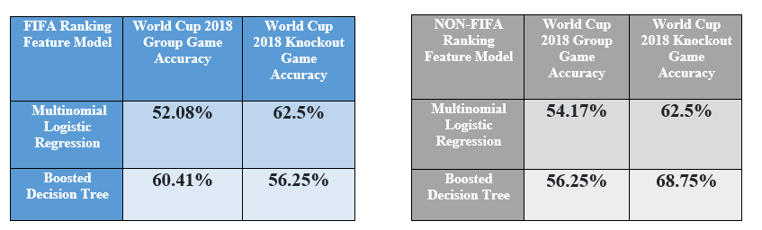

Using our multinomial logistic regression model with a carefully selected group of predictors based on effective EDA, we were able to map out World Cup outcomes and rankings, on both a team and player basis, with a decent level of accuracy comparable to that of our Boosted Decision Tree Model.
A combination of the two models below were given us the best accuracies in term of predicting both the Group Phase Games and Knockout Games of the FIFA World Cup 2018.

Our contributions mainly involve the recognition and subsequent incorporation of often ignored minute and nuanced player statistics, like value and agility. It is not that these facets are wholly ignored, it is more so that our model utilizes an effectively holistic take on both player and team data in a way that avoids overlooking important predictors, thus our extensive menu of predictors, while still averting overfitting. While we were relatively successful, we certainly could have improved model performance even more. This process might have involved looking at other non-FIFA data sources that might indicate other potent predictors that are often ignored in predicting matches.

## Future Work:

As mentioned above, it would be worth looking into non-FIFA data sources to improve the credibility of our model. While FIFA is a great sources for more concrete and objective predictors, it is likely that organizational politics, preference for host countries, and certain monetary initiates might affect more subjective statistics, like potential. Another idea would be to work on incorporating media hubbub and discussion about players and teams to account for factors like public appeal and popularity, which may influence outcomes more indirectly. The last idea would be to also look at some measure of referee strictness or call-making probabilities, which might influence the directions that games take. This aspect would only enrich the model, as we already look at players, coaches, and competing teams as a whole.

