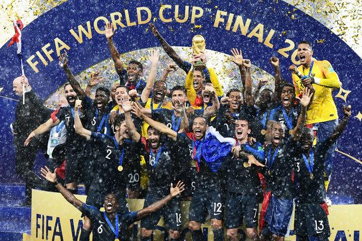

Using our KNN model with a carefully selected group of predictors based on effective EDA, we were able to map out World Cup outcomes and rankings, on both a team and player basis, with a decent level of accuracy comparable to that of our Random Forest baseline model. Our contributions mainly involve the recognition and subsequent incorporation of often ignored minute and nuanced player statistics, like value and agility. It is not that these facets are wholly ignored, it is more so that our model utilizes an effectively holistic take on both player and team data in a way that avoids overlooking important predictors, thus our extensive menu of predictors, while still averting overfitting. While we were relatively successful, we certainly could have improved model performance even more. This process might have involved looking at other non-FIFA data sources that might indicate other potent predictors that are often ignored in predicting matches.

