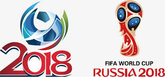

# Overview

Billions around the globe watch the FIFA world cup. Given the popularity of each of the games played during the tournament, people have attempted to predict outcomes of this world popular sport. The FIFA world cup is played every four (4) years and three (3) years leading up to it, all the teams play qualifying matches that allow them to participate in the final round except the hosting nation which is automatically qualified. In case of co-hosting, the number of host countries that automatically qualify is decided by the FIFA Council. After this initial qualification phase, 32 teams including the host nation that has qualified play for the title over a period of approximately a month. The goal of this project is to use machine-learning techniques to predict the outcome of all 64 games (including the knockout Phase games) of the FIFA world cup 2018.
