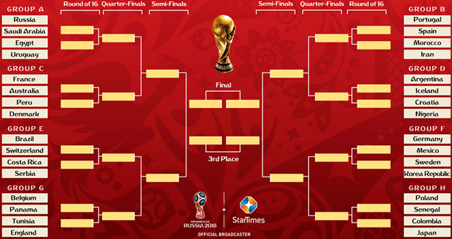

<figcaption class="credit">
    
        	        Image by Fifa.com
	            
  </figcaption>

# Introduction

This website presents a summary of our project on predicting the 2018 World Cup for the course
CS109A: Introduction to Data Science at Harvard. We used publicly available data mainly from
FIFA.com and SOFIFA.COM to work on predictive modeling of the games.

# Overview

Billions around the globe watch the FIFA World Cup. Given the popularity of each of the games
played during the tournament, people have attempted to predict outcomes of this world popular sport.
The FIFA World Cup is played every four (4) years. In the three (3) years leading up to it, all the
teams play matches that allow them to qualify to participate in the final round. One exception is the
hosting nation which is automatically qualified. In case of co-hosting, the number of host countries
that automatically qualify is decided by the FIFA Council. After this initial qualification phase, 32 teams
including the host nation play for the title over a period of approximately a month. The goal of this
project is to use machine-learning techniques to predict the outcome of all 64 games (including the
playoff games) of the FIFA World Cup 2018.
