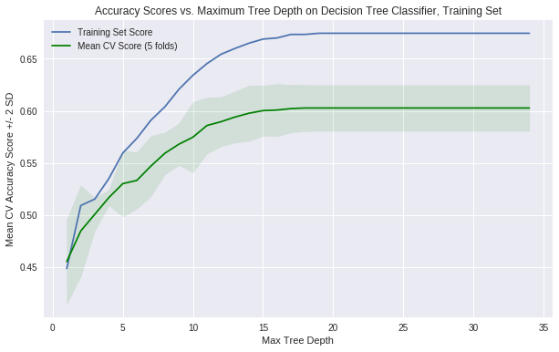

# Results of our baseline model

In this section, we display the results of our baseline model and we look for the best Hyper parameters for each model tried. The model to be tried include:

- Multinomial logistic Regression
- kNN
- Decision Tree
- Linear Discriminant Analysis / Quadratic Linear Discriminant Analysis
- Random Forest
- Neural Network

# Classification methods

# Logisitic regression - Baseline model

```
Number of components that explain at least 90% of the variance= 8
```


# train set

```
Confusion matrix of logisitic regression:
```

<div>
  <style scoped="">
    .dataframe tbody tr th:only-of-type {
        vertical-align: middle;
    }

    .dataframe tbody tr th {
        vertical-align: top;
    }

    .dataframe thead th {
        text-align: right;
    }
</style>
  <table border="1" class="dataframe">
  <thead><tr style="text-align: right;"><th></th><th>Actual Draw</th><th>Actual Team 1</th><th>Actual Team 2</th></tr></thead>
  <tbody><tr><th>Predicted Draw</th><td>52</td><td>32</td><td>48</td></tr><tr><th>Predicted Team 1</th><td>612</td><td>1346</td><td>460</td></tr><tr><th>Predicted Team 2</th><td>322</td><td>220</td><td>472</td></tr></tbody>
</table>
</div>

Accuracy score or the model logistic regression multinomial model is: 0.5246913580246914

## test set

<div>
  <style scoped="">
    .dataframe tbody tr th:only-of-type {
        vertical-align: middle;
    }

    .dataframe tbody tr th {
        vertical-align: top;
    }

    .dataframe thead th {
        text-align: right;
    }
</style>
  <table border="1" class="dataframe">
  <thead><tr style="text-align: right;"><th></th><th>Observed</th><th>Predicted</th></tr></thead>
  <tbody><tr><th>0</th><td>Russia</td><td>Russia</td></tr><tr><th>1</th><td>Uruguay</td><td>Uruguay</td></tr><tr><th>2</th><td>Iran</td><td>Morocco</td></tr><tr><th>3</th><td>Draw</td><td>Portugal</td></tr><tr><th>4</th><td>France</td><td>France</td></tr></tbody>
</table>
</div>

```
'conf matrix of logisitic regression of the baseline model on the first test set'
```

<div>
  <style scoped="">
    .dataframe tbody tr th:only-of-type {
        vertical-align: middle;
    }

    .dataframe tbody tr th {
        vertical-align: top;
    }

    .dataframe thead th {
        text-align: right;
    }
</style>
  <table border="1" class="dataframe">
  <thead><tr style="text-align: right;"><th></th><th>Actual Draw</th><th>Actual Team 1</th><th>Actual Team 2</th></tr></thead>
  <tbody><tr><th>Predicted Draw</th><td>0</td><td>0</td><td>2</td></tr><tr><th>Predicted Team 1</th><td>7</td><td>16</td><td>11</td></tr><tr><th>Predicted Team 2</th><td>2</td><td>1</td><td>9</td></tr></tbody>
</table>
</div>

```
accuracy score or the model logistic regression multinomial model on test set 1 is: 0.5208333333333334


'conf matrix of logistic regression of the baseline model of the second test set'
```

<div>
  <style scoped="">
    .dataframe tbody tr th:only-of-type {
        vertical-align: middle;
    }

    .dataframe tbody tr th {
        vertical-align: top;
    }

    .dataframe thead th {
        text-align: right;
    }
</style>
  <table border="1" class="dataframe">
  <thead><tr style="text-align: right;"><th></th><th>Actual Team 1</th><th>Actual Team 2</th></tr></thead>
  <tbody><tr><th>Predicted Team 1</th><td>7</td><td>4</td></tr><tr><th>Predicted Team 2</th><td>2</td><td>3</td></tr></tbody>
</table>
</div>

```
accuracy score or the baseline model with logistic regression on test set 2 is: 0.625
```

# KNN - baseline model

# Pick the best k of the model

```
Best K is 5.
```

## train set

```
'conf matrix of the KNN model of the train set on the baseline model'
```

<div>
  <style scoped="">
    .dataframe tbody tr th:only-of-type {
        vertical-align: middle;
    }

    .dataframe tbody tr th {
        vertical-align: top;
    }

    .dataframe thead th {
        text-align: right;
    }
</style>
  <table border="1" class="dataframe">
  <thead><tr style="text-align: right;"><th></th><th>Actual Draw</th><th>Actual Team 1</th><th>Actual Team 2</th></tr></thead>
  <tbody><tr><th>Predicted Draw</th><td>546</td><td>288</td><td>242</td></tr><tr><th>Predicted Team 1</th><td>330</td><td>1202</td><td>260</td></tr><tr><th>Predicted Team 2</th><td>110</td><td>108</td><td>478</td></tr></tbody>
</table>
</div>

```
accuracy score of the knn model of the train set on the baseline model: 0.6245791245791246
accuracy score of the knn model Validation Set on the baseline model: 0.5518964059749552
```

## World Cup 2018 - Group Phase games

<div>
  <style scoped="">
    .dataframe tbody tr th:only-of-type {
        vertical-align: middle;
    }

    .dataframe tbody tr th {
        vertical-align: top;
    }

    .dataframe thead th {
        text-align: right;
    }
</style>
  <table border="1" class="dataframe">
  <thead><tr style="text-align: right;"><th></th><th>Observed</th><th>Predicted</th></tr></thead>
  <tbody><tr><th>0</th><td>Russia</td><td>Russia</td></tr><tr><th>1</th><td>Uruguay</td><td>Uruguay</td></tr><tr><th>2</th><td>Iran</td><td>Morocco</td></tr><tr><th>3</th><td>Draw</td><td>Portugal</td></tr><tr><th>4</th><td>France</td><td>France</td></tr></tbody>
</table>
</div>

```
'conf matrix of KNN of the baseline model on the first test set'
```

<div>
  <style scoped="">
    .dataframe tbody tr th:only-of-type {
        vertical-align: middle;
    }

    .dataframe tbody tr th {
        vertical-align: top;
    }

    .dataframe thead th {
        text-align: right;
    }
</style>
  <table border="1" class="dataframe">
  <thead><tr style="text-align: right;"><th></th><th>Actual Draw</th><th>Actual Team 1</th><th>Actual Team 2</th></tr></thead>
  <tbody><tr><th>Predicted Draw</th><td>3</td><td>1</td><td>7</td></tr><tr><th>Predicted Team 1</th><td>4</td><td>14</td><td>8</td></tr><tr><th>Predicted Team 2</th><td>2</td><td>2</td><td>7</td></tr></tbody>
</table>
</div>

```
accuracy score or the baseline model with KNN on the first test set is: 0.5
```

## World Cup 2018 - Knockout Games

```
'conf matrix of KNN of the baseline model on the second test set'
```

<div>
  <style scoped="">
    .dataframe tbody tr th:only-of-type {
        vertical-align: middle;
    }

    .dataframe tbody tr th {
        vertical-align: top;
    }

    .dataframe thead th {
        text-align: right;
    }
</style>
  <table border="1" class="dataframe">
  <thead><tr style="text-align: right;"><th></th><th>Actual Team 1</th><th>Actual Team 2</th></tr></thead>
  <tbody><tr><th>Predicted Team 1</th><td>2</td><td>2</td></tr><tr><th>Predicted Team 2</th><td>7</td><td>5</td></tr></tbody>
</table>
</div>

```
accuracy score or the baseline model with KNN on second  test set is: 0.4375
```

## Decision tree-Baseline Model


Best depth is 16

## Linear Discriminant Analysis (LDA)-Baseline model

### Train Data Set

```
'conf matrix of lda on the baseline model'
```

<div>
  <style scoped="">
    .dataframe tbody tr th:only-of-type {
        vertical-align: middle;
    }

    .dataframe tbody tr th {
        vertical-align: top;
    }

    .dataframe thead th {
        text-align: right;
    }
</style>
  <table border="1" class="dataframe">
  <thead><tr style="text-align: right;"><th></th><th>Actual Draw</th><th>Actual Team 1</th><th>Actual Team 2</th></tr></thead>
  <tbody><tr><th>Predicted Draw</th><td>64</td><td>40</td><td>58</td></tr><tr><th>Predicted Team 1</th><td>600</td><td>1326</td><td>440</td></tr><tr><th>Predicted Team 2</th><td>322</td><td>232</td><td>482</td></tr></tbody>
</table>
</div>

```
accuracy score of lda on baseline model: 0.5252525252525253
accuracy score of lda on baseline model Validation Set: 0.5247027017801897
```

### World Cup 2018 - Group Phase games

```
'conf matrix of the lda model'
```

<div>
  <style scoped="">
    .dataframe tbody tr th:only-of-type {
        vertical-align: middle;
    }

    .dataframe tbody tr th {
        vertical-align: top;
    }

    .dataframe thead th {
        text-align: right;
    }
</style>
  <table border="1" class="dataframe">
  <thead><tr style="text-align: right;"><th></th><th>Actual Draw</th><th>Actual Team 1</th><th>Actual Team 2</th></tr></thead>
  <tbody><tr><th>Predicted Draw</th><td>4</td><td>2</td><td>0</td></tr><tr><th>Predicted Team 1</th><td>1</td><td>14</td><td>2</td></tr><tr><th>Predicted Team 2</th><td>4</td><td>1</td><td>20</td></tr></tbody>
</table>
</div>

```
accuracy score of the lda model: 0.7916666666666666
accuracy score of the lda model Validation Set: 0.5247027017801897
```

### World Cup 2018 - Knockout Games

```
accuracy score of lda on baseline model of the second test set: 0.0
```

## Quadratic Discriminant Analysis (QDA)

### Training Data Set

```
'conf matrix of qda on baseline model train set'
```

<div>
  <style scoped="">
    .dataframe tbody tr th:only-of-type {
        vertical-align: middle;
    }

    .dataframe tbody tr th {
        vertical-align: top;
    }

    .dataframe thead th {
        text-align: right;
    }
</style>
  <table border="1" class="dataframe">
  <thead><tr style="text-align: right;"><th></th><th>Actual Draw</th><th>Actual Team 1</th><th>Actual Team 2</th></tr></thead>
  <tbody><tr><th>Predicted Draw</th><td>240</td><td>182</td><td>186</td></tr><tr><th>Predicted Team 1</th><td>482</td><td>1198</td><td>344</td></tr><tr><th>Predicted Team 2</th><td>264</td><td>218</td><td>450</td></tr></tbody>
</table>
</div>

```
accuracy score of qda on baselin model train set: 0.5297418630751964
accuracy score of qda on baseline model Validation Set: 0.5103846653394701
```

### World Cup 2018 - Group Phase games

```
'conf matrix of the qda model'
```

<div>
  <style scoped="">
    .dataframe tbody tr th:only-of-type {
        vertical-align: middle;
    }

    .dataframe tbody tr th {
        vertical-align: top;
    }

    .dataframe thead th {
        text-align: right;
    }
</style>
  <table border="1" class="dataframe">
  <thead><tr style="text-align: right;"><th></th><th>Actual Draw</th><th>Actual Team 1</th><th>Actual Team 2</th></tr></thead>
  <tbody><tr><th>Predicted Draw</th><td>1</td><td>2</td><td>7</td></tr><tr><th>Predicted Team 1</th><td>5</td><td>13</td><td>8</td></tr><tr><th>Predicted Team 2</th><td>3</td><td>2</td><td>7</td></tr></tbody>
</table>
</div>

```
accuracy score of the qda model: 0.4375
accuracy score of the qda model Validation Set: 0.5103846653394701
```

### World Cup 2018 - Knockout Games

```
accuracy score of qda on baseline model second test: 0.5625
accuracy score of qda baseline model on Validation Set: 0.5103846653394701
```

# Ensemble methods

In this section we try different types of Ensembles methods:

- Random Forest
- Bagging
- Boosting

## Random Forest- baseline model

### train set

```
accuracy score for the random forest model: 0.6728395061728395
```

### test set 1

```
accuracy score for the random forest test1 on baseline model: 0.6666666666666666
```

### test set 2

```
accuracy score for the random forest test2 on baseline model: 0.1875
```

## Bagging

```
train bootstrapped table:
```

<div>
  <style scoped="">
    .dataframe tbody tr th:only-of-type {
        vertical-align: middle;
    }

    .dataframe tbody tr th {
        vertical-align: top;
    }

    .dataframe thead th {
        text-align: right;
    }
</style>
  <table border="1" class="dataframe">
  <thead><tr style="text-align: right;"><th></th><th>Bootstrap-Model_1</th><th>Bootstrap-Model_2</th><th>Bootstrap-Model_3</th><th>Bootstrap-Model_4</th><th>Bootstrap-Model_5</th><th>Bootstrap-Model_6</th><th>Bootstrap-Model_7</th><th>Bootstrap-Model_8</th><th>Bootstrap-Model_9</th><th>Bootstrap-Model_10</th><th>...</th><th>Bootstrap-Model_36</th><th>Bootstrap-Model_37</th><th>Bootstrap-Model_38</th><th>Bootstrap-Model_39</th><th>Bootstrap-Model_40</th><th>Bootstrap-Model_41</th><th>Bootstrap-Model_42</th><th>Bootstrap-Model_43</th><th>Bootstrap-Model_44</th><th>Bootstrap-Model_45</th></tr></thead>
  <tbody><tr><th>Training-Row_1</th><td>2</td><td>2</td><td>2</td><td>2</td><td>2</td><td>2</td><td>2</td><td>2</td><td>2</td><td>2</td><td>...</td><td>2</td><td>2</td><td>2</td><td>2</td><td>0</td><td>2</td><td>2</td><td>2</td><td>2</td><td>2</td></tr><tr><th>Training-Row_2</th><td>0</td><td>1</td><td>1</td><td>1</td><td>2</td><td>0</td><td>0</td><td>1</td><td>1</td><td>0</td><td>...</td><td>1</td><td>0</td><td>0</td><td>1</td><td>0</td><td>2</td><td>1</td><td>1</td><td>0</td><td>0</td></tr><tr><th>Training-Row_3</th><td>1</td><td>1</td><td>1</td><td>1</td><td>1</td><td>1</td><td>1</td><td>1</td><td>1</td><td>2</td><td>...</td><td>1</td><td>1</td><td>1</td><td>2</td><td>1</td><td>1</td><td>2</td><td>2</td><td>1</td><td>1</td></tr><tr><th>Training-Row_4</th><td>2</td><td>2</td><td>2</td><td>2</td><td>2</td><td>2</td><td>2</td><td>2</td><td>2</td><td>2</td><td>...</td><td>2</td><td>2</td><td>2</td><td>2</td><td>2</td><td>2</td><td>2</td><td>2</td><td>2</td><td>2</td></tr><tr><th>Training-Row_5</th><td>2</td><td>2</td><td>2</td><td>2</td><td>2</td><td>2</td><td>2</td><td>2</td><td>2</td><td>2</td><td>...</td><td>0</td><td>2</td><td>2</td><td>2</td><td>2</td><td>2</td><td>2</td><td>2</td><td>2</td><td>2</td></tr></tbody>
</table>
  <p>5 rows × 45 columns</p>
</div>

```
test1 bootstrapped table:
```

<div>
  <style scoped="">
    .dataframe tbody tr th:only-of-type {
        vertical-align: middle;
    }

    .dataframe tbody tr th {
        vertical-align: top;
    }

    .dataframe thead th {
        text-align: right;
    }
</style>
  <table border="1" class="dataframe">
  <thead><tr style="text-align: right;"><th></th><th>Bootstrap-Model_1</th><th>Bootstrap-Model_2</th><th>Bootstrap-Model_3</th><th>Bootstrap-Model_4</th><th>Bootstrap-Model_5</th><th>Bootstrap-Model_6</th><th>Bootstrap-Model_7</th><th>Bootstrap-Model_8</th><th>Bootstrap-Model_9</th><th>Bootstrap-Model_10</th><th>...</th><th>Bootstrap-Model_36</th><th>Bootstrap-Model_37</th><th>Bootstrap-Model_38</th><th>Bootstrap-Model_39</th><th>Bootstrap-Model_40</th><th>Bootstrap-Model_41</th><th>Bootstrap-Model_42</th><th>Bootstrap-Model_43</th><th>Bootstrap-Model_44</th><th>Bootstrap-Model_45</th></tr></thead>
  <tbody><tr><th>Test-Row_1</th><td>0</td><td>1</td><td>1</td><td>1</td><td>1</td><td>1</td><td>1</td><td>1</td><td>1</td><td>1</td><td>...</td><td>1</td><td>1</td><td>1</td><td>1</td><td>1</td><td>0</td><td>1</td><td>1</td><td>1</td><td>1</td></tr><tr><th>Test-Row_2</th><td>2</td><td>2</td><td>2</td><td>2</td><td>2</td><td>2</td><td>2</td><td>2</td><td>2</td><td>2</td><td>...</td><td>2</td><td>2</td><td>2</td><td>2</td><td>2</td><td>2</td><td>2</td><td>2</td><td>2</td><td>2</td></tr><tr><th>Test-Row_3</th><td>2</td><td>2</td><td>2</td><td>2</td><td>2</td><td>0</td><td>2</td><td>2</td><td>2</td><td>2</td><td>...</td><td>2</td><td>2</td><td>2</td><td>1</td><td>1</td><td>2</td><td>0</td><td>2</td><td>2</td><td>2</td></tr><tr><th>Test-Row_4</th><td>0</td><td>0</td><td>0</td><td>0</td><td>1</td><td>0</td><td>0</td><td>0</td><td>2</td><td>0</td><td>...</td><td>0</td><td>0</td><td>0</td><td>0</td><td>0</td><td>2</td><td>0</td><td>0</td><td>1</td><td>1</td></tr><tr><th>Test-Row_5</th><td>1</td><td>1</td><td>1</td><td>1</td><td>1</td><td>1</td><td>1</td><td>1</td><td>1</td><td>1</td><td>...</td><td>1</td><td>1</td><td>1</td><td>1</td><td>1</td><td>1</td><td>1</td><td>1</td><td>1</td><td>1</td></tr></tbody>
</table>
  <p>5 rows × 45 columns</p>
</div>

```
test2 bootstrapped table:
```

<div>
  <style scoped="">
    .dataframe tbody tr th:only-of-type {
        vertical-align: middle;
    }

    .dataframe tbody tr th {
        vertical-align: top;
    }

    .dataframe thead th {
        text-align: right;
    }
</style>
  <table border="1" class="dataframe">
  <thead><tr style="text-align: right;"><th></th><th>Bootstrap-Model_1</th><th>Bootstrap-Model_2</th><th>Bootstrap-Model_3</th><th>Bootstrap-Model_4</th><th>Bootstrap-Model_5</th><th>Bootstrap-Model_6</th><th>Bootstrap-Model_7</th><th>Bootstrap-Model_8</th><th>Bootstrap-Model_9</th><th>Bootstrap-Model_10</th><th>...</th><th>Bootstrap-Model_36</th><th>Bootstrap-Model_37</th><th>Bootstrap-Model_38</th><th>Bootstrap-Model_39</th><th>Bootstrap-Model_40</th><th>Bootstrap-Model_41</th><th>Bootstrap-Model_42</th><th>Bootstrap-Model_43</th><th>Bootstrap-Model_44</th><th>Bootstrap-Model_45</th></tr></thead>
  <tbody><tr><th>Test-Row_1</th><td>2</td><td>2</td><td>2</td><td>2</td><td>2</td><td>2</td><td>2</td><td>2</td><td>2</td><td>2</td><td>...</td><td>2</td><td>2</td><td>2</td><td>2</td><td>2</td><td>2</td><td>2</td><td>2</td><td>2</td><td>2</td></tr><tr><th>Test-Row_2</th><td>0</td><td>1</td><td>2</td><td>2</td><td>0</td><td>0</td><td>2</td><td>0</td><td>1</td><td>2</td><td>...</td><td>2</td><td>0</td><td>1</td><td>0</td><td>0</td><td>0</td><td>0</td><td>0</td><td>1</td><td>0</td></tr><tr><th>Test-Row_3</th><td>1</td><td>1</td><td>1</td><td>1</td><td>0</td><td>1</td><td>0</td><td>1</td><td>1</td><td>0</td><td>...</td><td>1</td><td>1</td><td>0</td><td>0</td><td>1</td><td>1</td><td>0</td><td>1</td><td>1</td><td>0</td></tr><tr><th>Test-Row_4</th><td>1</td><td>0</td><td>1</td><td>0</td><td>2</td><td>2</td><td>0</td><td>1</td><td>0</td><td>1</td><td>...</td><td>1</td><td>1</td><td>1</td><td>1</td><td>1</td><td>2</td><td>2</td><td>2</td><td>0</td><td>2</td></tr><tr><th>Test-Row_5</th><td>1</td><td>1</td><td>1</td><td>1</td><td>1</td><td>1</td><td>1</td><td>1</td><td>1</td><td>1</td><td>...</td><td>1</td><td>1</td><td>1</td><td>1</td><td>1</td><td>1</td><td>1</td><td>1</td><td>1</td><td>1</td></tr></tbody>
</table>
  <p>5 rows × 45 columns</p>
</div>

```
bagging model, training set accuracy: 0.5359147025813692
bagging model, test-1 set accuracy: 0.4166666666666667
bagging model, test-2 set accuracy: 0.4375
```


## Boosting


```
Depth = 1: best test set 1 accuracy at 1 estimators.
train set accuracy score: 0.6041666666666666

Depth = 2: best test set 1 accuracy at 342 estimators.
train set accuracy score: 0.6041666666666666

Depth = 3: best test set 1 accuracy at 356 estimators.
train set accuracy score: 0.6041666666666666

Depth = 4: best test set 1 accuracy at 673 estimators.
train set accuracy score: 0.6666666666666666

Depth = 1: best test set 2 accuracy at 14 estimators.
train set accuracy score: 0.6875

Depth = 2: best test set 2 accuracy at 38 estimators.
train set accuracy score: 0.625

Depth = 3: best test set 2 accuracy at 18 estimators.
train set accuracy score: 0.5625

Depth = 4: best test set 2 accuracy at 51 estimators.
train set accuracy score: 0.5625
```

## Neural Network

### Training Data Set

```
_________________________________________________________________
Layer (type)                 Output Shape              Param #   
=================================================================
dense_30 (Dense)             (None, 200)               2600      
_________________________________________________________________
dense_31 (Dense)             (None, 3)                 603       
=================================================================
Total params: 3,203
Trainable params: 3,203
Non-trainable params: 0
_________________________________________________________________


the loss of this model is: 0.2612320419012095
the accuracy of this model is: 0.6470258137593767
```

### regularized neural network train set

```
Model 2
the loss of this model is: 0.2612320419012095
the accuracy of this model is: 0.6470258137593767
```

### World Cup 2018 - Group Phase games

```
The accuracy score of test set 1 of this neural net is: 0.4583333333333333
```

### World Cup 2018 - Knockout Games

```
The accuracy score of test set 2 of this neural net is: 0.625
```

# Model comparison

In this Section we apply 5-fold Cross Validation to all the models designed above in order to fund which ones has the best Training and Validation Accuracy

```
Mean CV Accuracy Score by Model:
```

<div>
  <style scoped="">
    .dataframe tbody tr th:only-of-type {
        vertical-align: middle;
    }

    .dataframe tbody tr th {
        vertical-align: top;
    }

    .dataframe thead th {
        text-align: right;
    }
</style>
  <table border="1" class="dataframe">
  <thead><tr style="text-align: right;"><th></th><th>Model</th><th>CV_Accuracy</th></tr></thead>
  <tbody><tr><th>1</th><td>Random Forest</td><td>0.6016</td></tr><tr><th>2</th><td>Decision Tree</td><td>0.5864</td></tr><tr><th>3</th><td>KNN</td><td>0.5404</td></tr><tr><th>4</th><td>LDA</td><td>0.5205</td></tr><tr><th>5</th><td>QDA</td><td>0.5126</td></tr><tr><th>6</th><td>Logistic Regression</td><td>0.4950</td></tr></tbody>
</table>
</div>

# Second Model built with non FIFA - Ranking Features

# Results

## Logistic regression- Second model

### Training Data Set

```
'conf matrix of logisitic regression of our model'
```

<div>
  <style scoped="">
    .dataframe tbody tr th:only-of-type {
        vertical-align: middle;
    }

    .dataframe tbody tr th {
        vertical-align: top;
    }

    .dataframe thead th {
        text-align: right;
    }
</style>
  <table border="1" class="dataframe">
  <thead><tr style="text-align: right;"><th></th><th>Actual Draw</th><th>Actual Team 1</th><th>Actual Team 2</th></tr></thead>
  <tbody><tr><th>Predicted Draw</th><td>188</td><td>106</td><td>124</td></tr><tr><th>Predicted Team 1</th><td>532</td><td>1306</td><td>372</td></tr><tr><th>Predicted Team 2</th><td>266</td><td>186</td><td>484</td></tr></tbody>
</table>
</div>

```
accuracy score or the model logistic regression multinomial model is: 0.5549943883277216
```

### World Cup 2018 - Group Phase games

<div>
  <style scoped="">
    .dataframe tbody tr th:only-of-type {
        vertical-align: middle;
    }

    .dataframe tbody tr th {
        vertical-align: top;
    }

    .dataframe thead th {
        text-align: right;
    }
</style>
  <table border="1" class="dataframe">
  <thead><tr style="text-align: right;"><th></th><th>Observed</th><th>Predicted</th></tr></thead>
  <tbody><tr><th>0</th><td>Russia</td><td>Russia</td></tr><tr><th>1</th><td>Uruguay</td><td>Uruguay</td></tr><tr><th>2</th><td>Iran</td><td>Draw</td></tr><tr><th>3</th><td>Draw</td><td>Draw</td></tr><tr><th>4</th><td>France</td><td>France</td></tr></tbody>
</table>
</div>

```
'conf matrix of logisitic regression of our model'
```

<div>
  <style scoped="">
    .dataframe tbody tr th:only-of-type {
        vertical-align: middle;
    }

    .dataframe tbody tr th {
        vertical-align: top;
    }

    .dataframe thead th {
        text-align: right;
    }
</style>
  <table border="1" class="dataframe">
  <thead><tr style="text-align: right;"><th></th><th>Actual Draw</th><th>Actual Team 1</th><th>Actual Team 2</th></tr></thead>
  <tbody><tr><th>Predicted Draw</th><td>2</td><td>0</td><td>5</td></tr><tr><th>Predicted Team 1</th><td>6</td><td>16</td><td>9</td></tr><tr><th>Predicted Team 2</th><td>1</td><td>1</td><td>8</td></tr></tbody>
</table>
</div>

```
accuracy score of the model logistic regression multinomial model on test set of our model is: 0.5416666666666666
```

finding top 2 components

```
number of components that explain at least 90% of the variance= 10
```


## KNN model- Second model

### Training Data Set

```
'conf matrix of the KNN model of our model'
```

<div>
  <style scoped="">
    .dataframe tbody tr th:only-of-type {
        vertical-align: middle;
    }

    .dataframe tbody tr th {
        vertical-align: top;
    }

    .dataframe thead th {
        text-align: right;
    }
</style>
  <table border="1" class="dataframe">
  <thead><tr style="text-align: right;"><th></th><th>Actual Draw</th><th>Actual Team 1</th><th>Actual Team 2</th></tr></thead>
  <tbody><tr><th>Predicted Draw</th><td>560</td><td>296</td><td>254</td></tr><tr><th>Predicted Team 1</th><td>294</td><td>1178</td><td>270</td></tr><tr><th>Predicted Team 2</th><td>132</td><td>124</td><td>456</td></tr></tbody>
</table>
</div>

```
accuracy score of the knn model training set: 0.6156004489337823
```

### World Cup 2018 - Group Phase games

<div>
  <style scoped="">
    .dataframe tbody tr th:only-of-type {
        vertical-align: middle;
    }

    .dataframe tbody tr th {
        vertical-align: top;
    }

    .dataframe thead th {
        text-align: right;
    }
</style>
  <table border="1" class="dataframe">
  <thead><tr style="text-align: right;"><th></th><th>Observed</th><th>Predicted</th></tr></thead>
  <tbody><tr><th>0</th><td>Russia</td><td>Russia</td></tr><tr><th>1</th><td>Uruguay</td><td>Uruguay</td></tr><tr><th>2</th><td>Iran</td><td>Iran</td></tr><tr><th>3</th><td>Draw</td><td>Draw</td></tr><tr><th>4</th><td>France</td><td>France</td></tr></tbody>
</table>
</div>

```
'conf matrix of KNN of our model'
```

<div>
  <style scoped="">
    .dataframe tbody tr th:only-of-type {
        vertical-align: middle;
    }

    .dataframe tbody tr th {
        vertical-align: top;
    }

    .dataframe thead th {
        text-align: right;
    }
</style>
  <table border="1" class="dataframe">
  <thead><tr style="text-align: right;"><th></th><th>Actual Draw</th><th>Actual Team 1</th><th>Actual Team 2</th></tr></thead>
  <tbody><tr><th>Predicted Draw</th><td>4</td><td>4</td><td>8</td></tr><tr><th>Predicted Team 1</th><td>3</td><td>12</td><td>5</td></tr><tr><th>Predicted Team 2</th><td>2</td><td>1</td><td>9</td></tr></tbody>
</table>
</div>

```
accuracy score or the model KNN model on test set is: 0.5208333333333334
```

### World Cup 2018 - Knockout Phase games

<div>
  <style scoped="">
    .dataframe tbody tr th:only-of-type {
        vertical-align: middle;
    }

    .dataframe tbody tr th {
        vertical-align: top;
    }

    .dataframe thead th {
        text-align: right;
    }
</style>
  <table border="1" class="dataframe">
  <thead><tr style="text-align: right;"><th></th><th>Observed</th><th>Predicted</th></tr></thead>
  <tbody><tr><th>0</th><td>France</td><td>Draw</td></tr><tr><th>1</th><td>Uruguay</td><td>Draw</td></tr><tr><th>2</th><td>Russia</td><td>Draw</td></tr><tr><th>3</th><td>Croatia</td><td>Denmark</td></tr><tr><th>4</th><td>Brazil</td><td>Brazil</td></tr></tbody>
</table>
</div>

```
'conf matrix of KNN of our model'
```

<div>
  <style scoped="">
    .dataframe tbody tr th:only-of-type {
        vertical-align: middle;
    }

    .dataframe tbody tr th {
        vertical-align: top;
    }

    .dataframe thead th {
        text-align: right;
    }
</style>
  <table border="1" class="dataframe">
  <thead><tr style="text-align: right;"><th></th><th>Actual Team 1</th><th>Actual Team 2</th></tr></thead>
  <tbody><tr><th>Predicted Team 1</th><td>3</td><td>3</td></tr><tr><th>Predicted Team 2</th><td>6</td><td>4</td></tr></tbody>
</table>
</div>

```
accuracy score or the model KNN model on test set is: 0.25
```

## **_DECISION TREE FOR OUR MODEL_**

### **_Data Training Set_**



Best depth: 18

### **_World Cup 2018 - Group Phase games_**

<div>
  <style scoped="">
    .dataframe tbody tr th:only-of-type {
        vertical-align: middle;
    }

    .dataframe tbody tr th {
        vertical-align: top;
    }

    .dataframe thead th {
        text-align: right;
    }
</style>
  <table border="1" class="dataframe">
  <thead><tr style="text-align: right;"><th></th><th>Observed</th><th>Predicted</th></tr></thead>
  <tbody><tr><th>0</th><td>Russia</td><td>Russia</td></tr><tr><th>1</th><td>Uruguay</td><td>Uruguay</td></tr><tr><th>2</th><td>Iran</td><td>Iran</td></tr><tr><th>3</th><td>Draw</td><td>Draw</td></tr><tr><th>4</th><td>France</td><td>France</td></tr></tbody>
</table>
</div>

```
'conf matrix of Tree of our own model'
```

<div>
  <style scoped="">
    .dataframe tbody tr th:only-of-type {
        vertical-align: middle;
    }

    .dataframe tbody tr th {
        vertical-align: top;
    }

    .dataframe thead th {
        text-align: right;
    }
</style>
  <table border="1" class="dataframe">
  <thead><tr style="text-align: right;"><th></th><th>Actual Draw</th><th>Actual Team 1</th><th>Actual Team 2</th></tr></thead>
  <tbody><tr><th>Predicted Draw</th><td>5</td><td>3</td><td>7</td></tr><tr><th>Predicted Team 1</th><td>2</td><td>13</td><td>4</td></tr><tr><th>Predicted Team 2</th><td>2</td><td>1</td><td>11</td></tr></tbody>
</table>
</div>

```
accuracy score for our own model with Decision Tree on test set is: 0.6041666666666666
```

### World Cup 2018 - Group Phase games

<div>
  <style scoped="">
    .dataframe tbody tr th:only-of-type {
        vertical-align: middle;
    }

    .dataframe tbody tr th {
        vertical-align: top;
    }

    .dataframe thead th {
        text-align: right;
    }
</style>
  <table border="1" class="dataframe">
  <thead><tr style="text-align: right;"><th></th><th>Observed</th><th>Predicted</th></tr></thead>
  <tbody><tr><th>0</th><td>France</td><td>Argentina</td></tr><tr><th>1</th><td>Uruguay</td><td>Draw</td></tr><tr><th>2</th><td>Russia</td><td>Spain</td></tr><tr><th>3</th><td>Croatia</td><td>Draw</td></tr><tr><th>4</th><td>Brazil</td><td>Brazil</td></tr></tbody>
</table>
</div>

```
'conf matrix of Tree of our own model'
```

<div>
  <style scoped="">
    .dataframe tbody tr th:only-of-type {
        vertical-align: middle;
    }

    .dataframe tbody tr th {
        vertical-align: top;
    }

    .dataframe thead th {
        text-align: right;
    }
</style>
  <table border="1" class="dataframe">
  <thead><tr style="text-align: right;"><th></th><th>Actual Team 1</th><th>Actual Team 2</th></tr></thead>
  <tbody><tr><th>Predicted Team 1</th><td>3</td><td>4</td></tr><tr><th>Predicted Team 2</th><td>6</td><td>3</td></tr></tbody>
</table>
</div>

```
Accuracy score for our own model with Decision Tree on test set is: 0.25
```

## LDA-Our model

### **_Training Data Set_**

<div>
  <style scoped="">
    .dataframe tbody tr th:only-of-type {
        vertical-align: middle;
    }

    .dataframe tbody tr th {
        vertical-align: top;
    }

    .dataframe thead th {
        text-align: right;
    }
</style>
  <table border="1" class="dataframe">
  <thead><tr style="text-align: right;"><th></th><th>Observed</th><th>Predicted</th></tr></thead>
  <tbody><tr><th>0</th><td>Mexico</td><td>Argentina</td></tr><tr><th>1</th><td>Draw</td><td>Nigeria</td></tr><tr><th>2</th><td>Uruguay</td><td>Colombia</td></tr><tr><th>3</th><td>Poland</td><td>Draw</td></tr><tr><th>4</th><td>Uruguay</td><td>Uruguay</td></tr></tbody>
</table>
</div>

```
'conf matrix of Tree of our own model'
```

<div>
  <style scoped="">
    .dataframe tbody tr th:only-of-type {
        vertical-align: middle;
    }

    .dataframe tbody tr th {
        vertical-align: top;
    }

    .dataframe thead th {
        text-align: right;
    }
</style>
  <table border="1" class="dataframe">
  <thead><tr style="text-align: right;"><th></th><th>Actual Draw</th><th>Actual Team 1</th><th>Actual Team 2</th></tr></thead>
  <tbody><tr><th>Predicted Draw</th><td>240</td><td>146</td><td>158</td></tr><tr><th>Predicted Team 1</th><td>484</td><td>1264</td><td>342</td></tr><tr><th>Predicted Team 2</th><td>262</td><td>188</td><td>480</td></tr></tbody>
</table>
</div>

```
accuracy score for our own model with LDA  on train is: 0.5566778900112234
```

### **_World Cup 2018 - Group Phase games_**

<div>
  <style scoped="">
    .dataframe tbody tr th:only-of-type {
        vertical-align: middle;
    }

    .dataframe tbody tr th {
        vertical-align: top;
    }

    .dataframe thead th {
        text-align: right;
    }
</style>
  <table border="1" class="dataframe">
  <thead><tr style="text-align: right;"><th></th><th>Observed</th><th>Predicted</th></tr></thead>
  <tbody><tr><th>0</th><td>Russia</td><td>Russia</td></tr><tr><th>1</th><td>Uruguay</td><td>Uruguay</td></tr><tr><th>2</th><td>Iran</td><td>Draw</td></tr><tr><th>3</th><td>Draw</td><td>Draw</td></tr><tr><th>4</th><td>France</td><td>France</td></tr></tbody>
</table>
</div>

```
'conf matrix of Lda of our own model on test 1'
```

<div>
  <style scoped="">
    .dataframe tbody tr th:only-of-type {
        vertical-align: middle;
    }

    .dataframe tbody tr th {
        vertical-align: top;
    }

    .dataframe thead th {
        text-align: right;
    }
</style>
  <table border="1" class="dataframe">
  <thead><tr style="text-align: right;"><th></th><th>Actual Draw</th><th>Actual Team 1</th><th>Actual Team 2</th></tr></thead>
  <tbody><tr><th>Predicted Draw</th><td>2</td><td>0</td><td>9</td></tr><tr><th>Predicted Team 1</th><td>6</td><td>16</td><td>8</td></tr><tr><th>Predicted Team 2</th><td>1</td><td>1</td><td>5</td></tr></tbody>
</table>
</div>

```
accuracy score for our own model with LDA  on test set 1 is: 0.4791666666666667
```

<div>
  <style scoped="">
    .dataframe tbody tr th:only-of-type {
        vertical-align: middle;
    }

    .dataframe tbody tr th {
        vertical-align: top;
    }

    .dataframe thead th {
        text-align: right;
    }
</style>
  <table border="1" class="dataframe">
  <thead><tr style="text-align: right;"><th></th><th>Observed</th><th>Predicted</th></tr></thead>
  <tbody><tr><th>0</th><td>France</td><td>France</td></tr><tr><th>1</th><td>Uruguay</td><td>Draw</td></tr><tr><th>2</th><td>Russia</td><td>Spain</td></tr><tr><th>3</th><td>Croatia</td><td>Denmark</td></tr><tr><th>4</th><td>Brazil</td><td>Brazil</td></tr></tbody>
</table>
</div>

```
'conf matrix of Tree of our own model'
```

<div>
  <style scoped="">
    .dataframe tbody tr th:only-of-type {
        vertical-align: middle;
    }

    .dataframe tbody tr th {
        vertical-align: top;
    }

    .dataframe thead th {
        text-align: right;
    }
</style>
  <table border="1" class="dataframe">
  <thead><tr style="text-align: right;"><th></th><th>Actual Draw</th><th>Actual Team 1</th><th>Actual Team 2</th></tr></thead>
  <tbody><tr><th>Predicted Draw</th><td>0</td><td>2</td><td>2</td></tr><tr><th>Predicted Team 1</th><td>0</td><td>5</td><td>3</td></tr><tr><th>Predicted Team 2</th><td>0</td><td>2</td><td>2</td></tr></tbody>
</table>
</div>

```
accuracy score for our own model with LDA  on test set 2 is: 0.4375
```

## QDA

## train set

<div>
  <style scoped="">
    .dataframe tbody tr th:only-of-type {
        vertical-align: middle;
    }

    .dataframe tbody tr th {
        vertical-align: top;
    }

    .dataframe thead th {
        text-align: right;
    }
</style>
  <table border="1" class="dataframe">
  <thead><tr style="text-align: right;"><th></th><th>Observed</th><th>Predicted</th></tr></thead>
  <tbody><tr><th>0</th><td>Mexico</td><td>Draw</td></tr><tr><th>1</th><td>Draw</td><td>Senegal</td></tr><tr><th>2</th><td>Uruguay</td><td>Uruguay</td></tr><tr><th>3</th><td>Poland</td><td>Poland</td></tr><tr><th>4</th><td>Uruguay</td><td>Uruguay</td></tr></tbody>
</table>
</div>

```
'conf matrix of Tree of our own model'
```

<div>
  <style scoped="">
    .dataframe tbody tr th:only-of-type {
        vertical-align: middle;
    }

    .dataframe tbody tr th {
        vertical-align: top;
    }

    .dataframe thead th {
        text-align: right;
    }
</style>
  <table border="1" class="dataframe">
  <thead><tr style="text-align: right;"><th></th><th>Actual Draw</th><th>Actual Team 1</th><th>Actual Team 2</th></tr></thead>
  <tbody><tr><th>Predicted Draw</th><td>166</td><td>216</td><td>110</td></tr><tr><th>Predicted Team 1</th><td>314</td><td>718</td><td>214</td></tr><tr><th>Predicted Team 2</th><td>506</td><td>664</td><td>656</td></tr></tbody>
</table>
</div>

```
accuracy score for our own model with QDA  on train is: 0.43209876543209874
```

## group phase- test1

<div>
  <style scoped="">
    .dataframe tbody tr th:only-of-type {
        vertical-align: middle;
    }

    .dataframe tbody tr th {
        vertical-align: top;
    }

    .dataframe thead th {
        text-align: right;
    }
</style>
  <table border="1" class="dataframe">
  <thead><tr style="text-align: right;"><th></th><th>Observed</th><th>Predicted</th></tr></thead>
  <tbody><tr><th>0</th><td>Russia</td><td>Russia</td></tr><tr><th>1</th><td>Uruguay</td><td>Uruguay</td></tr><tr><th>2</th><td>Iran</td><td>Iran</td></tr><tr><th>3</th><td>Draw</td><td>Portugal</td></tr><tr><th>4</th><td>France</td><td>Australia</td></tr></tbody>
</table>
</div>

```
'conf matrix of Tree of our own model'
```

<div>
  <style scoped="">
    .dataframe tbody tr th:only-of-type {
        vertical-align: middle;
    }

    .dataframe tbody tr th {
        vertical-align: top;
    }

    .dataframe thead th {
        text-align: right;
    }
</style>
  <table border="1" class="dataframe">
  <thead><tr style="text-align: right;"><th></th><th>Actual Draw</th><th>Actual Team 1</th><th>Actual Team 2</th></tr></thead>
  <tbody><tr><th>Predicted Draw</th><td>5</td><td>3</td><td>7</td></tr><tr><th>Predicted Team 1</th><td>2</td><td>13</td><td>4</td></tr><tr><th>Predicted Team 2</th><td>2</td><td>1</td><td>11</td></tr></tbody>
</table>
</div>

```
accuracy score for our own model with qda  on test set 1 is: 0.4583333333333333
```

## group phase-test2

<div>
  <style scoped="">
    .dataframe tbody tr th:only-of-type {
        vertical-align: middle;
    }

    .dataframe tbody tr th {
        vertical-align: top;
    }

    .dataframe thead th {
        text-align: right;
    }
</style>
  <table border="1" class="dataframe">
  <thead><tr style="text-align: right;"><th></th><th>Observed</th><th>Predicted</th></tr></thead>
  <tbody><tr><th>0</th><td>France</td><td>France</td></tr><tr><th>1</th><td>Uruguay</td><td>Draw</td></tr><tr><th>2</th><td>Russia</td><td>Russia</td></tr><tr><th>3</th><td>Croatia</td><td>Denmark</td></tr><tr><th>4</th><td>Brazil</td><td>Brazil</td></tr></tbody>
</table>
</div>

## **_Random FOREST - Second Model_**

### **_Training Data set_**

```
accuracy score for the random forest model: 0.6745230078563412
```

### **_World Cup 2018 - Group Phase games_**

```
accuracy score for the random forest Test 1 model: 0.5208333333333334


accuracy score for the random forest Test 2 model: 0.1875
```

## **_Bagging - Second Model_**

```
train bootstrapped table:
```

<div>
  <style scoped="">
    .dataframe tbody tr th:only-of-type {
        vertical-align: middle;
    }

    .dataframe tbody tr th {
        vertical-align: top;
    }

    .dataframe thead th {
        text-align: right;
    }
</style>
  <table border="1" class="dataframe">
  <thead><tr style="text-align: right;"><th></th><th>Bootstrap-Model_1</th><th>Bootstrap-Model_2</th><th>Bootstrap-Model_3</th><th>Bootstrap-Model_4</th><th>Bootstrap-Model_5</th><th>Bootstrap-Model_6</th><th>Bootstrap-Model_7</th><th>Bootstrap-Model_8</th><th>Bootstrap-Model_9</th><th>Bootstrap-Model_10</th><th>...</th><th>Bootstrap-Model_36</th><th>Bootstrap-Model_37</th><th>Bootstrap-Model_38</th><th>Bootstrap-Model_39</th><th>Bootstrap-Model_40</th><th>Bootstrap-Model_41</th><th>Bootstrap-Model_42</th><th>Bootstrap-Model_43</th><th>Bootstrap-Model_44</th><th>Bootstrap-Model_45</th></tr></thead>
  <tbody><tr><th>Training-Row_1</th><td>2</td><td>2</td><td>2</td><td>2</td><td>2</td><td>2</td><td>2</td><td>2</td><td>2</td><td>2</td><td>...</td><td>2</td><td>2</td><td>2</td><td>0</td><td>0</td><td>2</td><td>2</td><td>2</td><td>2</td><td>2</td></tr><tr><th>Training-Row_2</th><td>0</td><td>1</td><td>1</td><td>1</td><td>2</td><td>0</td><td>0</td><td>1</td><td>1</td><td>0</td><td>...</td><td>1</td><td>0</td><td>0</td><td>1</td><td>0</td><td>2</td><td>1</td><td>1</td><td>0</td><td>0</td></tr><tr><th>Training-Row_3</th><td>1</td><td>1</td><td>1</td><td>1</td><td>1</td><td>1</td><td>1</td><td>1</td><td>1</td><td>2</td><td>...</td><td>1</td><td>1</td><td>1</td><td>2</td><td>1</td><td>1</td><td>2</td><td>2</td><td>1</td><td>1</td></tr><tr><th>Training-Row_4</th><td>2</td><td>2</td><td>2</td><td>2</td><td>2</td><td>2</td><td>2</td><td>2</td><td>2</td><td>2</td><td>...</td><td>2</td><td>2</td><td>2</td><td>2</td><td>2</td><td>2</td><td>2</td><td>2</td><td>2</td><td>2</td></tr><tr><th>Training-Row_5</th><td>2</td><td>2</td><td>2</td><td>2</td><td>2</td><td>2</td><td>2</td><td>2</td><td>2</td><td>2</td><td>...</td><td>0</td><td>2</td><td>2</td><td>2</td><td>2</td><td>2</td><td>2</td><td>2</td><td>2</td><td>2</td></tr></tbody>
</table>
  <p>5 rows × 45 columns</p>
</div>

```
test1 bootstrapped table:
```

<div>
  <style scoped="">
    .dataframe tbody tr th:only-of-type {
        vertical-align: middle;
    }

    .dataframe tbody tr th {
        vertical-align: top;
    }

    .dataframe thead th {
        text-align: right;
    }
</style>
  <table border="1" class="dataframe">
  <thead><tr style="text-align: right;"><th></th><th>Bootstrap-Model_1</th><th>Bootstrap-Model_2</th><th>Bootstrap-Model_3</th><th>Bootstrap-Model_4</th><th>Bootstrap-Model_5</th><th>Bootstrap-Model_6</th><th>Bootstrap-Model_7</th><th>Bootstrap-Model_8</th><th>Bootstrap-Model_9</th><th>Bootstrap-Model_10</th><th>...</th><th>Bootstrap-Model_36</th><th>Bootstrap-Model_37</th><th>Bootstrap-Model_38</th><th>Bootstrap-Model_39</th><th>Bootstrap-Model_40</th><th>Bootstrap-Model_41</th><th>Bootstrap-Model_42</th><th>Bootstrap-Model_43</th><th>Bootstrap-Model_44</th><th>Bootstrap-Model_45</th></tr></thead>
  <tbody><tr><th>Test-Row_1</th><td>1</td><td>1</td><td>1</td><td>1</td><td>1</td><td>1</td><td>1</td><td>1</td><td>1</td><td>1</td><td>...</td><td>1</td><td>1</td><td>1</td><td>1</td><td>1</td><td>2</td><td>1</td><td>1</td><td>1</td><td>1</td></tr><tr><th>Test-Row_2</th><td>2</td><td>2</td><td>2</td><td>2</td><td>2</td><td>2</td><td>2</td><td>2</td><td>2</td><td>2</td><td>...</td><td>2</td><td>2</td><td>2</td><td>2</td><td>2</td><td>2</td><td>2</td><td>2</td><td>2</td><td>2</td></tr><tr><th>Test-Row_3</th><td>2</td><td>2</td><td>2</td><td>2</td><td>2</td><td>1</td><td>2</td><td>2</td><td>2</td><td>2</td><td>...</td><td>2</td><td>2</td><td>2</td><td>2</td><td>2</td><td>2</td><td>0</td><td>2</td><td>2</td><td>2</td></tr><tr><th>Test-Row_4</th><td>0</td><td>0</td><td>0</td><td>0</td><td>1</td><td>0</td><td>0</td><td>0</td><td>2</td><td>0</td><td>...</td><td>0</td><td>0</td><td>0</td><td>0</td><td>0</td><td>2</td><td>0</td><td>0</td><td>1</td><td>1</td></tr><tr><th>Test-Row_5</th><td>1</td><td>1</td><td>1</td><td>1</td><td>1</td><td>1</td><td>1</td><td>1</td><td>1</td><td>1</td><td>...</td><td>1</td><td>1</td><td>1</td><td>1</td><td>1</td><td>1</td><td>1</td><td>1</td><td>1</td><td>1</td></tr></tbody>
</table>
  <p>5 rows × 45 columns</p>
</div>

```
test2 bootstrapped table:
```

<div>
  <style scoped="">
    .dataframe tbody tr th:only-of-type {
        vertical-align: middle;
    }

    .dataframe tbody tr th {
        vertical-align: top;
    }

    .dataframe thead th {
        text-align: right;
    }
</style>
  <table border="1" class="dataframe">
  <thead><tr style="text-align: right;"><th></th><th>Bootstrap-Model_1</th><th>Bootstrap-Model_2</th><th>Bootstrap-Model_3</th><th>Bootstrap-Model_4</th><th>Bootstrap-Model_5</th><th>Bootstrap-Model_6</th><th>Bootstrap-Model_7</th><th>Bootstrap-Model_8</th><th>Bootstrap-Model_9</th><th>Bootstrap-Model_10</th><th>...</th><th>Bootstrap-Model_36</th><th>Bootstrap-Model_37</th><th>Bootstrap-Model_38</th><th>Bootstrap-Model_39</th><th>Bootstrap-Model_40</th><th>Bootstrap-Model_41</th><th>Bootstrap-Model_42</th><th>Bootstrap-Model_43</th><th>Bootstrap-Model_44</th><th>Bootstrap-Model_45</th></tr></thead>
  <tbody><tr><th>Test-Row_1</th><td>2</td><td>2</td><td>2</td><td>2</td><td>2</td><td>2</td><td>2</td><td>2</td><td>2</td><td>2</td><td>...</td><td>2</td><td>2</td><td>2</td><td>2</td><td>2</td><td>2</td><td>2</td><td>2</td><td>2</td><td>2</td></tr><tr><th>Test-Row_2</th><td>2</td><td>0</td><td>0</td><td>1</td><td>2</td><td>1</td><td>0</td><td>0</td><td>0</td><td>0</td><td>...</td><td>2</td><td>2</td><td>1</td><td>0</td><td>0</td><td>0</td><td>0</td><td>0</td><td>0</td><td>0</td></tr><tr><th>Test-Row_3</th><td>1</td><td>1</td><td>1</td><td>1</td><td>0</td><td>1</td><td>0</td><td>1</td><td>1</td><td>0</td><td>...</td><td>1</td><td>1</td><td>0</td><td>0</td><td>1</td><td>1</td><td>0</td><td>1</td><td>1</td><td>0</td></tr><tr><th>Test-Row_4</th><td>1</td><td>0</td><td>1</td><td>0</td><td>2</td><td>2</td><td>0</td><td>1</td><td>0</td><td>1</td><td>...</td><td>1</td><td>1</td><td>1</td><td>1</td><td>1</td><td>2</td><td>2</td><td>2</td><td>0</td><td>2</td></tr><tr><th>Test-Row_5</th><td>1</td><td>1</td><td>1</td><td>1</td><td>1</td><td>1</td><td>1</td><td>1</td><td>1</td><td>1</td><td>...</td><td>1</td><td>1</td><td>1</td><td>1</td><td>1</td><td>1</td><td>1</td><td>1</td><td>1</td><td>1</td></tr></tbody>
</table>
  <p>5 rows × 45 columns</p>
</div>

```
bagging model, training set accuracy: 0.5359147025813692
bagging model, test-1 set accuracy: 0.4375
bagging model, test-2 set accuracy: 0.4375
```

## Boosting-Second model


```
Depth = 1: best train set accuracy at 766 estimators.
train set accuracy score: 0.5420875420875421

Depth = 2: best train set accuracy at 782 estimators.
train set accuracy score: 0.6167227833894501

Depth = 3: best train set accuracy at 748 estimators.
train set accuracy score: 0.6655443322109988

Depth = 4: best train set accuracy at 440 estimators.
train set accuracy score: 0.6689113355780022


Depth = 1: best test set 1 accuracy at 1 estimators.
train set accuracy score: 0.6041666666666666

Depth = 2: best test set 1 accuracy at 342 estimators.
train set accuracy score: 0.6041666666666666

Depth = 3: best test set 1 accuracy at 356 estimators.
train set accuracy score: 0.6041666666666666

Depth = 4: best test set 1 accuracy at 673 estimators.
train set accuracy score: 0.6666666666666666


Depth = 1: best test set 2 accuracy at 766 estimators.
train set accuracy score: 0.5420875420875421

Depth = 2: best test set 2 set accuracy at 782 estimators.
train set accuracy score: 0.6167227833894501

Depth = 3: best test set 2 accuracy at 748 estimators.
train set accuracy score: 0.6655443322109988

Depth = 4: best test set 2 accuracy at 440 estimators.
train set accuracy score: 0.6689113355780022
```

## Neural Networks - Second Model

### Training Data Set

```
_________________________________________________________________
Layer (type)                 Output Shape              Param #   
=================================================================
dense_35 (Dense)             (None, 200)               27800     
_________________________________________________________________
dropout_19 (Dropout)         (None, 200)               0         
_________________________________________________________________
dense_36 (Dense)             (None, 3)                 603       
=================================================================
Total params: 28,403
Trainable params: 28,403
Non-trainable params: 0
_________________________________________________________________
```

the training set accuracy score is: 0.6341189675191972

### World Cup 2018 - Group Phase games

test set 1 accuracy score is: 0.4583333333333333

## World Cup 2018 -knockout phase

test set 2 accuracy score is: 0.4375

# Model Comparison on Accuracies - Second Models

In this section:

- We compared the Training and Validation Accuracies of all the models tried in both with FIFA Ranking and non-FIFA Rankings

```
Mean 5-Fold CV Accuracy Score by Model:
```

<div>
  <style scoped="">
    .dataframe tbody tr th:only-of-type {
        vertical-align: middle;
    }

    .dataframe tbody tr th {
        vertical-align: top;
    }

    .dataframe thead th {
        text-align: right;
    }
</style>
  <table border="1" class="dataframe">
  <thead><tr style="text-align: right;"><th></th><th>Model</th><th>CV_Accuracy</th></tr></thead>
  <tbody><tr><th>1</th><td>Random Forest</td><td>0.597928</td></tr><tr><th>2</th><td>Decision Tree</td><td>0.589507</td></tr><tr><th>3</th><td>Bagging</td><td>0.536476</td></tr><tr><th>4</th><td>Logistic Regression</td><td>0.532831</td></tr><tr><th>5</th><td>KNN</td><td>0.531141</td></tr><tr><th>6</th><td>qda</td><td>0.440778</td></tr></tbody>
</table>
</div>

# Results and comparison between baseline model and Second Model

Our analysis of the training set show that random forest is the best model to use for the test set for both the baseline model and the model we developed ourselves

## Baseline Model Test Set Results

```
accuracy score for the random forest train set baseline model is: 0.6728395061728395
accuracy score for the random forest train set baseline model is: 0.6666666666666666
accuracy score for the random forest train set baseline model is: 0.1875


accuracy score for the random forest of our model on the train set : 0.6717171717171717
accuracy score for the random forest of model test 1 is: 0.5625
accuracy score for the random forest of our model test2 is model: 0.25
```
