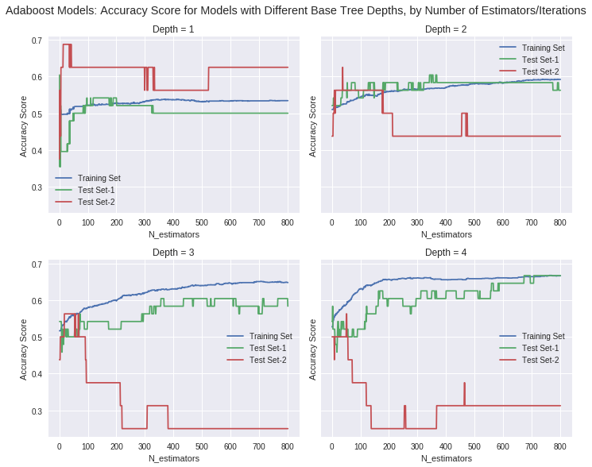

## Results of our baseline model

In this section, we display the results of our baseline model and we look for the best Hyper paramters for each model tried. The model to be tried include:

- Mutinomial logistic Regression
- kNN
- Decision Tree
- Linear Discriminant Analysis / Quadratic Linear Discriminant Analysis
- Random Forest
- Neural Network


```
# encapsulate performance measures in functions

def train_acc_score(model):
    return round(np.mean(cross_val_score(model,x_train,y_train,cv=k_fold,scoring="accuracy")),4)

def test_acc_score(model):
    return round(accuracy_score(y_test, model.predict(x_test)),4)

def train_prec_score(model):
    return round(precision_score(y_train,model.predict(x_train),average='macro'),4)

def test_prec_score(model):
    return round(precision_score(y_test,model.predict(x_test),average='macro'),4)

```


```
# function used in order to get the a confusion matrix of the classifcation model used
def confusion_matrix_model(model_used,x,y):
    cm=confusion_matrix(y,model_used.predict(x))
    col=["Predicted Draw","Predicted Team 1","Predicted Team 2"]
    cm=pd.DataFrame(cm)
    cm.columns=col
    cm.index=["Actual Draw","Actual Team 1","Actual Team 2"]
    return cm.T

def confusion_matrix_model_knockout(model_used,x,y):
    cm=confusion_matrix(y,knockout_test(model_used,x))
    col=["Predicted Team 1","Predicted Team 2"]
    cm=pd.DataFrame(cm)
    cm.columns=col
    cm.index=["Actual Team 1","Actual Team 2"]
    return cm.T
```


```
# function used  in order to merge the x and y_train sets with the features data frame and then give it to the model

def prepare_data(x_train,y_train,result):

    x1 = np.array(result.loc[x_train['home_team']])   # Match each home team game to it's stats
    x2 = np.array(result.loc[x_train['away_team']])   # Match each away team game to its stats
    y = np.zeros_like(y_train.values)
    y[y_train.values == 'Draw'] = 0   #Build the classfication
    y[y_train.values == x_train['home_team'].values] = 1
    y[y_train.values == x_train['away_team'].values] = 2
    y = np.array(y,dtype=np.float64)
    x = np.hstack((x1,x2))     # Overall dataset made of 138 predictors. 69 of the same for each team
    return x,y

```


## Classification methods


```
# function to get the observed versus predicted values
def encoder(ypred,y_train,x_train):
    ypred_label = list()
    k = 0
    for y in ypred:
        if y == 1:
            ypred_label.append(x_train['home_team'].values[k])
        elif y == 0:
            ypred_label.append('Draw')
        else:
            ypred_label.append(x_train['away_team'].values[k])
        k += 1
    return pd.DataFrame({'Predicted':ypred_label,'Observed':y_train.values})
```


##Logisitic regression - Baseline model


```
# finding top 2 components
var_explained = []
total_comp = 12
x,y = prepare_data(x_train,y_train,result3_std)
pca = PCA(n_components = total_comp).fit(x)

plt.plot(np.linspace(1, total_comp, total_comp), np.cumsum(pca.explained_variance_ratio_))
plt.xlabel('number of components')
plt.ylabel('variance explained')
plt.title('Cumulative variance explained',fontsize=15)

print("number of components that explain at least 90% of the variance=",\
    len(np.where(np.cumsum(pca.explained_variance_ratio_)<=0.9)[0])+1)
```


    number of components that explain at least 90% of the variance= 8


###train set


```
# fit the logistic regression model
reg3 = LogisticRegression(penalty='l2',multi_class='multinomial', solver='lbfgs', random_state=123456)
x,y = prepare_data(x_train,y_train,result3_std)
reg3.fit(x,y)
ypredml1 = reg3.predict(x)
df_pred_mat_lr = confusion_matrix_model(reg3,x,y)
display("conf matrix of logisitic regression",df_pred_mat_lr)
print("accuracy score or the model logistic regression multinomial model is:",accuracy_score(ypredml1,y))
```


    'conf matrix of logisitic regression'


<div>
<style scoped>
    .dataframe tbody tr th:only-of-type {
        vertical-align: middle;
    }

    .dataframe tbody tr th {
        vertical-align: top;
    }

    .dataframe thead th {
        text-align: right;
    }
</style>
<table border="1" class="dataframe">
  <thead>
    <tr style="text-align: right;">
      <th></th>
      <th>Actual Draw</th>
      <th>Actual Team 1</th>
      <th>Actual Team 2</th>
    </tr>
  </thead>
  <tbody>
    <tr>
      <th>Predicted Draw</th>
      <td>52</td>
      <td>32</td>
      <td>48</td>
    </tr>
    <tr>
      <th>Predicted Team 1</th>
      <td>612</td>
      <td>1346</td>
      <td>460</td>
    </tr>
    <tr>
      <th>Predicted Team 2</th>
      <td>322</td>
      <td>220</td>
      <td>472</td>
    </tr>
  </tbody>
</table>
</div>


    accuracy score or the model logistic regression multinomial model is: 0.5246913580246914


### test set


```
# test set code
x,y = prepare_data(x_test1,y_test1,result3_std)
ypredml1_test = reg3.predict(x)
df_predml1_test = encoder(ypredml1_test,y_test1,x_test1)
display(df_predml1_test.head())
df_pred_light_lr_test = confusion_matrix_model(reg3,x,y)
display("conf matrix of logisitic regression of the baseline model on the first test set",df_pred_light_lr_test)
print("accuracy score or the model logistic regression multinomial model on test set 1 is:",accuracy_score(ypredml1_test,y))

x,y = prepare_data(x_test2,y_test2,result3_std)
df_predml1_test2 = knockout_test(reg3,x)
df_pred_light_lr_test2 = confusion_matrix_model_knockout(reg3,x,y)
display("conf matrix of logistic gression of the baseline model of the second test set",df_pred_light_lr_test2)
print("accuracy score or the baseline model with logistic regression on test set 2 is:",accuracy_score(df_predml1_test2,y))
```


<div>
<style scoped>
    .dataframe tbody tr th:only-of-type {
        vertical-align: middle;
    }

    .dataframe tbody tr th {
        vertical-align: top;
    }

    .dataframe thead th {
        text-align: right;
    }
</style>
<table border="1" class="dataframe">
  <thead>
    <tr style="text-align: right;">
      <th></th>
      <th>Observed</th>
      <th>Predicted</th>
    </tr>
  </thead>
  <tbody>
    <tr>
      <th>0</th>
      <td>Russia</td>
      <td>Russia</td>
    </tr>
    <tr>
      <th>1</th>
      <td>Uruguay</td>
      <td>Uruguay</td>
    </tr>
    <tr>
      <th>2</th>
      <td>Iran</td>
      <td>Morocco</td>
    </tr>
    <tr>
      <th>3</th>
      <td>Draw</td>
      <td>Portugal</td>
    </tr>
    <tr>
      <th>4</th>
      <td>France</td>
      <td>France</td>
    </tr>
  </tbody>
</table>
</div>


    'conf matrix of logisitic regression of the baseline model on the first test set'


<div>
<style scoped>
    .dataframe tbody tr th:only-of-type {
        vertical-align: middle;
    }

    .dataframe tbody tr th {
        vertical-align: top;
    }

    .dataframe thead th {
        text-align: right;
    }
</style>
<table border="1" class="dataframe">
  <thead>
    <tr style="text-align: right;">
      <th></th>
      <th>Actual Draw</th>
      <th>Actual Team 1</th>
      <th>Actual Team 2</th>
    </tr>
  </thead>
  <tbody>
    <tr>
      <th>Predicted Draw</th>
      <td>0</td>
      <td>0</td>
      <td>2</td>
    </tr>
    <tr>
      <th>Predicted Team 1</th>
      <td>7</td>
      <td>16</td>
      <td>11</td>
    </tr>
    <tr>
      <th>Predicted Team 2</th>
      <td>2</td>
      <td>1</td>
      <td>9</td>
    </tr>
  </tbody>
</table>
</div>


    accuracy score or the model logistic regression multinomial model on test set 1 is: 0.5208333333333334


    'conf matrix of logistic gression of the baseline model of the second test set'


<div>
<style scoped>
    .dataframe tbody tr th:only-of-type {
        vertical-align: middle;
    }

    .dataframe tbody tr th {
        vertical-align: top;
    }

    .dataframe thead th {
        text-align: right;
    }
</style>
<table border="1" class="dataframe">
  <thead>
    <tr style="text-align: right;">
      <th></th>
      <th>Actual Team 1</th>
      <th>Actual Team 2</th>
    </tr>
  </thead>
  <tbody>
    <tr>
      <th>Predicted Team 1</th>
      <td>7</td>
      <td>4</td>
    </tr>
    <tr>
      <th>Predicted Team 2</th>
      <td>2</td>
      <td>3</td>
    </tr>
  </tbody>
</table>
</div>


    accuracy score or the baseline model with logistic regression on test set 2 is: 0.625


##KNN - baseline model


```
#Pick the best k of the model
max_score = 0
best_k = 0
x,y = prepare_data(x_train,y_train,result3_std)
for k in range(5,26):
    KNN3 = KNeighborsClassifier(n_neighbors = k, weights='uniform')
    score = cross_val_score(KNN3, x, y ,cv=5, scoring='accuracy').mean()
    if score > max_score:
        best_k = k
        max_score = score

print( 'Best K is ' + str(best_k) +'.')
```


    Best K is 5.


###train set


```
# fit knn
KNN3=KNeighborsClassifier(n_neighbors=best_k,p=1,weights='uniform')

KNN3.fit(x,y)
#make predictions
ypredml3 = KNN3.predict(x)
#use confusion matrix function
df_pred_mat_knn = confusion_matrix_model(KNN3,x,y)
display("conf matrix of the KNN model of the train set on the baseline model",df_pred_mat_knn)  
print("accuracy score of the knn model of the train set on the baseline model:",accuracy_score(ypredml3,y))  

x,y = prepare_data(x_train,y_train,result3_std)
print("accuracy score of the knn model Validation Set on the baseline model:",cross_val_score(KNN3,x,y,cv=10).mean())
```


    'conf matrix of the KNN model of the train set on the baseline model'


<div>
<style scoped>
    .dataframe tbody tr th:only-of-type {
        vertical-align: middle;
    }

    .dataframe tbody tr th {
        vertical-align: top;
    }

    .dataframe thead th {
        text-align: right;
    }
</style>
<table border="1" class="dataframe">
  <thead>
    <tr style="text-align: right;">
      <th></th>
      <th>Actual Draw</th>
      <th>Actual Team 1</th>
      <th>Actual Team 2</th>
    </tr>
  </thead>
  <tbody>
    <tr>
      <th>Predicted Draw</th>
      <td>546</td>
      <td>288</td>
      <td>242</td>
    </tr>
    <tr>
      <th>Predicted Team 1</th>
      <td>330</td>
      <td>1202</td>
      <td>260</td>
    </tr>
    <tr>
      <th>Predicted Team 2</th>
      <td>110</td>
      <td>108</td>
      <td>478</td>
    </tr>
  </tbody>
</table>
</div>


    accuracy score of the knn model of the train set on the baseline model: 0.6245791245791246
    accuracy score of the knn model Validation Set on the baseline model: 0.5518964059749552


### World Cup 2018 - Group  Phase games


```
# test set code
x,y = prepare_data(x_test1,y_test1,result3_std)
ypredml3_test = KNN3.predict(x)
df_predml3_test = encoder(ypredml3_test,y_test1,x_test1)
display(df_predml3_test.head())
df_pred_light_KNN_test = confusion_matrix_model(KNN3,x,y)
display("conf matrix of KNN of the baseline model on the first test set",df_pred_light_KNN_test)
print("accuracy score or the baseline model with KNN on the first test set is:",accuracy_score(ypredml3_test,y))

```


<div>
<style scoped>
    .dataframe tbody tr th:only-of-type {
        vertical-align: middle;
    }

    .dataframe tbody tr th {
        vertical-align: top;
    }

    .dataframe thead th {
        text-align: right;
    }
</style>
<table border="1" class="dataframe">
  <thead>
    <tr style="text-align: right;">
      <th></th>
      <th>Observed</th>
      <th>Predicted</th>
    </tr>
  </thead>
  <tbody>
    <tr>
      <th>0</th>
      <td>Russia</td>
      <td>Russia</td>
    </tr>
    <tr>
      <th>1</th>
      <td>Uruguay</td>
      <td>Uruguay</td>
    </tr>
    <tr>
      <th>2</th>
      <td>Iran</td>
      <td>Morocco</td>
    </tr>
    <tr>
      <th>3</th>
      <td>Draw</td>
      <td>Portugal</td>
    </tr>
    <tr>
      <th>4</th>
      <td>France</td>
      <td>France</td>
    </tr>
  </tbody>
</table>
</div>


    'conf matrix of KNN of the baseline model on the first test set'


<div>
<style scoped>
    .dataframe tbody tr th:only-of-type {
        vertical-align: middle;
    }

    .dataframe tbody tr th {
        vertical-align: top;
    }

    .dataframe thead th {
        text-align: right;
    }
</style>
<table border="1" class="dataframe">
  <thead>
    <tr style="text-align: right;">
      <th></th>
      <th>Actual Draw</th>
      <th>Actual Team 1</th>
      <th>Actual Team 2</th>
    </tr>
  </thead>
  <tbody>
    <tr>
      <th>Predicted Draw</th>
      <td>3</td>
      <td>1</td>
      <td>7</td>
    </tr>
    <tr>
      <th>Predicted Team 1</th>
      <td>4</td>
      <td>14</td>
      <td>8</td>
    </tr>
    <tr>
      <th>Predicted Team 2</th>
      <td>2</td>
      <td>2</td>
      <td>7</td>
    </tr>
  </tbody>
</table>
</div>


    accuracy score or the baseline model with KNN on the first test set is: 0.5


### World Cup 2018 - Knockout Games


```
x,y = prepare_data(x_test2,y_test2,result3_std)

KNN3=KNeighborsClassifier(n_neighbors=best_k,p=1,weights='uniform')
KNN3.fit(x,y)
ypredml3_test2 = knockout_test(KNN3,x)
# print(min(y),max(y),min(ypredml3_test2),max(ypredml3_test2))
df_pred_light_KNN_test2 = confusion_matrix_model_knockout(KNN3,x,y)
display("conf matrix of KNN of the baseline model on the second test set",df_pred_light_KNN_test2)
print("accuracy score or the baseline model with KNN on second  test set is:",accuracy_score(ypredml3_test2,y))


```


    'conf matrix of KNN of the baseline model on the second test set'


<div>
<style scoped>
    .dataframe tbody tr th:only-of-type {
        vertical-align: middle;
    }

    .dataframe tbody tr th {
        vertical-align: top;
    }

    .dataframe thead th {
        text-align: right;
    }
</style>
<table border="1" class="dataframe">
  <thead>
    <tr style="text-align: right;">
      <th></th>
      <th>Actual Team 1</th>
      <th>Actual Team 2</th>
    </tr>
  </thead>
  <tbody>
    <tr>
      <th>Predicted Team 1</th>
      <td>2</td>
      <td>2</td>
    </tr>
    <tr>
      <th>Predicted Team 2</th>
      <td>7</td>
      <td>5</td>
    </tr>
  </tbody>
</table>
</div>


    accuracy score or the baseline model with KNN on second  test set is: 0.4375


##Decision tree-Baseline Model


```
x,y = prepare_data(x_train,y_train,result3_std)
# fitting DecisionTreeClassifier class for depths 1-25, storing results
tree_cv_scores = []
for i in range (1,26):
  clf = DecisionTreeClassifier(criterion='gini', max_depth=i)
  clf.fit(x, y)
  train_score = clf.score(x, y)
  cv_score = cross_val_score(clf, x, y, scoring='accuracy', cv=5)
#   test_score = clf.score(x_test, y_test)
  tree_cv_scores.append({'Depth': i,
                         'Train Score': train_score,
                        'CV Mean Accuracy': cv_score.mean(),
                        'CV std.': cv_score.std(),
#                         'Test Score': test_score
                        })

columns=['Depth', 'Train Score', 'CV Mean Accuracy', 'CV std.'] # to preserve order
tree_scores_df = pd.DataFrame(tree_cv_scores, columns=columns)

```


```
# plot
num_SD = 2 # number of CV std for plotting

plt.figure(figsize =(10,6))
plt.plot(tree_scores_df['Depth'], tree_scores_df['Train Score'], label='Training Set Score')
plt.plot(tree_scores_df['Depth'], tree_scores_df['CV Mean Accuracy'],label='Mean CV Score ',color='green')
plt.fill_between(
    tree_scores_df['Depth'],
    tree_scores_df['CV Mean Accuracy'] -  num_SD * tree_scores_df['CV std.'],
    tree_scores_df['CV Mean Accuracy'] +  num_SD * tree_scores_df['CV std.'],
    alpha=.1, color='green')

plt.legend()
plt.xlabel("Max Tree Depth")
plt.ylabel("Mean CV Accuracy Score +/- {} SD".format(num_SD))
plt.title("Accuracy Scores vs. Maximum Tree Depth on Decision Tree Classifier, Training Set");
```


```
best_index = tree_scores_df['CV Mean Accuracy'].idxmax()
best_depth = tree_scores_df['Depth'][best_index]

tree_clf = DecisionTreeClassifier(max_depth=best_depth).fit(x,y)
best_depth
```


    16


##Linear Discriminant Analysis (LDA)-Baseline model

### Train Data Set


```
x,y = prepare_data(x_train,y_train,result3_std)
lda = LinearDiscriminantAnalysis()
lda.fit(x, y)
ypredlda3 = lda.predict(x)
#use confusion matrix function
df_pred_mat_lda = confusion_matrix_model(lda,x,y)
display("conf matrix of lda on the baseline model",df_pred_mat_lda)  
print("accuracy score of lda on baseline model:",accuracy_score(ypredlda3,y))  

x,y = prepare_data(x_train,y_train,result3_std)
print("accuracy score of lda on baseline model Validation Set:",cross_val_score(lda,x,y,cv=10).mean())
```


    'conf matrix of lda on the baseline model'


<div>
<style scoped>
    .dataframe tbody tr th:only-of-type {
        vertical-align: middle;
    }

    .dataframe tbody tr th {
        vertical-align: top;
    }

    .dataframe thead th {
        text-align: right;
    }
</style>
<table border="1" class="dataframe">
  <thead>
    <tr style="text-align: right;">
      <th></th>
      <th>Actual Draw</th>
      <th>Actual Team 1</th>
      <th>Actual Team 2</th>
    </tr>
  </thead>
  <tbody>
    <tr>
      <th>Predicted Draw</th>
      <td>64</td>
      <td>40</td>
      <td>58</td>
    </tr>
    <tr>
      <th>Predicted Team 1</th>
      <td>600</td>
      <td>1326</td>
      <td>440</td>
    </tr>
    <tr>
      <th>Predicted Team 2</th>
      <td>322</td>
      <td>232</td>
      <td>482</td>
    </tr>
  </tbody>
</table>
</div>


    accuracy score of lda on baseline model: 0.5252525252525253
    accuracy score of lda on baseline model Validation Set: 0.5247027017801897


### World Cup 2018 - Group  Phase games


```
x,y = prepare_data(x_test1,y_test1,result3_std)
lda = LinearDiscriminantAnalysis()
lda.fit(x, y)
ypredlda3 = lda.predict(x)
#use confusion matrix function
df_pred_mat_lda = confusion_matrix_model(lda,x,y)
display("conf matrix of the lda model",df_pred_mat_lda)  
print("accuracy score of the lda model:",accuracy_score(ypredlda3,y))  

x,y = prepare_data(x_train,y_train,result3_std)
print("accuracy score of the lda model Validation Set:",cross_val_score(lda,x,y,cv=10).mean())
```


    'conf matrix of the lda model'


<div>
<style scoped>
    .dataframe tbody tr th:only-of-type {
        vertical-align: middle;
    }

    .dataframe tbody tr th {
        vertical-align: top;
    }

    .dataframe thead th {
        text-align: right;
    }
</style>
<table border="1" class="dataframe">
  <thead>
    <tr style="text-align: right;">
      <th></th>
      <th>Actual Draw</th>
      <th>Actual Team 1</th>
      <th>Actual Team 2</th>
    </tr>
  </thead>
  <tbody>
    <tr>
      <th>Predicted Draw</th>
      <td>4</td>
      <td>2</td>
      <td>0</td>
    </tr>
    <tr>
      <th>Predicted Team 1</th>
      <td>1</td>
      <td>14</td>
      <td>2</td>
    </tr>
    <tr>
      <th>Predicted Team 2</th>
      <td>4</td>
      <td>1</td>
      <td>20</td>
    </tr>
  </tbody>
</table>
</div>


    accuracy score of the lda model: 0.7916666666666666
    accuracy score of the lda model Validation Set: 0.5247027017801897


### World Cup 2018 - Knockout Games


```
x,y = prepare_data(x_test2,y_test2,result3_std)
lda = LinearDiscriminantAnalysis()
lda.fit(x, y)
ypredlda3 = knockout_test(lda,x)
#use confusion matrix function
# df_pred_mat_lda = confusion_matrix_model_knockout(lda,x,y)
# display("conf matrix of the lda model",df_pred_mat_lda)  
print("accuracy score of lda on baseline model of the second test set:",accuracy_score(ypredlda3,y))  

```


    accuracy score of lda on baseline model of the second test set: 0.0


## Quadratic Discriminant Analysis (QDA)

### Training Data Set


```
x,y = prepare_data(x_train,y_train,result3_std)
qda = QuadraticDiscriminantAnalysis()
qda.fit(x, y)
ypredqda3 = qda.predict(x)
#use confusion matrix function
df_pred_mat_qda = confusion_matrix_model(qda,x,y)
display("conf matrix of qda on baseline model train set",df_pred_mat_qda)  
print("accuracy score of qda on baselin model train set:",accuracy_score(ypredqda3,y))  

x,y = prepare_data(x_train,y_train,result3_std)
print("accuracy score of qda on baseline model Validation Set:",cross_val_score(qda,x,y,cv=10).mean())
```


    'conf matrix of qda on baseline model train set'


<div>
<style scoped>
    .dataframe tbody tr th:only-of-type {
        vertical-align: middle;
    }

    .dataframe tbody tr th {
        vertical-align: top;
    }

    .dataframe thead th {
        text-align: right;
    }
</style>
<table border="1" class="dataframe">
  <thead>
    <tr style="text-align: right;">
      <th></th>
      <th>Actual Draw</th>
      <th>Actual Team 1</th>
      <th>Actual Team 2</th>
    </tr>
  </thead>
  <tbody>
    <tr>
      <th>Predicted Draw</th>
      <td>240</td>
      <td>182</td>
      <td>186</td>
    </tr>
    <tr>
      <th>Predicted Team 1</th>
      <td>482</td>
      <td>1198</td>
      <td>344</td>
    </tr>
    <tr>
      <th>Predicted Team 2</th>
      <td>264</td>
      <td>218</td>
      <td>450</td>
    </tr>
  </tbody>
</table>
</div>


    accuracy score of qda on baselin model train set: 0.5297418630751964
    accuracy score of qda on baseline model Validation Set: 0.5103846653394701


### World Cup 2018 - Group  Phase games


```
x,y = prepare_data(x_test1,y_test1,result3_std)
ypredqda3_test1 = qda.predict(x)
#use confusion matrix function
df_pred_mat_qda = confusion_matrix_model(qda,x,y)
display("conf matrix of the qda model",df_pred_mat_qda)  
print("accuracy score of the qda model:",accuracy_score(ypredqda3_test1,y))  

x,y = prepare_data(x_train,y_train,result3_std)
print("accuracy score of the qda model Validation Set:",cross_val_score(qda,x,y,cv=10).mean())
```


    'conf matrix of the qda model'


<div>
<style scoped>
    .dataframe tbody tr th:only-of-type {
        vertical-align: middle;
    }

    .dataframe tbody tr th {
        vertical-align: top;
    }

    .dataframe thead th {
        text-align: right;
    }
</style>
<table border="1" class="dataframe">
  <thead>
    <tr style="text-align: right;">
      <th></th>
      <th>Actual Draw</th>
      <th>Actual Team 1</th>
      <th>Actual Team 2</th>
    </tr>
  </thead>
  <tbody>
    <tr>
      <th>Predicted Draw</th>
      <td>1</td>
      <td>2</td>
      <td>7</td>
    </tr>
    <tr>
      <th>Predicted Team 1</th>
      <td>5</td>
      <td>13</td>
      <td>8</td>
    </tr>
    <tr>
      <th>Predicted Team 2</th>
      <td>3</td>
      <td>2</td>
      <td>7</td>
    </tr>
  </tbody>
</table>
</div>


    accuracy score of the qda model: 0.4375
    accuracy score of the qda model Validation Set: 0.5103846653394701


### World Cup 2018 - Knockout Games


```
x,y = prepare_data(x_test2,y_test2,result3_std)
ypredqda3_test2 = qda.predict(x)
#use confusion matrix function
# df_pred_mat_qda = confusion_matrix_model(qda,x,y)
# display("conf matrix of the qda model",df_pred_mat_qda)  
print("accuracy score of qda on baseline model second test:",accuracy_score(ypredqda3_test2,y))  

x,y = prepare_data(x_train,y_train,result3_std)
print("accuracy score of qda baseline model on Validation Set:",cross_val_score(qda,x,y,cv=10).mean())
```


    accuracy score of qda on baseline model second test: 0.5625
    accuracy score of qda baseline model on Validation Set: 0.5103846653394701


# Ensemble methods

In this section we try different types of Ensembles methods:
- Random Forest
- Bagging
- Boosting

## Random Forest- baseline model

### train set


```
# fit the random forest model and get its accuracy score
x,y = prepare_data(x_train,y_train,result3_std)
rfml = RandomForestClassifier(n_estimators=50, oob_score=True, max_depth=10,random_state=1234)
rfml.fit(x, y)
ypredml2=rfml.predict(x)

print("accuracy score for the random forest model:",accuracy_score(ypredml2,y))

```


    accuracy score for the random forest model: 0.6728395061728395


### test set 1


```
# fit the random forest model and get its accuracy score
x,y = prepare_data(x_test1,y_test1,result3_std)
# rfml = RandomForestClassifier(n_estimators=50, oob_score=True, max_depth=10,random_state=1234)
# rfml.fit(x, y)
ypredml2=rfml.predict(x)

print("accuracy score for the random forest test1 on baseline model:",accuracy_score(ypredml2,y))

```


    accuracy score for the random forest test1 on baseline model: 0.6666666666666666


### test set 2


```
# fit the random forest model and get its accuracy score
x,y = prepare_data(x_test2,y_test2,result3_std)
# rfml = RandomForestClassifier(n_estimators=50, oob_score=True, max_depth=10,random_state=1234)
# rfml.fit(x, y)
ypredml2=knockout_test(rfml,x)

print("accuracy score for the random forest test2 on baseline model:",accuracy_score(ypredml2,y))

```


    accuracy score for the random forest test2 on baseline model: 0.1875


##Bagging


```
from sklearn.utils import resample


x,y = prepare_data(x_train,y_train,result3_std)
xt1,yt1 = prepare_data(x_test1,y_test1,result3_std)
xt2,yt2 = prepare_data(x_test2,y_test2,result3_std)

np.random.seed(0)

N_bootstraps = 45
bagging_train = np.zeros((x.shape[0], N_bootstraps),dtype=int)
bagging_test1 = np.zeros((xt1.shape[0], N_bootstraps),dtype=int)
bagging_test2 = np.zeros((xt2.shape[0], N_bootstraps),dtype=int)
bagging_trees = []

simpletree = DecisionTreeClassifier(max_depth=16)

# bootstrapping, saving results each time
for i in range(N_bootstraps):
  boot_xx, boot_y = resample(x, y)
  bagging_trees.append(simpletree.fit(boot_xx, boot_y))
  bagging_train[:, i] = simpletree.predict(x)
  bagging_test1[:, i] = simpletree.predict(xt1)
  bagging_test2[:, i] = simpletree.predict(xt2)


# format table
columns = ["Bootstrap-Model_"+str(i+1) for i in range(N_bootstraps)]
rows_train = ["Training-Row_" + str(i+1) for i in range(len(x))]
rows_test1 = ["Test-Row_" + str(i+1) for i in range(len(xt1))]
rows_test2 = ["Test-Row_" + str(i+1) for i in range(len(xt2))]


bagging_train = pd.DataFrame(bagging_train, columns=columns, index=rows_train)
bagging_test1 = pd.DataFrame(bagging_test1, columns=columns, index=rows_test1)
bagging_test2 = pd.DataFrame(bagging_test2, columns=columns, index=rows_test2)


print("train bootstrapped table:")
display(bagging_train.head())
print("\ntest1 bootstrapped table:")
display(bagging_test1.head())
print("\ntest2 bootstrapped table:")
display(bagging_test2.head())

```


    train bootstrapped table:


<div>
<style scoped>
    .dataframe tbody tr th:only-of-type {
        vertical-align: middle;
    }

    .dataframe tbody tr th {
        vertical-align: top;
    }

    .dataframe thead th {
        text-align: right;
    }
</style>
<table border="1" class="dataframe">
  <thead>
    <tr style="text-align: right;">
      <th></th>
      <th>Bootstrap-Model_1</th>
      <th>Bootstrap-Model_2</th>
      <th>Bootstrap-Model_3</th>
      <th>Bootstrap-Model_4</th>
      <th>Bootstrap-Model_5</th>
      <th>Bootstrap-Model_6</th>
      <th>Bootstrap-Model_7</th>
      <th>Bootstrap-Model_8</th>
      <th>Bootstrap-Model_9</th>
      <th>Bootstrap-Model_10</th>
      <th>...</th>
      <th>Bootstrap-Model_36</th>
      <th>Bootstrap-Model_37</th>
      <th>Bootstrap-Model_38</th>
      <th>Bootstrap-Model_39</th>
      <th>Bootstrap-Model_40</th>
      <th>Bootstrap-Model_41</th>
      <th>Bootstrap-Model_42</th>
      <th>Bootstrap-Model_43</th>
      <th>Bootstrap-Model_44</th>
      <th>Bootstrap-Model_45</th>
    </tr>
  </thead>
  <tbody>
    <tr>
      <th>Training-Row_1</th>
      <td>2</td>
      <td>2</td>
      <td>2</td>
      <td>2</td>
      <td>2</td>
      <td>2</td>
      <td>2</td>
      <td>2</td>
      <td>2</td>
      <td>2</td>
      <td>...</td>
      <td>2</td>
      <td>2</td>
      <td>2</td>
      <td>2</td>
      <td>0</td>
      <td>2</td>
      <td>2</td>
      <td>2</td>
      <td>2</td>
      <td>2</td>
    </tr>
    <tr>
      <th>Training-Row_2</th>
      <td>0</td>
      <td>1</td>
      <td>1</td>
      <td>1</td>
      <td>2</td>
      <td>0</td>
      <td>0</td>
      <td>1</td>
      <td>1</td>
      <td>0</td>
      <td>...</td>
      <td>1</td>
      <td>0</td>
      <td>0</td>
      <td>1</td>
      <td>0</td>
      <td>2</td>
      <td>1</td>
      <td>1</td>
      <td>0</td>
      <td>0</td>
    </tr>
    <tr>
      <th>Training-Row_3</th>
      <td>1</td>
      <td>1</td>
      <td>1</td>
      <td>1</td>
      <td>1</td>
      <td>1</td>
      <td>1</td>
      <td>1</td>
      <td>1</td>
      <td>2</td>
      <td>...</td>
      <td>1</td>
      <td>1</td>
      <td>1</td>
      <td>2</td>
      <td>1</td>
      <td>1</td>
      <td>2</td>
      <td>2</td>
      <td>1</td>
      <td>1</td>
    </tr>
    <tr>
      <th>Training-Row_4</th>
      <td>2</td>
      <td>2</td>
      <td>2</td>
      <td>2</td>
      <td>2</td>
      <td>2</td>
      <td>2</td>
      <td>2</td>
      <td>2</td>
      <td>2</td>
      <td>...</td>
      <td>2</td>
      <td>2</td>
      <td>2</td>
      <td>2</td>
      <td>2</td>
      <td>2</td>
      <td>2</td>
      <td>2</td>
      <td>2</td>
      <td>2</td>
    </tr>
    <tr>
      <th>Training-Row_5</th>
      <td>2</td>
      <td>2</td>
      <td>2</td>
      <td>2</td>
      <td>2</td>
      <td>2</td>
      <td>2</td>
      <td>2</td>
      <td>2</td>
      <td>2</td>
      <td>...</td>
      <td>0</td>
      <td>2</td>
      <td>2</td>
      <td>2</td>
      <td>2</td>
      <td>2</td>
      <td>2</td>
      <td>2</td>
      <td>2</td>
      <td>2</td>
    </tr>
  </tbody>
</table>
<p>5 rows × 45 columns</p>
</div>


    test1 bootstrapped table:


<div>
<style scoped>
    .dataframe tbody tr th:only-of-type {
        vertical-align: middle;
    }

    .dataframe tbody tr th {
        vertical-align: top;
    }

    .dataframe thead th {
        text-align: right;
    }
</style>
<table border="1" class="dataframe">
  <thead>
    <tr style="text-align: right;">
      <th></th>
      <th>Bootstrap-Model_1</th>
      <th>Bootstrap-Model_2</th>
      <th>Bootstrap-Model_3</th>
      <th>Bootstrap-Model_4</th>
      <th>Bootstrap-Model_5</th>
      <th>Bootstrap-Model_6</th>
      <th>Bootstrap-Model_7</th>
      <th>Bootstrap-Model_8</th>
      <th>Bootstrap-Model_9</th>
      <th>Bootstrap-Model_10</th>
      <th>...</th>
      <th>Bootstrap-Model_36</th>
      <th>Bootstrap-Model_37</th>
      <th>Bootstrap-Model_38</th>
      <th>Bootstrap-Model_39</th>
      <th>Bootstrap-Model_40</th>
      <th>Bootstrap-Model_41</th>
      <th>Bootstrap-Model_42</th>
      <th>Bootstrap-Model_43</th>
      <th>Bootstrap-Model_44</th>
      <th>Bootstrap-Model_45</th>
    </tr>
  </thead>
  <tbody>
    <tr>
      <th>Test-Row_1</th>
      <td>0</td>
      <td>1</td>
      <td>1</td>
      <td>1</td>
      <td>1</td>
      <td>1</td>
      <td>1</td>
      <td>1</td>
      <td>1</td>
      <td>1</td>
      <td>...</td>
      <td>1</td>
      <td>1</td>
      <td>1</td>
      <td>1</td>
      <td>1</td>
      <td>0</td>
      <td>1</td>
      <td>1</td>
      <td>1</td>
      <td>1</td>
    </tr>
    <tr>
      <th>Test-Row_2</th>
      <td>2</td>
      <td>2</td>
      <td>2</td>
      <td>2</td>
      <td>2</td>
      <td>2</td>
      <td>2</td>
      <td>2</td>
      <td>2</td>
      <td>2</td>
      <td>...</td>
      <td>2</td>
      <td>2</td>
      <td>2</td>
      <td>2</td>
      <td>2</td>
      <td>2</td>
      <td>2</td>
      <td>2</td>
      <td>2</td>
      <td>2</td>
    </tr>
    <tr>
      <th>Test-Row_3</th>
      <td>2</td>
      <td>2</td>
      <td>2</td>
      <td>2</td>
      <td>2</td>
      <td>0</td>
      <td>2</td>
      <td>2</td>
      <td>2</td>
      <td>2</td>
      <td>...</td>
      <td>2</td>
      <td>2</td>
      <td>2</td>
      <td>1</td>
      <td>1</td>
      <td>2</td>
      <td>0</td>
      <td>2</td>
      <td>2</td>
      <td>2</td>
    </tr>
    <tr>
      <th>Test-Row_4</th>
      <td>0</td>
      <td>0</td>
      <td>0</td>
      <td>0</td>
      <td>1</td>
      <td>0</td>
      <td>0</td>
      <td>0</td>
      <td>2</td>
      <td>0</td>
      <td>...</td>
      <td>0</td>
      <td>0</td>
      <td>0</td>
      <td>0</td>
      <td>0</td>
      <td>2</td>
      <td>0</td>
      <td>0</td>
      <td>1</td>
      <td>1</td>
    </tr>
    <tr>
      <th>Test-Row_5</th>
      <td>1</td>
      <td>1</td>
      <td>1</td>
      <td>1</td>
      <td>1</td>
      <td>1</td>
      <td>1</td>
      <td>1</td>
      <td>1</td>
      <td>1</td>
      <td>...</td>
      <td>1</td>
      <td>1</td>
      <td>1</td>
      <td>1</td>
      <td>1</td>
      <td>1</td>
      <td>1</td>
      <td>1</td>
      <td>1</td>
      <td>1</td>
    </tr>
  </tbody>
</table>
<p>5 rows × 45 columns</p>
</div>


    test2 bootstrapped table:


<div>
<style scoped>
    .dataframe tbody tr th:only-of-type {
        vertical-align: middle;
    }

    .dataframe tbody tr th {
        vertical-align: top;
    }

    .dataframe thead th {
        text-align: right;
    }
</style>
<table border="1" class="dataframe">
  <thead>
    <tr style="text-align: right;">
      <th></th>
      <th>Bootstrap-Model_1</th>
      <th>Bootstrap-Model_2</th>
      <th>Bootstrap-Model_3</th>
      <th>Bootstrap-Model_4</th>
      <th>Bootstrap-Model_5</th>
      <th>Bootstrap-Model_6</th>
      <th>Bootstrap-Model_7</th>
      <th>Bootstrap-Model_8</th>
      <th>Bootstrap-Model_9</th>
      <th>Bootstrap-Model_10</th>
      <th>...</th>
      <th>Bootstrap-Model_36</th>
      <th>Bootstrap-Model_37</th>
      <th>Bootstrap-Model_38</th>
      <th>Bootstrap-Model_39</th>
      <th>Bootstrap-Model_40</th>
      <th>Bootstrap-Model_41</th>
      <th>Bootstrap-Model_42</th>
      <th>Bootstrap-Model_43</th>
      <th>Bootstrap-Model_44</th>
      <th>Bootstrap-Model_45</th>
    </tr>
  </thead>
  <tbody>
    <tr>
      <th>Test-Row_1</th>
      <td>2</td>
      <td>2</td>
      <td>2</td>
      <td>2</td>
      <td>2</td>
      <td>2</td>
      <td>2</td>
      <td>2</td>
      <td>2</td>
      <td>2</td>
      <td>...</td>
      <td>2</td>
      <td>2</td>
      <td>2</td>
      <td>2</td>
      <td>2</td>
      <td>2</td>
      <td>2</td>
      <td>2</td>
      <td>2</td>
      <td>2</td>
    </tr>
    <tr>
      <th>Test-Row_2</th>
      <td>0</td>
      <td>1</td>
      <td>2</td>
      <td>2</td>
      <td>0</td>
      <td>0</td>
      <td>2</td>
      <td>0</td>
      <td>1</td>
      <td>2</td>
      <td>...</td>
      <td>2</td>
      <td>0</td>
      <td>1</td>
      <td>0</td>
      <td>0</td>
      <td>0</td>
      <td>0</td>
      <td>0</td>
      <td>1</td>
      <td>0</td>
    </tr>
    <tr>
      <th>Test-Row_3</th>
      <td>1</td>
      <td>1</td>
      <td>1</td>
      <td>1</td>
      <td>0</td>
      <td>1</td>
      <td>0</td>
      <td>1</td>
      <td>1</td>
      <td>0</td>
      <td>...</td>
      <td>1</td>
      <td>1</td>
      <td>0</td>
      <td>0</td>
      <td>1</td>
      <td>1</td>
      <td>0</td>
      <td>1</td>
      <td>1</td>
      <td>0</td>
    </tr>
    <tr>
      <th>Test-Row_4</th>
      <td>1</td>
      <td>0</td>
      <td>1</td>
      <td>0</td>
      <td>2</td>
      <td>2</td>
      <td>0</td>
      <td>1</td>
      <td>0</td>
      <td>1</td>
      <td>...</td>
      <td>1</td>
      <td>1</td>
      <td>1</td>
      <td>1</td>
      <td>1</td>
      <td>2</td>
      <td>2</td>
      <td>2</td>
      <td>0</td>
      <td>2</td>
    </tr>
    <tr>
      <th>Test-Row_5</th>
      <td>1</td>
      <td>1</td>
      <td>1</td>
      <td>1</td>
      <td>1</td>
      <td>1</td>
      <td>1</td>
      <td>1</td>
      <td>1</td>
      <td>1</td>
      <td>...</td>
      <td>1</td>
      <td>1</td>
      <td>1</td>
      <td>1</td>
      <td>1</td>
      <td>1</td>
      <td>1</td>
      <td>1</td>
      <td>1</td>
      <td>1</td>
    </tr>
  </tbody>
</table>
<p>5 rows × 45 columns</p>
</div>


```
# get majority to generate combined predictions
y_hat_train_maj = (np.mean(bagging_train,axis=1)>.5).astype(int)
y_hat_test_maj1 = (np.mean(bagging_test1,axis=1)>.5).astype(int)
y_hat_test_maj2 = (np.mean(bagging_test2,axis=1)>.5).astype(int)


bagged_accuracy_train = accuracy_score(y, y_hat_train_maj)
bagged_accuracy_test1 = accuracy_score(yt1, y_hat_test_maj1)
bagged_accuracy_test2 = accuracy_score(yt2, y_hat_test_maj2)


print("bagging model, training set accuracy:", bagged_accuracy_train)
print("bagging model, test-1 set accuracy:", bagged_accuracy_test1)
print("bagging model, test-2 set accuracy:", bagged_accuracy_test2)

```


    bagging model, training set accuracy: 0.5359147025813692
    bagging model, test-1 set accuracy: 0.4166666666666667
    bagging model, test-2 set accuracy: 0.4375


```
def running_predictions(prediction_dataset, targets):
    """A function to predict examples' class via the majority among trees (ties are predicted as 0)

    Inputs:
      prediction_dataset - a (n_examples by n_sub_models) dataset, where each entry [i,j] is sub-model j's prediction
          for example i
      targets - the true class labels

    Returns:
      a vector where vec[i] is the model's accuracy when using just the first i+1 sub-models
    """

    n_trees = prediction_dataset.shape[1]

    # find the running percentage of models voting 1 as more models are considered
    running_percent_1s = np.cumsum(prediction_dataset, axis=1)/np.arange(1,n_trees+1)

    # predict 1 when the running average is above 0.5
    running_conclusions = running_percent_1s > 0.5

    # check whether the running predictions match the targets
    running_correctnesss = running_conclusions == targets.reshape(-1,1)

    return np.mean(running_correctnesss, axis=0)
    # returns a 1-d series of the accuracy of using the first n trees to predict the targets
```


```
running_pred_train = running_predictions(bagging_train.values, y)
running_pred_test1 = running_predictions(bagging_test1.values, yt1)
running_pred_test2 = running_predictions(bagging_test2.values, yt2)

overfit_model = DecisionTreeClassifier(max_depth=16).fit(x, y)
ypred_overfit = overfit_model.predict(xt1)

plt.figure(figsize=(10,8))
plt.plot(range(1,46), running_pred_train, 'o-', label='Training set, Bootstrapped Models')
plt.plot(range(1,46), running_pred_test1, 'o-', label='Test set1, Bootstrapped Models')
plt.plot(range(1,46), running_pred_test2, 'o-', label='Test set2, Bootstrapped Models')
plt.title('Training and Test Set Accuracy Scores by Number of Bootstraps')
plt.xlabel('Number of Bootstraps')
plt.ylabel('Accuracy Score')
plt.legend();
```


## Boosting


```
n_estimators = 800
learning_rate = 0.05

x,y = prepare_data(x_train,y_train,result3_std)
ab = AdaBoostClassifier(base_estimator=DecisionTreeClassifier(max_depth=3),
                            n_estimators=n_estimators, learning_rate=learning_rate)
ab.fit(x, y)
xt1,yt1 = prepare_data(x_test1,y_test1,result3_std)
xt2,yt2 = prepare_data(x_test2,y_test2,result3_std)
ab_scores_train = list(ab.staged_score(x, y))
ab_scores_test1 = list(ab.staged_score(xt1, yt1))
ab_scores_test2 = list(ab.staged_score(xt2, yt2))

x_plot = range(1, n_estimators+1) # just so we plot x-values of 1-800 instead of 0-799

plt.plot(x_plot, ab_scores_train, label='Training Set')
plt.plot(x_plot, ab_scores_test1, label='Test Set-1')
plt.plot(x_plot, ab_scores_test2, label='Test Set-2')
plt.title('Adaboost Model: Accuracy Score by Number of Estimators/Iterations')
plt.xlabel('Number of Estimators/Iterations')
plt.ylabel('Accuracy')
plt.legend();
```


```
# List of lists of the staged predictions
staged_scores_train = []
staged_scores_test1 = []
staged_scores_test2 = []

for depth in range(1,5):
  ab = AdaBoostClassifier(base_estimator=DecisionTreeClassifier(max_depth=depth),
                            n_estimators=n_estimators, learning_rate=learning_rate)
  ab.fit(x, y)

  ab_scores_train = list(ab.staged_score(x, y))
  ab_scores_test1 = list(ab.staged_score(xt1, yt1))
  ab_scores_test2 = list(ab.staged_score(xt2, yt2))

  staged_scores_train.append(ab_scores_train)
  staged_scores_test1.append(ab_scores_test1)
  staged_scores_test2.append(ab_scores_test2)

```


```
fig, axs = plt.subplots(2,2,figsize=(10,8), sharey=True)

for i, ax in enumerate(axs.ravel()):
  ax.plot(x_plot, staged_scores_train[i], label='Training Set')
  ax.plot(x_plot, staged_scores_test1[i], label='Test Set-1')
  ax.plot(x_plot, staged_scores_test2[i], label='Test Set-2')
  ax.set_title('Depth = {}'.format(i+1))
  ax.set_xlabel('N_estimators')
  ax.set_ylabel('Accuracy Score')
  ax.legend();

plt.tight_layout()
plt.suptitle('Adaboost Models: Accuracy Score for Models with Different Base Tree Depths, \
by Number of Estimators/Iterations', x=.5, y=1.02);
```





```
staged_scores_test_array1 = np.array(staged_scores_test1)
staged_scores_test_array2 = np.array(staged_scores_test2)


for i, depth_scores in enumerate(staged_scores_test_array1):
  depth = i+1
  idx = (np.argmax(depth_scores))
  print("Depth = {}: best test set 1 accuracy at {} estimators.".format(depth, idx+1))
  print("train set accuracy score: {}\n".format(depth_scores[idx]))


for i, depth_scores in enumerate(staged_scores_test_array2):
  depth = i+1
  idx = (np.argmax(depth_scores))
  print("Depth = {}: best test set 2 accuracy at {} estimators.".format(depth, idx+1))
  print("train set accuracy score: {}\n".format(depth_scores[idx]))
```


    Depth = 1: best test set 1 accuracy at 1 estimators.
    train set accuracy score: 0.6041666666666666

    Depth = 2: best test set 1 accuracy at 342 estimators.
    train set accuracy score: 0.6041666666666666

    Depth = 3: best test set 1 accuracy at 356 estimators.
    train set accuracy score: 0.6041666666666666

    Depth = 4: best test set 1 accuracy at 673 estimators.
    train set accuracy score: 0.6666666666666666

    Depth = 1: best test set 2 accuracy at 14 estimators.
    train set accuracy score: 0.6875

    Depth = 2: best test set 2 accuracy at 38 estimators.
    train set accuracy score: 0.625

    Depth = 3: best test set 2 accuracy at 18 estimators.
    train set accuracy score: 0.5625

    Depth = 4: best test set 2 accuracy at 51 estimators.
    train set accuracy score: 0.5625


##Neural Network


### Training Data Set


```
x,y = prepare_data(x_train,y_train,result3_std)
y_nn = []
for value in y:
  if value == 0:
    y_nn.append([1,0,0])
  elif value == 1:
    y_nn.append([0,1,0])
  else:
    y_nn.append([0,0,1])

y_nn = np.array(y_nn)

model_nn = Sequential([
    Dense(200, input_shape=(x.shape[1],), activation='relu'),
    # Dense(100, activation='relu'),
    # Dense(50, activation='relu'),
    Dense(3, activation='linear')
])


model_nn.compile(loss='mean_absolute_error',
              optimizer='adam',metrics=['acc'])
model_nn.summary()

model_nn.fit(x, y_nn,
          epochs=10*32,
          batch_size=32,
          validation_split=.2,
          verbose=False)

```


    _________________________________________________________________
    Layer (type)                 Output Shape              Param #   
    =================================================================
    dense_30 (Dense)             (None, 200)               2600      
    _________________________________________________________________
    dense_31 (Dense)             (None, 3)                 603       
    =================================================================
    Total params: 3,203
    Trainable params: 3,203
    Non-trainable params: 0
    _________________________________________________________________


    <keras.callbacks.History at 0x7f271ef6fd68>


```
res=model_nn.evaluate(x, y_nn, verbose=False)

print("the loss of this model is:",res[0])
print("the accuracy of this model is:",res[1])
```


    the loss of this model is: 0.2612320419012095
    the accuracy of this model is: 0.6470258137593767


### regularized neural network train set


```
from keras.constraints import maxnorm

model2 = Sequential()
model2.add(Dense(60, input_shape=(x.shape[1],), kernel_initializer='normal', activation='relu', kernel_constraint=maxnorm(3)))
model2.add(Dropout(0.2))
model2.add(Dense(30, kernel_initializer='normal', activation='relu', kernel_constraint=maxnorm(3)))
model2.add(Dropout(0.2))
model2.add(Dense(3, kernel_initializer='normal', activation='linear'))
# Compile model

model2.compile(loss='mean_absolute_error',
              optimizer='adam',metrics=['acc'])

model2.fit(x, y_nn,
          epochs=10*32,
          batch_size=32,
          validation_split=.2,
          verbose=False)

print('Model 2')
res1=model2.evaluate(x, y_nn, verbose=False)
print("the loss of this model is:",res[0])
print("the accuracy of this model is:",res[1])
```


    Model 2
    the loss of this model is: 0.2612320419012095
    the accuracy of this model is: 0.6470258137593767


### World Cup 2018 - Group  Phase games


```
x,y = prepare_data(x_test1,y_test1,result3_std)
y_nn = []
for value in y:
  if value == 0:
    y_nn.append([1,0,0])
  elif value == 1:
    y_nn.append([0,1,0])
  else:
    y_nn.append([0,0,1])

y_nn = np.array(y_nn)

ypred_proba_nn = model2.predict(x)

ypred_nn = []
for value in ypred_proba_nn:
  if value[0] == 1:
    ypred_nn.append(0)
  elif value[1] == 1:
    ypred_nn.append(1)
  else:
    ypred_nn.append(2)

ypred_nn_test1 = np.array(ypred_nn)

print("The accuracy score of test set 1 of this neural net is:",accuracy_score(ypred_nn_test1,y))


```


    The accuracy score of test set 1 of this neural net is: 0.4583333333333333


### World Cup 2018 - Knockout Games


```

x,y = prepare_data(x_test2,y_test2,result3_std)

ypred_nn_test2 = knockout_test(model2,x)

print("The accuracy score of test set 2 of this neural net is:",accuracy_score(ypred_nn_test2,y))

```


    The accuracy score of test set 2 of this neural net is: 0.625


# Model comparison

In this Section we apply 7-fold Cross Validation to all the models designed above in order to fund which ones has the best Training and Validation Accuracy


```
models = [reg3, tree_clf, lda, qda, KNN3,rfml,model2]
labels = ['Logistic Regression' ,'Decision Tree','LDA','QDA','KNN','Random Forest']
x,y = prepare_data(x_train,y_train,result3)
cv_scores = []
for model, label in zip(models, labels):
  cv_score = cross_val_score(model, x, y, scoring='accuracy', cv=7).mean()
  cv_scores.append({'Model': label,
                        'CV_Accuracy': cv_score})

scores_df = pd.DataFrame(cv_scores, columns=['Model', 'CV_Accuracy'])
scores_df.sort_values(by='CV_Accuracy', ascending=False, inplace=True)
scores_df.reset_index(drop=True, inplace=True)
scores_df.index +=1 # So the indices will be model rankings by score


print("Mean CV Accuracy Score by Model:")
display(scores_df.round(4))
```


    Mean CV Accuracy Score by Model:


<div>
<style scoped>
    .dataframe tbody tr th:only-of-type {
        vertical-align: middle;
    }

    .dataframe tbody tr th {
        vertical-align: top;
    }

    .dataframe thead th {
        text-align: right;
    }
</style>
<table border="1" class="dataframe">
  <thead>
    <tr style="text-align: right;">
      <th></th>
      <th>Model</th>
      <th>CV_Accuracy</th>
    </tr>
  </thead>
  <tbody>
    <tr>
      <th>1</th>
      <td>Random Forest</td>
      <td>0.6016</td>
    </tr>
    <tr>
      <th>2</th>
      <td>Decision Tree</td>
      <td>0.5864</td>
    </tr>
    <tr>
      <th>3</th>
      <td>KNN</td>
      <td>0.5404</td>
    </tr>
    <tr>
      <th>4</th>
      <td>LDA</td>
      <td>0.5205</td>
    </tr>
    <tr>
      <th>5</th>
      <td>QDA</td>
      <td>0.5126</td>
    </tr>
    <tr>
      <th>6</th>
      <td>Logistic Regression</td>
      <td>0.4950</td>
    </tr>
  </tbody>
</table>
</div>


### Coefficient analysis-Logistic regression


```
plt.figure(figsize = [21,8])
plt.subplot(1,3,1)
plt.title('Logisitic reg. Feature Importance for Draw')
plt.barh(result3.columns,reg3.coef_[0,:6],color='r')
plt.barh(result3.columns,reg3.coef_[0,6:],color='b')
plt.legend(['Home Team','Away Team'])
plt.subplot(1,3,2)
plt.title('Logisitic reg. Feature Importance for Home Team Win')
plt.barh(result3.columns,reg3.coef_[1,:6],color='r')
plt.barh(result3.columns,reg3.coef_[1,6:],color='b')
plt.legend(['Home Team','Away Team'])
plt.subplot(1,3,3)
plt.title('Logisitic reg. Feature Importance for Away Team Win')
plt.barh(result3.columns,reg3.coef_[2,:6],color='r')
plt.barh(result3.columns,reg3.coef_[2,6:],color='b')
plt.legend(['Home Team','Away Team'])

```


    <matplotlib.legend.Legend at 0x7f271e76d780>


```
# result3 coefficients

plt.figure(figsize = [9,9])
plt.title('Logisitic Feature Comparison (Age)')
plt.barh(result3.columns[1]+' Draw',reg3.coef_[0,1],color='c',edgecolor='k')
plt.barh(result3.columns[1]+' Draw',reg3.coef_[0,6],color='c')
plt.barh(result3.columns[1]+' Home win',reg3.coef_[1,1],color='m',edgecolor='k')
plt.barh(result3.columns[1]+' Home win',reg3.coef_[1,6],color='m')
plt.barh(result3.columns[1]+' Away win',reg3.coef_[2,1],color='y',edgecolor='k')
plt.barh(result3.columns[1]+' Away win',reg3.coef_[2,6],color='y')

```


    <Container object of 1 artists>


#Second Model built with non FIFA - Ranking Features

In this section we web-scrap data in order to find new feature apart from FIFA Ranking  feature with the goal of building a better model


```
# sofifa complete dataset
response = requests.get('https://drive.google.com/uc?export=download&id=12Km8bbBwLulQi2uFymPSCkXBTB5Ws-qj')
#have to decode the bytes before it can be read by pandas into df
df1 = pd.read_csv(BytesIO(response.content),index_col=0)
df1.head()
```


<div>
<style scoped>
    .dataframe tbody tr th:only-of-type {
        vertical-align: middle;
    }

    .dataframe tbody tr th {
        vertical-align: top;
    }

    .dataframe thead th {
        text-align: right;
    }
</style>
<table border="1" class="dataframe">
  <thead>
    <tr style="text-align: right;">
      <th></th>
      <th>Name</th>
      <th>Age</th>
      <th>Photo</th>
      <th>Nationality</th>
      <th>Flag</th>
      <th>Overall</th>
      <th>Potential</th>
      <th>Club</th>
      <th>Club Logo</th>
      <th>Value</th>
      <th>...</th>
      <th>RB</th>
      <th>RCB</th>
      <th>RCM</th>
      <th>RDM</th>
      <th>RF</th>
      <th>RM</th>
      <th>RS</th>
      <th>RW</th>
      <th>RWB</th>
      <th>ST</th>
    </tr>
  </thead>
  <tbody>
    <tr>
      <th>0</th>
      <td>Cristiano Ronaldo</td>
      <td>32</td>
      <td>https://cdn.sofifa.org/48/18/players/20801.png</td>
      <td>Portugal</td>
      <td>https://cdn.sofifa.org/flags/38.png</td>
      <td>94</td>
      <td>94</td>
      <td>Real Madrid CF</td>
      <td>https://cdn.sofifa.org/24/18/teams/243.png</td>
      <td>€95.5M</td>
      <td>...</td>
      <td>61.0</td>
      <td>53.0</td>
      <td>82.0</td>
      <td>62.0</td>
      <td>91.0</td>
      <td>89.0</td>
      <td>92.0</td>
      <td>91.0</td>
      <td>66.0</td>
      <td>92.0</td>
    </tr>
    <tr>
      <th>1</th>
      <td>L. Messi</td>
      <td>30</td>
      <td>https://cdn.sofifa.org/48/18/players/158023.png</td>
      <td>Argentina</td>
      <td>https://cdn.sofifa.org/flags/52.png</td>
      <td>93</td>
      <td>93</td>
      <td>FC Barcelona</td>
      <td>https://cdn.sofifa.org/24/18/teams/241.png</td>
      <td>€105M</td>
      <td>...</td>
      <td>57.0</td>
      <td>45.0</td>
      <td>84.0</td>
      <td>59.0</td>
      <td>92.0</td>
      <td>90.0</td>
      <td>88.0</td>
      <td>91.0</td>
      <td>62.0</td>
      <td>88.0</td>
    </tr>
    <tr>
      <th>2</th>
      <td>Neymar</td>
      <td>25</td>
      <td>https://cdn.sofifa.org/48/18/players/190871.png</td>
      <td>Brazil</td>
      <td>https://cdn.sofifa.org/flags/54.png</td>
      <td>92</td>
      <td>94</td>
      <td>Paris Saint-Germain</td>
      <td>https://cdn.sofifa.org/24/18/teams/73.png</td>
      <td>€123M</td>
      <td>...</td>
      <td>59.0</td>
      <td>46.0</td>
      <td>79.0</td>
      <td>59.0</td>
      <td>88.0</td>
      <td>87.0</td>
      <td>84.0</td>
      <td>89.0</td>
      <td>64.0</td>
      <td>84.0</td>
    </tr>
    <tr>
      <th>3</th>
      <td>L. Suárez</td>
      <td>30</td>
      <td>https://cdn.sofifa.org/48/18/players/176580.png</td>
      <td>Uruguay</td>
      <td>https://cdn.sofifa.org/flags/60.png</td>
      <td>92</td>
      <td>92</td>
      <td>FC Barcelona</td>
      <td>https://cdn.sofifa.org/24/18/teams/241.png</td>
      <td>€97M</td>
      <td>...</td>
      <td>64.0</td>
      <td>58.0</td>
      <td>80.0</td>
      <td>65.0</td>
      <td>88.0</td>
      <td>85.0</td>
      <td>88.0</td>
      <td>87.0</td>
      <td>68.0</td>
      <td>88.0</td>
    </tr>
    <tr>
      <th>4</th>
      <td>M. Neuer</td>
      <td>31</td>
      <td>https://cdn.sofifa.org/48/18/players/167495.png</td>
      <td>Germany</td>
      <td>https://cdn.sofifa.org/flags/21.png</td>
      <td>92</td>
      <td>92</td>
      <td>FC Bayern Munich</td>
      <td>https://cdn.sofifa.org/24/18/teams/21.png</td>
      <td>€61M</td>
      <td>...</td>
      <td>NaN</td>
      <td>NaN</td>
      <td>NaN</td>
      <td>NaN</td>
      <td>NaN</td>
      <td>NaN</td>
      <td>NaN</td>
      <td>NaN</td>
      <td>NaN</td>
      <td>NaN</td>
    </tr>
  </tbody>
</table>
<p>5 rows × 74 columns</p>
</div>


```
# rank players according to their overall score
df1.nlargest(100, columns='Overall').head()
```


<div>
<style scoped>
    .dataframe tbody tr th:only-of-type {
        vertical-align: middle;
    }

    .dataframe tbody tr th {
        vertical-align: top;
    }

    .dataframe thead th {
        text-align: right;
    }
</style>
<table border="1" class="dataframe">
  <thead>
    <tr style="text-align: right;">
      <th></th>
      <th>Name</th>
      <th>Age</th>
      <th>Photo</th>
      <th>Nationality</th>
      <th>Flag</th>
      <th>Overall</th>
      <th>Potential</th>
      <th>Club</th>
      <th>Club Logo</th>
      <th>Value</th>
      <th>...</th>
      <th>RB</th>
      <th>RCB</th>
      <th>RCM</th>
      <th>RDM</th>
      <th>RF</th>
      <th>RM</th>
      <th>RS</th>
      <th>RW</th>
      <th>RWB</th>
      <th>ST</th>
    </tr>
  </thead>
  <tbody>
    <tr>
      <th>0</th>
      <td>Cristiano Ronaldo</td>
      <td>32</td>
      <td>https://cdn.sofifa.org/48/18/players/20801.png</td>
      <td>Portugal</td>
      <td>https://cdn.sofifa.org/flags/38.png</td>
      <td>94</td>
      <td>94</td>
      <td>Real Madrid CF</td>
      <td>https://cdn.sofifa.org/24/18/teams/243.png</td>
      <td>€95.5M</td>
      <td>...</td>
      <td>61.0</td>
      <td>53.0</td>
      <td>82.0</td>
      <td>62.0</td>
      <td>91.0</td>
      <td>89.0</td>
      <td>92.0</td>
      <td>91.0</td>
      <td>66.0</td>
      <td>92.0</td>
    </tr>
    <tr>
      <th>1</th>
      <td>L. Messi</td>
      <td>30</td>
      <td>https://cdn.sofifa.org/48/18/players/158023.png</td>
      <td>Argentina</td>
      <td>https://cdn.sofifa.org/flags/52.png</td>
      <td>93</td>
      <td>93</td>
      <td>FC Barcelona</td>
      <td>https://cdn.sofifa.org/24/18/teams/241.png</td>
      <td>€105M</td>
      <td>...</td>
      <td>57.0</td>
      <td>45.0</td>
      <td>84.0</td>
      <td>59.0</td>
      <td>92.0</td>
      <td>90.0</td>
      <td>88.0</td>
      <td>91.0</td>
      <td>62.0</td>
      <td>88.0</td>
    </tr>
    <tr>
      <th>2</th>
      <td>Neymar</td>
      <td>25</td>
      <td>https://cdn.sofifa.org/48/18/players/190871.png</td>
      <td>Brazil</td>
      <td>https://cdn.sofifa.org/flags/54.png</td>
      <td>92</td>
      <td>94</td>
      <td>Paris Saint-Germain</td>
      <td>https://cdn.sofifa.org/24/18/teams/73.png</td>
      <td>€123M</td>
      <td>...</td>
      <td>59.0</td>
      <td>46.0</td>
      <td>79.0</td>
      <td>59.0</td>
      <td>88.0</td>
      <td>87.0</td>
      <td>84.0</td>
      <td>89.0</td>
      <td>64.0</td>
      <td>84.0</td>
    </tr>
    <tr>
      <th>3</th>
      <td>L. Suárez</td>
      <td>30</td>
      <td>https://cdn.sofifa.org/48/18/players/176580.png</td>
      <td>Uruguay</td>
      <td>https://cdn.sofifa.org/flags/60.png</td>
      <td>92</td>
      <td>92</td>
      <td>FC Barcelona</td>
      <td>https://cdn.sofifa.org/24/18/teams/241.png</td>
      <td>€97M</td>
      <td>...</td>
      <td>64.0</td>
      <td>58.0</td>
      <td>80.0</td>
      <td>65.0</td>
      <td>88.0</td>
      <td>85.0</td>
      <td>88.0</td>
      <td>87.0</td>
      <td>68.0</td>
      <td>88.0</td>
    </tr>
    <tr>
      <th>4</th>
      <td>M. Neuer</td>
      <td>31</td>
      <td>https://cdn.sofifa.org/48/18/players/167495.png</td>
      <td>Germany</td>
      <td>https://cdn.sofifa.org/flags/21.png</td>
      <td>92</td>
      <td>92</td>
      <td>FC Bayern Munich</td>
      <td>https://cdn.sofifa.org/24/18/teams/21.png</td>
      <td>€61M</td>
      <td>...</td>
      <td>NaN</td>
      <td>NaN</td>
      <td>NaN</td>
      <td>NaN</td>
      <td>NaN</td>
      <td>NaN</td>
      <td>NaN</td>
      <td>NaN</td>
      <td>NaN</td>
      <td>NaN</td>
    </tr>
  </tbody>
</table>
<p>5 rows × 74 columns</p>
</div>


```
# clean unnecessary columns and strip the value and wage column from non numeric signs to make the data analyzable
df1_clean=df1.drop(["Photo","Flag","Club Logo"],axis=1)
df1_clean['Value'] = df1_clean['Value'].str.replace('€', '')
df1_clean['Wage']=df1_clean['Wage'].str.replace('€','')

#parse string for millions and thousands to numeric values
def parseValueColumn(strVal):
    if 'M' in strVal:
        return int(float(strVal.replace('M', '')) * 1000000)
    elif 'K' in strVal:
        return int(float(strVal.replace('K', '')) * 1000)
    else:
        return int(strVal)   
#parse string for thousands to numeric values
def parseWageColumn(strVal):
  if 'K' in strVal:
    return int(float(strVal.replace('K', '')) * 1000)
  else:
    return int(strVal)   

df1_clean['Value'] = df1_clean['Value'].apply(lambda x: parseValueColumn(x))
df1_clean['Wage']=df1_clean['Wage'].apply(lambda x: parseWageColumn(x))
```


```
# check for null data
df1.isnull().sum()
```


    Name                      0
    Age                       0
    Photo                     0
    Nationality               0
    Flag                      0
    Overall                   0
    Potential                 0
    Club                    248
    Club Logo                 0
    Value                     0
    Wage                      0
    Special                   0
    Acceleration              0
    Aggression                0
    Agility                   0
    Balance                   0
    Ball control              0
    Composure                 0
    Crossing                  0
    Curve                     0
    Dribbling                 0
    Finishing                 0
    Free kick accuracy        0
    GK diving                 0
    GK handling               0
    GK kicking                0
    GK positioning            0
    GK reflexes               0
    Heading accuracy          0
    Interceptions             0
                           ...
    Vision                    0
    Volleys                   0
    CAM                    2029
    CB                     2029
    CDM                    2029
    CF                     2029
    CM                     2029
    ID                        0
    LAM                    2029
    LB                     2029
    LCB                    2029
    LCM                    2029
    LDM                    2029
    LF                     2029
    LM                     2029
    LS                     2029
    LW                     2029
    LWB                    2029
    Preferred Positions       0
    RAM                    2029
    RB                     2029
    RCB                    2029
    RCM                    2029
    RDM                    2029
    RF                     2029
    RM                     2029
    RS                     2029
    RW                     2029
    RWB                    2029
    ST                     2029
    Length: 74, dtype: int64


```
df1_clean.head()
```


<div>
<style scoped>
    .dataframe tbody tr th:only-of-type {
        vertical-align: middle;
    }

    .dataframe tbody tr th {
        vertical-align: top;
    }

    .dataframe thead th {
        text-align: right;
    }
</style>
<table border="1" class="dataframe">
  <thead>
    <tr style="text-align: right;">
      <th></th>
      <th>Name</th>
      <th>Age</th>
      <th>Nationality</th>
      <th>Overall</th>
      <th>Potential</th>
      <th>Club</th>
      <th>Value</th>
      <th>Wage</th>
      <th>Special</th>
      <th>Acceleration</th>
      <th>...</th>
      <th>RB</th>
      <th>RCB</th>
      <th>RCM</th>
      <th>RDM</th>
      <th>RF</th>
      <th>RM</th>
      <th>RS</th>
      <th>RW</th>
      <th>RWB</th>
      <th>ST</th>
    </tr>
  </thead>
  <tbody>
    <tr>
      <th>0</th>
      <td>Cristiano Ronaldo</td>
      <td>32</td>
      <td>Portugal</td>
      <td>94</td>
      <td>94</td>
      <td>Real Madrid CF</td>
      <td>95500000</td>
      <td>565000</td>
      <td>2228</td>
      <td>89</td>
      <td>...</td>
      <td>61.0</td>
      <td>53.0</td>
      <td>82.0</td>
      <td>62.0</td>
      <td>91.0</td>
      <td>89.0</td>
      <td>92.0</td>
      <td>91.0</td>
      <td>66.0</td>
      <td>92.0</td>
    </tr>
    <tr>
      <th>1</th>
      <td>L. Messi</td>
      <td>30</td>
      <td>Argentina</td>
      <td>93</td>
      <td>93</td>
      <td>FC Barcelona</td>
      <td>105000000</td>
      <td>565000</td>
      <td>2154</td>
      <td>92</td>
      <td>...</td>
      <td>57.0</td>
      <td>45.0</td>
      <td>84.0</td>
      <td>59.0</td>
      <td>92.0</td>
      <td>90.0</td>
      <td>88.0</td>
      <td>91.0</td>
      <td>62.0</td>
      <td>88.0</td>
    </tr>
    <tr>
      <th>2</th>
      <td>Neymar</td>
      <td>25</td>
      <td>Brazil</td>
      <td>92</td>
      <td>94</td>
      <td>Paris Saint-Germain</td>
      <td>123000000</td>
      <td>280000</td>
      <td>2100</td>
      <td>94</td>
      <td>...</td>
      <td>59.0</td>
      <td>46.0</td>
      <td>79.0</td>
      <td>59.0</td>
      <td>88.0</td>
      <td>87.0</td>
      <td>84.0</td>
      <td>89.0</td>
      <td>64.0</td>
      <td>84.0</td>
    </tr>
    <tr>
      <th>3</th>
      <td>L. Suárez</td>
      <td>30</td>
      <td>Uruguay</td>
      <td>92</td>
      <td>92</td>
      <td>FC Barcelona</td>
      <td>97000000</td>
      <td>510000</td>
      <td>2291</td>
      <td>88</td>
      <td>...</td>
      <td>64.0</td>
      <td>58.0</td>
      <td>80.0</td>
      <td>65.0</td>
      <td>88.0</td>
      <td>85.0</td>
      <td>88.0</td>
      <td>87.0</td>
      <td>68.0</td>
      <td>88.0</td>
    </tr>
    <tr>
      <th>4</th>
      <td>M. Neuer</td>
      <td>31</td>
      <td>Germany</td>
      <td>92</td>
      <td>92</td>
      <td>FC Bayern Munich</td>
      <td>61000000</td>
      <td>230000</td>
      <td>1493</td>
      <td>58</td>
      <td>...</td>
      <td>NaN</td>
      <td>NaN</td>
      <td>NaN</td>
      <td>NaN</td>
      <td>NaN</td>
      <td>NaN</td>
      <td>NaN</td>
      <td>NaN</td>
      <td>NaN</td>
      <td>NaN</td>
    </tr>
  </tbody>
</table>
<p>5 rows × 71 columns</p>
</div>


```
df1_clean.columns
```


    Index(['Name', 'Age', 'Nationality', 'Overall', 'Potential', 'Club', 'Value',
           'Wage', 'Special', 'Acceleration', 'Aggression', 'Agility', 'Balance',
           'Ball control', 'Composure', 'Crossing', 'Curve', 'Dribbling',
           'Finishing', 'Free kick accuracy', 'GK diving', 'GK handling',
           'GK kicking', 'GK positioning', 'GK reflexes', 'Heading accuracy',
           'Interceptions', 'Jumping', 'Long passing', 'Long shots', 'Marking',
           'Penalties', 'Positioning', 'Reactions', 'Short passing', 'Shot power',
           'Sliding tackle', 'Sprint speed', 'Stamina', 'Standing tackle',
           'Strength', 'Vision', 'Volleys', 'CAM', 'CB', 'CDM', 'CF', 'CM', 'ID',
           'LAM', 'LB', 'LCB', 'LCM', 'LDM', 'LF', 'LM', 'LS', 'LW', 'LWB',
           'Preferred Positions', 'RAM', 'RB', 'RCB', 'RCM', 'RDM', 'RF', 'RM',
           'RS', 'RW', 'RWB', 'ST'],
          dtype='object')


```
# limit the players for only the players in the world cup
df1_clean=df1_clean[df1_clean['Nationality'].isin(countrylist)]
display(df1_clean.shape)
df1_clean.columns
df1_clean.dtypes
```


    (11686, 71)


    Name                    object
    Age                      int64
    Nationality             object
    Overall                  int64
    Potential                int64
    Club                    object
    Value                    int64
    Wage                     int64
    Special                  int64
    Acceleration            object
    Aggression              object
    Agility                 object
    Balance                 object
    Ball control            object
    Composure               object
    Crossing                object
    Curve                   object
    Dribbling               object
    Finishing               object
    Free kick accuracy      object
    GK diving               object
    GK handling             object
    GK kicking              object
    GK positioning          object
    GK reflexes             object
    Heading accuracy        object
    Interceptions           object
    Jumping                 object
    Long passing            object
    Long shots              object
                            ...   
    Vision                  object
    Volleys                 object
    CAM                    float64
    CB                     float64
    CDM                    float64
    CF                     float64
    CM                     float64
    ID                       int64
    LAM                    float64
    LB                     float64
    LCB                    float64
    LCM                    float64
    LDM                    float64
    LF                     float64
    LM                     float64
    LS                     float64
    LW                     float64
    LWB                    float64
    Preferred Positions     object
    RAM                    float64
    RB                     float64
    RCB                    float64
    RCM                    float64
    RDM                    float64
    RF                     float64
    RM                     float64
    RS                     float64
    RW                     float64
    RWB                    float64
    ST                     float64
    Length: 71, dtype: object


#Analysis of second model's full features dataframe


```
# change object type data to integer for pivot table and fill 0 in string values
df1_clean.iloc[:,9:43]=df1_clean.iloc[:,9:43].apply(pd.to_numeric, errors='coerce').fillna(0).astype(int)
```


```
players_pivot = pd.pivot_table(df1_clean,index='Nationality', aggfunc='mean')
players_pivot['country'] = players_pivot.index
players_pivot.head()
```


<div>
<style scoped>
    .dataframe tbody tr th:only-of-type {
        vertical-align: middle;
    }

    .dataframe tbody tr th {
        vertical-align: top;
    }

    .dataframe thead th {
        text-align: right;
    }
</style>
<table border="1" class="dataframe">
  <thead>
    <tr style="text-align: right;">
      <th></th>
      <th>Acceleration</th>
      <th>Age</th>
      <th>Aggression</th>
      <th>Agility</th>
      <th>Balance</th>
      <th>Ball control</th>
      <th>CAM</th>
      <th>CB</th>
      <th>CDM</th>
      <th>CF</th>
      <th>...</th>
      <th>Special</th>
      <th>Sprint speed</th>
      <th>Stamina</th>
      <th>Standing tackle</th>
      <th>Strength</th>
      <th>Value</th>
      <th>Vision</th>
      <th>Volleys</th>
      <th>Wage</th>
      <th>country</th>
    </tr>
    <tr>
      <th>Nationality</th>
      <th></th>
      <th></th>
      <th></th>
      <th></th>
      <th></th>
      <th></th>
      <th></th>
      <th></th>
      <th></th>
      <th></th>
      <th></th>
      <th></th>
      <th></th>
      <th></th>
      <th></th>
      <th></th>
      <th></th>
      <th></th>
      <th></th>
      <th></th>
      <th></th>
    </tr>
  </thead>
  <tbody>
    <tr>
      <th>Argentina</th>
      <td>64.584456</td>
      <td>25.932642</td>
      <td>55.247668</td>
      <td>63.623834</td>
      <td>64.943005</td>
      <td>58.800000</td>
      <td>60.710465</td>
      <td>55.486047</td>
      <td>57.126744</td>
      <td>60.563953</td>
      <td>...</td>
      <td>1620.636269</td>
      <td>64.580311</td>
      <td>63.014508</td>
      <td>46.212435</td>
      <td>64.113990</td>
      <td>2.908699e+06</td>
      <td>53.920207</td>
      <td>44.503627</td>
      <td>12752.331606</td>
      <td>Argentina</td>
    </tr>
    <tr>
      <th>Australia</th>
      <td>64.303965</td>
      <td>24.312775</td>
      <td>53.154185</td>
      <td>61.814978</td>
      <td>62.607930</td>
      <td>52.779736</td>
      <td>55.578680</td>
      <td>54.482234</td>
      <td>54.989848</td>
      <td>55.223350</td>
      <td>...</td>
      <td>1515.881057</td>
      <td>65.105727</td>
      <td>61.832599</td>
      <td>47.422907</td>
      <td>64.894273</td>
      <td>7.339868e+05</td>
      <td>50.101322</td>
      <td>37.660793</td>
      <td>4114.537445</td>
      <td>Australia</td>
    </tr>
    <tr>
      <th>Belgium</th>
      <td>63.319853</td>
      <td>23.893382</td>
      <td>54.444853</td>
      <td>63.908088</td>
      <td>63.404412</td>
      <td>59.705882</td>
      <td>61.982684</td>
      <td>56.043290</td>
      <td>58.480519</td>
      <td>61.411255</td>
      <td>...</td>
      <td>1619.849265</td>
      <td>63.856618</td>
      <td>61.088235</td>
      <td>45.474265</td>
      <td>63.783088</td>
      <td>4.450092e+06</td>
      <td>54.628676</td>
      <td>44.919118</td>
      <td>19194.852941</td>
      <td>Belgium</td>
    </tr>
    <tr>
      <th>Brazil</th>
      <td>66.439655</td>
      <td>27.208128</td>
      <td>59.816502</td>
      <td>65.306650</td>
      <td>64.038177</td>
      <td>63.248768</td>
      <td>63.122340</td>
      <td>58.454787</td>
      <td>60.143617</td>
      <td>63.029255</td>
      <td>...</td>
      <td>1710.948276</td>
      <td>66.811576</td>
      <td>65.019704</td>
      <td>50.869458</td>
      <td>67.185961</td>
      <td>4.008898e+06</td>
      <td>57.556650</td>
      <td>49.998768</td>
      <td>18736.453202</td>
      <td>Brazil</td>
    </tr>
    <tr>
      <th>Colombia</th>
      <td>66.429054</td>
      <td>25.388514</td>
      <td>53.596284</td>
      <td>64.327703</td>
      <td>64.927365</td>
      <td>57.097973</td>
      <td>58.020408</td>
      <td>54.352505</td>
      <td>55.458256</td>
      <td>57.873840</td>
      <td>...</td>
      <td>1571.844595</td>
      <td>66.322635</td>
      <td>65.275338</td>
      <td>46.072635</td>
      <td>65.403716</td>
      <td>1.708860e+06</td>
      <td>51.471284</td>
      <td>40.246622</td>
      <td>5859.797297</td>
      <td>Colombia</td>
    </tr>
  </tbody>
</table>
<p>5 rows × 68 columns</p>
</div>


```
# this dataframe englobes all the predictors that make our own model
result2 = pd.merge(df_wins, players_pivot, on='country')
result2 = pd.merge(result2,df_ranking, on='country')
result2= pd.merge(result2, players_features,on='country')
result2 = result2.set_index('country')
# drop non relevant columns
result2=result2.drop(['ranking','ID','age','caps','goals'], axis=1)
result2.loc['South Korea'] = result2.mean()
result2.head()
```


<div>
<style scoped>
    .dataframe tbody tr th:only-of-type {
        vertical-align: middle;
    }

    .dataframe tbody tr th {
        vertical-align: top;
    }

    .dataframe thead th {
        text-align: right;
    }
</style>
<table border="1" class="dataframe">
  <thead>
    <tr style="text-align: right;">
      <th></th>
      <th># won</th>
      <th>Acceleration</th>
      <th>Age</th>
      <th>Aggression</th>
      <th>Agility</th>
      <th>Balance</th>
      <th>Ball control</th>
      <th>CAM</th>
      <th>CB</th>
      <th>CDM</th>
      <th>...</th>
      <th>Sprint speed</th>
      <th>Stamina</th>
      <th>Standing tackle</th>
      <th>Strength</th>
      <th>Value</th>
      <th>Vision</th>
      <th>Volleys</th>
      <th>Wage</th>
      <th>CL League 2017-2018</th>
      <th>Top League</th>
    </tr>
    <tr>
      <th>country</th>
      <th></th>
      <th></th>
      <th></th>
      <th></th>
      <th></th>
      <th></th>
      <th></th>
      <th></th>
      <th></th>
      <th></th>
      <th></th>
      <th></th>
      <th></th>
      <th></th>
      <th></th>
      <th></th>
      <th></th>
      <th></th>
      <th></th>
      <th></th>
      <th></th>
    </tr>
  </thead>
  <tbody>
    <tr>
      <th>Egypt</th>
      <td>6.0</td>
      <td>66.562500</td>
      <td>27.250000</td>
      <td>59.187500</td>
      <td>64.906250</td>
      <td>66.468750</td>
      <td>61.718750</td>
      <td>62.620690</td>
      <td>58.551724</td>
      <td>60.241379</td>
      <td>...</td>
      <td>64.843750</td>
      <td>65.125000</td>
      <td>51.750000</td>
      <td>69.437500</td>
      <td>2.958437e+06</td>
      <td>56.875000</td>
      <td>47.937500</td>
      <td>16062.500000</td>
      <td>1.0</td>
      <td>7.0</td>
    </tr>
    <tr>
      <th>Russia</th>
      <td>5.0</td>
      <td>62.169935</td>
      <td>25.232026</td>
      <td>52.862745</td>
      <td>60.238562</td>
      <td>61.692810</td>
      <td>54.127451</td>
      <td>59.816000</td>
      <td>57.020000</td>
      <td>58.032000</td>
      <td>...</td>
      <td>61.130719</td>
      <td>58.555556</td>
      <td>46.627451</td>
      <td>62.944444</td>
      <td>2.006209e+06</td>
      <td>51.111111</td>
      <td>41.415033</td>
      <td>16637.254902</td>
      <td>8.0</td>
      <td>1.0</td>
    </tr>
    <tr>
      <th>Saudi Arabia</th>
      <td>2.0</td>
      <td>63.793313</td>
      <td>25.252280</td>
      <td>51.954407</td>
      <td>62.747720</td>
      <td>65.243161</td>
      <td>50.693009</td>
      <td>54.134752</td>
      <td>52.198582</td>
      <td>52.755319</td>
      <td>...</td>
      <td>63.942249</td>
      <td>61.060790</td>
      <td>43.650456</td>
      <td>62.358663</td>
      <td>5.641641e+05</td>
      <td>47.890578</td>
      <td>36.796353</td>
      <td>6990.881459</td>
      <td>0.0</td>
      <td>3.0</td>
    </tr>
    <tr>
      <th>Uruguay</th>
      <td>7.0</td>
      <td>65.196078</td>
      <td>26.124183</td>
      <td>57.660131</td>
      <td>62.333333</td>
      <td>64.287582</td>
      <td>60.836601</td>
      <td>61.507246</td>
      <td>56.028986</td>
      <td>57.550725</td>
      <td>...</td>
      <td>65.633987</td>
      <td>63.464052</td>
      <td>47.437908</td>
      <td>65.980392</td>
      <td>4.146046e+06</td>
      <td>52.588235</td>
      <td>46.594771</td>
      <td>17333.333333</td>
      <td>7.0</td>
      <td>11.0</td>
    </tr>
    <tr>
      <th>Iran</th>
      <td>4.0</td>
      <td>66.764706</td>
      <td>24.882353</td>
      <td>57.058824</td>
      <td>65.470588</td>
      <td>62.941176</td>
      <td>57.117647</td>
      <td>64.142857</td>
      <td>53.142857</td>
      <td>55.571429</td>
      <td>...</td>
      <td>67.352941</td>
      <td>59.000000</td>
      <td>39.411765</td>
      <td>64.647059</td>
      <td>2.822353e+06</td>
      <td>58.176471</td>
      <td>50.764706</td>
      <td>9117.647059</td>
      <td>2.0</td>
      <td>1.0</td>
    </tr>
  </tbody>
</table>
<p>5 rows × 69 columns</p>
</div>


```
# Standardize the feature dataset
result2_std = (result2-result2.mean())/result2.std()
result2_std
```


<div>
<style scoped>
    .dataframe tbody tr th:only-of-type {
        vertical-align: middle;
    }

    .dataframe tbody tr th {
        vertical-align: top;
    }

    .dataframe thead th {
        text-align: right;
    }
</style>
<table border="1" class="dataframe">
  <thead>
    <tr style="text-align: right;">
      <th></th>
      <th># won</th>
      <th>Acceleration</th>
      <th>Age</th>
      <th>Aggression</th>
      <th>Agility</th>
      <th>Balance</th>
      <th>Ball control</th>
      <th>CAM</th>
      <th>CB</th>
      <th>CDM</th>
      <th>...</th>
      <th>Sprint speed</th>
      <th>Stamina</th>
      <th>Standing tackle</th>
      <th>Strength</th>
      <th>Value</th>
      <th>Vision</th>
      <th>Volleys</th>
      <th>Wage</th>
      <th>CL League 2017-2018</th>
      <th>Top League</th>
    </tr>
    <tr>
      <th>country</th>
      <th></th>
      <th></th>
      <th></th>
      <th></th>
      <th></th>
      <th></th>
      <th></th>
      <th></th>
      <th></th>
      <th></th>
      <th></th>
      <th></th>
      <th></th>
      <th></th>
      <th></th>
      <th></th>
      <th></th>
      <th></th>
      <th></th>
      <th></th>
      <th></th>
    </tr>
  </thead>
  <tbody>
    <tr>
      <th>Egypt</th>
      <td>-0.213267</td>
      <td>0.590170</td>
      <td>2.047348</td>
      <td>0.754439</td>
      <td>0.594921</td>
      <td>1.138137</td>
      <td>0.841515</td>
      <td>1.037926</td>
      <td>1.374589</td>
      <td>1.473563</td>
      <td>...</td>
      <td>-0.072050</td>
      <td>0.879177</td>
      <td>1.606122</td>
      <td>1.296947</td>
      <td>0.298354</td>
      <td>1.174404</td>
      <td>0.914263</td>
      <td>0.699775</td>
      <td>-0.939500</td>
      <td>-0.755005</td>
    </tr>
    <tr>
      <th>Russia</th>
      <td>-0.528089</td>
      <td>-0.976277</td>
      <td>-0.045982</td>
      <td>-1.085022</td>
      <td>-1.363505</td>
      <td>-0.826752</td>
      <td>-1.116339</td>
      <td>0.010670</td>
      <td>0.653287</td>
      <td>0.469538</td>
      <td>...</td>
      <td>-1.380452</td>
      <td>-2.089858</td>
      <td>-0.187332</td>
      <td>-0.942367</td>
      <td>-0.444818</td>
      <td>-0.642398</td>
      <td>-0.736420</td>
      <td>0.807301</td>
      <td>0.205846</td>
      <td>-1.643808</td>
    </tr>
    <tr>
      <th>Saudi Arabia</th>
      <td>-1.472556</td>
      <td>-0.397359</td>
      <td>-0.024972</td>
      <td>-1.349199</td>
      <td>-0.310735</td>
      <td>0.633912</td>
      <td>-2.002107</td>
      <td>-2.070163</td>
      <td>-1.617160</td>
      <td>-1.928384</td>
      <td>...</td>
      <td>-0.389722</td>
      <td>-0.957627</td>
      <td>-1.229607</td>
      <td>-1.144390</td>
      <td>-1.570271</td>
      <td>-1.657523</td>
      <td>-1.905300</td>
      <td>-0.997344</td>
      <td>-1.103121</td>
      <td>-1.347540</td>
    </tr>
    <tr>
      <th>Uruguay</th>
      <td>0.101556</td>
      <td>0.102886</td>
      <td>0.879490</td>
      <td>0.310227</td>
      <td>-0.484600</td>
      <td>0.240774</td>
      <td>0.614002</td>
      <td>0.630112</td>
      <td>0.186610</td>
      <td>0.250829</td>
      <td>...</td>
      <td>0.206415</td>
      <td>0.128518</td>
      <td>0.096417</td>
      <td>0.104666</td>
      <td>1.225231</td>
      <td>-0.176802</td>
      <td>0.574450</td>
      <td>0.937523</td>
      <td>0.042225</td>
      <td>-0.162469</td>
    </tr>
    <tr>
      <th>Iran</th>
      <td>-0.842911</td>
      <td>0.662279</td>
      <td>-0.408713</td>
      <td>0.135345</td>
      <td>0.831701</td>
      <td>-0.313156</td>
      <td>-0.345144</td>
      <td>1.595440</td>
      <td>-1.172493</td>
      <td>-0.648638</td>
      <td>...</td>
      <td>0.812142</td>
      <td>-1.888993</td>
      <td>-2.713613</td>
      <td>-0.355172</td>
      <td>0.192146</td>
      <td>1.584633</td>
      <td>1.629763</td>
      <td>-0.599469</td>
      <td>-0.775880</td>
      <td>-1.643808</td>
    </tr>
    <tr>
      <th>Morocco</th>
      <td>-0.213267</td>
      <td>2.085774</td>
      <td>-0.526060</td>
      <td>0.233826</td>
      <td>3.033341</td>
      <td>1.878879</td>
      <td>2.587144</td>
      <td>1.784080</td>
      <td>-1.134430</td>
      <td>-0.119030</td>
      <td>...</td>
      <td>1.324769</td>
      <td>0.191118</td>
      <td>0.041850</td>
      <td>-1.170812</td>
      <td>1.003035</td>
      <td>2.276608</td>
      <td>2.078658</td>
      <td>0.745646</td>
      <td>-0.448638</td>
      <td>-0.014336</td>
    </tr>
    <tr>
      <th>Portugal</th>
      <td>1.046022</td>
      <td>0.424556</td>
      <td>-0.015324</td>
      <td>1.069197</td>
      <td>1.427668</td>
      <td>0.900446</td>
      <td>1.063736</td>
      <td>1.427749</td>
      <td>1.371113</td>
      <td>1.657102</td>
      <td>...</td>
      <td>0.237454</td>
      <td>0.536985</td>
      <td>1.290117</td>
      <td>-0.505030</td>
      <td>1.588975</td>
      <td>0.935531</td>
      <td>0.810093</td>
      <td>0.503042</td>
      <td>1.023950</td>
      <td>-0.162469</td>
    </tr>
    <tr>
      <th>Spain</th>
      <td>1.046022</td>
      <td>-0.373347</td>
      <td>-0.066785</td>
      <td>0.184453</td>
      <td>0.169805</td>
      <td>0.321504</td>
      <td>0.785477</td>
      <td>1.073893</td>
      <td>1.279596</td>
      <td>1.606238</td>
      <td>...</td>
      <td>-0.413635</td>
      <td>0.098417</td>
      <td>1.231532</td>
      <td>-0.558360</td>
      <td>1.515090</td>
      <td>0.886227</td>
      <td>-0.121715</td>
      <td>1.185801</td>
      <td>1.842054</td>
      <td>1.615137</td>
    </tr>
    <tr>
      <th>Australia</th>
      <td>-1.157733</td>
      <td>-0.215254</td>
      <td>-0.999560</td>
      <td>-1.000261</td>
      <td>-0.702086</td>
      <td>-0.450259</td>
      <td>-1.463925</td>
      <td>-1.541305</td>
      <td>-0.541769</td>
      <td>-0.912930</td>
      <td>...</td>
      <td>0.020266</td>
      <td>-0.608811</td>
      <td>0.091165</td>
      <td>-0.269913</td>
      <td>-1.437732</td>
      <td>-0.960688</td>
      <td>-1.686530</td>
      <td>-1.535451</td>
      <td>-0.775880</td>
      <td>-0.458737</td>
    </tr>
    <tr>
      <th>Denmark</th>
      <td>0.416378</td>
      <td>-1.117271</td>
      <td>-0.946255</td>
      <td>-0.709719</td>
      <td>-0.862133</td>
      <td>-0.699180</td>
      <td>-0.752658</td>
      <td>-1.098784</td>
      <td>-0.707098</td>
      <td>-0.805509</td>
      <td>...</td>
      <td>-0.621945</td>
      <td>-0.230116</td>
      <td>-0.559802</td>
      <td>0.021720</td>
      <td>-0.764767</td>
      <td>-0.585410</td>
      <td>-1.068932</td>
      <td>-0.957790</td>
      <td>-0.285017</td>
      <td>0.726334</td>
    </tr>
    <tr>
      <th>France</th>
      <td>1.675667</td>
      <td>-0.381993</td>
      <td>-0.665335</td>
      <td>-0.173490</td>
      <td>-0.461433</td>
      <td>0.090908</td>
      <td>0.008738</td>
      <td>0.151400</td>
      <td>0.555029</td>
      <td>0.539678</td>
      <td>...</td>
      <td>-0.500524</td>
      <td>-0.810884</td>
      <td>0.299654</td>
      <td>-0.240856</td>
      <td>0.596582</td>
      <td>-0.062160</td>
      <td>-0.337372</td>
      <td>0.366144</td>
      <td>1.842054</td>
      <td>1.615137</td>
    </tr>
    <tr>
      <th>Peru</th>
      <td>-0.528089</td>
      <td>1.114688</td>
      <td>0.716092</td>
      <td>-0.308321</td>
      <td>0.718170</td>
      <td>2.138387</td>
      <td>-0.736557</td>
      <td>0.145889</td>
      <td>0.347371</td>
      <td>0.337179</td>
      <td>...</td>
      <td>0.147454</td>
      <td>-0.081209</td>
      <td>0.795034</td>
      <td>-1.394540</td>
      <td>-0.310613</td>
      <td>-2.169387</td>
      <td>0.305825</td>
      <td>-1.089179</td>
      <td>-0.939500</td>
      <td>-1.643808</td>
    </tr>
    <tr>
      <th>Argentina</th>
      <td>0.416378</td>
      <td>-0.115227</td>
      <td>0.680797</td>
      <td>-0.391402</td>
      <td>0.056857</td>
      <td>0.510424</td>
      <td>0.088747</td>
      <td>0.338280</td>
      <td>-0.069065</td>
      <td>0.058156</td>
      <td>...</td>
      <td>-0.164881</td>
      <td>-0.074652</td>
      <td>-0.332633</td>
      <td>-0.539016</td>
      <td>0.259536</td>
      <td>0.243041</td>
      <td>0.045230</td>
      <td>0.080509</td>
      <td>1.187571</td>
      <td>0.281932</td>
    </tr>
    <tr>
      <th>Croatia</th>
      <td>1.046022</td>
      <td>-0.866751</td>
      <td>-0.305707</td>
      <td>0.414409</td>
      <td>-1.240341</td>
      <td>-2.164852</td>
      <td>0.216045</td>
      <td>0.362104</td>
      <td>0.816856</td>
      <td>0.723949</td>
      <td>...</td>
      <td>-0.660329</td>
      <td>0.246349</td>
      <td>0.675440</td>
      <td>1.136571</td>
      <td>2.058715</td>
      <td>0.285543</td>
      <td>0.442502</td>
      <td>2.354641</td>
      <td>0.205846</td>
      <td>0.578200</td>
    </tr>
    <tr>
      <th>Iceland</th>
      <td>-1.472556</td>
      <td>-0.619708</td>
      <td>0.417937</td>
      <td>1.034643</td>
      <td>0.088022</td>
      <td>0.308759</td>
      <td>0.471229</td>
      <td>0.190184</td>
      <td>0.115298</td>
      <td>0.074753</td>
      <td>...</td>
      <td>0.428472</td>
      <td>2.229686</td>
      <td>0.372481</td>
      <td>0.911806</td>
      <td>-0.728861</td>
      <td>0.969967</td>
      <td>0.992156</td>
      <td>-0.356742</td>
      <td>-1.103121</td>
      <td>-0.606871</td>
    </tr>
    <tr>
      <th>Nigeria</th>
      <td>-0.842911</td>
      <td>2.758506</td>
      <td>-1.925016</td>
      <td>0.720682</td>
      <td>1.536667</td>
      <td>0.886513</td>
      <td>1.153537</td>
      <td>0.170373</td>
      <td>-1.986328</td>
      <td>-2.013006</td>
      <td>...</td>
      <td>2.983843</td>
      <td>1.428865</td>
      <td>-1.587934</td>
      <td>1.458096</td>
      <td>-0.202489</td>
      <td>-0.142074</td>
      <td>1.337815</td>
      <td>0.022909</td>
      <td>-0.775880</td>
      <td>-0.310603</td>
    </tr>
    <tr>
      <th>Brazil</th>
      <td>1.990489</td>
      <td>0.546362</td>
      <td>2.003913</td>
      <td>0.937376</td>
      <td>0.762918</td>
      <td>0.138165</td>
      <td>1.236118</td>
      <td>1.221662</td>
      <td>1.328941</td>
      <td>1.429137</td>
      <td>...</td>
      <td>0.621375</td>
      <td>0.831589</td>
      <td>1.297836</td>
      <td>0.520440</td>
      <td>1.118193</td>
      <td>1.389263</td>
      <td>1.435922</td>
      <td>1.200019</td>
      <td>1.842054</td>
      <td>0.726334</td>
    </tr>
    <tr>
      <th>Costa Rica</th>
      <td>-0.842911</td>
      <td>1.865216</td>
      <td>1.108374</td>
      <td>1.391895</td>
      <td>1.458930</td>
      <td>0.831793</td>
      <td>0.700611</td>
      <td>0.965547</td>
      <td>0.734428</td>
      <td>0.874477</td>
      <td>...</td>
      <td>2.060843</td>
      <td>-0.050040</td>
      <td>-0.745046</td>
      <td>0.147105</td>
      <td>0.360665</td>
      <td>0.833386</td>
      <td>0.327933</td>
      <td>1.068694</td>
      <td>-0.612259</td>
      <td>-0.903139</td>
    </tr>
    <tr>
      <th>Serbia</th>
      <td>-1.157733</td>
      <td>-1.082461</td>
      <td>0.142303</td>
      <td>1.259711</td>
      <td>-1.507764</td>
      <td>-2.169705</td>
      <td>0.652266</td>
      <td>0.541997</td>
      <td>2.029125</td>
      <td>1.693339</td>
      <td>...</td>
      <td>-1.097979</td>
      <td>0.707149</td>
      <td>1.333010</td>
      <td>1.620595</td>
      <td>1.050895</td>
      <td>0.417499</td>
      <td>0.427733</td>
      <td>0.991912</td>
      <td>-0.285017</td>
      <td>0.133798</td>
    </tr>
    <tr>
      <th>Switzerland</th>
      <td>0.416378</td>
      <td>-1.136363</td>
      <td>-1.266138</td>
      <td>-1.274776</td>
      <td>-1.782328</td>
      <td>-0.679181</td>
      <td>-1.042947</td>
      <td>-1.028127</td>
      <td>-0.340758</td>
      <td>-0.566341</td>
      <td>...</td>
      <td>-1.057498</td>
      <td>-1.305148</td>
      <td>-0.295815</td>
      <td>-0.516162</td>
      <td>-0.448039</td>
      <td>-0.812701</td>
      <td>-1.203148</td>
      <td>-0.369362</td>
      <td>-0.121396</td>
      <td>1.022602</td>
    </tr>
    <tr>
      <th>Germany</th>
      <td>0.101556</td>
      <td>-0.730003</td>
      <td>-1.113817</td>
      <td>-0.339956</td>
      <td>-0.547535</td>
      <td>-0.772187</td>
      <td>-0.576609</td>
      <td>-0.633114</td>
      <td>0.094397</td>
      <td>-0.095809</td>
      <td>...</td>
      <td>-0.556999</td>
      <td>-0.229875</td>
      <td>0.000531</td>
      <td>0.195833</td>
      <td>0.035906</td>
      <td>-0.857419</td>
      <td>-0.800608</td>
      <td>-0.168219</td>
      <td>1.514812</td>
      <td>1.615137</td>
    </tr>
    <tr>
      <th>Mexico</th>
      <td>1.046022</td>
      <td>-0.394975</td>
      <td>-0.361592</td>
      <td>-1.368254</td>
      <td>-0.234023</td>
      <td>1.032140</td>
      <td>-0.418471</td>
      <td>-0.123973</td>
      <td>0.457025</td>
      <td>0.394893</td>
      <td>...</td>
      <td>-0.619954</td>
      <td>-0.868348</td>
      <td>0.448815</td>
      <td>-1.463516</td>
      <td>-0.680235</td>
      <td>-0.308807</td>
      <td>-0.369046</td>
      <td>-0.081024</td>
      <td>-0.448638</td>
      <td>-0.903139</td>
    </tr>
    <tr>
      <th>Sweden</th>
      <td>-0.213267</td>
      <td>-0.788800</td>
      <td>-0.162643</td>
      <td>0.276300</td>
      <td>-0.686024</td>
      <td>-1.101722</td>
      <td>-0.588540</td>
      <td>-0.611047</td>
      <td>-1.030791</td>
      <td>-0.723226</td>
      <td>...</td>
      <td>-0.744734</td>
      <td>0.197573</td>
      <td>-1.068221</td>
      <td>0.255752</td>
      <td>-0.938902</td>
      <td>0.185108</td>
      <td>-0.287163</td>
      <td>-1.104938</td>
      <td>-0.612259</td>
      <td>0.281932</td>
    </tr>
    <tr>
      <th>Belgium</th>
      <td>2.305311</td>
      <td>-0.566201</td>
      <td>-1.434615</td>
      <td>-0.624889</td>
      <td>0.176122</td>
      <td>-0.122575</td>
      <td>0.322381</td>
      <td>0.804248</td>
      <td>0.193346</td>
      <td>0.673363</td>
      <td>...</td>
      <td>-0.419897</td>
      <td>-0.945223</td>
      <td>-0.591074</td>
      <td>-0.653137</td>
      <td>1.462525</td>
      <td>0.466353</td>
      <td>0.150381</td>
      <td>1.285777</td>
      <td>1.678433</td>
      <td>1.022602</td>
    </tr>
    <tr>
      <th>England</th>
      <td>1.046022</td>
      <td>0.055933</td>
      <td>-1.407385</td>
      <td>-0.993182</td>
      <td>-0.288800</td>
      <td>0.027556</td>
      <td>-0.937187</td>
      <td>-1.237465</td>
      <td>-1.173741</td>
      <td>-1.366502</td>
      <td>...</td>
      <td>-0.156430</td>
      <td>-0.349881</td>
      <td>-0.783967</td>
      <td>-0.721358</td>
      <td>-0.922884</td>
      <td>-1.046770</td>
      <td>-1.058977</td>
      <td>-0.123478</td>
      <td>1.514812</td>
      <td>1.615137</td>
    </tr>
    <tr>
      <th>Panama</th>
      <td>-1.157733</td>
      <td>0.055250</td>
      <td>0.556168</td>
      <td>1.863249</td>
      <td>-0.336002</td>
      <td>-0.983217</td>
      <td>0.269283</td>
      <td>-1.615906</td>
      <td>-0.033062</td>
      <td>-0.794707</td>
      <td>...</td>
      <td>-0.016990</td>
      <td>1.302876</td>
      <td>1.124721</td>
      <td>2.116033</td>
      <td>-1.383528</td>
      <td>-0.972924</td>
      <td>-0.098043</td>
      <td>-1.685497</td>
      <td>-1.103121</td>
      <td>-1.643808</td>
    </tr>
    <tr>
      <th>Tunisia</th>
      <td>-0.528089</td>
      <td>0.159502</td>
      <td>1.955326</td>
      <td>1.168997</td>
      <td>0.580118</td>
      <td>-0.142970</td>
      <td>1.230196</td>
      <td>0.419909</td>
      <td>-0.360736</td>
      <td>-0.060033</td>
      <td>...</td>
      <td>0.096681</td>
      <td>0.866420</td>
      <td>0.146390</td>
      <td>0.901311</td>
      <td>-0.669450</td>
      <td>1.284979</td>
      <td>1.174993</td>
      <td>-0.313701</td>
      <td>-1.103121</td>
      <td>-0.606871</td>
    </tr>
    <tr>
      <th>Colombia</th>
      <td>-0.842911</td>
      <td>0.542581</td>
      <td>0.116349</td>
      <td>-0.871683</td>
      <td>0.352180</td>
      <td>0.503989</td>
      <td>-0.350218</td>
      <td>-0.646989</td>
      <td>-0.602859</td>
      <td>-0.700068</td>
      <td>...</td>
      <td>0.449081</td>
      <td>0.947122</td>
      <td>-0.381578</td>
      <td>-0.094217</td>
      <td>-0.676886</td>
      <td>-0.528870</td>
      <td>-1.032118</td>
      <td>-1.208948</td>
      <td>-0.121396</td>
      <td>0.133798</td>
    </tr>
    <tr>
      <th>Japan</th>
      <td>0.416378</td>
      <td>-1.315934</td>
      <td>1.336802</td>
      <td>-2.083181</td>
      <td>-0.304187</td>
      <td>0.893531</td>
      <td>-1.375222</td>
      <td>-1.354988</td>
      <td>-1.598661</td>
      <td>-1.442170</td>
      <td>...</td>
      <td>-1.272489</td>
      <td>-0.982210</td>
      <td>-1.123651</td>
      <td>-1.779152</td>
      <td>-1.387052</td>
      <td>-0.905255</td>
      <td>-1.386460</td>
      <td>-1.549699</td>
      <td>-0.939500</td>
      <td>0.133798</td>
    </tr>
    <tr>
      <th>Poland</th>
      <td>-0.528089</td>
      <td>-1.176561</td>
      <td>-0.046576</td>
      <td>-0.774118</td>
      <td>-0.897115</td>
      <td>-0.970169</td>
      <td>-1.299209</td>
      <td>-0.757275</td>
      <td>-0.411958</td>
      <td>-0.476202</td>
      <td>...</td>
      <td>-1.282217</td>
      <td>-0.863062</td>
      <td>-0.778935</td>
      <td>-0.220146</td>
      <td>-0.846168</td>
      <td>-0.716704</td>
      <td>-0.783631</td>
      <td>-0.976764</td>
      <td>0.042225</td>
      <td>0.430066</td>
    </tr>
    <tr>
      <th>Senegal</th>
      <td>-0.528089</td>
      <td>1.290783</td>
      <td>-0.238424</td>
      <td>1.592704</td>
      <td>0.221190</td>
      <td>-1.079891</td>
      <td>0.764105</td>
      <td>-0.152329</td>
      <td>1.243898</td>
      <td>0.396359</td>
      <td>...</td>
      <td>2.039932</td>
      <td>1.744093</td>
      <td>1.528093</td>
      <td>1.881268</td>
      <td>0.646847</td>
      <td>-0.386651</td>
      <td>0.227744</td>
      <td>0.867912</td>
      <td>-0.448638</td>
      <td>0.874468</td>
    </tr>
    <tr>
      <th>South Korea</th>
      <td>0.000000</td>
      <td>0.000000</td>
      <td>0.000000</td>
      <td>0.000000</td>
      <td>0.000000</td>
      <td>0.000000</td>
      <td>0.000000</td>
      <td>0.000000</td>
      <td>0.000000</td>
      <td>0.000000</td>
      <td>...</td>
      <td>0.000000</td>
      <td>0.000000</td>
      <td>0.000000</td>
      <td>0.000000</td>
      <td>0.000000</td>
      <td>0.000000</td>
      <td>0.000000</td>
      <td>0.000000</td>
      <td>0.000000</td>
      <td>0.000000</td>
    </tr>
  </tbody>
</table>
<p>32 rows × 69 columns</p>
</div>


# Results of second model

##Logistic regression- Second model

### Training Data Set


```
# fit the logistic regression model
reg2 = LogisticRegression(penalty='l2',multi_class='multinomial',solver='lbfgs',random_state=123456)
x,y = prepare_data(x_train,y_train,result2_std)
reg2.fit(x,y)
ypredmf1 = reg2.predict(x)
df_pred_full_lr = confusion_matrix_model(reg2,x,y)
display("conf matrix of logisitic regression of our model",df_pred_full_lr)
print("accuracy score or the model logistic regression multinomial model is:",accuracy_score(ypredmf1,y))

```


    'conf matrix of logisitic regression of our model'


<div>
<style scoped>
    .dataframe tbody tr th:only-of-type {
        vertical-align: middle;
    }

    .dataframe tbody tr th {
        vertical-align: top;
    }

    .dataframe thead th {
        text-align: right;
    }
</style>
<table border="1" class="dataframe">
  <thead>
    <tr style="text-align: right;">
      <th></th>
      <th>Actual Draw</th>
      <th>Actual Team 1</th>
      <th>Actual Team 2</th>
    </tr>
  </thead>
  <tbody>
    <tr>
      <th>Predicted Draw</th>
      <td>188</td>
      <td>106</td>
      <td>124</td>
    </tr>
    <tr>
      <th>Predicted Team 1</th>
      <td>532</td>
      <td>1306</td>
      <td>372</td>
    </tr>
    <tr>
      <th>Predicted Team 2</th>
      <td>266</td>
      <td>186</td>
      <td>484</td>
    </tr>
  </tbody>
</table>
</div>


    accuracy score or the model logistic regression multinomial model is: 0.5549943883277216


### World Cup 2018 - Group  Phase games


```
# test set code
x,y = prepare_data(x_test1,y_test1,result2_std)
ypredmf1_test = reg2.predict(x)
df_predmf1_test = encoder(ypredmf1_test,y_test1,x_test1)
display(df_predmf1_test.head())
df_pred_full_lr_test = confusion_matrix_model(reg2,x,y)
display("conf matrix of logisitic regression of our model",df_pred_full_lr_test)
print("accuracy score of the model logistic regression multinomial model on test set of our model is:",accuracy_score(ypredmf1_test,y))
```


<div>
<style scoped>
    .dataframe tbody tr th:only-of-type {
        vertical-align: middle;
    }

    .dataframe tbody tr th {
        vertical-align: top;
    }

    .dataframe thead th {
        text-align: right;
    }
</style>
<table border="1" class="dataframe">
  <thead>
    <tr style="text-align: right;">
      <th></th>
      <th>Observed</th>
      <th>Predicted</th>
    </tr>
  </thead>
  <tbody>
    <tr>
      <th>0</th>
      <td>Russia</td>
      <td>Russia</td>
    </tr>
    <tr>
      <th>1</th>
      <td>Uruguay</td>
      <td>Uruguay</td>
    </tr>
    <tr>
      <th>2</th>
      <td>Iran</td>
      <td>Draw</td>
    </tr>
    <tr>
      <th>3</th>
      <td>Draw</td>
      <td>Draw</td>
    </tr>
    <tr>
      <th>4</th>
      <td>France</td>
      <td>France</td>
    </tr>
  </tbody>
</table>
</div>


    'conf matrix of logisitic regression of our model'


<div>
<style scoped>
    .dataframe tbody tr th:only-of-type {
        vertical-align: middle;
    }

    .dataframe tbody tr th {
        vertical-align: top;
    }

    .dataframe thead th {
        text-align: right;
    }
</style>
<table border="1" class="dataframe">
  <thead>
    <tr style="text-align: right;">
      <th></th>
      <th>Actual Draw</th>
      <th>Actual Team 1</th>
      <th>Actual Team 2</th>
    </tr>
  </thead>
  <tbody>
    <tr>
      <th>Predicted Draw</th>
      <td>2</td>
      <td>0</td>
      <td>5</td>
    </tr>
    <tr>
      <th>Predicted Team 1</th>
      <td>6</td>
      <td>16</td>
      <td>9</td>
    </tr>
    <tr>
      <th>Predicted Team 2</th>
      <td>1</td>
      <td>1</td>
      <td>8</td>
    </tr>
  </tbody>
</table>
</div>


    accuracy score of the model logistic regression multinomial model on test set of our model is: 0.5416666666666666


```
# finding top 2 components
var_explained = []
total_comp = 20
x,y = prepare_data(x_train,y_train,result2_std)
pca = PCA(n_components = total_comp).fit(x)

plt.plot(np.linspace(1, total_comp, total_comp), np.cumsum(pca.explained_variance_ratio_))
plt.xlabel('number of components')
plt.ylabel('variance explained')
plt.title('Cumulative variance explained',fontsize=15)

print("number of components that explain at least 90% of the variance=",\
    len(np.where(np.cumsum(pca.explained_variance_ratio_)<=0.9)[0])+1)
```


    number of components that explain at least 90% of the variance= 10


## KNN model- Second model

### Training Data Set


```
# fit knn
KNN2=KNeighborsClassifier(n_neighbors=8,p=1,weights='uniform')
x,y = prepare_data(x_train,y_train,result2_std)
KNN2.fit(x,y)
ypredmf3 = KNN2.predict(x)
df_pred_mat_knn = confusion_matrix_model(KNN2,x,y)
display("conf matrix of the KNN model of our model",df_pred_mat_knn)  
print("accuracy score of the knn model:",accuracy_score(ypredmf3,y))  
```


    'conf matrix of the KNN model of our model'


<div>
<style scoped>
    .dataframe tbody tr th:only-of-type {
        vertical-align: middle;
    }

    .dataframe tbody tr th {
        vertical-align: top;
    }

    .dataframe thead th {
        text-align: right;
    }
</style>
<table border="1" class="dataframe">
  <thead>
    <tr style="text-align: right;">
      <th></th>
      <th>Actual Draw</th>
      <th>Actual Team 1</th>
      <th>Actual Team 2</th>
    </tr>
  </thead>
  <tbody>
    <tr>
      <th>Predicted Draw</th>
      <td>560</td>
      <td>296</td>
      <td>254</td>
    </tr>
    <tr>
      <th>Predicted Team 1</th>
      <td>294</td>
      <td>1178</td>
      <td>270</td>
    </tr>
    <tr>
      <th>Predicted Team 2</th>
      <td>132</td>
      <td>124</td>
      <td>456</td>
    </tr>
  </tbody>
</table>
</div>


    accuracy score of the knn model: 0.6156004489337823


### World Cup 2018 - Group  Phase games


```
# test set code
x,y = prepare_data(x_test1,y_test1,result2_std)
ypredmf2_test = KNN2.predict(x)
df_predmf2_test = encoder(ypredmf2_test,y_test1,x_test1)
display(df_predmf2_test.head())
df_pred_full_KNN_test = confusion_matrix_model(KNN2,x,y)
display("conf matrix of KNN of our model",df_pred_full_KNN_test)
print("accuracy score or the model KNN model on test set is:",accuracy_score(ypredmf2_test,y))
```


<div>
<style scoped>
    .dataframe tbody tr th:only-of-type {
        vertical-align: middle;
    }

    .dataframe tbody tr th {
        vertical-align: top;
    }

    .dataframe thead th {
        text-align: right;
    }
</style>
<table border="1" class="dataframe">
  <thead>
    <tr style="text-align: right;">
      <th></th>
      <th>Observed</th>
      <th>Predicted</th>
    </tr>
  </thead>
  <tbody>
    <tr>
      <th>0</th>
      <td>Russia</td>
      <td>Russia</td>
    </tr>
    <tr>
      <th>1</th>
      <td>Uruguay</td>
      <td>Uruguay</td>
    </tr>
    <tr>
      <th>2</th>
      <td>Iran</td>
      <td>Iran</td>
    </tr>
    <tr>
      <th>3</th>
      <td>Draw</td>
      <td>Draw</td>
    </tr>
    <tr>
      <th>4</th>
      <td>France</td>
      <td>France</td>
    </tr>
  </tbody>
</table>
</div>


    'conf matrix of KNN of our model'


<div>
<style scoped>
    .dataframe tbody tr th:only-of-type {
        vertical-align: middle;
    }

    .dataframe tbody tr th {
        vertical-align: top;
    }

    .dataframe thead th {
        text-align: right;
    }
</style>
<table border="1" class="dataframe">
  <thead>
    <tr style="text-align: right;">
      <th></th>
      <th>Actual Draw</th>
      <th>Actual Team 1</th>
      <th>Actual Team 2</th>
    </tr>
  </thead>
  <tbody>
    <tr>
      <th>Predicted Draw</th>
      <td>4</td>
      <td>4</td>
      <td>8</td>
    </tr>
    <tr>
      <th>Predicted Team 1</th>
      <td>3</td>
      <td>12</td>
      <td>5</td>
    </tr>
    <tr>
      <th>Predicted Team 2</th>
      <td>2</td>
      <td>1</td>
      <td>9</td>
    </tr>
  </tbody>
</table>
</div>


    accuracy score or the model KNN model on test set is: 0.5208333333333334


### World Cup 2018 - Knockout  Phase games


```
# test set code
x,y = prepare_data(x_test2,y_test2,result2_std)
ypredmf2_test2 = KNN2.predict(x)
df_predmf2_test2 = encoder(ypredmf2_test2,y_test2,x_test2)
display(df_predmf2_test2.head())
df_pred_full_KNN_test2 = confusion_matrix_model_knockout(KNN2,x,y)
display("conf matrix of KNN of our model",df_pred_full_KNN_test2)
print("accuracy score or the model KNN model on test set is:",accuracy_score(ypredmf2_test2,y))
```


<div>
<style scoped>
    .dataframe tbody tr th:only-of-type {
        vertical-align: middle;
    }

    .dataframe tbody tr th {
        vertical-align: top;
    }

    .dataframe thead th {
        text-align: right;
    }
</style>
<table border="1" class="dataframe">
  <thead>
    <tr style="text-align: right;">
      <th></th>
      <th>Observed</th>
      <th>Predicted</th>
    </tr>
  </thead>
  <tbody>
    <tr>
      <th>0</th>
      <td>France</td>
      <td>Draw</td>
    </tr>
    <tr>
      <th>1</th>
      <td>Uruguay</td>
      <td>Draw</td>
    </tr>
    <tr>
      <th>2</th>
      <td>Russia</td>
      <td>Draw</td>
    </tr>
    <tr>
      <th>3</th>
      <td>Croatia</td>
      <td>Denmark</td>
    </tr>
    <tr>
      <th>4</th>
      <td>Brazil</td>
      <td>Brazil</td>
    </tr>
  </tbody>
</table>
</div>


    'conf matrix of KNN of our model'


<div>
<style scoped>
    .dataframe tbody tr th:only-of-type {
        vertical-align: middle;
    }

    .dataframe tbody tr th {
        vertical-align: top;
    }

    .dataframe thead th {
        text-align: right;
    }
</style>
<table border="1" class="dataframe">
  <thead>
    <tr style="text-align: right;">
      <th></th>
      <th>Actual Team 1</th>
      <th>Actual Team 2</th>
    </tr>
  </thead>
  <tbody>
    <tr>
      <th>Predicted Team 1</th>
      <td>3</td>
      <td>3</td>
    </tr>
    <tr>
      <th>Predicted Team 2</th>
      <td>6</td>
      <td>4</td>
    </tr>
  </tbody>
</table>
</div>


    accuracy score or the model KNN model on test set is: 0.25


## *** DECISION TREE FOR OUR MODEL***

### *** Data Training Set ***


```
x,y = prepare_data(x_train,y_train,result2_std)
# fitting DecisionTreeClassifier class for depths 1-25, storing results
tree_cv_scores_om = []
for i in range (1,35):
  clf = DecisionTreeClassifier(criterion='gini', max_depth=i)
  clf.fit(x, y)
  train_score = clf.score(x, y)
  cv_score = cross_val_score(clf, x, y, scoring='accuracy', cv=5)
#   test_score = clf.score(x_test, y_test)
  tree_cv_scores_om.append({'Depth': i,
                         'Train Score': train_score,
                        'CV Mean Accuracy': cv_score.mean(),
                        'CV std.': cv_score.std(),
#                         'Test Score': test_score
                        })

columns=['Depth', 'Train Score', 'CV Mean Accuracy', 'CV std.'] # to preserve order
tree_scores_df_om = pd.DataFrame(tree_cv_scores_om, columns=columns)
```


```
# plot
num_SD = 2 # number of CV std for plotting

plt.figure(figsize =(10,6))
plt.plot(tree_scores_df_om['Depth'], tree_scores_df_om['Train Score'], label='Training Set Score')
plt.plot(tree_scores_df_om['Depth'], tree_scores_df_om['CV Mean Accuracy'],label='Mean CV Score (5 folds)',color='green')
plt.fill_between(
    tree_scores_df_om['Depth'],
    tree_scores_df_om['CV Mean Accuracy'] -  num_SD * tree_scores_df_om['CV std.'],
    tree_scores_df_om['CV Mean Accuracy'] +  num_SD * tree_scores_df_om['CV std.'],
    alpha=.1, color='green')

plt.legend()
plt.xlabel("Max Tree Depth")
plt.ylabel("Mean CV Accuracy Score +/- {} SD".format(num_SD))
plt.title("Accuracy Scores vs. Maximum Tree Depth on Decision Tree Classifier, Training Set");
```


```
best_index = tree_scores_df_om['CV Mean Accuracy'].idxmax()
best_depth = tree_scores_df_om['Depth'][best_index]

tree_clf_om = DecisionTreeClassifier(max_depth=best_depth).fit(x,y)
best_depth
```


    18


### *** World Cup 2018 - Group  Phase games ***


```
x,y = prepare_data(x_test1,y_test1,result2_std)
ypred_test_om = tree_clf_om.predict(x)
df_pred_tree_test = encoder(ypred_test_om,y_test1,x_test1)
display(df_pred_tree_test.head())
df_pred_tree_test = confusion_matrix_model(tree_clf_om,x,y)
display("conf matrix of Tree of our own model",df_pred_tree_test)
print("accuracy score for our own model with Decision Tree on test set is:",accuracy_score(ypred_test_om,y))
```


<div>
<style scoped>
    .dataframe tbody tr th:only-of-type {
        vertical-align: middle;
    }

    .dataframe tbody tr th {
        vertical-align: top;
    }

    .dataframe thead th {
        text-align: right;
    }
</style>
<table border="1" class="dataframe">
  <thead>
    <tr style="text-align: right;">
      <th></th>
      <th>Observed</th>
      <th>Predicted</th>
    </tr>
  </thead>
  <tbody>
    <tr>
      <th>0</th>
      <td>Russia</td>
      <td>Russia</td>
    </tr>
    <tr>
      <th>1</th>
      <td>Uruguay</td>
      <td>Uruguay</td>
    </tr>
    <tr>
      <th>2</th>
      <td>Iran</td>
      <td>Iran</td>
    </tr>
    <tr>
      <th>3</th>
      <td>Draw</td>
      <td>Draw</td>
    </tr>
    <tr>
      <th>4</th>
      <td>France</td>
      <td>France</td>
    </tr>
  </tbody>
</table>
</div>


    'conf matrix of Tree of our own model'


<div>
<style scoped>
    .dataframe tbody tr th:only-of-type {
        vertical-align: middle;
    }

    .dataframe tbody tr th {
        vertical-align: top;
    }

    .dataframe thead th {
        text-align: right;
    }
</style>
<table border="1" class="dataframe">
  <thead>
    <tr style="text-align: right;">
      <th></th>
      <th>Actual Draw</th>
      <th>Actual Team 1</th>
      <th>Actual Team 2</th>
    </tr>
  </thead>
  <tbody>
    <tr>
      <th>Predicted Draw</th>
      <td>5</td>
      <td>3</td>
      <td>7</td>
    </tr>
    <tr>
      <th>Predicted Team 1</th>
      <td>2</td>
      <td>13</td>
      <td>4</td>
    </tr>
    <tr>
      <th>Predicted Team 2</th>
      <td>2</td>
      <td>1</td>
      <td>11</td>
    </tr>
  </tbody>
</table>
</div>


    accuracy score for our own model with Decision Tree on test set is: 0.6041666666666666


### World Cup 2018 - Group Phase games


```
x,y = prepare_data(x_test2,y_test2,result2_std)
ypred_test2_om = tree_clf_om.predict(x)
df_pred_tree_test2 = encoder(ypred_test2_om,y_test2,x_test2)
display(df_pred_tree_test2.head())
df_pred_tree_test2_conf = confusion_matrix_model_knockout(tree_clf_om,x,y)
display("conf matrix of Tree of our own model",df_pred_tree_test2_conf)
print("accuracy score for our own model with Decision Tree on test set is:",accuracy_score(ypred_test2_om,y))
```


<div>
<style scoped>
    .dataframe tbody tr th:only-of-type {
        vertical-align: middle;
    }

    .dataframe tbody tr th {
        vertical-align: top;
    }

    .dataframe thead th {
        text-align: right;
    }
</style>
<table border="1" class="dataframe">
  <thead>
    <tr style="text-align: right;">
      <th></th>
      <th>Observed</th>
      <th>Predicted</th>
    </tr>
  </thead>
  <tbody>
    <tr>
      <th>0</th>
      <td>France</td>
      <td>Argentina</td>
    </tr>
    <tr>
      <th>1</th>
      <td>Uruguay</td>
      <td>Draw</td>
    </tr>
    <tr>
      <th>2</th>
      <td>Russia</td>
      <td>Spain</td>
    </tr>
    <tr>
      <th>3</th>
      <td>Croatia</td>
      <td>Draw</td>
    </tr>
    <tr>
      <th>4</th>
      <td>Brazil</td>
      <td>Brazil</td>
    </tr>
  </tbody>
</table>
</div>


    'conf matrix of Tree of our own model'


<div>
<style scoped>
    .dataframe tbody tr th:only-of-type {
        vertical-align: middle;
    }

    .dataframe tbody tr th {
        vertical-align: top;
    }

    .dataframe thead th {
        text-align: right;
    }
</style>
<table border="1" class="dataframe">
  <thead>
    <tr style="text-align: right;">
      <th></th>
      <th>Actual Team 1</th>
      <th>Actual Team 2</th>
    </tr>
  </thead>
  <tbody>
    <tr>
      <th>Predicted Team 1</th>
      <td>3</td>
      <td>4</td>
    </tr>
    <tr>
      <th>Predicted Team 2</th>
      <td>6</td>
      <td>3</td>
    </tr>
  </tbody>
</table>
</div>


    accuracy score for our own model with Decision Tree on test set is: 0.25


## *** LDA and QDA - Second Model ***

## LDA

###*** Training Data Set ***


```
x,y = prepare_data(x_train,y_train,result2_std)
lda_om = LinearDiscriminantAnalysis()
lda_om.fit(x, y)
```


    LinearDiscriminantAnalysis(n_components=None, priors=None, shrinkage=None,
                  solver='svd', store_covariance=False, tol=0.0001)


```
# print("THe CV accurary on LDA is: ", cross_val_score(lda_om, x, y, cv=7).mean())

ypred_train_ldaom = lda_om.predict(x)
df_pred_lda_train = encoder(ypred_train_ldaom,y_train,x_train)
display(df_pred_lda_train.head())
df_pred_lda_train = confusion_matrix_model(lda_om,x,y)
display("conf matrix of Tree of our own model",df_pred_lda_train)
print("accuracy score for our own model with LDA  on train is:",accuracy_score(ypred_train_ldaom,y))

```


<div>
<style scoped>
    .dataframe tbody tr th:only-of-type {
        vertical-align: middle;
    }

    .dataframe tbody tr th {
        vertical-align: top;
    }

    .dataframe thead th {
        text-align: right;
    }
</style>
<table border="1" class="dataframe">
  <thead>
    <tr style="text-align: right;">
      <th></th>
      <th>Observed</th>
      <th>Predicted</th>
    </tr>
  </thead>
  <tbody>
    <tr>
      <th>0</th>
      <td>Mexico</td>
      <td>Argentina</td>
    </tr>
    <tr>
      <th>1</th>
      <td>Draw</td>
      <td>Nigeria</td>
    </tr>
    <tr>
      <th>2</th>
      <td>Uruguay</td>
      <td>Colombia</td>
    </tr>
    <tr>
      <th>3</th>
      <td>Poland</td>
      <td>Draw</td>
    </tr>
    <tr>
      <th>4</th>
      <td>Uruguay</td>
      <td>Uruguay</td>
    </tr>
  </tbody>
</table>
</div>


    'conf matrix of Tree of our own model'


<div>
<style scoped>
    .dataframe tbody tr th:only-of-type {
        vertical-align: middle;
    }

    .dataframe tbody tr th {
        vertical-align: top;
    }

    .dataframe thead th {
        text-align: right;
    }
</style>
<table border="1" class="dataframe">
  <thead>
    <tr style="text-align: right;">
      <th></th>
      <th>Actual Draw</th>
      <th>Actual Team 1</th>
      <th>Actual Team 2</th>
    </tr>
  </thead>
  <tbody>
    <tr>
      <th>Predicted Draw</th>
      <td>240</td>
      <td>146</td>
      <td>158</td>
    </tr>
    <tr>
      <th>Predicted Team 1</th>
      <td>484</td>
      <td>1264</td>
      <td>342</td>
    </tr>
    <tr>
      <th>Predicted Team 2</th>
      <td>262</td>
      <td>188</td>
      <td>480</td>
    </tr>
  </tbody>
</table>
</div>


    accuracy score for our own model with LDA  on train is: 0.5566778900112234


###*** World Cup 2018 - Group  Phase games ***


```
x,y = prepare_data(x_test1,y_test1,result2_std)

#lda Test set 1

ypred_test_ldaom = lda_om.predict(x)
df_pred_lda_test = encoder(ypred_test_ldaom,y_test1,x_test1)
display(df_pred_lda_test.head())
df_pred_lda_test1 = confusion_matrix_model(lda_om,x,y)
display("conf matrix of lda of our own model on test 1",df_pred_lda_test1.head())
print("accuracy score for our own model with LDA  on test set 1 is:",accuracy_score(ypred_test_ldaom,y))

#lda test set 2
x,y = prepare_data(x_test2,y_test2,result2_std)
ypred_test_ldaom = lda_om.predict(x)
df_pred_lda_test = encoder(ypred_test_ldaom,y_test2,x_test2)
display(df_pred_lda_test.head())
df_pred_lda_test = confusion_matrix_model(lda_om,x,y)
display("conf matrix of Tree of our own model",df_pred_lda_test)
print("accuracy score for our own model with LDA  on test set 2 is:",accuracy_score(ypred_test_ldaom,y))


```


<div>
<style scoped>
    .dataframe tbody tr th:only-of-type {
        vertical-align: middle;
    }

    .dataframe tbody tr th {
        vertical-align: top;
    }

    .dataframe thead th {
        text-align: right;
    }
</style>
<table border="1" class="dataframe">
  <thead>
    <tr style="text-align: right;">
      <th></th>
      <th>Observed</th>
      <th>Predicted</th>
    </tr>
  </thead>
  <tbody>
    <tr>
      <th>0</th>
      <td>Russia</td>
      <td>Russia</td>
    </tr>
    <tr>
      <th>1</th>
      <td>Uruguay</td>
      <td>Uruguay</td>
    </tr>
    <tr>
      <th>2</th>
      <td>Iran</td>
      <td>Draw</td>
    </tr>
    <tr>
      <th>3</th>
      <td>Draw</td>
      <td>Draw</td>
    </tr>
    <tr>
      <th>4</th>
      <td>France</td>
      <td>France</td>
    </tr>
  </tbody>
</table>
</div>


    'conf matrix of lda of our own model on test 1'


<div>
<style scoped>
    .dataframe tbody tr th:only-of-type {
        vertical-align: middle;
    }

    .dataframe tbody tr th {
        vertical-align: top;
    }

    .dataframe thead th {
        text-align: right;
    }
</style>
<table border="1" class="dataframe">
  <thead>
    <tr style="text-align: right;">
      <th></th>
      <th>Actual Draw</th>
      <th>Actual Team 1</th>
      <th>Actual Team 2</th>
    </tr>
  </thead>
  <tbody>
    <tr>
      <th>Predicted Draw</th>
      <td>2</td>
      <td>0</td>
      <td>9</td>
    </tr>
    <tr>
      <th>Predicted Team 1</th>
      <td>6</td>
      <td>16</td>
      <td>8</td>
    </tr>
    <tr>
      <th>Predicted Team 2</th>
      <td>1</td>
      <td>1</td>
      <td>5</td>
    </tr>
  </tbody>
</table>
</div>


    accuracy score for our own model with LDA  on test set 1 is: 0.4791666666666667


<div>
<style scoped>
    .dataframe tbody tr th:only-of-type {
        vertical-align: middle;
    }

    .dataframe tbody tr th {
        vertical-align: top;
    }

    .dataframe thead th {
        text-align: right;
    }
</style>
<table border="1" class="dataframe">
  <thead>
    <tr style="text-align: right;">
      <th></th>
      <th>Observed</th>
      <th>Predicted</th>
    </tr>
  </thead>
  <tbody>
    <tr>
      <th>0</th>
      <td>France</td>
      <td>France</td>
    </tr>
    <tr>
      <th>1</th>
      <td>Uruguay</td>
      <td>Draw</td>
    </tr>
    <tr>
      <th>2</th>
      <td>Russia</td>
      <td>Spain</td>
    </tr>
    <tr>
      <th>3</th>
      <td>Croatia</td>
      <td>Denmark</td>
    </tr>
    <tr>
      <th>4</th>
      <td>Brazil</td>
      <td>Brazil</td>
    </tr>
  </tbody>
</table>
</div>


    'conf matrix of Tree of our own model'


<div>
<style scoped>
    .dataframe tbody tr th:only-of-type {
        vertical-align: middle;
    }

    .dataframe tbody tr th {
        vertical-align: top;
    }

    .dataframe thead th {
        text-align: right;
    }
</style>
<table border="1" class="dataframe">
  <thead>
    <tr style="text-align: right;">
      <th></th>
      <th>Actual Draw</th>
      <th>Actual Team 1</th>
      <th>Actual Team 2</th>
    </tr>
  </thead>
  <tbody>
    <tr>
      <th>Predicted Draw</th>
      <td>0</td>
      <td>2</td>
      <td>2</td>
    </tr>
    <tr>
      <th>Predicted Team 1</th>
      <td>0</td>
      <td>5</td>
      <td>3</td>
    </tr>
    <tr>
      <th>Predicted Team 2</th>
      <td>0</td>
      <td>2</td>
      <td>2</td>
    </tr>
  </tbody>
</table>
</div>


    accuracy score for our own model with LDA  on test set 2 is: 0.4375


##  QDA

## train set


```
x,y = prepare_data(x_train,y_train,result2_std)
qda_om = QuadraticDiscriminantAnalysis()
qda_om.fit(x, y)
```


    QuadraticDiscriminantAnalysis(priors=None, reg_param=0.0,
                   store_covariance=False, store_covariances=None, tol=0.0001)


```
ypred_train_qdaom = qda_om.predict(x)
df_pred_qda_train = encoder(ypred_train_qdaom,y_train,x_train)
display(df_pred_qda_train.head())
df_pred_qda_train = confusion_matrix_model(qda_om,x,y)
display("conf matrix of Tree of our own model",df_pred_qda_train)
print("accuracy score for our own model with QDA  on train is:",accuracy_score(ypred_train_qdaom,y))

```


<div>
<style scoped>
    .dataframe tbody tr th:only-of-type {
        vertical-align: middle;
    }

    .dataframe tbody tr th {
        vertical-align: top;
    }

    .dataframe thead th {
        text-align: right;
    }
</style>
<table border="1" class="dataframe">
  <thead>
    <tr style="text-align: right;">
      <th></th>
      <th>Observed</th>
      <th>Predicted</th>
    </tr>
  </thead>
  <tbody>
    <tr>
      <th>0</th>
      <td>Mexico</td>
      <td>Draw</td>
    </tr>
    <tr>
      <th>1</th>
      <td>Draw</td>
      <td>Senegal</td>
    </tr>
    <tr>
      <th>2</th>
      <td>Uruguay</td>
      <td>Uruguay</td>
    </tr>
    <tr>
      <th>3</th>
      <td>Poland</td>
      <td>Poland</td>
    </tr>
    <tr>
      <th>4</th>
      <td>Uruguay</td>
      <td>Uruguay</td>
    </tr>
  </tbody>
</table>
</div>


    'conf matrix of Tree of our own model'


<div>
<style scoped>
    .dataframe tbody tr th:only-of-type {
        vertical-align: middle;
    }

    .dataframe tbody tr th {
        vertical-align: top;
    }

    .dataframe thead th {
        text-align: right;
    }
</style>
<table border="1" class="dataframe">
  <thead>
    <tr style="text-align: right;">
      <th></th>
      <th>Actual Draw</th>
      <th>Actual Team 1</th>
      <th>Actual Team 2</th>
    </tr>
  </thead>
  <tbody>
    <tr>
      <th>Predicted Draw</th>
      <td>166</td>
      <td>216</td>
      <td>110</td>
    </tr>
    <tr>
      <th>Predicted Team 1</th>
      <td>314</td>
      <td>718</td>
      <td>214</td>
    </tr>
    <tr>
      <th>Predicted Team 2</th>
      <td>506</td>
      <td>664</td>
      <td>656</td>
    </tr>
  </tbody>
</table>
</div>


    accuracy score for our own model with QDA  on train is: 0.43209876543209874


## group phase- test1


```
# qda Test1

x,y = prepare_data(x_test1,y_test1,result2_std)
ypred_test_qdaom = qda_om.predict(x)
df_pred_qda_test = encoder(ypred_test_qdaom,y_test1,x_test1)
display(df_pred_qda_test.head())
df_pred_qda_test = confusion_matrix_model(qda_om,x,y)
display("conf matrix of Tree of our own model",df_pred_tree_test)
print("accuracy score for our own model with qda  on test set 1 is:",accuracy_score(ypred_test_qdaom,y))

```


<div>
<style scoped>
    .dataframe tbody tr th:only-of-type {
        vertical-align: middle;
    }

    .dataframe tbody tr th {
        vertical-align: top;
    }

    .dataframe thead th {
        text-align: right;
    }
</style>
<table border="1" class="dataframe">
  <thead>
    <tr style="text-align: right;">
      <th></th>
      <th>Observed</th>
      <th>Predicted</th>
    </tr>
  </thead>
  <tbody>
    <tr>
      <th>0</th>
      <td>Russia</td>
      <td>Russia</td>
    </tr>
    <tr>
      <th>1</th>
      <td>Uruguay</td>
      <td>Uruguay</td>
    </tr>
    <tr>
      <th>2</th>
      <td>Iran</td>
      <td>Iran</td>
    </tr>
    <tr>
      <th>3</th>
      <td>Draw</td>
      <td>Portugal</td>
    </tr>
    <tr>
      <th>4</th>
      <td>France</td>
      <td>Australia</td>
    </tr>
  </tbody>
</table>
</div>


    'conf matrix of Tree of our own model'


<div>
<style scoped>
    .dataframe tbody tr th:only-of-type {
        vertical-align: middle;
    }

    .dataframe tbody tr th {
        vertical-align: top;
    }

    .dataframe thead th {
        text-align: right;
    }
</style>
<table border="1" class="dataframe">
  <thead>
    <tr style="text-align: right;">
      <th></th>
      <th>Actual Draw</th>
      <th>Actual Team 1</th>
      <th>Actual Team 2</th>
    </tr>
  </thead>
  <tbody>
    <tr>
      <th>Predicted Draw</th>
      <td>5</td>
      <td>3</td>
      <td>7</td>
    </tr>
    <tr>
      <th>Predicted Team 1</th>
      <td>2</td>
      <td>13</td>
      <td>4</td>
    </tr>
    <tr>
      <th>Predicted Team 2</th>
      <td>2</td>
      <td>1</td>
      <td>11</td>
    </tr>
  </tbody>
</table>
</div>


    accuracy score for our own model with qda  on test set 1 is: 0.4583333333333333


## group phase-test2


```
# qda test 2
x,y = prepare_data(x_test2,y_test2,result2_std)
ypred_test2_qdaom = qda_om.predict(x)
df_pred_qda_test2 = encoder(ypred_test2_qdaom,y_test2,x_test2)
display(df_pred_qda_test2.head())
df_pred_qda_test2 = confusion_matrix_model_knockout(qda_om,x,y)
display("conf matrix of Tree of our own model",df_pred_qda_test2)
print("accuracy score for our own model with qda  on test set 2 is:",accuracy_score(ypred_test2_qdaom,y))


```


<div>
<style scoped>
    .dataframe tbody tr th:only-of-type {
        vertical-align: middle;
    }

    .dataframe tbody tr th {
        vertical-align: top;
    }

    .dataframe thead th {
        text-align: right;
    }
</style>
<table border="1" class="dataframe">
  <thead>
    <tr style="text-align: right;">
      <th></th>
      <th>Observed</th>
      <th>Predicted</th>
    </tr>
  </thead>
  <tbody>
    <tr>
      <th>0</th>
      <td>France</td>
      <td>France</td>
    </tr>
    <tr>
      <th>1</th>
      <td>Uruguay</td>
      <td>Draw</td>
    </tr>
    <tr>
      <th>2</th>
      <td>Russia</td>
      <td>Russia</td>
    </tr>
    <tr>
      <th>3</th>
      <td>Croatia</td>
      <td>Denmark</td>
    </tr>
    <tr>
      <th>4</th>
      <td>Brazil</td>
      <td>Brazil</td>
    </tr>
  </tbody>
</table>
</div>


    ---------------------------------------------------------------------------

    ValueError                                Traceback (most recent call last)

    <ipython-input-211-463516d102f4> in <module>()
          3 df_pred_qda_test2 = encoder(ypred_test2_qdaom,y_test2,x_test2)
          4 display(df_pred_qda_test2.head())
    ----> 5 df_pred_qda_test2 = confusion_matrix_model_knockout(qda_om,x,y)
          6 display("conf matrix of Tree of our own model",df_pred_qda_test2)
          7 print("accuracy score for our own model with qda  on test set 2 is:",accuracy_score(ypred_test2_qdaom,y))


    <ipython-input-44-a8dacae91cce> in confusion_matrix_model_knockout(model_used, x, y)
         11     col=["Predicted Team 1","Predicted Team 2"]
         12     cm=pd.DataFrame(cm)
    ---> 13     cm.columns=col
         14     cm.index=["Actual Team 1","Actual Team 2"]
         15     return cm.T


    /usr/local/lib/python3.6/dist-packages/pandas/core/generic.py in __setattr__(self, name, value)
       3625         try:
       3626             object.__getattribute__(self, name)
    -> 3627             return object.__setattr__(self, name, value)
       3628         except AttributeError:
       3629             pass


    pandas/_libs/properties.pyx in pandas._libs.properties.AxisProperty.__set__()


    /usr/local/lib/python3.6/dist-packages/pandas/core/generic.py in _set_axis(self, axis, labels)
        557
        558     def _set_axis(self, axis, labels):
    --> 559         self._data.set_axis(axis, labels)
        560         self._clear_item_cache()
        561


    /usr/local/lib/python3.6/dist-packages/pandas/core/internals.py in set_axis(self, axis, new_labels)
       3072             raise ValueError('Length mismatch: Expected axis has %d elements, '
       3073                              'new values have %d elements' %
    -> 3074                              (old_len, new_len))
       3075
       3076         self.axes[axis] = new_labels


    ValueError: Length mismatch: Expected axis has 3 elements, new values have 2 elements


##*** Random FOREST  -  Second Model***

###*** Training Data set ***


```
# fit the random forest model and get its accuracy score
x,y = prepare_data(x_train,y_train,result2_std)

max_rf_score= 0
index = 0
for i in range(20):
    model = RandomForestClassifier(n_estimators=100, oob_score=True, max_depth=i+1,random_state=1234)
    model.fit(x, y)
    ypred=model.predict(x)
    if (accuracy_score(ypred,y)) > max_rf_score:
        index = i
        max_rf_score = accuracy_score(ypred,y)


```


```
# fit the random forest model and get its accuracy score
#x,y = prepare_data(x_train,y_train,result2_std)
rfml_om = RandomForestClassifier(n_estimators=50, oob_score=True, max_depth=12,random_state=1234)
rfml_om.fit(x, y)
ypredml2_om=rfml_om.predict(x)

print("accuracy score for the random forest model:",accuracy_score(ypredml2_om,y))
```


    accuracy score for the random forest model: 0.6745230078563412


###*** World Cup 2018 - Group  Phase games ***


```
# fit the random forest model and get its accuracy score
x,y = prepare_data(x_test1,y_test1,result2_std)
ypredml2_om=rfml_om.predict(x)

print("accuracy score for the random forest Test model:",accuracy_score(ypredml2_om,y))
```


    accuracy score for the random forest Test model: 0.5208333333333334


```
# fit the random forest model and get its accuracy score
x,y = prepare_data(x_test2,y_test2,result2_std)
ypredml2_om=rfml_om.predict(x)

print("accuracy score for the random forest Test model:",accuracy_score(ypredml2_om,y))
```


    accuracy score for the random forest Test model: 0.1875


##*** Bagging - Second Model ***


```

x,y = prepare_data(x_train,y_train,result2_std)
xt1,yt1 = prepare_data(x_test1,y_test1,result2_std)
xt2,yt2 = prepare_data(x_test2,y_test2,result2_std)

np.random.seed(0)

N_bootstraps = 45
bagging_train_om = np.zeros((x.shape[0], N_bootstraps),dtype=int)
bagging_test1_om = np.zeros((xt1.shape[0], N_bootstraps),dtype=int)
bagging_test2_om = np.zeros((xt2.shape[0], N_bootstraps),dtype=int)
bagging_trees_om = []

simpletree = DecisionTreeClassifier(max_depth=16)

# bootstrapping, saving results each time
for i in range(N_bootstraps):
  boot_xx, boot_y = resample(x, y)
  bagging_trees_om.append(simpletree.fit(boot_xx, boot_y))
  bagging_train_om[:, i] = simpletree.predict(x)
  bagging_test1_om[:, i] = simpletree.predict(xt1)
  bagging_test2_om[:, i] = simpletree.predict(xt2)


# format table
columns_om = ["Bootstrap-Model_"+str(i+1) for i in range(N_bootstraps)]
rows_train_om = ["Training-Row_" + str(i+1) for i in range(len(x))]
rows_test1_om = ["Test-Row_" + str(i+1) for i in range(len(xt1))]
rows_test2_om = ["Test-Row_" + str(i+1) for i in range(len(xt2))]


bagging_train_om = pd.DataFrame(bagging_train, columns=columns, index=rows_train)
bagging_test1_om = pd.DataFrame(bagging_test1, columns=columns, index=rows_test1)
bagging_test2_om = pd.DataFrame(bagging_test2, columns=columns, index=rows_test2)


print("train bootstrapped table:")
display(bagging_train_om.head())
print("\ntest1 bootstrapped table:")
display(bagging_test1_om.head())
print("\ntest2 bootstrapped table:")
display(bagging_test2_om.head())

```


    train bootstrapped table:


<div>
<style scoped>
    .dataframe tbody tr th:only-of-type {
        vertical-align: middle;
    }

    .dataframe tbody tr th {
        vertical-align: top;
    }

    .dataframe thead th {
        text-align: right;
    }
</style>
<table border="1" class="dataframe">
  <thead>
    <tr style="text-align: right;">
      <th></th>
      <th>Bootstrap-Model_1</th>
      <th>Bootstrap-Model_2</th>
      <th>Bootstrap-Model_3</th>
      <th>Bootstrap-Model_4</th>
      <th>Bootstrap-Model_5</th>
      <th>Bootstrap-Model_6</th>
      <th>Bootstrap-Model_7</th>
      <th>Bootstrap-Model_8</th>
      <th>Bootstrap-Model_9</th>
      <th>Bootstrap-Model_10</th>
      <th>...</th>
      <th>Bootstrap-Model_36</th>
      <th>Bootstrap-Model_37</th>
      <th>Bootstrap-Model_38</th>
      <th>Bootstrap-Model_39</th>
      <th>Bootstrap-Model_40</th>
      <th>Bootstrap-Model_41</th>
      <th>Bootstrap-Model_42</th>
      <th>Bootstrap-Model_43</th>
      <th>Bootstrap-Model_44</th>
      <th>Bootstrap-Model_45</th>
    </tr>
  </thead>
  <tbody>
    <tr>
      <th>Training-Row_1</th>
      <td>2</td>
      <td>2</td>
      <td>2</td>
      <td>2</td>
      <td>2</td>
      <td>2</td>
      <td>2</td>
      <td>2</td>
      <td>2</td>
      <td>2</td>
      <td>...</td>
      <td>2</td>
      <td>2</td>
      <td>2</td>
      <td>0</td>
      <td>0</td>
      <td>2</td>
      <td>2</td>
      <td>2</td>
      <td>2</td>
      <td>2</td>
    </tr>
    <tr>
      <th>Training-Row_2</th>
      <td>0</td>
      <td>1</td>
      <td>1</td>
      <td>1</td>
      <td>2</td>
      <td>0</td>
      <td>0</td>
      <td>1</td>
      <td>1</td>
      <td>0</td>
      <td>...</td>
      <td>1</td>
      <td>0</td>
      <td>0</td>
      <td>1</td>
      <td>0</td>
      <td>2</td>
      <td>1</td>
      <td>1</td>
      <td>0</td>
      <td>0</td>
    </tr>
    <tr>
      <th>Training-Row_3</th>
      <td>1</td>
      <td>1</td>
      <td>1</td>
      <td>1</td>
      <td>1</td>
      <td>1</td>
      <td>1</td>
      <td>1</td>
      <td>1</td>
      <td>2</td>
      <td>...</td>
      <td>1</td>
      <td>1</td>
      <td>1</td>
      <td>2</td>
      <td>1</td>
      <td>1</td>
      <td>2</td>
      <td>2</td>
      <td>1</td>
      <td>1</td>
    </tr>
    <tr>
      <th>Training-Row_4</th>
      <td>2</td>
      <td>2</td>
      <td>2</td>
      <td>2</td>
      <td>2</td>
      <td>2</td>
      <td>2</td>
      <td>2</td>
      <td>2</td>
      <td>2</td>
      <td>...</td>
      <td>2</td>
      <td>2</td>
      <td>2</td>
      <td>2</td>
      <td>2</td>
      <td>2</td>
      <td>2</td>
      <td>2</td>
      <td>2</td>
      <td>2</td>
    </tr>
    <tr>
      <th>Training-Row_5</th>
      <td>2</td>
      <td>2</td>
      <td>2</td>
      <td>2</td>
      <td>2</td>
      <td>2</td>
      <td>2</td>
      <td>2</td>
      <td>2</td>
      <td>2</td>
      <td>...</td>
      <td>0</td>
      <td>2</td>
      <td>2</td>
      <td>2</td>
      <td>2</td>
      <td>2</td>
      <td>2</td>
      <td>2</td>
      <td>2</td>
      <td>2</td>
    </tr>
  </tbody>
</table>
<p>5 rows × 45 columns</p>
</div>


    test1 bootstrapped table:


<div>
<style scoped>
    .dataframe tbody tr th:only-of-type {
        vertical-align: middle;
    }

    .dataframe tbody tr th {
        vertical-align: top;
    }

    .dataframe thead th {
        text-align: right;
    }
</style>
<table border="1" class="dataframe">
  <thead>
    <tr style="text-align: right;">
      <th></th>
      <th>Bootstrap-Model_1</th>
      <th>Bootstrap-Model_2</th>
      <th>Bootstrap-Model_3</th>
      <th>Bootstrap-Model_4</th>
      <th>Bootstrap-Model_5</th>
      <th>Bootstrap-Model_6</th>
      <th>Bootstrap-Model_7</th>
      <th>Bootstrap-Model_8</th>
      <th>Bootstrap-Model_9</th>
      <th>Bootstrap-Model_10</th>
      <th>...</th>
      <th>Bootstrap-Model_36</th>
      <th>Bootstrap-Model_37</th>
      <th>Bootstrap-Model_38</th>
      <th>Bootstrap-Model_39</th>
      <th>Bootstrap-Model_40</th>
      <th>Bootstrap-Model_41</th>
      <th>Bootstrap-Model_42</th>
      <th>Bootstrap-Model_43</th>
      <th>Bootstrap-Model_44</th>
      <th>Bootstrap-Model_45</th>
    </tr>
  </thead>
  <tbody>
    <tr>
      <th>Test-Row_1</th>
      <td>1</td>
      <td>1</td>
      <td>1</td>
      <td>1</td>
      <td>1</td>
      <td>1</td>
      <td>1</td>
      <td>1</td>
      <td>1</td>
      <td>1</td>
      <td>...</td>
      <td>1</td>
      <td>1</td>
      <td>1</td>
      <td>1</td>
      <td>1</td>
      <td>2</td>
      <td>1</td>
      <td>1</td>
      <td>1</td>
      <td>1</td>
    </tr>
    <tr>
      <th>Test-Row_2</th>
      <td>2</td>
      <td>2</td>
      <td>2</td>
      <td>2</td>
      <td>2</td>
      <td>2</td>
      <td>2</td>
      <td>2</td>
      <td>2</td>
      <td>2</td>
      <td>...</td>
      <td>2</td>
      <td>2</td>
      <td>2</td>
      <td>2</td>
      <td>2</td>
      <td>2</td>
      <td>2</td>
      <td>2</td>
      <td>2</td>
      <td>2</td>
    </tr>
    <tr>
      <th>Test-Row_3</th>
      <td>2</td>
      <td>2</td>
      <td>2</td>
      <td>2</td>
      <td>2</td>
      <td>1</td>
      <td>2</td>
      <td>2</td>
      <td>2</td>
      <td>2</td>
      <td>...</td>
      <td>2</td>
      <td>2</td>
      <td>2</td>
      <td>2</td>
      <td>2</td>
      <td>2</td>
      <td>0</td>
      <td>2</td>
      <td>2</td>
      <td>2</td>
    </tr>
    <tr>
      <th>Test-Row_4</th>
      <td>0</td>
      <td>0</td>
      <td>0</td>
      <td>0</td>
      <td>1</td>
      <td>0</td>
      <td>0</td>
      <td>0</td>
      <td>2</td>
      <td>0</td>
      <td>...</td>
      <td>0</td>
      <td>0</td>
      <td>0</td>
      <td>0</td>
      <td>0</td>
      <td>2</td>
      <td>0</td>
      <td>0</td>
      <td>1</td>
      <td>1</td>
    </tr>
    <tr>
      <th>Test-Row_5</th>
      <td>1</td>
      <td>1</td>
      <td>1</td>
      <td>1</td>
      <td>1</td>
      <td>1</td>
      <td>1</td>
      <td>1</td>
      <td>1</td>
      <td>1</td>
      <td>...</td>
      <td>1</td>
      <td>1</td>
      <td>1</td>
      <td>1</td>
      <td>1</td>
      <td>1</td>
      <td>1</td>
      <td>1</td>
      <td>1</td>
      <td>1</td>
    </tr>
  </tbody>
</table>
<p>5 rows × 45 columns</p>
</div>


    test2 bootstrapped table:


<div>
<style scoped>
    .dataframe tbody tr th:only-of-type {
        vertical-align: middle;
    }

    .dataframe tbody tr th {
        vertical-align: top;
    }

    .dataframe thead th {
        text-align: right;
    }
</style>
<table border="1" class="dataframe">
  <thead>
    <tr style="text-align: right;">
      <th></th>
      <th>Bootstrap-Model_1</th>
      <th>Bootstrap-Model_2</th>
      <th>Bootstrap-Model_3</th>
      <th>Bootstrap-Model_4</th>
      <th>Bootstrap-Model_5</th>
      <th>Bootstrap-Model_6</th>
      <th>Bootstrap-Model_7</th>
      <th>Bootstrap-Model_8</th>
      <th>Bootstrap-Model_9</th>
      <th>Bootstrap-Model_10</th>
      <th>...</th>
      <th>Bootstrap-Model_36</th>
      <th>Bootstrap-Model_37</th>
      <th>Bootstrap-Model_38</th>
      <th>Bootstrap-Model_39</th>
      <th>Bootstrap-Model_40</th>
      <th>Bootstrap-Model_41</th>
      <th>Bootstrap-Model_42</th>
      <th>Bootstrap-Model_43</th>
      <th>Bootstrap-Model_44</th>
      <th>Bootstrap-Model_45</th>
    </tr>
  </thead>
  <tbody>
    <tr>
      <th>Test-Row_1</th>
      <td>2</td>
      <td>2</td>
      <td>2</td>
      <td>2</td>
      <td>2</td>
      <td>2</td>
      <td>2</td>
      <td>2</td>
      <td>2</td>
      <td>2</td>
      <td>...</td>
      <td>2</td>
      <td>2</td>
      <td>2</td>
      <td>2</td>
      <td>2</td>
      <td>2</td>
      <td>2</td>
      <td>2</td>
      <td>2</td>
      <td>2</td>
    </tr>
    <tr>
      <th>Test-Row_2</th>
      <td>2</td>
      <td>0</td>
      <td>0</td>
      <td>1</td>
      <td>2</td>
      <td>1</td>
      <td>0</td>
      <td>0</td>
      <td>0</td>
      <td>0</td>
      <td>...</td>
      <td>2</td>
      <td>2</td>
      <td>1</td>
      <td>0</td>
      <td>0</td>
      <td>0</td>
      <td>0</td>
      <td>0</td>
      <td>0</td>
      <td>0</td>
    </tr>
    <tr>
      <th>Test-Row_3</th>
      <td>1</td>
      <td>1</td>
      <td>1</td>
      <td>1</td>
      <td>0</td>
      <td>1</td>
      <td>0</td>
      <td>1</td>
      <td>1</td>
      <td>0</td>
      <td>...</td>
      <td>1</td>
      <td>1</td>
      <td>0</td>
      <td>0</td>
      <td>1</td>
      <td>1</td>
      <td>0</td>
      <td>1</td>
      <td>1</td>
      <td>0</td>
    </tr>
    <tr>
      <th>Test-Row_4</th>
      <td>1</td>
      <td>0</td>
      <td>1</td>
      <td>0</td>
      <td>2</td>
      <td>2</td>
      <td>0</td>
      <td>1</td>
      <td>0</td>
      <td>1</td>
      <td>...</td>
      <td>1</td>
      <td>1</td>
      <td>1</td>
      <td>1</td>
      <td>1</td>
      <td>2</td>
      <td>2</td>
      <td>2</td>
      <td>0</td>
      <td>2</td>
    </tr>
    <tr>
      <th>Test-Row_5</th>
      <td>1</td>
      <td>1</td>
      <td>1</td>
      <td>1</td>
      <td>1</td>
      <td>1</td>
      <td>1</td>
      <td>1</td>
      <td>1</td>
      <td>1</td>
      <td>...</td>
      <td>1</td>
      <td>1</td>
      <td>1</td>
      <td>1</td>
      <td>1</td>
      <td>1</td>
      <td>1</td>
      <td>1</td>
      <td>1</td>
      <td>1</td>
    </tr>
  </tbody>
</table>
<p>5 rows × 45 columns</p>
</div>


```

# get majority to generate combined predictions
y_hat_train_maj_om = (np.mean(bagging_train,axis=1)>.5).astype(int)
y_hat_test_maj1_om = (np.mean(bagging_test1,axis=1)>.5).astype(int)
y_hat_test_maj2_om = (np.mean(bagging_test2,axis=1)>.5).astype(int)


bagged_accuracy_train_om = accuracy_score(y, y_hat_train_maj_om)
bagged_accuracy_test1_om = accuracy_score(yt1, y_hat_test_maj1_om)
bagged_accuracy_test2_om = accuracy_score(yt2, y_hat_test_maj2_om)


print("bagging model, training set accuracy:", bagged_accuracy_train_om)
print("bagging model, test-1 set accuracy:", bagged_accuracy_test1_om)
print("bagging model, test-2 set accuracy:", bagged_accuracy_test2_om)

```


    bagging model, training set accuracy: 0.5359147025813692
    bagging model, test-1 set accuracy: 0.4375
    bagging model, test-2 set accuracy: 0.4375


## Boosting-Second  model


```
n_estimators = 800
learning_rate = 0.05

x,y = prepare_data(x_train,y_train,result2_std)
ab = AdaBoostClassifier(base_estimator=DecisionTreeClassifier(max_depth=3),
                            n_estimators=n_estimators, learning_rate=learning_rate)
ab.fit(x, y)
xt,yt = prepare_data(x_test1,y_test1,result2_std)
xt2,yt2 = prepare_data(x_test2,y_test2,result2_std)
ab_scores_train = list(ab.staged_score(x, y))
ab_scores_test = list(ab.staged_score(xt, yt))
ab_scores_test2 = list(ab.staged_score(xt2, yt2))

x_plot = range(1, n_estimators+1) # just so we plot x-values of 1-800 instead of 0-799

plt.plot(x_plot, ab_scores_train, label='Training Set')
plt.plot(x_plot, ab_scores_test, label='Test Set1')
plt.plot(x_plot, ab_scores_test2, label='Test Set2')
plt.title('Adaboost Model: Accuracy Score by Number of Estimators/Iterations')
plt.xlabel('Number of Estimators/Iterations')
plt.ylabel('Accuracy')
plt.legend();
```


```
# List of lists of the staged predictions
staged_scores_train = []
staged_scores_test = []
staged_scores_test2 = []

for depth in range(1,5):
  ab = AdaBoostClassifier(base_estimator=DecisionTreeClassifier(max_depth=depth),
                            n_estimators=n_estimators, learning_rate=learning_rate)
  ab.fit(x, y)

  ab_scores_train = list(ab.staged_score(x, y))
  ab_scores_test = list(ab.staged_score(xt, yt))
  ab_scores_test2 = list(ab.staged_score(xt2, yt2))

  staged_scores_train.append(ab_scores_train)
  staged_scores_test.append(ab_scores_test)
  staged_scores_test2.append(ab_scores_test2)

```


```
fig, axs = plt.subplots(2,2,figsize=(10,8), sharey=True)

for i, ax in enumerate(axs.ravel()):
  ax.plot(x_plot, staged_scores_train[i], label='Training Set')
  ax.plot(x_plot, staged_scores_test[i], label='Test Set 1')
  ax.plot(x_plot, staged_scores_test2[i], label='Test Set 2')
  ax.set_title('Depth = {}'.format(i+1))
  ax.set_xlabel('N_estimators')
  ax.set_ylabel('Accuracy Score')
  ax.legend();

plt.tight_layout()
plt.suptitle('Adaboost Models: Accuracy Score for Models with Different Base Tree Depths, \
by Number of Estimators/Iterations', x=.5, y=1.02);
```


```
staged_scores_train_array = np.array(staged_scores_train)

for i, depth_scores in enumerate(staged_scores_train_array):
  depth = i+1
  idx = (np.argmax(depth_scores))
  print("Depth = {}: best train set accuracy at {} estimators.".format(depth, idx+1))
  print("train set accuracy score: {}\n".format(depth_scores[idx]))
```


    Depth = 1: best train set accuracy at 766 estimators.
    train set accuracy score: 0.5420875420875421

    Depth = 2: best train set accuracy at 782 estimators.
    train set accuracy score: 0.6167227833894501

    Depth = 3: best train set accuracy at 748 estimators.
    train set accuracy score: 0.6655443322109988

    Depth = 4: best train set accuracy at 440 estimators.
    train set accuracy score: 0.6689113355780022


```
staged_scores_test1_array = np.array(staged_scores_test1)

for i, depth_scores in enumerate(staged_scores_test1_array):
  depth = i+1
  idx = (np.argmax(depth_scores))
  print("Depth = {}: best train set accuracy at {} estimators.".format(depth, idx+1))
  print("train set accuracy score: {}\n".format(depth_scores[idx]))
```


    Depth = 1: best train set accuracy at 1 estimators.
    train set accuracy score: 0.6041666666666666

    Depth = 2: best train set accuracy at 342 estimators.
    train set accuracy score: 0.6041666666666666

    Depth = 3: best train set accuracy at 356 estimators.
    train set accuracy score: 0.6041666666666666

    Depth = 4: best train set accuracy at 673 estimators.
    train set accuracy score: 0.6666666666666666


```
staged_scores_test2_array = np.array(staged_scores_train)

for i, depth_scores in enumerate(staged_scores_test2_array):
  depth = i+1
  idx = (np.argmax(depth_scores))
  print("Depth = {}: best train set accuracy at {} estimators.".format(depth, idx+1))
  print("train set accuracy score: {}\n".format(depth_scores[idx]))
```


    Depth = 1: best train set accuracy at 766 estimators.
    train set accuracy score: 0.5420875420875421

    Depth = 2: best train set accuracy at 782 estimators.
    train set accuracy score: 0.6167227833894501

    Depth = 3: best train set accuracy at 748 estimators.
    train set accuracy score: 0.6655443322109988

    Depth = 4: best train set accuracy at 440 estimators.
    train set accuracy score: 0.6689113355780022


##*** Neural Networks - Second Model ***

###** Training Data Set  **


```
x,y = prepare_data(x_train,y_train,result2_std)
y_nn = []
for value in y:
  if value == 0:
    y_nn.append([1,0,0])
  elif value == 1:
    y_nn.append([0,1,0])
  else:
    y_nn.append([0,0,1])

y_nn = np.array(y_nn)

model_nn_om = Sequential([
    Dense(200, input_shape=(x.shape[1],), activation='relu'),
    # Dense(100, activation='relu'),
    # Dense(50, activation='relu'),
    Dropout(0.2),
    Dense(3, activation='linear')
])

#model_nn_om.add(Dropout(0.2))
model_nn_om.compile(loss='mean_absolute_error',
              optimizer='adam',metrics=['acc'])

model_nn_om.summary()

model_nn_om.fit(x, y_nn,
          epochs=10*32,
          batch_size=32,
          validation_split=.2,
          verbose=False)
```


    _________________________________________________________________
    Layer (type)                 Output Shape              Param #   
    =================================================================
    dense_35 (Dense)             (None, 200)               27800     
    _________________________________________________________________
    dropout_19 (Dropout)         (None, 200)               0         
    _________________________________________________________________
    dense_36 (Dense)             (None, 3)                 603       
    =================================================================
    Total params: 28,403
    Trainable params: 28,403
    Non-trainable params: 0
    _________________________________________________________________


    <keras.callbacks.History at 0x7f271de569b0>


```
model_nn_om.evaluate(x, y_nn, verbose=False)[1]
```


    0.6341189675191972


###*** World Cup 2018 - Group  Phase games ***


```
x,y = prepare_data(x_test1,y_test1,result2_std)
y_nn = []
for value in y:
  if value == 0:
    y_nn.append([1,0,0])
  elif value == 1:
    y_nn.append([0,1,0])
  else:
    y_nn.append([0,0,1])

y_nn = np.array(y_nn)

ypred_proba_nn = model_nn_om.predict(x)

ypred_nn = []
for value in ypred_proba_nn:
  if value[0] == 1:
    ypred_nn.append(0)
  elif value[1] == 1:
    ypred_nn.append(1)
  else:
    ypred_nn.append(2)

ypred_nn = np.array(ypred_nn)

print(accuracy_score(ypred_nn,y))

```


    0.4583333333333333


## World Cup 2018 -knockout phase


```
x,y = prepare_data(x_test2,y_test2,result2_std)
y_nn = []
for value in y:
  if value == 0:
    y_nn.append([1,0,0])
  elif value == 1:
    y_nn.append([0,1,0])
  else:
    y_nn.append([0,0,1])

y_nn = np.array(y_nn)

ypred_proba_nn = model_nn_om.predict(x)

ypred_nn = []
for value in ypred_proba_nn:
  if value[0] == 1:
    ypred_nn.append(0)
  elif value[1] == 1:
    ypred_nn.append(1)
  else:
    ypred_nn.append(2)

ypred_nn = np.array(ypred_nn)

print(accuracy_score(ypred_nn,y))

```


    0.4375


#*** Model Comparison on Accuracies - Second Models***

In this section:
- We compared the Training and Validation Accuraries of all the models tried in both with FIFA Ranking and non-FIFA Rankings


```
models = [reg2, tree_clf_om,qda_om, KNN2,rfml_om]
labels = ['Logistic Regression' ,'Decision Tree','qda','KNN','Random Forest']
x,y = prepare_data(x_train,y_train,result2_std)
cv_scores = []
for model, label in zip(models, labels):
  cv_score = cross_val_score(model, x, y, scoring='accuracy', cv=7).mean()
  cv_scores.append({'Model': label,
                        'CV_Accuracy': cv_score})

cv_scores.append({'Model': 'Bagging',
                        'CV_Accuracy': bagged_accuracy_train_om})
scores_df = pd.DataFrame(cv_scores, columns=['Model', 'CV_Accuracy'])

scores_df.sort_values(by='CV_Accuracy', ascending=False, inplace=True)
scores_df.reset_index(drop=True, inplace=True)
scores_df.index +=1 # So the indices will be model rankings by score


print("Mean 5-Fold CV Accuracy Score by Model:")

scores_df
```


    /usr/local/lib/python3.6/dist-packages/sklearn/discriminant_analysis.py:682: UserWarning: Variables are collinear
      warnings.warn("Variables are collinear")
    /usr/local/lib/python3.6/dist-packages/sklearn/discriminant_analysis.py:682: UserWarning: Variables are collinear
      warnings.warn("Variables are collinear")
    /usr/local/lib/python3.6/dist-packages/sklearn/discriminant_analysis.py:682: UserWarning: Variables are collinear
      warnings.warn("Variables are collinear")
    /usr/local/lib/python3.6/dist-packages/sklearn/discriminant_analysis.py:682: UserWarning: Variables are collinear
      warnings.warn("Variables are collinear")
    /usr/local/lib/python3.6/dist-packages/sklearn/discriminant_analysis.py:682: UserWarning: Variables are collinear
      warnings.warn("Variables are collinear")
    /usr/local/lib/python3.6/dist-packages/sklearn/discriminant_analysis.py:682: UserWarning: Variables are collinear
      warnings.warn("Variables are collinear")
    /usr/local/lib/python3.6/dist-packages/sklearn/discriminant_analysis.py:682: UserWarning: Variables are collinear
      warnings.warn("Variables are collinear")


    Mean 5-Fold CV Accuracy Score by Model:


<div>
<style scoped>
    .dataframe tbody tr th:only-of-type {
        vertical-align: middle;
    }

    .dataframe tbody tr th {
        vertical-align: top;
    }

    .dataframe thead th {
        text-align: right;
    }
</style>
<table border="1" class="dataframe">
  <thead>
    <tr style="text-align: right;">
      <th></th>
      <th>Model</th>
      <th>CV_Accuracy</th>
    </tr>
  </thead>
  <tbody>
    <tr>
      <th>1</th>
      <td>Random Forest</td>
      <td>0.597928</td>
    </tr>
    <tr>
      <th>2</th>
      <td>Decision Tree</td>
      <td>0.589507</td>
    </tr>
    <tr>
      <th>3</th>
      <td>Bagging</td>
      <td>0.536476</td>
    </tr>
    <tr>
      <th>4</th>
      <td>Logistic Regression</td>
      <td>0.532831</td>
    </tr>
    <tr>
      <th>5</th>
      <td>KNN</td>
      <td>0.531141</td>
    </tr>
    <tr>
      <th>6</th>
      <td>qda</td>
      <td>0.440778</td>
    </tr>
  </tbody>
</table>
</div>


# Results and comparison between baseline model and Second Model

Our analysis of the training set show that random forest is the best model to use for the test set for both the baseline model and the model we developed ourselves

### Baseline Model Test Set Results


```
# fit the random forest model and get its accuracy score
x,y = prepare_data(x_train,y_train,result3_std)
rfml = RandomForestClassifier(n_estimators=50, oob_score=True, max_depth=10,random_state=1234)
rfml.fit(x, y)
ypredml2=rfml.predict(x)
print("accuracy score for the random forest model:",accuracy_score(ypredml2,y))

xt1,yt1 = prepare_data(x_test1,y_test1,result3_std)
ypredml2_test1_bl=rfml.predict(xt1)
print("accuracy score for the random forest model:",accuracy_score(ypredml2_test1_bl,yt1))

xt2,yt2 = prepare_data(x_test2,y_test2,result3_std)
ypredml2_test2_bl=knockout_test(rfml,xt2)
print("accuracy score for the random forest model:",accuracy_score(ypredml2_test2_bl,yt2))

```


    accuracy score for the random forest model: 0.6728395061728395
    accuracy score for the random forest model: 0.6666666666666666
    accuracy score for the random forest model: 0.1875


```
# fit the random forest model and get its accuracy score
x,y = prepare_data(x_train,y_train,result2_std)
rfml = RandomForestClassifier(n_estimators=50, oob_score=True, max_depth=10,random_state=1234)
rfml.fit(x, y)
ypredml2=rfml.predict(x)
print("accuracy score for the random forest of our model on the train set :",accuracy_score(ypredml2,y))
xt1,yt1 = prepare_data(x_test1,y_test1,result2_std)
ypredml2_test1=rfml.predict(xt1)
print("accuracy score for the random forest model:",accuracy_score(ypredml2_test1,yt1))

xt2,yt2 = prepare_data(x_test2,y_test2,result2_std)
ypredml2_test2=knockout_test(rfml,xt2)
print("accuracy score for the random forest model:",accuracy_score(ypredml2_test2,yt2))


```


    accuracy score for the random forest of our model on the train set : 0.6717171717171717
    accuracy score for the random forest model: 0.5625
    accuracy score for the random forest model: 0.25


#EDA of our own model data

This section represents all the Explanatory Data Analysis that was done with all the data used on this project


```
result2_std.boxplot(column=['Age','# won','Wage','Overall'],figsize=(10,8),
                       grid=True)
```


    <matplotlib.axes._subplots.AxesSubplot at 0x7f271de56860>


```
# show players Overall distribution
plt.hist(df1.Potential, bins=10, alpha=0.4,normed=True, color='b')
plt.title("#Players Potential distribution")
plt.xlabel("Potential")
plt.ylabel("Count")
overall_mean = df1_clean.Overall.mean()
overall_std = df1_clean.Overall.std()
xmin, xmax = plt.xlim()
x = np.linspace(xmin, xmax, 100)
p = norm.pdf(x, overall_mean, overall_std)
plt.plot(x, p, 'k', linewidth=2, color='r')
title = "Player's Potential,  mean = %.2f,  std = %.2f" % (overall_mean, overall_std)
plt.title(title)

plt.show()


# show players Overall distribution
plt.hist(df1_clean.Potential, bins=10, alpha=0.4,normed=True, color='b')
plt.title("#Players Overall Rating distribution")
plt.xlabel("Overall")
plt.ylabel("Count")
potential_mean = df1_clean.Potential.mean()
potential_std = df1_clean.Potential.std()
xmin, xmax = plt.xlim()
x = np.linspace(xmin, xmax, 100)
p = norm.pdf(x, potential_mean, potential_std)
plt.plot(x, p, 'k', linewidth=2, color='r')
title = "Player's Overall Rating,  mean = %.2f,  std = %.2f" % (potential_mean, potential_std)
plt.title(title)

plt.show()
```


```
age=df1['Age']
Nationality=df1['Nationality']
playerval=df1.groupby('Club')['Value']
playernationality=df1.groupby('Nationality')['Age']


# n = pd.DataFrame(list(zip(df1['Value'],df1['Club'])))
age_high = result2.Age.sort_values()[:10]
age_low = result2.Age.sort_values()[-10:]

pot_high = result2.Potential.sort_values()[:10]
pot_low = result2.Potential.sort_values()[-10:]

wage_high = result2.Wage.sort_values()[:10]
wage_low = result2.Wage.sort_values()[-10:]

value_high = result2.Value.sort_values()[:10]
value_low = result2.Value.sort_values()[-10:]


plt.figure(figsize = [18,9])
plt.subplot(2,2,1)
agedist=plt.barh(age_high.index,age_high,align='center')
agedist=plt.barh(age_low.index,age_low,align='center')
plt.xlabel('Age')
plt.ylabel('Country')
plt.subplot(2,2,2)
agedist=plt.barh(pot_high.index,pot_high,align='center')
agedist=plt.barh(pot_low.index,pot_low,align='center')
plt.xlabel('Potential')
plt.ylabel('Country')
plt.subplot(2,2,3)
agedist=plt.barh(wage_high.index,wage_high,align='center')
agedist=plt.barh(wage_low.index,wage_low,align='center')
plt.xlabel('Wage')
plt.ylabel('Country')
plt.subplot(2,2,4)
agedist=plt.barh(value_high.index,value_high,align='center')
agedist=plt.barh(value_low.index,value_low,align='center')
plt.xlabel('Value')
plt.ylabel('Country')


```


    Text(0,0.5,'Country')


```
plt.figure(figsize = [21,15])
plt.subplot(1,3,1)
plt.title('Logisitic Feature Importance for Draw')
plt.barh(result2_std.columns,reg2.coef_[0,:69],color='r')
plt.barh(result2_std.columns,reg2.coef_[0,69:],color='b')
plt.legend(['Home Team','Away Team'])
plt.subplot(1,3,2)
plt.title('Logisitic Feature Importance for Home Team Win')
plt.barh(result2_std.columns,reg2.coef_[1,:69],color='r')
plt.barh(result2_std.columns,reg2.coef_[1,69:],color='b')
plt.legend(['Home Team','Away Team'])
plt.subplot(1,3,3)
plt.title('Logisitic Feature Importance for Away Team Win')
plt.barh(result2_std.columns,reg2.coef_[2,:69],color='r')
plt.barh(result2_std.columns,reg2.coef_[2,69:],color='b')
plt.legend(['Home Team','Away Team'])

```


    <matplotlib.legend.Legend at 0x7f271d20eb00>


