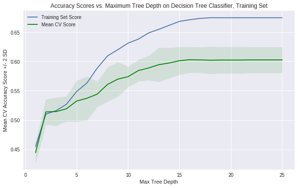
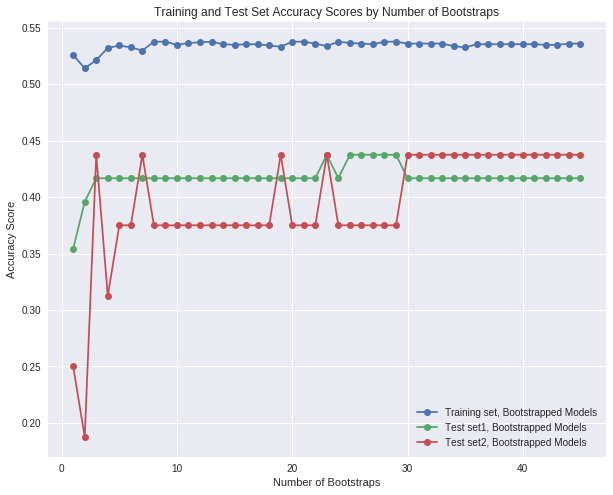
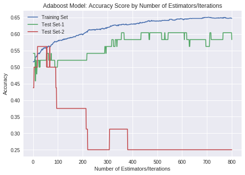
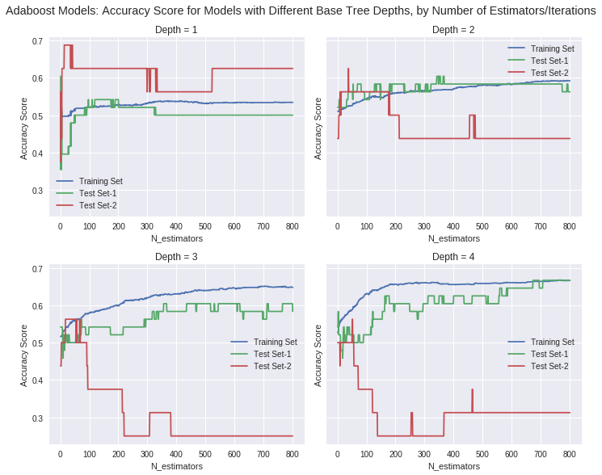
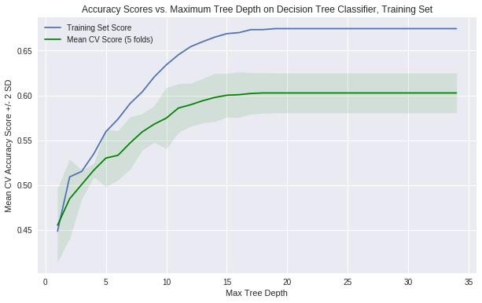
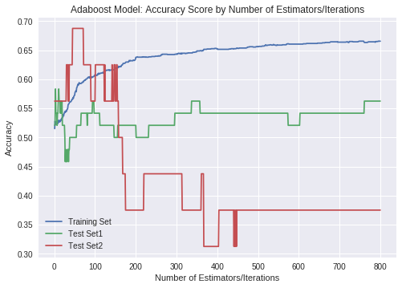
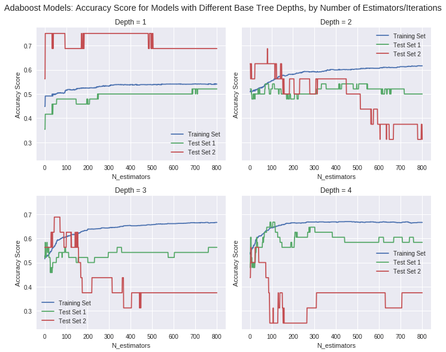

In this section, we display the results of FIFA Ranking and non FIFA Ranking based models and we look for the best Hyper parameters for each model tried.
The models to be tried on each features are:

- Multinomial logistic Regression
- kNN
- Decision Tree
- Linear Discriminant Analysis / Quadratic Linear Discriminant Analysis
- Random Forest
- Neural Network

# FIFA Ranking based Models

As Stated in our project statement, we will first try to find the best model based on the FIFA Ranking before the begining of the World Cup 2018


## Model Selection

<h3 style=“color:red>1) Logisitic regression - FIFA Ranking Based Model</h3>
Our First model is built using multinomial Logistic Regression on the three classes in the y_train.
We will use the training accuracy score of this model as our baseline for all the other models.

#### Training Set

```
Confusion matrix of logisitic regression:
```

<div>
  <style scoped="">
    .dataframe tbody tr th:only-of-type {
        vertical-align: middle;
    }

    .dataframe tbody tr th {
        vertical-align: top;
    }

    .dataframe thead th {
        text-align: right;
    }
</style>
  <table border="1" class="dataframe">
  <thead><tr style="text-align: right;"><th></th><th>Actual Draw</th><th>Actual Team 1</th><th>Actual Team 2</th></tr></thead>
  <tbody><tr><th>Predicted Draw</th><td>52</td><td>32</td><td>48</td></tr><tr><th>Predicted Team 1</th><td>612</td><td>1346</td><td>460</td></tr><tr><th>Predicted Team 2</th><td>322</td><td>220</td><td>472</td></tr></tbody>
</table>
</div>

Accuracy score or the model logistic regression multinomial model is: 52.47%

#### Test Set (Word Cup 2018 Group Phase games)

<div>
  <style scoped="">
    .dataframe tbody tr th:only-of-type {
        vertical-align: middle;
    }

    .dataframe tbody tr th {
        vertical-align: top;
    }

    .dataframe thead th {
        text-align: right;
    }
</style>
  <table border="1" class="dataframe">
  <thead><tr style="text-align: right;"><th></th><th>Observed</th><th>Predicted</th></tr></thead>
  <tbody><tr><th>0</th><td>Russia</td><td>Russia</td></tr><tr><th>1</th><td>Uruguay</td><td>Uruguay</td></tr><tr><th>2</th><td>Iran</td><td>Morocco</td></tr><tr><th>3</th><td>Draw</td><td>Portugal</td></tr><tr><th>4</th><td>France</td><td>France</td></tr></tbody>
</table>
</div>

```
Confusion matrix of logisitic regression of the baseline model on the first test set'
```

<div>
  <style scoped="">
    .dataframe tbody tr th:only-of-type {
        vertical-align: middle;
    }

    .dataframe tbody tr th {
        vertical-align: top;
    }

    .dataframe thead th {
        text-align: right;
    }
</style>
  <table border="1" class="dataframe">
  <thead><tr style="text-align: right;"><th></th><th>Actual Draw</th><th>Actual Team 1</th><th>Actual Team 2</th></tr></thead>
  <tbody><tr><th>Predicted Draw</th><td>0</td><td>0</td><td>2</td></tr><tr><th>Predicted Team 1</th><td>7</td><td>16</td><td>11</td></tr><tr><th>Predicted Team 2</th><td>2</td><td>1</td><td>9</td></tr></tbody>
</table>
</div>

```
The accuracy score of the multinomial logistic regression model on the Group Phase Game is: 52.08%


Confusion matrix of logistic regression of the baseline model of the second test set'
```

<div>
  <style scoped="">
    .dataframe tbody tr th:only-of-type {
        vertical-align: middle;
    }

    .dataframe tbody tr th {
        vertical-align: top;
    }

    .dataframe thead th {
        text-align: right;
    }
</style>
  <table border="1" class="dataframe">
  <thead><tr style="text-align: right;"><th></th><th>Actual Team 1</th><th>Actual Team 2</th></tr></thead>
  <tbody><tr><th>Predicted Team 1</th><td>7</td><td>4</td></tr><tr><th>Predicted Team 2</th><td>2</td><td>3</td></tr></tbody>
</table>
</div>

```
The accuracy score of the multinomial logistic regression on Knockout games is: 62.5%
```

### 2) KNN - FIFA Ranking Based Model

Our second model was built on the k-Nearest Neighbors algorithm. To determine the optimal k for the training set, we used cross_val_score to evaluate different values of k on repeated subsamples of our training set
The Best K for this model was  5.


#### Training set

Using the value k=5 we are now able to build the best kNN model

```
Confusion matrix of the KNN model of the train set on the baseline model'
```

<div>
  <style scoped="">
    .dataframe tbody tr th:only-of-type {
        vertical-align: middle;
    }

    .dataframe tbody tr th {
        vertical-align: top;
    }

    .dataframe thead th {
        text-align: right;
    }
</style>
  <table border="1" class="dataframe">
  <thead><tr style="text-align: right;"><th></th><th>Actual Draw</th><th>Actual Team 1</th><th>Actual Team 2</th></tr></thead>
  <tbody><tr><th>Predicted Draw</th><td>546</td><td>288</td><td>242</td></tr><tr><th>Predicted Team 1</th><td>330</td><td>1202</td><td>260</td></tr><tr><th>Predicted Team 2</th><td>110</td><td>108</td><td>478</td></tr></tbody>
</table>
</div>

```
The accuracy score of the KNN model on the train set on the baseline model: 62.45%
The accuracy score of the KNN model on Cross Validation on the baseline model: 55.19%
```

#### World Cup 2018 - Group Phase games

<div>
  <style scoped="">
    .dataframe tbody tr th:only-of-type {
        vertical-align: middle;
    }

    .dataframe tbody tr th {
        vertical-align: top;
    }

    .dataframe thead th {
        text-align: right;
    }
</style>
  <table border="1" class="dataframe">
  <thead><tr style="text-align: right;"><th></th><th>Observed</th><th>Predicted</th></tr></thead>
  <tbody><tr><th>0</th><td>Russia</td><td>Russia</td></tr><tr><th>1</th><td>Uruguay</td><td>Uruguay</td></tr><tr><th>2</th><td>Iran</td><td>Morocco</td></tr><tr><th>3</th><td>Draw</td><td>Portugal</td></tr><tr><th>4</th><td>France</td><td>France</td></tr></tbody>
</table>
</div>

```
Confusion matrix of KNN of the baseline model on the Group Phase games:
```

<div>
  <style scoped="">
    .dataframe tbody tr th:only-of-type {
        vertical-align: middle;
    }

    .dataframe tbody tr th {
        vertical-align: top;
    }

    .dataframe thead th {
        text-align: right;
    }
</style>
  <table border="1" class="dataframe">
  <thead><tr style="text-align: right;"><th></th><th>Actual Draw</th><th>Actual Team 1</th><th>Actual Team 2</th></tr></thead>
  <tbody><tr><th>Predicted Draw</th><td>3</td><td>1</td><td>7</td></tr><tr><th>Predicted Team 1</th><td>4</td><td>14</td><td>8</td></tr><tr><th>Predicted Team 2</th><td>2</td><td>2</td><td>7</td></tr></tbody>
</table>
</div>

```
The accuracy score of the baseline model with KNN on the Group Phase is: 50%
```

#### World Cup 2018 - Knockout Games

```
The Confusion matrix of KNN of the baseline model on the second test set:
```

<div>
  <style scoped="">
    .dataframe tbody tr th:only-of-type {
        vertical-align: middle;
    }

    .dataframe tbody tr th {
        vertical-align: top;
    }

    .dataframe thead th {
        text-align: right;
    }
</style>
  <table border="1" class="dataframe">
  <thead><tr style="text-align: right;"><th></th><th>Actual Team 1</th><th>Actual Team 2</th></tr></thead>
  <tbody><tr><th>Predicted Team 1</th><td>2</td><td>2</td></tr><tr><th>Predicted Team 2</th><td>7</td><td>5</td></tr></tbody>
</table>
</div>

```
The accuracy score of the baseline model with KNN on Knockout Games WC2018 is: 43.75%
```

### 3) Decision tree - FIFA Ranking Based Model

Based on the plot below, we pick 16 as our maximum depth for both our decision Tree and Random Forest Models.



Best depth is 16

### 4) Linear Discriminant Analysis (LDA)- FIFA Ranking Based Model

####      Training Data Set

```
The Confusion matrix of the train set of LDA on the baseline model
```

<div>
  <style scoped="">
    .dataframe tbody tr th:only-of-type {
        vertical-align: middle;
    }

    .dataframe tbody tr th {
        vertical-align: top;
    }

    .dataframe thead th {
        text-align: right;
    }
</style>
  <table border="1" class="dataframe">
  <thead><tr style="text-align: right;"><th></th><th>Actual Draw</th><th>Actual Team 1</th><th>Actual Team 2</th></tr></thead>
  <tbody><tr><th>Predicted Draw</th><td>64</td><td>40</td><td>58</td></tr><tr><th>Predicted Team 1</th><td>600</td><td>1326</td><td>440</td></tr><tr><th>Predicted Team 2</th><td>322</td><td>232</td><td>482</td></tr></tbody>
</table>
</div>

```
The accuracy score of LDA on baseline model: 52.52%
The accuracy score of LDA on baseline model Cross Validation: 52.47%
```

####      World Cup 2018 - Group Phase games

```
The confusion matrix of the LDA model of the test set 1 on the baseline model
```

<div>
  <style scoped="">
    .dataframe tbody tr th:only-of-type {
        vertical-align: middle;
    }

    .dataframe tbody tr th {
        vertical-align: top;
    }

    .dataframe thead th {
        text-align: right;
    }
</style>
  <table border="1" class="dataframe">
  <thead><tr style="text-align: right;"><th></th><th>Actual Draw</th><th>Actual Team 1</th><th>Actual Team 2</th></tr></thead>
  <tbody><tr><th>Predicted Draw</th><td>4</td><td>2</td><td>0</td></tr><tr><th>Predicted Team 1</th><td>1</td><td>14</td><td>2</td></tr><tr><th>Predicted Team 2</th><td>4</td><td>1</td><td>20</td></tr></tbody>
</table>
</div>

```
The accuracy score of the LDA model: 50%
```

####      World Cup 2018 - Knockout Games

```
The accuracy score of LDA on baseline model of the second test set 1: 68.75%

```

### 5) Quadratic Discriminant Analysis (QDA)

####      Training Data Set

```
Confusion matrix of QDA on baseline model train set
```

<div>
  <style scoped="">
    .dataframe tbody tr th:only-of-type {
        vertical-align: middle;
    }

    .dataframe tbody tr th {
        vertical-align: top;
    }

    .dataframe thead th {
        text-align: right;
    }
</style>
  <table border="1" class="dataframe">
  <thead><tr style="text-align: right;"><th></th><th>Actual Draw</th><th>Actual Team 1</th><th>Actual Team 2</th></tr></thead>
  <tbody><tr><th>Predicted Draw</th><td>240</td><td>182</td><td>186</td></tr><tr><th>Predicted Team 1</th><td>482</td><td>1198</td><td>344</td></tr><tr><th>Predicted Team 2</th><td>264</td><td>218</td><td>450</td></tr></tbody>
</table>
</div>

```
The accuracy score of QDA on baseline model train set: 52.97%
The accuracy score of QDA on baseline model cross validation: 51.08%
```

####      World Cup 2018 - Group Phase games

```
The Confusion matrix of the QDA model
```

<div>
  <style scoped="">
    .dataframe tbody tr th:only-of-type {
        vertical-align: middle;
    }

    .dataframe tbody tr th {
        vertical-align: top;
    }

    .dataframe thead th {
        text-align: right;
    }
</style>
  <table border="1" class="dataframe">
  <thead><tr style="text-align: right;"><th></th><th>Actual Draw</th><th>Actual Team 1</th><th>Actual Team 2</th></tr></thead>
  <tbody><tr><th>Predicted Draw</th><td>1</td><td>2</td><td>7</td></tr><tr><th>Predicted Team 1</th><td>5</td><td>13</td><td>8</td></tr><tr><th>Predicted Team 2</th><td>3</td><td>2</td><td>7</td></tr></tbody>
</table>
</div>

```
The accuracy score of the QDA model: 43.75%
```

####      World Cup 2018 - Knockout Games

```
The accuracy score of QDA on baseline model second test: 45.833%
```

### 6) Ensemble methods

In this section we try different types of Ensembles methods:

- Random Forest
- Bagging
- Boosting

#### Random Forest- baseline model

##### train set

```
The accuracy score for the Random Forest model: 67.28%
```

#####      World Cup 2018 - Group Phase games

```
The accuracy score for the Random Forest test1 on baseline model: 66.67%
```

#####      World Cup 2018 - Knockout Games

```
The accuracy score for the Random Forest test2 on baseline model: 18.75%
```

#### Bagging


```
bagging model, training set accuracy: 53.6%
bagging model, Group Phase games accuracy: 41.67%
bagging model, Knockout Games  accuracy: 43.75%
```



#### Boosting





```
Depth = 1: best test set 1 accuracy at 1 estimators.
train set accuracy score: 0.6041666666666666

Depth = 2: best test set 1 accuracy at 342 estimators.
train set accuracy score: 0.6041666666666666

Depth = 3: best test set 1 accuracy at 356 estimators.
train set accuracy score: 0.6041666666666666

Depth = 4: best test set 1 accuracy at 673 estimators.
train set accuracy score: 0.6666666666666666

Depth = 1: best test set 2 accuracy at 14 estimators.
train set accuracy score: 0.6875

Depth = 2: best test set 2 accuracy at 38 estimators.
train set accuracy score: 0.625

Depth = 3: best test set 2 accuracy at 18 estimators.
train set accuracy score: 0.5625

Depth = 4: best test set 2 accuracy at 51 estimators.
train set accuracy score: 0.5625
```

#### Neural Network

##### Training Data Set

```
_________________________________________________________________
Layer (type)                 Output Shape              Param #   
=================================================================
dense_30 (Dense)             (None, 200)               2600      
_________________________________________________________________
dense_31 (Dense)             (None, 3)                 603       
=================================================================
Total params: 3,203
Trainable params: 3,203
Non-trainable params: 0
_________________________________________________________________


```

##### regularized neural network train set

```
Model 2
the loss of this model is: 0.2612320419012095
the accuracy of this model is: 0.6470258137593767
```

##### World Cup 2018 - Group Phase games

```
The accuracy score of Group games of this neural net is: 0.4583333333333333
```

##### World Cup 2018 - Knockout Games

```
The accuracy score of Knockout of this neural net is: 0.625
```

## Model comparison

In this Section we apply 5-fold Cross Validation to all the models designed above in order to fund which ones has the best Training and Validation Accuracy

```
Mean CV Accuracy Score by Model:
```

<div>
  <style scoped="">
    .dataframe tbody tr th:only-of-type {
        vertical-align: middle;
    }

    .dataframe tbody tr th {
        vertical-align: top;
    }

    .dataframe thead th {
        text-align: right;
    }
</style>
  <table border="1" class="dataframe">
  <thead><tr style="text-align: right;"><th></th><th>Model</th><th>CV_Accuracy</th></tr></thead>
  <tbody><tr><th>1</th><td>Random Forest</td><td>0.6016</td></tr><tr><th>2</th><td>Decision Tree</td><td>0.5864</td></tr><tr><th>3</th><td>KNN</td><td>0.5404</td></tr><tr><th>4</th><td>LDA</td><td>0.5205</td></tr><tr><th>5</th><td>QDA</td><td>0.5126</td></tr><tr><th>6</th><td>Logistic Regression</td><td>0.4950</td></tr></tbody>
</table>
</div>

# Second Model built with non FIFA - Ranking Features

##  Model Selection

### 1) Logistic regression- Second model

#### Training Data Set

```
Confusion matrix of logisitic regression of our model'
```

<div>
  <style scoped="">
    .dataframe tbody tr th:only-of-type {
        vertical-align: middle;
    }

    .dataframe tbody tr th {
        vertical-align: top;
    }

    .dataframe thead th {
        text-align: right;
    }
</style>
  <table border="1" class="dataframe">
  <thead><tr style="text-align: right;"><th></th><th>Actual Draw</th><th>Actual Team 1</th><th>Actual Team 2</th></tr></thead>
  <tbody><tr><th>Predicted Draw</th><td>188</td><td>106</td><td>124</td></tr><tr><th>Predicted Team 1</th><td>532</td><td>1306</td><td>372</td></tr><tr><th>Predicted Team 2</th><td>266</td><td>186</td><td>484</td></tr></tbody>
</table>
</div>

```
The accuracy score or the model logistic regression multinomial model is: 55.94%
```

#### World Cup 2018 - Group Phase games

<div>
  <style scoped="">
    .dataframe tbody tr th:only-of-type {
        vertical-align: middle;
    }

    .dataframe tbody tr th {
        vertical-align: top;
    }

    .dataframe thead th {
        text-align: right;
    }
</style>
  <table border="1" class="dataframe">
  <thead><tr style="text-align: right;"><th></th><th>Observed</th><th>Predicted</th></tr></thead>
  <tbody><tr><th>0</th><td>Russia</td><td>Russia</td></tr><tr><th>1</th><td>Uruguay</td><td>Uruguay</td></tr><tr><th>2</th><td>Iran</td><td>Draw</td></tr><tr><th>3</th><td>Draw</td><td>Draw</td></tr><tr><th>4</th><td>France</td><td>France</td></tr></tbody>
</table>
</div>

```
The Confusion matrix of logisitic regression of our model'
```

<div>
  <style scoped="">
    .dataframe tbody tr th:only-of-type {
        vertical-align: middle;
    }

    .dataframe tbody tr th {
        vertical-align: top;
    }

    .dataframe thead th {
        text-align: right;
    }
</style>
  <table border="1" class="dataframe">
  <thead><tr style="text-align: right;"><th></th><th>Actual Draw</th><th>Actual Team 1</th><th>Actual Team 2</th></tr></thead>
  <tbody><tr><th>Predicted Draw</th><td>2</td><td>0</td><td>5</td></tr><tr><th>Predicted Team 1</th><td>6</td><td>16</td><td>9</td></tr><tr><th>Predicted Team 2</th><td>1</td><td>1</td><td>8</td></tr></tbody>
</table>
</div>

```
The accuracy score of the model logistic regression multinomial model on test set of our model is: 54.17%
```

### 2) KNN model- Second model

####      Training Data Set

```
Confusion matrix of the KNN model of our model'
```

<div>
  <style scoped="">
    .dataframe tbody tr th:only-of-type {
        vertical-align: middle;
    }

    .dataframe tbody tr th {
        vertical-align: top;
    }

    .dataframe thead th {
        text-align: right;
    }
</style>
  <table border="1" class="dataframe">
  <thead><tr style="text-align: right;"><th></th><th>Actual Draw</th><th>Actual Team 1</th><th>Actual Team 2</th></tr></thead>
  <tbody><tr><th>Predicted Draw</th><td>560</td><td>296</td><td>254</td></tr><tr><th>Predicted Team 1</th><td>294</td><td>1178</td><td>270</td></tr><tr><th>Predicted Team 2</th><td>132</td><td>124</td><td>456</td></tr></tbody>
</table>
</div>

```
The accuracy score of the knn model training set: 61.56%
```

####      World Cup 2018 - Group Phase games

<div>
  <style scoped="">
    .dataframe tbody tr th:only-of-type {
        vertical-align: middle;
    }

    .dataframe tbody tr th {
        vertical-align: top;
    }

    .dataframe thead th {
        text-align: right;
    }
</style>
  <table border="1" class="dataframe">
  <thead><tr style="text-align: right;"><th></th><th>Observed</th><th>Predicted</th></tr></thead>
  <tbody><tr><th>0</th><td>Russia</td><td>Russia</td></tr><tr><th>1</th><td>Uruguay</td><td>Uruguay</td></tr><tr><th>2</th><td>Iran</td><td>Iran</td></tr><tr><th>3</th><td>Draw</td><td>Draw</td></tr><tr><th>4</th><td>France</td><td>France</td></tr></tbody>
</table>
</div>

```
Confusion matrix of KNN of our model'
```

<div>
  <style scoped="">
    .dataframe tbody tr th:only-of-type {
        vertical-align: middle;
    }

    .dataframe tbody tr th {
        vertical-align: top;
    }

    .dataframe thead th {
        text-align: right;
    }
</style>
  <table border="1" class="dataframe">
  <thead><tr style="text-align: right;"><th></th><th>Actual Draw</th><th>Actual Team 1</th><th>Actual Team 2</th></tr></thead>
  <tbody><tr><th>Predicted Draw</th><td>4</td><td>4</td><td>8</td></tr><tr><th>Predicted Team 1</th><td>3</td><td>12</td><td>5</td></tr><tr><th>Predicted Team 2</th><td>2</td><td>1</td><td>9</td></tr></tbody>
</table>
</div>

```
The accuracy score or the model KNN model on test set is: 52.08%
```

####      World Cup 2018 - Knockout Phase games

<div>
  <style scoped="">
    .dataframe tbody tr th:only-of-type {
        vertical-align: middle;
    }

    .dataframe tbody tr th {
        vertical-align: top;
    }

    .dataframe thead th {
        text-align: right;
    }
</style>
  <table border="1" class="dataframe">
  <thead><tr style="text-align: right;"><th></th><th>Observed</th><th>Predicted</th></tr></thead>
  <tbody><tr><th>0</th><td>France</td><td>Draw</td></tr><tr><th>1</th><td>Uruguay</td><td>Draw</td></tr><tr><th>2</th><td>Russia</td><td>Draw</td></tr><tr><th>3</th><td>Croatia</td><td>Denmark</td></tr><tr><th>4</th><td>Brazil</td><td>Brazil</td></tr></tbody>
</table>
</div>

```
The Confusion matrix of KNN of our model'
```

<div>
  <style scoped="">
    .dataframe tbody tr th:only-of-type {
        vertical-align: middle;
    }

    .dataframe tbody tr th {
        vertical-align: top;
    }

    .dataframe thead th {
        text-align: right;
    }
</style>
  <table border="1" class="dataframe">
  <thead><tr style="text-align: right;"><th></th><th>Actual Team 1</th><th>Actual Team 2</th></tr></thead>
  <tbody><tr><th>Predicted Team 1</th><td>3</td><td>3</td></tr><tr><th>Predicted Team 2</th><td>6</td><td>4</td></tr></tbody>
</table>
</div>

```
The accuracy score or the model KNN model on test set is: 0.25
```

### 3) Decision Tree - Second Model

#### Data Training Set



Best depth: 18

#### World Cup 2018 - Group Phase games

<div>
  <style scoped="">
    .dataframe tbody tr th:only-of-type {
        vertical-align: middle;
    }

    .dataframe tbody tr th {
        vertical-align: top;
    }

    .dataframe thead th {
        text-align: right;
    }
</style>
  <table border="1" class="dataframe">
  <thead><tr style="text-align: right;"><th></th><th>Observed</th><th>Predicted</th></tr></thead>
  <tbody><tr><th>0</th><td>Russia</td><td>Russia</td></tr><tr><th>1</th><td>Uruguay</td><td>Uruguay</td></tr><tr><th>2</th><td>Iran</td><td>Iran</td></tr><tr><th>3</th><td>Draw</td><td>Draw</td></tr><tr><th>4</th><td>France</td><td>France</td></tr></tbody>
</table>
</div>

```
The Confusion matrix of Tree of our own model'
```

<div>
  <style scoped="">
    .dataframe tbody tr th:only-of-type {
        vertical-align: middle;
    }

    .dataframe tbody tr th {
        vertical-align: top;
    }

    .dataframe thead th {
        text-align: right;
    }
</style>
  <table border="1" class="dataframe">
  <thead><tr style="text-align: right;"><th></th><th>Actual Draw</th><th>Actual Team 1</th><th>Actual Team 2</th></tr></thead>
  <tbody><tr><th>Predicted Draw</th><td>5</td><td>3</td><td>7</td></tr><tr><th>Predicted Team 1</th><td>2</td><td>13</td><td>4</td></tr><tr><th>Predicted Team 2</th><td>2</td><td>1</td><td>11</td></tr></tbody>
</table>
</div>

```
The accuracy score for our own model with Decision Tree on test set is: 60.4%
```

#### World Cup 2018 - Group Phase games

<div>
  <style scoped="">
    .dataframe tbody tr th:only-of-type {
        vertical-align: middle;
    }

    .dataframe tbody tr th {
        vertical-align: top;
    }

    .dataframe thead th {
        text-align: right;
    }
</style>
  <table border="1" class="dataframe">
  <thead><tr style="text-align: right;"><th></th><th>Observed</th><th>Predicted</th></tr></thead>
  <tbody><tr><th>0</th><td>France</td><td>Argentina</td></tr><tr><th>1</th><td>Uruguay</td><td>Draw</td></tr><tr><th>2</th><td>Russia</td><td>Spain</td></tr><tr><th>3</th><td>Croatia</td><td>Draw</td></tr><tr><th>4</th><td>Brazil</td><td>Brazil</td></tr></tbody>
</table>
</div>

```
Confusion matrix of Tree of our own model'
```

<div>
  <style scoped="">
    .dataframe tbody tr th:only-of-type {
        vertical-align: middle;
    }

    .dataframe tbody tr th {
        vertical-align: top;
    }

    .dataframe thead th {
        text-align: right;
    }
</style>
  <table border="1" class="dataframe">
  <thead><tr style="text-align: right;"><th></th><th>Actual Team 1</th><th>Actual Team 2</th></tr></thead>
  <tbody><tr><th>Predicted Team 1</th><td>3</td><td>4</td></tr><tr><th>Predicted Team 2</th><td>6</td><td>3</td></tr></tbody>
</table>
</div>

```
The Accuracy score for our own model with Decision Tree on test set is: 25%
```

### 4) LDA-Our model

#### Training Data Set

<div>
  <style scoped="">
    .dataframe tbody tr th:only-of-type {
        vertical-align: middle;
    }

    .dataframe tbody tr th {
        vertical-align: top;
    }

    .dataframe thead th {
        text-align: right;
    }
</style>
  <table border="1" class="dataframe">
  <thead><tr style="text-align: right;"><th></th><th>Observed</th><th>Predicted</th></tr></thead>
  <tbody><tr><th>0</th><td>Mexico</td><td>Argentina</td></tr><tr><th>1</th><td>Draw</td><td>Nigeria</td></tr><tr><th>2</th><td>Uruguay</td><td>Colombia</td></tr><tr><th>3</th><td>Poland</td><td>Draw</td></tr><tr><th>4</th><td>Uruguay</td><td>Uruguay</td></tr></tbody>
</table>
</div>

```
Confusion matrix of Tree of our own model'
```

<div>
  <style scoped="">
    .dataframe tbody tr th:only-of-type {
        vertical-align: middle;
    }

    .dataframe tbody tr th {
        vertical-align: top;
    }

    .dataframe thead th {
        text-align: right;
    }
</style>
  <table border="1" class="dataframe">
  <thead><tr style="text-align: right;"><th></th><th>Actual Draw</th><th>Actual Team 1</th><th>Actual Team 2</th></tr></thead>
  <tbody><tr><th>Predicted Draw</th><td>240</td><td>146</td><td>158</td></tr><tr><th>Predicted Team 1</th><td>484</td><td>1264</td><td>342</td></tr><tr><th>Predicted Team 2</th><td>262</td><td>188</td><td>480</td></tr></tbody>
</table>
</div>

```
The accuracy score for our own model with LDA  on train is: 0.5566778900112234
```

#### World Cup 2018 - Group Phase games

<div>
  <style scoped="">
    .dataframe tbody tr th:only-of-type {
        vertical-align: middle;
    }

    .dataframe tbody tr th {
        vertical-align: top;
    }

    .dataframe thead th {
        text-align: right;
    }
</style>
  <table border="1" class="dataframe">
  <thead><tr style="text-align: right;"><th></th><th>Observed</th><th>Predicted</th></tr></thead>
  <tbody><tr><th>0</th><td>Russia</td><td>Russia</td></tr><tr><th>1</th><td>Uruguay</td><td>Uruguay</td></tr><tr><th>2</th><td>Iran</td><td>Draw</td></tr><tr><th>3</th><td>Draw</td><td>Draw</td></tr><tr><th>4</th><td>France</td><td>France</td></tr></tbody>
</table>
</div>

```
The Confusion matrix of Lda of our own model on test 1'
```

<div>
  <style scoped="">
    .dataframe tbody tr th:only-of-type {
        vertical-align: middle;
    }

    .dataframe tbody tr th {
        vertical-align: top;
    }

    .dataframe thead th {
        text-align: right;
    }
</style>
  <table border="1" class="dataframe">
  <thead><tr style="text-align: right;"><th></th><th>Actual Draw</th><th>Actual Team 1</th><th>Actual Team 2</th></tr></thead>
  <tbody><tr><th>Predicted Draw</th><td>2</td><td>0</td><td>9</td></tr><tr><th>Predicted Team 1</th><td>6</td><td>16</td><td>8</td></tr><tr><th>Predicted Team 2</th><td>1</td><td>1</td><td>5</td></tr></tbody>
</table>
</div>

```
The accuracy score for our own model with LDA  on test set 1 is: 47.92%
```

<div>
  <style scoped="">
    .dataframe tbody tr th:only-of-type {
        vertical-align: middle;
    }

    .dataframe tbody tr th {
        vertical-align: top;
    }

    .dataframe thead th {
        text-align: right;
    }
</style>
  <table border="1" class="dataframe">
  <thead><tr style="text-align: right;"><th></th><th>Observed</th><th>Predicted</th></tr></thead>
  <tbody><tr><th>0</th><td>France</td><td>France</td></tr><tr><th>1</th><td>Uruguay</td><td>Draw</td></tr><tr><th>2</th><td>Russia</td><td>Spain</td></tr><tr><th>3</th><td>Croatia</td><td>Denmark</td></tr><tr><th>4</th><td>Brazil</td><td>Brazil</td></tr></tbody>
</table>
</div>

```
The Confusion matrix of Tree of our own model'
```

<div>
  <style scoped="">
    .dataframe tbody tr th:only-of-type {
        vertical-align: middle;
    }

    .dataframe tbody tr th {
        vertical-align: top;
    }

    .dataframe thead th {
        text-align: right;
    }
</style>
  <table border="1" class="dataframe">
  <thead><tr style="text-align: right;"><th></th><th>Actual Draw</th><th>Actual Team 1</th><th>Actual Team 2</th></tr></thead>
  <tbody><tr><th>Predicted Draw</th><td>0</td><td>2</td><td>2</td></tr><tr><th>Predicted Team 1</th><td>0</td><td>5</td><td>3</td></tr><tr><th>Predicted Team 2</th><td>0</td><td>2</td><td>2</td></tr></tbody>
</table>
</div>

```
The accuracy score for our own model with LDA  on test set 2 is: 43.75%
```

### 5) QDA

#### Train Set

<div>
  <style scoped="">
    .dataframe tbody tr th:only-of-type {
        vertical-align: middle;
    }

    .dataframe tbody tr th {
        vertical-align: top;
    }

    .dataframe thead th {
        text-align: right;
    }
</style>
  <table border="1" class="dataframe">
  <thead><tr style="text-align: right;"><th></th><th>Observed</th><th>Predicted</th></tr></thead>
  <tbody><tr><th>0</th><td>Mexico</td><td>Draw</td></tr><tr><th>1</th><td>Draw</td><td>Senegal</td></tr><tr><th>2</th><td>Uruguay</td><td>Uruguay</td></tr><tr><th>3</th><td>Poland</td><td>Poland</td></tr><tr><th>4</th><td>Uruguay</td><td>Uruguay</td></tr></tbody>
</table>
</div>

```
Confusion matrix of Tree of our own model'
```

<div>
  <style scoped="">
    .dataframe tbody tr th:only-of-type {
        vertical-align: middle;
    }

    .dataframe tbody tr th {
        vertical-align: top;
    }

    .dataframe thead th {
        text-align: right;
    }
</style>
  <table border="1" class="dataframe">
  <thead><tr style="text-align: right;"><th></th><th>Actual Draw</th><th>Actual Team 1</th><th>Actual Team 2</th></tr></thead>
  <tbody><tr><th>Predicted Draw</th><td>166</td><td>216</td><td>110</td></tr><tr><th>Predicted Team 1</th><td>314</td><td>718</td><td>214</td></tr><tr><th>Predicted Team 2</th><td>506</td><td>664</td><td>656</td></tr></tbody>
</table>
</div>

```
The accuracy score for our own model with QDA  on train is: 43.21%
```

#### Group phase - test1

<div>
  <style scoped="">
    .dataframe tbody tr th:only-of-type {
        vertical-align: middle;
    }

    .dataframe tbody tr th {
        vertical-align: top;
    }

    .dataframe thead th {
        text-align: right;
    }
</style>
  <table border="1" class="dataframe">
  <thead><tr style="text-align: right;"><th></th><th>Observed</th><th>Predicted</th></tr></thead>
  <tbody><tr><th>0</th><td>Russia</td><td>Russia</td></tr><tr><th>1</th><td>Uruguay</td><td>Uruguay</td></tr><tr><th>2</th><td>Iran</td><td>Iran</td></tr><tr><th>3</th><td>Draw</td><td>Portugal</td></tr><tr><th>4</th><td>France</td><td>Australia</td></tr></tbody>
</table>
</div>

```
Confusion matrix of Tree of our own model'
```

<div>
  <style scoped="">
    .dataframe tbody tr th:only-of-type {
        vertical-align: middle;
    }

    .dataframe tbody tr th {
        vertical-align: top;
    }

    .dataframe thead th {
        text-align: right;
    }
</style>
  <table border="1" class="dataframe">
  <thead><tr style="text-align: right;"><th></th><th>Actual Draw</th><th>Actual Team 1</th><th>Actual Team 2</th></tr></thead>
  <tbody><tr><th>Predicted Draw</th><td>5</td><td>3</td><td>7</td></tr><tr><th>Predicted Team 1</th><td>2</td><td>13</td><td>4</td></tr><tr><th>Predicted Team 2</th><td>2</td><td>1</td><td>11</td></tr></tbody>
</table>
</div>

```
accuracy score for our own model with qda  on test set 1 is: 0.4583333333333333
```

#### Group phase - test2

<div>
  <style scoped="">
    .dataframe tbody tr th:only-of-type {
        vertical-align: middle;
    }

    .dataframe tbody tr th {
        vertical-align: top;
    }

    .dataframe thead th {
        text-align: right;
    }
</style>
  <table border="1" class="dataframe">
  <thead><tr style="text-align: right;"><th></th><th>Observed</th><th>Predicted</th></tr></thead>
  <tbody><tr><th>0</th><td>France</td><td>France</td></tr><tr><th>1</th><td>Uruguay</td><td>Draw</td></tr><tr><th>2</th><td>Russia</td><td>Russia</td></tr><tr><th>3</th><td>Croatia</td><td>Denmark</td></tr><tr><th>4</th><td>Brazil</td><td>Brazil</td></tr></tbody>
</table>
</div>

### 6) Random FOREST - Second Model

#### Training Data set

```
The accuracy score for the random forest model: 67.4%
```

####  World Cup 2018 - Group Phase games

```
The accuracy score for the random forest Test 1 model: 52.08%


The accuracy score for the random forest Test 2 model: 0.1875
```

### 7) Bagging - Second Model


```
bagging model, training set accuracy: 0.5359147025813692
bagging model, test-1 set accuracy: 0.4375
bagging model, test-2 set accuracy: 0.4375
```

### 8) Boosting-Second model





```
Depth = 1: best train set accuracy at 766 estimators.
train set accuracy score: 0.5420875420875421

Depth = 2: best train set accuracy at 782 estimators.
train set accuracy score: 0.6167227833894501

Depth = 3: best train set accuracy at 748 estimators.
train set accuracy score: 0.6655443322109988

Depth = 4: best train set accuracy at 440 estimators.
train set accuracy score: 0.6689113355780022


Depth = 1: best test set 1 accuracy at 1 estimators.
train set accuracy score: 0.6041666666666666

Depth = 2: best test set 1 accuracy at 342 estimators.
train set accuracy score: 0.6041666666666666

Depth = 3: best test set 1 accuracy at 356 estimators.
train set accuracy score: 0.6041666666666666

Depth = 4: best test set 1 accuracy at 673 estimators.
train set accuracy score: 0.6666666666666666


Depth = 1: best test set 2 accuracy at 766 estimators.
train set accuracy score: 0.5420875420875421

Depth = 2: best test set 2 set accuracy at 782 estimators.
train set accuracy score: 0.6167227833894501

Depth = 3: best test set 2 accuracy at 748 estimators.
train set accuracy score: 0.6655443322109988

Depth = 4: best test set 2 accuracy at 440 estimators.
train set accuracy score: 0.6689113355780022
```

### 9) Neural Networks - Second Model

#### Training Data Set

```
_________________________________________________________________
Layer (type)                 Output Shape              Param #   
=================================================================
dense_35 (Dense)             (None, 200)               27800     
_________________________________________________________________
dropout_19 (Dropout)         (None, 200)               0         
_________________________________________________________________
dense_36 (Dense)             (None, 3)                 603       
=================================================================
Total params: 28,403
Trainable params: 28,403
Non-trainable params: 0
_________________________________________________________________
```

the training set accuracy score is: 0.6341189675191972

#### World Cup 2018 - Group Phase games

test set 1 accuracy score is: 0.4583333333333333

#### World Cup 2018 -knockout phase

test set 2 accuracy score is: 0.4375

## Model Comparison on Accuracies - Second Models

In this section:

- We compared the Training and Validation Accuracies of all the models tried in both with FIFA Ranking and non-FIFA Rankings

```
Mean 5-Fold CV Accuracy Score by Model:
```

<div>
  <style scoped="">
    .dataframe tbody tr th:only-of-type {
        vertical-align: middle;
    }

    .dataframe tbody tr th {
        vertical-align: top;
    }

    .dataframe thead th {
        text-align: right;
    }
</style>
  <table border="1" class="dataframe">
  <thead><tr style="text-align: right;"><th></th><th>Model</th><th>CV_Accuracy</th></tr></thead>
  <tbody><tr><th>1</th><td>Random Forest</td><td>0.597928</td></tr><tr><th>2</th><td>Decision Tree</td><td>0.589507</td></tr><tr><th>3</th><td>Bagging</td><td>0.536476</td></tr><tr><th>4</th><td>Logistic Regression</td><td>0.532831</td></tr><tr><th>5</th><td>KNN</td><td>0.531141</td></tr><tr><th>6</th><td>qda</td><td>0.440778</td></tr></tbody>
</table>
</div>


## Overall Comparison between the Baseline Model and Our Model


<table class="tg">
  <tr>
    <th class="tg-0lax">Model</th>
    <th class="tg-0lax">Set</th>
    <th class="tg-0lax">Baseline Model Acc. Score</th>
    <th class="tg-0lax">Our own Model Acc. Score</th>
  </tr>
  <tr>
    <td class="tg-0lax">Logistic regression</td>
    <td class="tg-0lax">Train set</td>
    <td class="tg-0lax">0.52469</td>
    <td class="tg-0lax">0.55499</td>
  </tr>
  <tr>
    <td class="tg-0lax"></td>
    <td class="tg-0lax">Test set 1</td>
    <td class="tg-0lax">0.52083</td>
    <td class="tg-0lax">0.54167</td>
  </tr>
  <tr>
    <td class="tg-0lax"></td>
    <td class="tg-0lax">Test set 2</td>
    <td class="tg-0lax">0.625</td>
    <td class="tg-0lax">0.625</td>
  </tr>
  <tr>
    <td class="tg-0lax"></td>
    <td class="tg-0lax"></td>
    <td class="tg-0lax"></td>
    <td class="tg-0lax"></td>
  </tr>
  <tr>
    <td class="tg-0lax">KNN</td>
    <td class="tg-0lax">Train Set</td>
    <td class="tg-0lax">0.62458</td>
    <td class="tg-0lax">0.6156</td>
  </tr><tr>
    <td class="tg-0lax"></td>
    <td class="tg-0lax">Test set 1</td>
    <td class="tg-0lax">0.5</td>
    <td class="tg-0lax">0.52083</td>
  </tr>
  <tr>
    <td class="tg-0lax"></td>
    <td class="tg-0lax">Test set 2</td>
    <td class="tg-0lax">0.4375</td>
    <td class="tg-0lax">0.4375</td>
  </tr>
  <tr>
    <td class="tg-0lax"></td>
    <td class="tg-0lax"></td>
    <td class="tg-0lax"></td>
    <td class="tg-0lax"></td>
  </tr><tr>
    <td class="tg-0lax">Decision Tree</td>
    <td class="tg-0lax">Train Set</td>
    <td class="tg-0lax">0.67115</td>
    <td class="tg-0lax">0.6734</td>
  </tr>
  <tr>
    <td class="tg-0lax"></td>
    <td class="tg-0lax">Test Set 1</td>
    <td class="tg-0lax">0.6041</td>
    <td class="tg-0lax">0.5625</td>
  </tr>
  <tr>
    <td class="tg-0lax"></td>
    <td class="tg-0lax">Test Set 2</td>
    <td class="tg-0lax">0.3125</td>
    <td class="tg-0lax">0.25</td>
  </tr><tr>
    <th class="tg-0lax"></th>
    <th class="tg-0lax"></th>
    <th class="tg-0lax"></th>
    <th class="tg-0lax"></th>
  </tr>
  <tr>
    <td class="tg-0lax">LDA</td>
    <td class="tg-0lax">Train Set</td>
    <td class="tg-0lax">0.52525</td>
    <td class="tg-0lax">0.55667</td>
  </tr>
  <tr>
    <td class="tg-0lax"></td>
    <td class="tg-0lax">Test Set 1</td>
    <td class="tg-0lax">0.5</td>
    <td class="tg-0lax">0.47916</td>
  </tr>
   <tr>
    <td class="tg-0lax"></td>
    <td class="tg-0lax">Test Set 2</td>
    <td class="tg-0lax">0.6875</td>
    <td class="tg-0lax">0.4375</td>
  </tr>
  <tr>
    <td class="tg-0lax"></td>
    <td class="tg-0lax"></td>
    <td class="tg-0lax"></td>
    <td class="tg-0lax"></td>
  </tr>
  <tr>
    <td class="tg-0lax">QDA</td>
    <td class="tg-0lax">Train Set</td>
    <td class="tg-0lax">0.52974</td>
    <td class="tg-0lax">0.43209</td>
  </tr>
  <tr>
    <td class="tg-0lax"></td>
    <td class="tg-0lax">Test 1</td>
    <td class="tg-0lax">0.4375</td>
    <td class="tg-0lax">0.5625</td>
  </tr>
  <tr>
    <td class="tg-0lax"></td>
    <td class="tg-0lax">Test 2</td>
    <td class="tg-0lax">0.45833</td>
    <td class="tg-0lax">0.375</td>
  </tr>
  <tr>
    <td class="tg-0lax"></td>
    <td class="tg-0lax"></td>
    <td class="tg-0lax"></td>
    <td class="tg-0lax"></td>
  </tr>
  <tr>
    <td class="tg-0lax">Random Forest</td>
    <td class="tg-0lax">Train Set</td>
    <td class="tg-0lax">0.67284</td>
    <td class="tg-0lax">0.67452</td>
  </tr>
  <tr>
    <td class="tg-0lax"></td>
    <td class="tg-0lax">Test 1</td>
    <td class="tg-0lax">0.6667</td>
    <td class="tg-0lax">0.52083</td>
  </tr>
  <tr>
    <td class="tg-0lax"></td>
    <td class="tg-0lax">Test 2</td>
    <td class="tg-0lax">0.1875</td>
    <td class="tg-0lax">0.1875</td>
  </tr>
  <tr>
    <td class="tg-0lax"></td>
    <td class="tg-0lax"></td>
    <td class="tg-0lax"></td>
    <td class="tg-0lax"></td>
  </tr>
  <tr>
    <td class="tg-0lax">Bagging</td>
    <td class="tg-0lax">Train Set</td>
    <td class="tg-0lax">0.41667</td>
    <td class="tg-0lax">0.4375</td>
  </tr>
  <tr>
    <td class="tg-0lax"></td>
    <td class="tg-0lax">Test 1</td>
    <td class="tg-0lax">0.35416</td>
    <td class="tg-0lax">0.5625</td>
  </tr>
  <tr>
    <td class="tg-0lax"></td>
    <td class="tg-0lax">Test 2</td>
    <td class="tg-0lax">0.4375</td>
    <td class="tg-0lax">0.4375</td>
  </tr>
  <tr>
    <td class="tg-0lax"></td>
    <td class="tg-0lax"></td>
    <td class="tg-0lax"></td>
    <td class="tg-0lax"></td>
  </tr>
  <tr>
    <td class="tg-0lax">Boosting</td>
    <td class="tg-0lax">Train Set</td>
    <td class="tg-0lax">0.65095</td>
    <td class="tg-0lax">0.66554</td>
  </tr>
  <tr>
    <td class="tg-0lax"></td>
    <td class="tg-0lax">Test 1</td>
    <td class="tg-0lax">0.60417</td>
    <td class="tg-0lax">0.60417</td>
  </tr>
  <tr>
    <td class="tg-0lax"></td>
    <td class="tg-0lax">Test 2</td>
    <td class="tg-0lax">0.5625</td>
    <td class="tg-0lax">0.6875</td>
  </tr>
  <tr>
    <td class="tg-0lax"></td>
    <td class="tg-0lax"></td>
    <td class="tg-0lax"></td>
    <td class="tg-0lax"></td>
  </tr>
  <tr>
    <td class="tg-0lax">Neural Network</td>
    <td class="tg-0lax">Train Set</td>
    <td class="tg-0lax">0.64646</td>
    <td class="tg-0lax">0.63861</td>
  </tr>
  <tr>
    <td class="tg-0lax"></td>
    <td class="tg-0lax">Test 1</td>
    <td class="tg-0lax">0.45833</td>
    <td class="tg-0lax">0.45833</td>
  </tr>
  <tr>
    <td class="tg-0lax"></td>
    <td class="tg-0lax">Test 2</td>
    <td class="tg-0lax">0.5625</td>
    <td class="tg-0lax">0.4375</td>
  </tr>
</table>


# Match predictions by the logistic regression model


## Baseline model


## All the results for the group phase


<div>
<style scoped>
    .dataframe tbody tr th:only-of-type {
        vertical-align: middle;
    }

    .dataframe tbody tr th {
        vertical-align: top;
    }

    .dataframe thead th {
        text-align: right;
    }
</style>
<table border="1" class="dataframe">
  <thead>
    <tr style="text-align: right;">
      <th></th>
      <th>home_team</th>
      <th>away_team</th>
      <th>Observed</th>
      <th>Predicted</th>
    </tr>
  </thead>
  <tbody>
    <tr>
      <th>0</th>
      <td>Russia</td>
      <td>Saudi Arabia</td>
      <td>Russia</td>
      <td>Russia</td>
    </tr>
    <tr>
      <th>1</th>
      <td>Egypt</td>
      <td>Uruguay</td>
      <td>Uruguay</td>
      <td>Uruguay</td>
    </tr>
    <tr>
      <th>2</th>
      <td>Morocco</td>
      <td>Iran</td>
      <td>Iran</td>
      <td>Morocco</td>
    </tr>
    <tr>
      <th>3</th>
      <td>Portugal</td>
      <td>Spain</td>
      <td>Draw</td>
      <td>Draw</td>
    </tr>
    <tr>
      <th>4</th>
      <td>France</td>
      <td>Australia</td>
      <td>France</td>
      <td>France</td>
    </tr>
    <tr>
      <th>5</th>
      <td>Argentina</td>
      <td>Iceland</td>
      <td>Draw</td>
      <td>Draw</td>
    </tr>
    <tr>
      <th>6</th>
      <td>Peru</td>
      <td>Denmark</td>
      <td>Denmark</td>
      <td>Denmark</td>
    </tr>
    <tr>
      <th>7</th>
      <td>Croatia</td>
      <td>Nigeria</td>
      <td>Croatia</td>
      <td>Croatia</td>
    </tr>
    <tr>
      <th>8</th>
      <td>Costa Rica</td>
      <td>Serbia</td>
      <td>Serbia</td>
      <td>Serbia</td>
    </tr>
    <tr>
      <th>9</th>
      <td>Germany</td>
      <td>Mexico</td>
      <td>Mexico</td>
      <td>Mexico</td>
    </tr>
    <tr>
      <th>10</th>
      <td>Brazil</td>
      <td>Switzerland</td>
      <td>Draw</td>
      <td>Draw</td>
    </tr>
    <tr>
      <th>11</th>
      <td>Sweden</td>
      <td>South Korea</td>
      <td>Sweden</td>
      <td>Sweden</td>
    </tr>
    <tr>
      <th>12</th>
      <td>Belgium</td>
      <td>Panama</td>
      <td>Belgium</td>
      <td>Belgium</td>
    </tr>
    <tr>
      <th>13</th>
      <td>Tunisia</td>
      <td>England</td>
      <td>England</td>
      <td>England</td>
    </tr>
    <tr>
      <th>14</th>
      <td>Colombia</td>
      <td>Japan</td>
      <td>Japan</td>
      <td>Japan</td>
    </tr>
    <tr>
      <th>15</th>
      <td>Poland</td>
      <td>Senegal</td>
      <td>Senegal</td>
      <td>Senegal</td>
    </tr>
    <tr>
      <th>16</th>
      <td>Russia</td>
      <td>Egypt</td>
      <td>Russia</td>
      <td>Russia</td>
    </tr>
    <tr>
      <th>17</th>
      <td>Portugal</td>
      <td>Morocco</td>
      <td>Portugal</td>
      <td>Portugal</td>
    </tr>
    <tr>
      <th>18</th>
      <td>Uruguay</td>
      <td>Saudi Arabia</td>
      <td>Uruguay</td>
      <td>Uruguay</td>
    </tr>
    <tr>
      <th>19</th>
      <td>Iran</td>
      <td>Spain</td>
      <td>Spain</td>
      <td>Spain</td>
    </tr>
    <tr>
      <th>20</th>
      <td>Denmark</td>
      <td>Australia</td>
      <td>Draw</td>
      <td>Denmark</td>
    </tr>
    <tr>
      <th>21</th>
      <td>France</td>
      <td>Peru</td>
      <td>France</td>
      <td>France</td>
    </tr>
    <tr>
      <th>22</th>
      <td>Argentina</td>
      <td>Croatia</td>
      <td>Croatia</td>
      <td>Croatia</td>
    </tr>
    <tr>
      <th>23</th>
      <td>Brazil</td>
      <td>Costa Rica</td>
      <td>Brazil</td>
      <td>Brazil</td>
    </tr>
    <tr>
      <th>24</th>
      <td>Nigeria</td>
      <td>Iceland</td>
      <td>Nigeria</td>
      <td>Nigeria</td>
    </tr>
    <tr>
      <th>25</th>
      <td>Serbia</td>
      <td>Switzerland</td>
      <td>Switzerland</td>
      <td>Switzerland</td>
    </tr>
    <tr>
      <th>26</th>
      <td>Belgium</td>
      <td>Tunisia</td>
      <td>Belgium</td>
      <td>Belgium</td>
    </tr>
    <tr>
      <th>27</th>
      <td>South Korea</td>
      <td>Mexico</td>
      <td>Mexico</td>
      <td>Mexico</td>
    </tr>
    <tr>
      <th>28</th>
      <td>Germany</td>
      <td>Sweden</td>
      <td>Germany</td>
      <td>Germany</td>
    </tr>
    <tr>
      <th>29</th>
      <td>England</td>
      <td>Panama</td>
      <td>England</td>
      <td>England</td>
    </tr>
    <tr>
      <th>30</th>
      <td>Japan</td>
      <td>Senegal</td>
      <td>Draw</td>
      <td>Senegal</td>
    </tr>
    <tr>
      <th>31</th>
      <td>Poland</td>
      <td>Colombia</td>
      <td>Colombia</td>
      <td>Colombia</td>
    </tr>
    <tr>
      <th>32</th>
      <td>Uruguay</td>
      <td>Russia</td>
      <td>Uruguay</td>
      <td>Uruguay</td>
    </tr>
    <tr>
      <th>33</th>
      <td>Saudi Arabia</td>
      <td>Egypt</td>
      <td>Saudi Arabia</td>
      <td>Saudi Arabia</td>
    </tr>
    <tr>
      <th>34</th>
      <td>Iran</td>
      <td>Portugal</td>
      <td>Draw</td>
      <td>Portugal</td>
    </tr>
    <tr>
      <th>35</th>
      <td>Spain</td>
      <td>Morocco</td>
      <td>Draw</td>
      <td>Spain</td>
    </tr>
    <tr>
      <th>36</th>
      <td>Denmark</td>
      <td>France</td>
      <td>Draw</td>
      <td>Draw</td>
    </tr>
    <tr>
      <th>37</th>
      <td>Australia</td>
      <td>Peru</td>
      <td>Peru</td>
      <td>Peru</td>
    </tr>
    <tr>
      <th>38</th>
      <td>Nigeria</td>
      <td>Argentina</td>
      <td>Argentina</td>
      <td>Argentina</td>
    </tr>
    <tr>
      <th>39</th>
      <td>Iceland</td>
      <td>Croatia</td>
      <td>Croatia</td>
      <td>Croatia</td>
    </tr>
    <tr>
      <th>40</th>
      <td>Mexico</td>
      <td>Sweden</td>
      <td>Sweden</td>
      <td>Sweden</td>
    </tr>
    <tr>
      <th>41</th>
      <td>South Korea</td>
      <td>Germany</td>
      <td>South Korea</td>
      <td>Germany</td>
    </tr>
    <tr>
      <th>42</th>
      <td>Serbia</td>
      <td>Brazil</td>
      <td>Brazil</td>
      <td>Brazil</td>
    </tr>
    <tr>
      <th>43</th>
      <td>Switzerland</td>
      <td>Costa Rica</td>
      <td>Draw</td>
      <td>Costa Rica</td>
    </tr>
    <tr>
      <th>44</th>
      <td>Japan</td>
      <td>Poland</td>
      <td>Poland</td>
      <td>Poland</td>
    </tr>
    <tr>
      <th>45</th>
      <td>Senegal</td>
      <td>Colombia</td>
      <td>Colombia</td>
      <td>Colombia</td>
    </tr>
    <tr>
      <th>46</th>
      <td>Panama</td>
      <td>Tunisia</td>
      <td>Tunisia</td>
      <td>Tunisia</td>
    </tr>
    <tr>
      <th>47</th>
      <td>England</td>
      <td>Belgium</td>
      <td>Belgium</td>
      <td>Belgium</td>
    </tr>
  </tbody>
</table>
</div>


## All the results for the Knockout phase


<div>
<style scoped>
    .dataframe tbody tr th:only-of-type {
        vertical-align: middle;
    }

    .dataframe tbody tr th {
        vertical-align: top;
    }

    .dataframe thead th {
        text-align: right;
    }
</style>
<table border="1" class="dataframe">
  <thead>
    <tr style="text-align: right;">
      <th></th>
      <th>index</th>
      <th>home_team</th>
      <th>away_team</th>
      <th>Observed</th>
      <th>Predicted</th>
    </tr>
  </thead>
  <tbody>
    <tr>
      <th>0</th>
      <td>48</td>
      <td>France</td>
      <td>Argentina</td>
      <td>France</td>
      <td>Argentina</td>
    </tr>
    <tr>
      <th>1</th>
      <td>49</td>
      <td>Uruguay</td>
      <td>Portugal</td>
      <td>Uruguay</td>
      <td>Portugal</td>
    </tr>
    <tr>
      <th>2</th>
      <td>50</td>
      <td>Spain</td>
      <td>Russia</td>
      <td>Russia</td>
      <td>Spain</td>
    </tr>
    <tr>
      <th>3</th>
      <td>51</td>
      <td>Croatia</td>
      <td>Denmark</td>
      <td>Croatia</td>
      <td>Denmark</td>
    </tr>
    <tr>
      <th>4</th>
      <td>52</td>
      <td>Brazil</td>
      <td>Mexico</td>
      <td>Brazil</td>
      <td>Mexico</td>
    </tr>
    <tr>
      <th>5</th>
      <td>53</td>
      <td>Belgium</td>
      <td>Japan</td>
      <td>Belgium</td>
      <td>Belgium</td>
    </tr>
    <tr>
      <th>6</th>
      <td>54</td>
      <td>Sweden</td>
      <td>Switzerland</td>
      <td>Sweden</td>
      <td>Switzerland</td>
    </tr>
    <tr>
      <th>7</th>
      <td>55</td>
      <td>Colombia</td>
      <td>England</td>
      <td>England</td>
      <td>England</td>
    </tr>
    <tr>
      <th>8</th>
      <td>56</td>
      <td>Uruguay</td>
      <td>France</td>
      <td>France</td>
      <td>France</td>
    </tr>
    <tr>
      <th>9</th>
      <td>57</td>
      <td>Brazil</td>
      <td>Belgium</td>
      <td>Belgium</td>
      <td>Belgium</td>
    </tr>
    <tr>
      <th>10</th>
      <td>58</td>
      <td>Sweden</td>
      <td>England</td>
      <td>England</td>
      <td>England</td>
    </tr>
    <tr>
      <th>11</th>
      <td>59</td>
      <td>Russia</td>
      <td>Croatia</td>
      <td>Croatia</td>
      <td>Croatia</td>
    </tr>
    <tr>
      <th>12</th>
      <td>60</td>
      <td>France</td>
      <td>Belgium</td>
      <td>France</td>
      <td>Belgium</td>
    </tr>
    <tr>
      <th>13</th>
      <td>61</td>
      <td>England</td>
      <td>Croatia</td>
      <td>Croatia</td>
      <td>Croatia</td>
    </tr>
    <tr>
      <th>14</th>
      <td>62</td>
      <td>Belgium</td>
      <td>England</td>
      <td>Belgium</td>
      <td>England</td>
    </tr>
    <tr>
      <th>15</th>
      <td>63</td>
      <td>France</td>
      <td>Croatia</td>
      <td>France</td>
      <td>France</td>
    </tr>
  </tbody>
</table>
</div>


## Our model


## All the results for the group phase


<div>
<style scoped>
    .dataframe tbody tr th:only-of-type {
        vertical-align: middle;
    }

    .dataframe tbody tr th {
        vertical-align: top;
    }

    .dataframe thead th {
        text-align: right;
    }
</style>
<table border="1" class="dataframe">
  <thead>
    <tr style="text-align: right;">
      <th></th>
      <th>home_team</th>
      <th>away_team</th>
      <th>Observed</th>
      <th>Predicted</th>
    </tr>
  </thead>
  <tbody>
    <tr>
      <th>0</th>
      <td>Russia</td>
      <td>Saudi Arabia</td>
      <td>Russia</td>
      <td>Russia</td>
    </tr>
    <tr>
      <th>1</th>
      <td>Egypt</td>
      <td>Uruguay</td>
      <td>Uruguay</td>
      <td>Uruguay</td>
    </tr>
    <tr>
      <th>2</th>
      <td>Morocco</td>
      <td>Iran</td>
      <td>Iran</td>
      <td>Morocco</td>
    </tr>
    <tr>
      <th>3</th>
      <td>Portugal</td>
      <td>Spain</td>
      <td>Draw</td>
      <td>Draw</td>
    </tr>
    <tr>
      <th>4</th>
      <td>France</td>
      <td>Australia</td>
      <td>France</td>
      <td>France</td>
    </tr>
    <tr>
      <th>5</th>
      <td>Argentina</td>
      <td>Iceland</td>
      <td>Draw</td>
      <td>Draw</td>
    </tr>
    <tr>
      <th>6</th>
      <td>Peru</td>
      <td>Denmark</td>
      <td>Denmark</td>
      <td>Denmark</td>
    </tr>
    <tr>
      <th>7</th>
      <td>Croatia</td>
      <td>Nigeria</td>
      <td>Croatia</td>
      <td>Croatia</td>
    </tr>
    <tr>
      <th>8</th>
      <td>Costa Rica</td>
      <td>Serbia</td>
      <td>Serbia</td>
      <td>Serbia</td>
    </tr>
    <tr>
      <th>9</th>
      <td>Germany</td>
      <td>Mexico</td>
      <td>Mexico</td>
      <td>Mexico</td>
    </tr>
    <tr>
      <th>10</th>
      <td>Brazil</td>
      <td>Switzerland</td>
      <td>Draw</td>
      <td>Draw</td>
    </tr>
    <tr>
      <th>11</th>
      <td>Sweden</td>
      <td>South Korea</td>
      <td>Sweden</td>
      <td>Sweden</td>
    </tr>
    <tr>
      <th>12</th>
      <td>Belgium</td>
      <td>Panama</td>
      <td>Belgium</td>
      <td>Belgium</td>
    </tr>
    <tr>
      <th>13</th>
      <td>Tunisia</td>
      <td>England</td>
      <td>England</td>
      <td>England</td>
    </tr>
    <tr>
      <th>14</th>
      <td>Colombia</td>
      <td>Japan</td>
      <td>Japan</td>
      <td>Japan</td>
    </tr>
    <tr>
      <th>15</th>
      <td>Poland</td>
      <td>Senegal</td>
      <td>Senegal</td>
      <td>Senegal</td>
    </tr>
    <tr>
      <th>16</th>
      <td>Russia</td>
      <td>Egypt</td>
      <td>Russia</td>
      <td>Russia</td>
    </tr>
    <tr>
      <th>17</th>
      <td>Portugal</td>
      <td>Morocco</td>
      <td>Portugal</td>
      <td>Portugal</td>
    </tr>
    <tr>
      <th>18</th>
      <td>Uruguay</td>
      <td>Saudi Arabia</td>
      <td>Uruguay</td>
      <td>Uruguay</td>
    </tr>
    <tr>
      <th>19</th>
      <td>Iran</td>
      <td>Spain</td>
      <td>Spain</td>
      <td>Spain</td>
    </tr>
    <tr>
      <th>20</th>
      <td>Denmark</td>
      <td>Australia</td>
      <td>Draw</td>
      <td>Denmark</td>
    </tr>
    <tr>
      <th>21</th>
      <td>France</td>
      <td>Peru</td>
      <td>France</td>
      <td>France</td>
    </tr>
    <tr>
      <th>22</th>
      <td>Argentina</td>
      <td>Croatia</td>
      <td>Croatia</td>
      <td>Croatia</td>
    </tr>
    <tr>
      <th>23</th>
      <td>Brazil</td>
      <td>Costa Rica</td>
      <td>Brazil</td>
      <td>Brazil</td>
    </tr>
    <tr>
      <th>24</th>
      <td>Nigeria</td>
      <td>Iceland</td>
      <td>Nigeria</td>
      <td>Nigeria</td>
    </tr>
    <tr>
      <th>25</th>
      <td>Serbia</td>
      <td>Switzerland</td>
      <td>Switzerland</td>
      <td>Switzerland</td>
    </tr>
    <tr>
      <th>26</th>
      <td>Belgium</td>
      <td>Tunisia</td>
      <td>Belgium</td>
      <td>Belgium</td>
    </tr>
    <tr>
      <th>27</th>
      <td>South Korea</td>
      <td>Mexico</td>
      <td>Mexico</td>
      <td>Mexico</td>
    </tr>
    <tr>
      <th>28</th>
      <td>Germany</td>
      <td>Sweden</td>
      <td>Germany</td>
      <td>Germany</td>
    </tr>
    <tr>
      <th>29</th>
      <td>England</td>
      <td>Panama</td>
      <td>England</td>
      <td>England</td>
    </tr>
    <tr>
      <th>30</th>
      <td>Japan</td>
      <td>Senegal</td>
      <td>Draw</td>
      <td>Senegal</td>
    </tr>
    <tr>
      <th>31</th>
      <td>Poland</td>
      <td>Colombia</td>
      <td>Colombia</td>
      <td>Colombia</td>
    </tr>
    <tr>
      <th>32</th>
      <td>Uruguay</td>
      <td>Russia</td>
      <td>Uruguay</td>
      <td>Uruguay</td>
    </tr>
    <tr>
      <th>33</th>
      <td>Saudi Arabia</td>
      <td>Egypt</td>
      <td>Saudi Arabia</td>
      <td>Saudi Arabia</td>
    </tr>
    <tr>
      <th>34</th>
      <td>Iran</td>
      <td>Portugal</td>
      <td>Draw</td>
      <td>Portugal</td>
    </tr>
    <tr>
      <th>35</th>
      <td>Spain</td>
      <td>Morocco</td>
      <td>Draw</td>
      <td>Spain</td>
    </tr>
    <tr>
      <th>36</th>
      <td>Denmark</td>
      <td>France</td>
      <td>Draw</td>
      <td>Draw</td>
    </tr>
    <tr>
      <th>37</th>
      <td>Australia</td>
      <td>Peru</td>
      <td>Peru</td>
      <td>Peru</td>
    </tr>
    <tr>
      <th>38</th>
      <td>Nigeria</td>
      <td>Argentina</td>
      <td>Argentina</td>
      <td>Argentina</td>
    </tr>
    <tr>
      <th>39</th>
      <td>Iceland</td>
      <td>Croatia</td>
      <td>Croatia</td>
      <td>Croatia</td>
    </tr>
    <tr>
      <th>40</th>
      <td>Mexico</td>
      <td>Sweden</td>
      <td>Sweden</td>
      <td>Sweden</td>
    </tr>
    <tr>
      <th>41</th>
      <td>South Korea</td>
      <td>Germany</td>
      <td>South Korea</td>
      <td>Germany</td>
    </tr>
    <tr>
      <th>42</th>
      <td>Serbia</td>
      <td>Brazil</td>
      <td>Brazil</td>
      <td>Brazil</td>
    </tr>
    <tr>
      <th>43</th>
      <td>Switzerland</td>
      <td>Costa Rica</td>
      <td>Draw</td>
      <td>Costa Rica</td>
    </tr>
    <tr>
      <th>44</th>
      <td>Japan</td>
      <td>Poland</td>
      <td>Poland</td>
      <td>Poland</td>
    </tr>
    <tr>
      <th>45</th>
      <td>Senegal</td>
      <td>Colombia</td>
      <td>Colombia</td>
      <td>Colombia</td>
    </tr>
    <tr>
      <th>46</th>
      <td>Panama</td>
      <td>Tunisia</td>
      <td>Tunisia</td>
      <td>Tunisia</td>
    </tr>
    <tr>
      <th>47</th>
      <td>England</td>
      <td>Belgium</td>
      <td>Belgium</td>
      <td>Belgium</td>
    </tr>
  </tbody>
</table>
</div>


## All the results for the Knockout phase

<div>
<style scoped>
    .dataframe tbody tr th:only-of-type {
        vertical-align: middle;
    }

    .dataframe tbody tr th {
        vertical-align: top;
    }

    .dataframe thead th {
        text-align: right;
    }
</style>
<table border="1" class="dataframe">
  <thead>
    <tr style="text-align: right;">
      <th></th>
      <th>index</th>
      <th>home_team</th>
      <th>away_team</th>
      <th>Observed</th>
      <th>Predicted</th>
    </tr>
  </thead>
  <tbody>
    <tr>
      <th>0</th>
      <td>48</td>
      <td>France</td>
      <td>Argentina</td>
      <td>France</td>
      <td>France</td>
    </tr>
    <tr>
      <th>1</th>
      <td>49</td>
      <td>Uruguay</td>
      <td>Portugal</td>
      <td>Uruguay</td>
      <td>Uruguay</td>
    </tr>
    <tr>
      <th>2</th>
      <td>50</td>
      <td>Spain</td>
      <td>Russia</td>
      <td>Russia</td>
      <td>Spain</td>
    </tr>
    <tr>
      <th>3</th>
      <td>51</td>
      <td>Croatia</td>
      <td>Denmark</td>
      <td>Croatia</td>
      <td>Denmark</td>
    </tr>
    <tr>
      <th>4</th>
      <td>52</td>
      <td>Brazil</td>
      <td>Mexico</td>
      <td>Brazil</td>
      <td>Brazil</td>
    </tr>
    <tr>
      <th>5</th>
      <td>53</td>
      <td>Belgium</td>
      <td>Japan</td>
      <td>Belgium</td>
      <td>Belgium</td>
    </tr>
    <tr>
      <th>6</th>
      <td>54</td>
      <td>Sweden</td>
      <td>Switzerland</td>
      <td>Sweden</td>
      <td>Sweden</td>
    </tr>
    <tr>
      <th>7</th>
      <td>55</td>
      <td>Colombia</td>
      <td>England</td>
      <td>England</td>
      <td>England</td>
    </tr>
    <tr>
      <th>8</th>
      <td>56</td>
      <td>Uruguay</td>
      <td>France</td>
      <td>France</td>
      <td>France</td>
    </tr>
    <tr>
      <th>9</th>
      <td>57</td>
      <td>Brazil</td>
      <td>Belgium</td>
      <td>Belgium</td>
      <td>Brazil</td>
    </tr>
    <tr>
      <th>10</th>
      <td>58</td>
      <td>Sweden</td>
      <td>England</td>
      <td>England</td>
      <td>England</td>
    </tr>
    <tr>
      <th>11</th>
      <td>59</td>
      <td>Russia</td>
      <td>Croatia</td>
      <td>Croatia</td>
      <td>Russia</td>
    </tr>
    <tr>
      <th>12</th>
      <td>60</td>
      <td>France</td>
      <td>Belgium</td>
      <td>France</td>
      <td>France</td>
    </tr>
    <tr>
      <th>13</th>
      <td>61</td>
      <td>England</td>
      <td>Croatia</td>
      <td>Croatia</td>
      <td>England</td>
    </tr>
    <tr>
      <th>14</th>
      <td>62</td>
      <td>Belgium</td>
      <td>England</td>
      <td>Belgium</td>
      <td>England</td>
    </tr>
    <tr>
      <th>15</th>
      <td>63</td>
      <td>France</td>
      <td>Croatia</td>
      <td>France</td>
      <td>France</td>
    </tr>
  </tbody>
</table>
</div>
